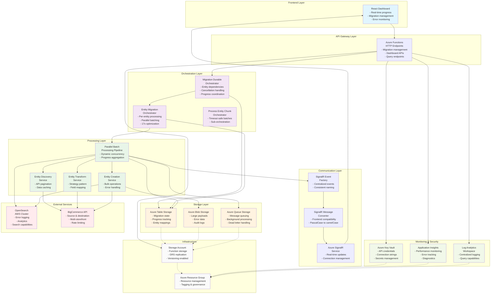

# BigCommerce Migration System - Architecture Diagram

## Overview

This diagram illustrates the complete system architecture of the BigCommerce Migration System, showing all Azure services, components, and their relationships. The system follows a multi-layered serverless architecture with real-time communication capabilities.

## Architecture Components

### Frontend Layer
- **React Dashboard**: Real-time progress monitoring, migration management, and error monitoring

### API Gateway Layer  
- **Azure Functions**: HTTP endpoints for migration management, dashboard APIs, and query endpoints

### Orchestration Layer
- **Migration Durable Orchestrator**: Manages entity dependencies, cancellation handling, and progress coordination
- **Entity Migration Orchestrator**: Per-entity processing with parallel batching and 17x optimization
- **Process Entity Chunk Orchestrator**: Timeout-safe batches with sub-orchestration

### Processing Layer
- **Parallel Batch Processing Pipeline**: Dynamic concurrency and progress aggregation
- **Entity Discovery Service**: API pagination and data caching
- **Entity Transform Service**: Strategy pattern and field mapping
- **Entity Creation Service**: Bulk operations and error handling

### Communication Layer
- **SignalR Event Factory**: Centralized events with consistent naming
- **SignalR Message Converter**: Frontend compatibility (PascalCase to camelCase)
- **Azure SignalR Service**: Real-time updates and connection management

### Storage Layer
- **Azure Table Storage**: Migration state, progress tracking, entity mappings
- **Azure Blob Storage**: Large payloads, error data, audit logs
- **Azure Queue Storage**: Message queuing, background processing, dead letter handling

### External Services
- **OpenSearch (AWS)**: Error logging, analytics, search capabilities
- **BigCommerce API**: Source & destination with multi-storefront support and rate limiting

### Monitoring & Security
- **Azure Key Vault**: API credentials, connection strings, secrets management
- **Application Insights**: Performance monitoring, error tracking, diagnostics
- **Log Analytics Workspace**: Centralized logging and query capabilities

## Architecture Diagram

## Key Features

1. **Serverless Architecture**: Built on Azure Functions for automatic scaling and cost optimization
2. **Real-time Communication**: Azure SignalR provides live progress updates to the dashboard
3. **Multi-layer Design**: Clear separation of concerns across frontend, API, orchestration, processing, and storage layers
4. **External Integration**: Seamless connection to BigCommerce APIs and AWS OpenSearch
5. **Comprehensive Monitoring**: Application Insights and Log Analytics for full observability
6. **Security**: Azure Key Vault for secure credential management
7. **Scalable Storage**: Multiple Azure storage services for different data types and access patterns