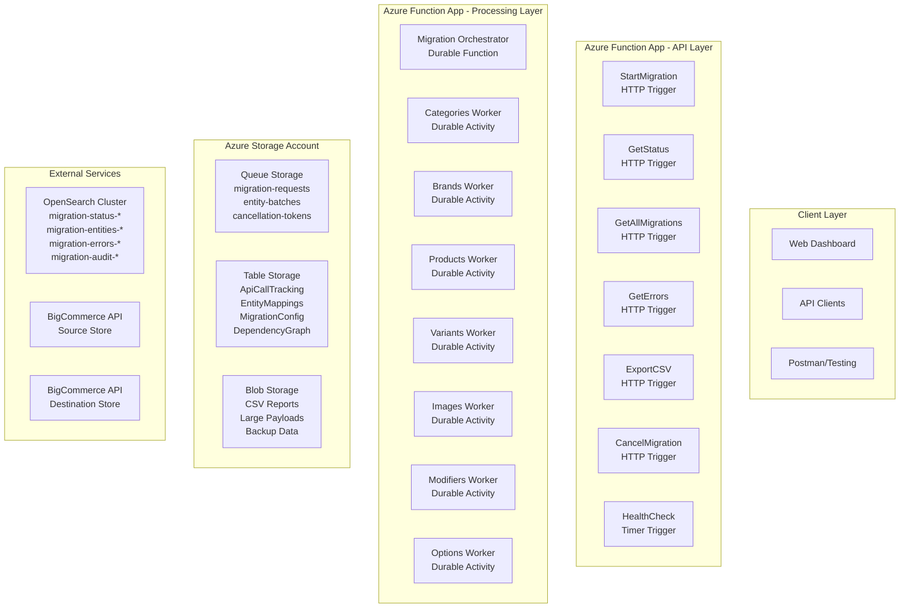
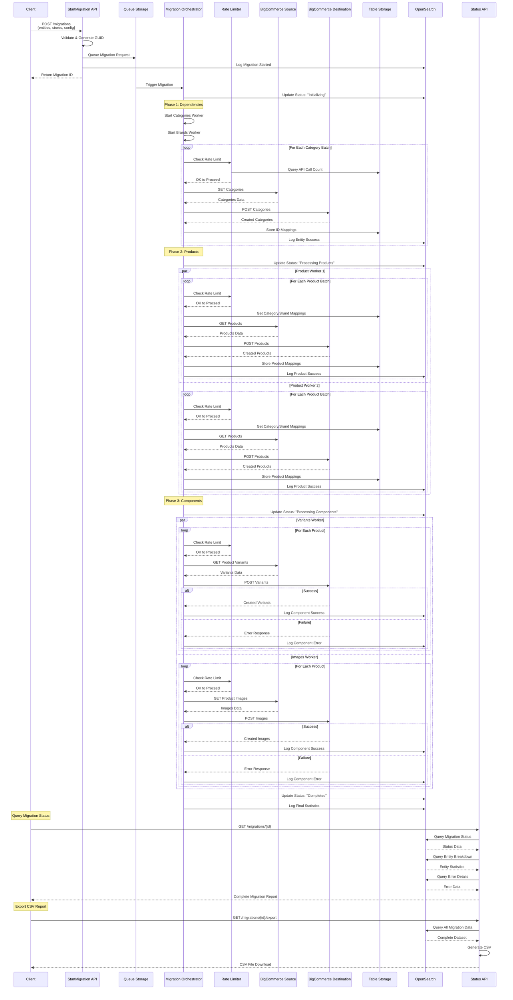

# BigCommerce Migration Architecture Documentation

## Table of Contents
1. [Executive Summary](#executive-summary)
2. [Architecture Overview](#architecture-overview)
3. [System Components](#system-components)
4. [Migration Flow](#migration-flow)
5. [Data Models](#data-models)
6. [API Specifications](#api-specifications)
7. [Rate Limiting Strategy](#rate-limiting-strategy)
8. [Error Handling](#error-handling)
9. [Monitoring & Logging](#monitoring--logging)
10. [Deployment Guide](#deployment-guide)
11. [Cost Analysis](#cost-analysis)

## Executive Summary

This document outlines a comprehensive, scalable solution for migrating products and related entities between BigCommerce stores. The architecture is designed to handle up to 10 million products while respecting API rate limits and maintaining detailed audit trails.

### Key Features
- **Scalable**: Handles millions of products through parallel processing
- **Cost-Effective**: Serverless architecture with pay-per-use pricing
- **Compliant**: Respects BigCommerce API rate limits (450 requests/30 seconds)
- **Generic**: Supports any BigCommerce entity type
- **Observable**: Comprehensive logging and monitoring
- **Reliable**: Built-in error handling and retry mechanisms

### Technology Stack
- **Azure Functions**: Serverless compute for APIs and processing
- **Azure Durable Functions**: Long-running orchestration
- **Azure Storage**: Queues, tables, and blobs for data persistence
- **OpenSearch**: Logging, monitoring, and reporting
- **BigCommerce API**: Source and destination store integration

## Architecture Overview

The solution follows a microservices architecture pattern with the following layers:

1. **API Layer**: HTTP trigger functions for client interaction
2. **Orchestration Layer**: Durable functions for workflow management
3. **Processing Layer**: Workers for entity migration
4. **Storage Layer**: Azure Storage for queues, mappings, and configuration
5. **Monitoring Layer**: OpenSearch for logging and analytics

### High-Level Architecture Diagram



## System Components

### 1. API Layer (HTTP Trigger Functions)

**Purpose**: Provide RESTful endpoints for migration management
**Technology**: Azure Functions with HTTP triggers
**Scaling**: Automatic based on demand

**Functions**:
- `StartMigration`: Initiates new migration process
- `GetStatus`: Retrieves migration status by ID
- `GetAllMigrations`: Lists all migrations with filtering
- `GetErrors`: Retrieves error details for a migration
- `ExportCSV`: Generates CSV reports
- `CancelMigration`: Cancels running migration

### 2. Orchestration Layer (Durable Functions)

**Purpose**: Coordinate long-running migration workflows
**Technology**: Azure Durable Functions
**Benefits**: State persistence, automatic checkpointing, built-in retry

**Components**:
- `Migration Orchestrator`: Main workflow coordinator
- `Entity Discovery`: Discovers entities to migrate
- `Dependency Resolver`: Determines processing order
- `Entity Migration Worker`: Processes individual entities

### 3. Processing Layer (Worker Functions)

**Purpose**: Handle actual data migration for specific entity types
**Technology**: Durable Activities
**Scaling**: Parallel execution with rate limiting

**Workers**:
- Categories Worker
- Brands Worker
- Products Worker
- Variants Worker
- Images Worker
- Modifiers Worker
- Options Worker

### 4. Storage Layer

#### Azure Queue Storage
**Purpose**: Message queuing for asynchronous processing
**Queues**:
- `migration-requests`: Incoming migration jobs
- `entity-batches`: Entity processing tasks
- `cancellation-tokens`: Migration cancellation signals

#### Azure Table Storage
**Purpose**: Structured data storage for mappings and configuration
**Tables**:
- `ApiCallTracking`: Rate limiting data
- `EntityMappings`: Source to destination ID mappings
- `MigrationConfig`: System configuration
- `DependencyGraph`: Entity relationship definitions
- `EntityConfiguration`: Default entity settings and constraints
- `MigrationEntityConfig`: Per-migration entity configurations
- `CancellationTokens`: Distributed cancellation state management
- `CancellationStatus`: Detailed cancellation progress tracking

#### Azure Blob Storage
**Purpose**: Large object storage
**Containers**:
- `csv-reports`: Generated CSV files
- `large-payloads`: Oversized request/response data
- `backup-data`: Migration backup files

### 5. Monitoring Layer (OpenSearch)

**Purpose**: Centralized logging, monitoring, and reporting
**Indices**:
- `migration-status-{date}`: Migration progress tracking
- `migration-entities-{date}`: Entity-level migration details
- `migration-errors-{date}`: Error details and stack traces
- `migration-audit-{date}`: Complete audit trail including migration request payloads
- `migration-payloads-{date}`: Failed request/response payloads for debugging

**Audit Trail Details**:
- **Migration Request Payloads**: Complete capture of initial migration requests
- **Configuration Changes**: Entity-level configuration modifications during processing
- **Administrative Actions**: User actions like cancellation, resume, configuration updates
- **System Events**: Automatic scaling, adaptive batching changes, rate limit adjustments
- **Compliance Logging**: Full audit trail for regulatory and business requirements

## Migration Flow

### Phase 1: Initialization
1. Client submits migration request via API
2. System validates request and generates unique GUID
3. **Migration request payload logged to audit trail**
4. Request queued in Azure Queue Storage
5. Initial status logged to OpenSearch

### Phase 2: Dependency Migration
1. Categories and Brands processed in parallel
2. Rate limiting ensures API compliance
3. ID mappings stored in Table Storage
4. Success/failure logged to OpenSearch

### Phase 3: Product Migration
1. Multiple workers process product batches (10 items each)
2. Rate limiter coordinates API calls across workers
3. Product mappings stored for component migration
4. Detailed logging per product

### Phase 4: Component Migration
1. Variants, Images, Modifiers, Options processed
2. Component-level error tracking
3. Hierarchical error logging
4. Final migration status update

### Migration Sequence Diagram



## Data Models

### Migration Status Schema

```json
{
  "migrationId": "string (GUID)",
  "sourceStore": "string (URL)",
  "destinationStore": "string (URL)",
  "requestedBy": "string (User ID)",
  "requestedEntities": ["string (Entity Types)"],
  "status": "string (InProgress|Completed|Failed|Cancelled)",
  "startTime": "datetime",
  "endTime": "datetime",
  "totalEntities": "integer",
  "completedEntities": "integer",
  "failedEntities": "integer",
  "skippedEntities": "integer",
  "currentPhase": "string",
  "estimatedCompletion": "datetime",
  "entities": [
    {
      "entityType": "string",
      "batchSize": "integer",
      "maxConcurrency": "integer", 
      "priority": "integer",
      "filters": "object",
      "parentEntity": "string"
    }
  ],
  "globalSettings": {
    "maxApiCallsPerSecond": "integer",
    "defaultRetryCount": "integer",
    "timeoutMinutes": "integer",
    "enableParallelProcessing": "boolean",
    "logLevel": "string"
  }
}
```

### Entity Migration Schema

```json
{
  "migrationId": "string (GUID)",
  "entityType": "string",
  "entityId": "string",
  "sourceId": "string",
  "destinationId": "string",
  "status": "string (Success|Failed|Skipped)",
  "startTime": "datetime",
  "endTime": "datetime",
  "parentEntity": {
    "type": "string",
    "id": "string"
  },
  "components": [
    {
      "componentType": "string",
      "componentId": "string",
      "status": "string",
      "sourceId": "string",
      "destinationId": "string",
      "errorMessage": "string",
      "errorCode": "string"
    }
  ]
}
```

### Error Details Schema

```json
{
  "migrationId": "string (GUID)",
  "entityType": "string",
  "entityId": "string",
  "componentType": "string",
  "componentId": "string",
  "errorLevel": "string (Warning|Error|Critical)",
  "errorCode": "string",
  "errorMessage": "string",
  "errorDetails": "string",
  "stackTrace": "string",
  "timestamp": "datetime",
  "apiEndpoint": "string",
  "httpStatusCode": "integer",
  "context": {
    "batchId": "string",
    "workerId": "string",
    "attemptNumber": "integer"
  }
}
```

### Entity Configuration Schema

```json
{
  "partitionKey": "BigCommerce",
  "rowKey": "Products",
  "entityType": "string",
  "defaultBatchSize": "integer",
  "minBatchSize": "integer",
  "maxBatchSize": "integer",
  "defaultConcurrency": "integer",
  "maxConcurrency": "integer",
  "apiEndpoint": "string",
  "estimatedProcessingTimePerItem": "decimal",
  "dependsOn": ["string"],
  "validationRules": ["string"],
  "complexityLevel": "string (Low|Medium|High)",
  "averageItemSize": "integer"
}
```

### Migration Entity Configuration Schema

```json
{
  "partitionKey": "string (Migration ID)",
  "rowKey": "string (Entity Type)",
  "entityType": "string",
  "batchSize": "integer",
  "maxConcurrency": "integer",
  "priority": "integer",
  "filters": "object",
  "parentEntity": "string",
  "customSettings": "object",
  "performanceMetrics": {
    "averageProcessingTime": "decimal",
    "errorRate": "decimal",
    "throughputPerSecond": "decimal"
  }
}
```

## API Specifications

### Start Migration
**Endpoint**: `POST /migrations`

**Request Body**:
```json
{
  "sourceStore": "https://store-a.mybigcommerce.com",
  "destinationStore": "https://store-b.mybigcommerce.com",
  "entities": [
    {
      "entityType": "Categories",
      "batchSize": 50,
      "maxConcurrency": 2,
      "priority": 1,
      "filters": {
        "status": "active"
      }
    },
    {
      "entityType": "Brands",
      "batchSize": 30,
      "maxConcurrency": 2,
      "priority": 1
    },
    {
      "entityType": "Products",
      "batchSize": 10,
      "maxConcurrency": 4,
      "priority": 2,
      "filters": {
        "categories": [1, 2, 3],
        "minPrice": 10.00
      }
    },
    {
      "entityType": "Variants",
      "batchSize": 20,
      "maxConcurrency": 3,
      "priority": 3,
      "parentEntity": "Products"
    },
    {
      "entityType": "Images",
      "batchSize": 5,
      "maxConcurrency": 2,
      "priority": 3,
      "parentEntity": "Products"
    }
  ],
  "globalSettings": {
    "maxApiCallsPerSecond": 12,
    "defaultRetryCount": 3,
    "timeoutMinutes": 60,
    "enableParallelProcessing": true,
    "logLevel": "INFO"
  }
}
```

**Response**:
```json
{
  "migrationId": "550e8400-e29b-41d4-a716-446655440000",
  "status": "Queued",
  "estimatedDuration": "PT2H30M",
  "queuePosition": 1
}
```

### Get Migration Status
**Endpoint**: `GET /migrations/{migrationId}`

**Response**:
```json
{
  "migrationId": "550e8400-e29b-41d4-a716-446655440000",
  "status": "InProgress",
  "progress": {
    "totalEntities": 10000,
    "completedEntities": 2500,
    "failedEntities": 5,
    "skippedEntities": 10,
    "percentage": 25.15
  },
  "currentPhase": "Processing Products",
  "estimatedCompletion": "2024-01-15T14:30:00Z",
  "entityBreakdown": {
    "Categories": {"total": 500, "completed": 500, "failed": 0},
    "Brands": {"total": 200, "completed": 200, "failed": 0},
    "Products": {"total": 10000, "completed": 2500, "failed": 5}
  }
}
```

### Get All Migrations
**Endpoint**: `GET /migrations`

**Query Parameters**:
- `startDate`: Filter by start date (ISO 8601 format, e.g., 2024-01-15T00:00:00Z)
- `endDate`: Filter by end date (ISO 8601 format, e.g., 2024-01-15T23:59:59Z)
- `migrationId`: Filter by specific migration ID (supports partial matching)
- `status`: Filter by status (Queued, InProgress, Completed, Failed, Cancelled)
- `sourceStore`: Filter by source store URL (supports partial matching)
- `destinationStore`: Filter by destination store URL (supports partial matching)
- `entityType`: Filter by entity type included in migration
- `page`: Page number (default: 1)
- `size`: Number of results per page (default: 50, max: 500)
- `sortBy`: Sort field (startTime, endTime, totalEntities, status, successRate)
- `sortOrder`: Sort order (asc, desc, default: desc)

**Response**:
```json
{
  "migrations": [
    {
      "migrationId": "550e8400-e29b-41d4-a716-446655440000",
      "sourceStore": "store-a.mybigcommerce.com",
      "destinationStore": "store-b.mybigcommerce.com",
      "status": "Completed",
      "startTime": "2024-01-15T10:00:00Z",
      "endTime": "2024-01-15T12:30:00Z",
      "duration": "PT2H30M",
      "totalEntities": 10000,
      "completedEntities": 9990,
      "failedEntities": 10,
      "skippedEntities": 0,
      "successRate": 99.9,
      "entityTypes": ["Categories", "Products", "Variants", "Images"],
      "configurationProfile": "Balanced",
      "createdBy": "user@company.com",
      "tags": ["production", "full-catalog"]
    }
  ],
  "pagination": {
    "page": 1,
    "size": 50,
    "total": 150,
    "pages": 3,
    "hasNext": true,
    "hasPrevious": false,
    "totalPages": 3,
    "totalItems": 150
  },
  "filters": {
    "applied": {
      "startDate": "2024-01-15T00:00:00Z",
      "endDate": "2024-01-15T23:59:59Z",
      "status": "Completed"
    },
    "available": {
      "statuses": ["Queued", "InProgress", "Completed", "Failed", "Cancelled"],
      "entityTypes": ["Categories", "Brands", "Products", "Variants", "Images"],
      "dateRange": {
        "earliest": "2024-01-01T00:00:00Z",
        "latest": "2024-01-15T23:59:59Z"
      }
    }
  }
}
```

### Get Migration Errors
**Endpoint**: `GET /migrations/{migrationId}/errors`

**Query Parameters**:
- `page`: Page number (default: 1)
- `size`: Number of results per page (default: 50, max: 500)
- `errorLevel`: Filter by error level (Critical, Error, Warning)
- `entityType`: Filter by entity type
- `entityId`: Filter by specific entity ID
- `startDate`: Filter by error timestamp start
- `endDate`: Filter by error timestamp end
- `includePayloads`: Include request/response payloads (default: false)

**Response**:
```json
{
  "migrationId": "550e8400-e29b-41d4-a716-446655440000",
  "errorSummary": {
    "totalErrors": 15,
    "criticalErrors": 2,
    "errors": 10,
    "warnings": 3
  },
  "errorsByType": {
    "Product": 10,
    "Variant": 3,
    "Image": 2
  },
  "errors": [
    {
      "entityType": "Product",
      "entityId": "PROD-001",
      "entityName": "Premium Widget",
      "entitySourceId": "12345",
      "componentType": "Variant",
      "componentId": "VAR-001",
      "componentName": "Large Blue",
      "errorLevel": "Error",
      "errorCode": "VALIDATION_FAILED",
      "errorMessage": "Price cannot be negative",
      "errorDetails": "Product variant price validation failed: -5.99 is not a valid price",
      "timestamp": "2024-01-15T10:15:00Z",
      "apiEndpoint": "POST /catalog/products/12345/variants",
      "httpStatusCode": 400,
      "batchId": "BATCH-789",
      "workerId": "WORKER-3",
      "hasPayload": true
    }
  ],
  "pagination": {
    "page": 1,
    "size": 50,
    "total": 15,
    "pages": 1,
    "hasNext": false,
    "hasPrevious": false
  }
}
```

### Get Error Payloads
**Endpoint**: `GET /migrations/{migrationId}/errors/{errorId}/payloads`

**Response**:
```json
{
  "migrationId": "550e8400-e29b-41d4-a716-446655440000",
  "errorId": "ERR-001",
  "entityType": "Product",
  "entityId": "PROD-001",
  "entityName": "Premium Widget",
  "timestamp": "2024-01-15T10:15:00Z",
  "apiEndpoint": "POST /catalog/products/12345/variants",
  "httpMethod": "POST",
  "httpStatusCode": 400,
  "requestPayload": {
    "sku": "PREM-WIDGET-LG-BLU",
    "price": -5.99,
    "inventory_level": 100,
    "product_id": 12345
  },
  "responsePayload": {
    "status": 400,
    "title": "Validation Error",
    "detail": "Price cannot be negative",
    "errors": {
      "price": ["Price must be greater than or equal to 0"]
    }
  },
  "requestHeaders": {
    "Content-Type": "application/json",
    "X-Auth-Token": "***masked***",
    "User-Agent": "BigCommerce-Migration/1.0"
  },
  "responseHeaders": {
    "Content-Type": "application/json",
    "X-Rate-Limit-Remaining": "449",
    "X-Rate-Limit-Window": "30s"
  }
}
```

### Get Migration History
**Endpoint**: `GET /migrations/history`

**Query Parameters**:
- `startDate`: Filter by start date (ISO 8601 format)
- `endDate`: Filter by end date (ISO 8601 format)
- `migrationId`: Filter by specific migration ID
- `sourceStore`: Filter by source store URL
- `destinationStore`: Filter by destination store URL
- `status`: Filter by status (Queued, InProgress, Completed, Failed, Cancelled)
- `entityType`: Filter by entity type
- `page`: Page number (default: 1)
- `size`: Number of results per page (default: 50, max: 500)
- `sortBy`: Sort field (startTime, endTime, totalEntities, status)
- `sortOrder`: Sort order (asc, desc)

**Response**:
```json
{
  "migrations": [
    {
      "migrationId": "550e8400-e29b-41d4-a716-446655440000",
      "sourceStore": "store-a.mybigcommerce.com",
      "destinationStore": "store-b.mybigcommerce.com",
      "status": "Completed",
      "startTime": "2024-01-15T10:00:00Z",
      "endTime": "2024-01-15T12:30:00Z",
      "duration": "PT2H30M",
      "totalEntities": 10000,
      "completedEntities": 9990,
      "failedEntities": 10,
      "skippedEntities": 0,
      "successRate": 99.9,
      "entityBreakdown": {
        "Categories": {"total": 500, "completed": 500, "failed": 0},
        "Products": {"total": 10000, "completed": 9990, "failed": 10}
      },
      "configurationProfile": "Balanced",
      "averageThroughput": 1.11,
      "peakThroughput": 2.5,
      "totalApiCalls": 12500,
      "createdBy": "user@company.com",
      "tags": ["production", "full-catalog"]
    }
  ],
  "pagination": {
    "page": 1,
    "size": 50,
    "total": 150,
    "pages": 3,
    "hasNext": true,
    "hasPrevious": false
  },
  "aggregations": {
    "totalMigrations": 150,
    "completedMigrations": 120,
    "failedMigrations": 15,
    "cancelledMigrations": 15,
    "averageSuccessRate": 94.5,
    "averageDuration": "PT1H45M",
    "totalEntitiesMigrated": 1500000
  }
}
```

### Export CSV Report
**Endpoint**: `GET /migrations/{migrationId}/export`

**Query Parameters**:
- `type`: Export type (summary, detailed, errors, payloads)
- `format`: Export format (csv, xlsx)
- `includePayloads`: Include request/response payloads (default: false)
- `errorLevel`: Filter by error level (for error exports)
- `entityType`: Filter by entity type
- `startDate`: Filter by date range start
- `endDate`: Filter by date range end

**Response**: File download with requested data

**Export Types**:

1. **Summary Export** (`type=summary`):
   - Migration overview and statistics
   - Entity counts and success rates
   - Processing times and throughput

2. **Detailed Export** (`type=detailed`):
   - Complete entity processing details
   - Individual entity status and timings
   - Configuration used per entity

3. **Error Export** (`type=errors`):
   - All error details with context
   - Entity ID, name, and source system ID
   - Error codes, messages, and timestamps
   - API endpoint and HTTP status information
   - Batch and worker context

4. **Payload Export** (`type=payloads`):
   - Failed request and response payloads
   - Complete API call details
   - Headers and timing information
   - Large payload support

**Example Error CSV Headers**:
```
MigrationId,EntityType,EntityId,EntityName,EntitySourceId,ComponentType,ComponentId,ComponentName,ErrorLevel,ErrorCode,ErrorMessage,ErrorDetails,Timestamp,ApiEndpoint,HttpMethod,HttpStatusCode,BatchId,WorkerId,HasPayload
```

**Example Error CSV Row**:
```
550e8400-e29b-41d4-a716-446655440000,Product,PROD-001,Premium Widget,12345,Variant,VAR-001,Large Blue,Error,VALIDATION_FAILED,Price cannot be negative,Product variant price validation failed: -5.99 is not a valid price,2024-01-15T10:15:00Z,POST /catalog/products/12345/variants,POST,400,BATCH-789,WORKER-3,true
```

### Cancel Migration
**Endpoint**: `DELETE /migrations/{migrationId}`

**Response**:
```json
{
  "migrationId": "550e8400-e29b-41d4-a716-446655440000",
  "status": "Cancelling",
  "message": "Migration cancellation initiated",
  "cancellationDetails": {
    "requestTime": "2024-01-15T10:30:00Z",
    "expectedCompletionTime": "2024-01-15T10:35:00Z",
    "currentPhase": "Products",
    "granularCancellation": true
  }
}
```

### Get Migration Request Payload
**Endpoint**: `GET /migrations/{migrationId}/request`

**Purpose**: Retrieve the original migration request payload for audit and debugging purposes.

**Response**:
```json
{
  "migrationId": "550e8400-e29b-41d4-a716-446655440000",
  "timestamp": "2024-01-15T10:00:00Z",
  "requestedBy": "user@company.com",
  "clientInfo": {
    "userAgent": "BigCommerce-Migration-Client/1.0",
    "ipAddress": "192.168.1.100",
    "sessionId": "sess_abc123"
  },
  "originalRequest": {
    "sourceStore": "https://store-a.mybigcommerce.com",
    "destinationStore": "https://store-b.mybigcommerce.com",
    "entities": [
      {
        "entityType": "Categories",
        "batchSize": 50,
        "maxConcurrency": 2,
        "priority": 1,
        "filters": {
          "status": "active"
        }
      },
      {
        "entityType": "Products",
        "batchSize": 10,
        "maxConcurrency": 4,
        "priority": 2,
        "filters": {
          "categories": [1, 2, 3],
          "minPrice": 10.00
        }
      }
    ],
    "globalSettings": {
      "maxApiCallsPerSecond": 12,
      "enableAdaptiveBatching": true,
      "logLevel": "INFO"
    }
  },
  "configurationProfile": "Balanced",
  "estimatedEntities": 50000,
  "validationResults": {
    "isValid": true,
    "warnings": ["High concurrency may impact rate limits"],
    "recommendations": ["Consider Conservative profile for first migration"]
  }
}
```

### Query Migration Requests by Date Range
**Endpoint**: `GET /migrations/requests`

**Purpose**: Query historical migration request payloads for analysis, auditing, and troubleshooting.

**Query Parameters**:
- `startDate`: Filter by request date start (ISO 8601 format, e.g., 2024-01-01T00:00:00Z)
- `endDate`: Filter by request date end (ISO 8601 format, e.g., 2024-01-31T23:59:59Z)
- `requestedBy`: Filter by user who requested the migration
- `sourceStore`: Filter by source store URL (supports partial matching)
- `destinationStore`: Filter by destination store URL (supports partial matching)
- `configurationProfile`: Filter by configuration profile (Conservative, Balanced, Aggressive, Custom)
- `entityType`: Filter by entity types included in request
- `status`: Filter by migration status (to see requests that resulted in specific outcomes)
- `page`: Page number (default: 1)
- `size`: Number of results per page (default: 50, max: 500)
- `sortBy`: Sort field (timestamp, requestedBy, totalEntities, configurationProfile)
- `sortOrder`: Sort order (asc, desc, default: desc)
- `includePayload`: Include full request payload (default: false for performance)

**Response**:
```json
{
  "requests": [
    {
      "migrationId": "550e8400-e29b-41d4-a716-446655440000",
      "timestamp": "2024-01-15T10:00:00Z",
      "requestedBy": "user@company.com",
      "sourceStore": "store-a.mybigcommerce.com",
      "destinationStore": "store-b.mybigcommerce.com",
      "configurationProfile": "Balanced",
      "entityTypes": ["Categories", "Products", "Variants", "Images"],
      "estimatedEntities": 50000,
      "migrationStatus": "Completed",
      "migrationDuration": "PT2H30M",
      "successRate": 99.9,
      "hasPayload": true,
      "clientInfo": {
        "userAgent": "BigCommerce-Migration-Client/1.0",
        "ipAddress": "192.168.1.100"
      }
    }
  ],
  "pagination": {
    "page": 1,
    "size": 50,
    "total": 150,
    "pages": 3,
    "hasNext": true,
    "hasPrevious": false
  },
  "aggregations": {
    "totalRequests": 150,
    "uniqueUsers": 25,
    "configurationProfiles": {
      "Balanced": 75,
      "Conservative": 45,
      "Aggressive": 20,
      "Custom": 10
    },
    "averageEstimatedEntities": 25000,
    "requestsByDay": {
      "2024-01-15": 15,
      "2024-01-14": 20,
      "2024-01-13": 18
    }
  }
}
```

**Example Queries**:
```bash
# Get all migration requests from last 30 days
GET /migrations/requests?startDate=2024-01-01T00:00:00Z&endDate=2024-01-31T23:59:59Z

# Get requests by specific user with full payloads
GET /migrations/requests?requestedBy=user@company.com&includePayload=true

# Get failed migration requests for analysis
GET /migrations/requests?status=Failed&includePayload=true&sortBy=timestamp&sortOrder=desc

# Get requests for specific store migration
GET /migrations/requests?sourceStore=old-store&destinationStore=new-store&page=1&size=100
```

## Granular Cancellation Architecture

### Multi-Level Cancellation Flow

The cancellation system works at **every granular level** of the migration hierarchy:

**1. Migration Level** → **2. Product Level** → **3. Component Level** → **4. Batch Level** → **5. API Call Level**

### Cancellation Token Propagation

**Distributed Cancellation Token Management:**
```csharp
public class CancellationTokenManager
{
    private readonly ITableStorageService _tableStorage;
    private readonly IQueueStorageService _queueStorage;
    
    public async Task<bool> RequestCancellation(string migrationId)
    {
        // 1. Create cancellation token
        var token = new CancellationToken
        {
            MigrationId = migrationId,
            RequestedAt = DateTime.UtcNow,
            Status = "Requested"
        };
        
        // 2. Store in Table Storage for persistence
        await _tableStorage.InsertOrReplaceAsync("CancellationTokens", token);
        
        // 3. Send signal to all orchestrators
        await _queueStorage.SendMessageAsync("cancellation-signals", token);
        
        return true;
    }
    
    public async Task<bool> IsCancellationRequested(string migrationId)
    {
        var token = await _tableStorage.RetrieveAsync<CancellationToken>(
            "CancellationTokens", 
            "Migration", 
            migrationId);
            
        return token?.Status == "Requested";
    }
}
```

### Main Migration Orchestrator Cancellation

```csharp
[FunctionName("MainMigrationOrchestrator")]
public async Task RunMainOrchestrator(
    [OrchestrationTrigger] IDurableOrchestrationContext context)
{
    var migrationId = context.GetInput<string>();
    
    // Phase 1: Dependencies
    if (!await context.CallActivityAsync<bool>("CheckCancellation", migrationId))
    {
        await context.CallSubOrchestratorAsync("ProcessDependencies", migrationId);
    }
    
    // Phase 2: Products
    if (!await context.CallActivityAsync<bool>("CheckCancellation", migrationId))
    {
        var products = await context.CallActivityAsync<List<Product>>("GetProducts", migrationId);
        
        // Launch product orchestrators with cancellation support
        var productTasks = products.Select(product => 
            context.CallSubOrchestratorAsync("ProcessProduct", 
                new { MigrationId = migrationId, Product = product }));
        
        await Task.WhenAll(productTasks);
    }
    
    // Check final cancellation status
    var finalStatus = await context.CallActivityAsync<bool>("CheckCancellation", migrationId);
    if (finalStatus)
    {
        await context.CallActivityAsync("HandleMigrationCancellation", migrationId);
    }
}
```

### Product-Level Cancellation

```csharp
[FunctionName("ProcessProduct")]
public async Task ProcessProductWithCancellation(
    [OrchestrationTrigger] IDurableOrchestrationContext context)
{
    var input = context.GetInput<dynamic>();
    var migrationId = input.MigrationId;
    var product = input.Product;
    
    // Check cancellation before processing
    if (await context.CallActivityAsync<bool>("CheckCancellation", migrationId))
    {
        await context.CallActivityAsync("MarkProductAsCancelled", 
            new { MigrationId = migrationId, ProductId = product.Id });
        return;
    }
    
    // Create main product
    await context.CallActivityAsync("CreateProduct", product);
    
    // Determine complexity and processing strategy
    var complexity = await context.CallActivityAsync<ProductComplexity>("AnalyzeComplexity", product);
    
    if (complexity.IsComplex)
    {
        // Launch sub-orchestrators with cancellation support
        var tasks = new List<Task>();
        
        // Variants sub-orchestrator
        if (product.Variants?.Count > 0)
        {
            tasks.Add(context.CallSubOrchestratorAsync("ProcessVariantsWithCancellation", 
                new { MigrationId = migrationId, ProductId = product.Id, Variants = product.Variants }));
        }
        
        // Images sub-orchestrator
        if (product.Images?.Count > 0)
        {
            tasks.Add(context.CallSubOrchestratorAsync("ProcessImagesWithCancellation", 
                new { MigrationId = migrationId, ProductId = product.Id, Images = product.Images }));
        }
        
        await Task.WhenAll(tasks);
    }
    
    // Final cancellation check
    if (await context.CallActivityAsync<bool>("CheckCancellation", migrationId))
    {
        await context.CallActivityAsync("HandleProductCancellation", 
            new { MigrationId = migrationId, ProductId = product.Id });
    }
}
```

### Component-Level Cancellation (Sub-Orchestrators)

```csharp
[FunctionName("ProcessVariantsWithCancellation")]
public async Task ProcessVariantsWithCancellation(
    [OrchestrationTrigger] IDurableOrchestrationContext context)
{
    var input = context.GetInput<dynamic>();
    var migrationId = input.MigrationId;
    var variants = input.Variants;
    var batchSize = 10; // Configurable based on complexity
    
    for (int i = 0; i < variants.Count; i += batchSize)
    {
        // Check cancellation before each batch
        if (await context.CallActivityAsync<bool>("CheckCancellation", migrationId))
        {
            // Mark remaining variants as cancelled
            await context.CallActivityAsync("MarkRemainingVariantsAsCancelled", 
                new { MigrationId = migrationId, RemainingVariants = variants.Skip(i).ToList() });
            break;
        }
        
        var chunk = variants.Skip(i).Take(batchSize).ToList();
        await context.CallActivityAsync("ProcessVariantBatch", 
            new { MigrationId = migrationId, Variants = chunk });
        
        // Rate limit delay with cancellation check
        await context.CreateTimer(context.CurrentUtcDateTime.AddSeconds(2), 
            CancellationToken.None);
    }
}
```

### Batch-Level Cancellation

```csharp
[FunctionName("ProcessVariantBatch")]
public async Task ProcessVariantBatch(
    [ActivityTrigger] IDurableActivityContext context)
{
    var input = context.GetInput<dynamic>();
    var migrationId = input.MigrationId;
    var variants = input.Variants;
    
    foreach (var variant in variants)
    {
        // Check cancellation before each API call
        if (await CheckCancellationAsync(migrationId))
        {
            // Mark this variant as cancelled
            await LogVariantCancellation(migrationId, variant.Id);
            continue;
        }
        
        try
        {
            // Process individual variant
            await ProcessSingleVariant(variant);
            await LogVariantSuccess(migrationId, variant.Id);
        }
        catch (Exception ex)
        {
            await LogVariantError(migrationId, variant.Id, ex);
        }
    }
}
```

### Graceful Shutdown Implementation

```csharp
public class GracefulShutdownManager
{
    public async Task<CancellationResult> HandleCancellation(
        string migrationId, 
        CancellationLevel level)
    {
        var result = new CancellationResult
        {
            MigrationId = migrationId,
            CancellationLevel = level,
            StartTime = DateTime.UtcNow
        };
        
        switch (level)
        {
            case CancellationLevel.Migration:
                await CancelEntireMigration(migrationId);
                break;
                
            case CancellationLevel.Product:
                await CancelCurrentProducts(migrationId);
                break;
                
            case CancellationLevel.Component:
                await CancelCurrentComponents(migrationId);
                break;
                
            case CancellationLevel.Batch:
                await CancelCurrentBatches(migrationId);
                break;
        }
        
        // Save current state for potential resume
        await SaveMigrationState(migrationId, result);
        
        // Generate cancellation report
        result.Summary = await GenerateCancellationSummary(migrationId);
        
        return result;
    }
}
```

### Cancellation Status Tracking

The system tracks cancellation status at multiple levels:

**OpenSearch Cancellation Logging:**
```json
{
  "migrationId": "550e8400-e29b-41d4-a716-446655440000",
  "cancellationTimestamp": "2024-01-15T10:30:00Z",
  "cancellationLevel": "Component",
  "entityType": "Variants",
  "entityId": "variant-123",
  "status": "Cancelled",
  "completedBatches": 15,
  "totalBatches": 25,
  "percentageComplete": 60.0,
  "cancellationReason": "User request",
  "gracefulShutdown": true
}
```

**Table Storage Cancellation State:**
```json
{
  "partitionKey": "Cancellation",
  "rowKey": "550e8400-e29b-41d4-a716-446655440000",
  "migrationId": "550e8400-e29b-41d4-a716-446655440000",
  "status": "Cancelled",
  "requestedAt": "2024-01-15T10:30:00Z",
  "completedAt": "2024-01-15T10:35:00Z",
  "cancellationSummary": {
    "totalEntities": 10000,
    "processedEntities": 6000,
    "cancelledEntities": 4000,
    "entityBreakdown": {
      "Categories": {"processed": 500, "cancelled": 0},
      "Products": {"processed": 2500, "cancelled": 1500},
      "Variants": {"processed": 3000, "cancelled": 2500}
    }
  }
}
```

### Get Entity Configurations
**Endpoint**: `GET /entity-configurations`

**Response**:
```json
{
  "entities": [
    {
      "entityType": "Categories",
      "defaultBatchSize": 50,
      "minBatchSize": 10,
      "maxBatchSize": 100,
      "recommendedConcurrency": 2,
      "averageProcessingTime": "0.5s",
      "complexityLevel": "Low",
      "dependsOn": []
    },
    {
      "entityType": "Products", 
      "defaultBatchSize": 10,
      "minBatchSize": 5,
      "maxBatchSize": 25,
      "recommendedConcurrency": 4,
      "averageProcessingTime": "2.1s", 
      "complexityLevel": "High",
      "dependsOn": ["Categories", "Brands"]
    },
    {
      "entityType": "Variants",
      "defaultBatchSize": 20,
      "minBatchSize": 10,
      "maxBatchSize": 50,
      "recommendedConcurrency": 3,
      "averageProcessingTime": "1.2s",
      "complexityLevel": "Medium",
      "dependsOn": ["Products"]
    }
  ]
}
```

### Update Entity Configuration
**Endpoint**: `PUT /entity-configurations/{entityType}`

**Request Body**:
```json
{
  "defaultBatchSize": 15,
  "maxConcurrency": 6,
  "customSettings": {
    "includeInventory": true,
    "optimizeImages": false
  }
}
```

**Response**:
```json
{
  "entityType": "Products",
  "defaultBatchSize": 15,
  "maxConcurrency": 6,
  "updated": "2024-01-15T10:30:00Z",
  "validationResult": {
    "isValid": true,
    "warnings": ["Batch size increased - monitor performance"]
  }
}
```

### Get Migration Entity Configuration
**Endpoint**: `GET /migrations/{migrationId}/entity-configurations`

**Response**:
```json
{
  "migrationId": "550e8400-e29b-41d4-a716-446655440000",
  "entities": [
    {
      "entityType": "Products",
      "batchSize": 10,
      "maxConcurrency": 4,
      "priority": 2,
      "performanceMetrics": {
        "averageProcessingTime": 2.3,
        "errorRate": 0.02,
        "throughputPerSecond": 1.7
      }
    }
  ]
}
```

## Rate Limiting Strategy

### BigCommerce API Limits
- **Limit**: 450 requests per 30 seconds per store
- **Implementation**: 12 requests per second (80% of limit for safety)
- **Tracking**: Table Storage with 30-second buckets

### Rate Limiter Implementation

```csharp
public class RateLimiter
{
    private readonly ITableStorageService _tableStorage;
    
    public async Task<bool> CanMakeRequest(string storeUrl)
    {
        var now = DateTime.UtcNow;
        var bucket = new DateTime(now.Year, now.Month, now.Day, 
                                 now.Hour, now.Minute, now.Second / 30 * 30);
        
        var entity = await _tableStorage.GetAsync<ApiCallTracker>(
            storeUrl, bucket.ToString("yyyy-MM-ddTHH:mm:ss"));
        
        if (entity == null || entity.CallCount < 180) // 80% of 450/2
        {
            await IncrementCallCount(storeUrl, bucket);
            return true;
        }
        
        return false;
    }
    
    public async Task WaitForRateLimit(string storeUrl)
    {
        while (!await CanMakeRequest(storeUrl))
        {
            await Task.Delay(1000); // Wait 1 second
        }
    }
}
```

### Parallel Processing Strategy

**For 10,000 Products with Entity-Level Configuration**:

**Phase 1 (Dependencies - Parallel):**
- Categories (Batch: 50, Concurrency: 2): 500 ÷ 50 ÷ 2 = ~1.25 minutes
- Brands (Batch: 30, Concurrency: 2): 200 ÷ 30 ÷ 2 = ~1 minute
- **Total Phase 1**: ~1.25 minutes (parallel execution)

**Phase 2 (Products):**
- Products (Batch: 10, Concurrency: 4): 10,000 ÷ 10 ÷ 4 = ~14 minutes

**Phase 3 (Components - Parallel per Product):**
- Variants (Batch: 20, Concurrency: 3): 30,000 ÷ 20 ÷ 3 = ~17.5 minutes
- Images (Batch: 5, Concurrency: 2): 50,000 ÷ 5 ÷ 2 = ~5.8 hours
- Modifiers (Batch: 15, Concurrency: 2): 15,000 ÷ 15 ÷ 2 = ~8.3 minutes
- **Total Phase 3**: ~5.8 hours (bottleneck: images)

**Total with Optimization**: ~6.2 hours

**For 10 Million Products**:
- Estimated time: 5-10 days with entity-level optimization
- Dynamic batch size adjustment based on performance

## Handling Complex Products (Timeout Prevention)

### The Challenge

Products with hundreds of variants and thousands of images pose a significant challenge:
- **Example**: 500 variants + 1000 images = ~70 minutes processing time
- **Azure Functions Limits**: 5-10 minutes (Consumption), 30 minutes (Premium)
- **Risk**: Function timeouts before completion

### Solution: Sub-Orchestration Pattern

**Architecture Enhancement:**
```csharp
[FunctionName("ProcessComplexProduct")]
public async Task ProcessComplexProduct(
    [OrchestrationTrigger] IDurableOrchestrationContext context)
{
    var product = context.GetInput<Product>();
    
    // Step 1: Analyze complexity
    var complexity = AnalyzeProductComplexity(product);
    
    if (complexity.IsSimple)
    {
        // Direct processing for simple products
        await context.CallActivityAsync("ProcessSimpleProduct", product);
    }
    else
    {
        // Sub-orchestration pattern for complex products
        await context.CallActivityAsync("CreateMainProduct", product);
        
        // Launch parallel sub-orchestrations
        var tasks = new List<Task>();
        
        if (product.Variants?.Count > 0)
        {
            tasks.Add(context.CallSubOrchestratorAsync(
                "ProcessVariantsOrchestrator", 
                new { ProductId = product.Id, Variants = product.Variants }));
        }
        
        if (product.Images?.Count > 0)
        {
            tasks.Add(context.CallSubOrchestratorAsync(
                "ProcessImagesOrchestrator", 
                new { ProductId = product.Id, Images = product.Images }));
        }
        
        await Task.WhenAll(tasks);
    }
}
```

### Chunked Processing Implementation

**Variants Sub-Orchestrator:**
```csharp
[FunctionName("ProcessVariantsOrchestrator")]
public async Task ProcessVariantsOrchestrator(
    [OrchestrationTrigger] IDurableOrchestrationContext context)
{
    var input = context.GetInput<dynamic>();
    var variants = input.Variants;
    var batchSize = 20; // Configurable based on complexity
    
    for (int i = 0; i < variants.Count; i += batchSize)
    {
        var chunk = variants.Skip(i).Take(batchSize).ToList();
        await context.CallActivityAsync("ProcessVariantBatch", chunk);
        
        // Rate limit compliance
        await context.CreateTimer(
            context.CurrentUtcDateTime.AddSeconds(2), 
            CancellationToken.None);
    }
}
```

**Images Sub-Orchestrator:**
```csharp
[FunctionName("ProcessImagesOrchestrator")]
public async Task ProcessImagesOrchestrator(
    [OrchestrationTrigger] IDurableOrchestrationContext context)
{
    var input = context.GetInput<dynamic>();
    var images = input.Images;
    var batchSize = 5; // Smaller batches for image processing
    
    for (int i = 0; i < images.Count; i += batchSize)
    {
        var chunk = images.Skip(i).Take(batchSize).ToList();
        await context.CallActivityAsync("ProcessImageBatch", chunk);
        
        // Longer delay for image processing
        await context.CreateTimer(
            context.CurrentUtcDateTime.AddSeconds(5), 
            CancellationToken.None);
    }
}
```

### Complexity Analysis

**Product Complexity Classification:**
```csharp
public class ProductComplexity
{
    public bool IsSimple => TotalComponents < 50;
    public bool IsComplex => TotalComponents >= 50;
    public int TotalComponents { get; set; }
    public int VariantCount { get; set; }
    public int ImageCount { get; set; }
    public int ModifierCount { get; set; }
    public TimeSpan EstimatedProcessingTime { get; set; }
}
```

**Complexity Thresholds:**
- **Simple Products**: < 50 total components (single activity function)
- **Complex Products**: 50+ components (sub-orchestration pattern)
- **Very Complex Products**: 500+ components (smaller batch sizes)

### Timeout Prevention Benefits

**1. Unlimited Duration:**
- Sub-orchestrations can run indefinitely
- No 30-minute timeout limitations
- Proper checkpointing and state management

**2. Progress Tracking:**
- Each batch completion is logged
- Resume from last successful batch on failure
- Granular progress reporting

**3. Error Isolation:**
- Failed batches don't affect others
- Retry individual components
- Continue processing despite failures

**4. Resource Optimization:**
- Parallel sub-orchestrations
- Efficient memory usage
- Proper rate limit distribution

### Updated Performance Estimates

**Complex Product (500 variants + 1000 images):**
- **Variants Processing**: 500 ÷ 20 = 25 batches × 2s delay = ~50 minutes
- **Images Processing**: 1000 ÷ 5 = 200 batches × 5s delay = ~16.7 hours
- **Total**: ~17.5 hours (processed in parallel sub-orchestrations)

**No timeout risk** with proper sub-orchestration implementation.

## Entity Configuration Management

### Configuration Strategies

**Conservative Profile (High Reliability):**
```json
{
  "Categories": {"batchSize": 25, "maxConcurrency": 1, "priority": 1},
  "Brands": {"batchSize": 20, "maxConcurrency": 1, "priority": 1}, 
  "Products": {"batchSize": 5, "maxConcurrency": 2, "priority": 2},
  "Variants": {"batchSize": 10, "maxConcurrency": 2, "priority": 3},
  "Images": {"batchSize": 3, "maxConcurrency": 1, "priority": 3}
}
```

**Aggressive Profile (High Speed):**
```json
{
  "Categories": {"batchSize": 100, "maxConcurrency": 3, "priority": 1},
  "Brands": {"batchSize": 50, "maxConcurrency": 2, "priority": 1},
  "Products": {"batchSize": 20, "maxConcurrency": 6, "priority": 2}, 
  "Variants": {"batchSize": 30, "maxConcurrency": 4, "priority": 3},
  "Images": {"batchSize": 10, "maxConcurrency": 3, "priority": 3}
}
```

**Balanced Profile (Recommended):**
```json
{
  "Categories": {"batchSize": 50, "maxConcurrency": 2, "priority": 1},
  "Brands": {"batchSize": 30, "maxConcurrency": 2, "priority": 1},
  "Products": {"batchSize": 10, "maxConcurrency": 4, "priority": 2},
  "Variants": {"batchSize": 20, "maxConcurrency": 3, "priority": 3},
  "Images": {"batchSize": 5, "maxConcurrency": 2, "priority": 3}
}
```

### Dynamic Batch Size Optimization

The system includes adaptive batch sizing based on performance metrics:

```csharp
public class AdaptiveBatchSizer
{
    public async Task<int> GetOptimalBatchSize(string entityType, 
        int currentBatchSize, 
        double averageProcessingTime,
        double errorRate)
    {
        var config = await GetEntityConfig(entityType);
        
        // Adjust based on performance
        if (averageProcessingTime > config.TargetProcessingTime)
        {
            // Slow processing - reduce batch size
            return Math.Max(currentBatchSize - 2, config.MinBatchSize);
        }
        else if (errorRate > 0.05) // 5% error rate threshold
        {
            // High error rate - reduce for better isolation
            return Math.Max(currentBatchSize - 1, config.MinBatchSize);
        }
        else if (averageProcessingTime < config.TargetProcessingTime * 0.5)
        {
            // Fast processing - increase batch size
            return Math.Min(currentBatchSize + 2, config.MaxBatchSize);
        }
        
        return currentBatchSize; // No change needed
    }
}
```

### Configuration Validation

All entity configurations are validated against constraints:

- **Batch Size Limits:** Min/Max boundaries per entity type
- **Concurrency Limits:** Resource-based constraints
- **Rate Limit Compliance:** Ensures API limits are respected
- **Dependency Validation:** Verifies correct processing order

### Entity Complexity Levels

**Low Complexity (Categories, Brands):**
- Large batch sizes (50-100)
- Higher concurrency (2-3)
- Fast processing (< 1 second per item)

**Medium Complexity (Variants, Modifiers):**
- Medium batch sizes (15-25)
- Moderate concurrency (2-3)
- Standard processing (1-2 seconds per item)

**High Complexity (Products, Images):**
- Smaller batch sizes (5-15)
- Controlled concurrency (2-4)
- Longer processing (2-5 seconds per item)

## Error Handling

### Error Levels
- **Warning**: Non-critical issues that don't prevent migration
- **Error**: Issues that prevent individual entity migration
- **Critical**: Issues that may stop entire migration

### Error Handling Strategy
1. **No Automatic Retry**: As per requirements
2. **Continue Processing**: Skip failed items and continue
3. **Detailed Logging**: Capture full error context including failed payloads
4. **Hierarchical Tracking**: Track errors at migration, entity, and component levels
5. **Payload Preservation**: Store complete request/response payloads for failed operations
6. **Entity Context**: Include entity ID, name, and source system identifiers
7. **CSV Export**: Enable error export in CSV format for analysis
8. **Searchable History**: Query migration history by date range and migration ID

### Error Capture Example

```csharp
public class MigrationLogger
{
    public async Task LogError(string migrationId, MigrationError error)
    {
        var errorLog = new MigrationErrorLog
        {
            MigrationId = migrationId,
            EntityType = error.EntityType,
            EntityId = error.EntityId,
            EntityName = error.EntityName, // Product name, category name, etc.
            EntitySourceId = error.EntitySourceId, // Original ID from source system
            ComponentType = error.ComponentType,
            ComponentId = error.ComponentId,
            ComponentName = error.ComponentName, // Variant name, image filename, etc.
            ErrorLevel = error.Level,
            ErrorCode = error.Code,
            ErrorMessage = error.Message,
            ErrorDetails = error.Details,
            StackTrace = error.StackTrace,
            Timestamp = DateTime.UtcNow,
            ApiEndpoint = error.ApiEndpoint,
            HttpStatusCode = error.HttpStatusCode,
            HttpMethod = error.HttpMethod,
            RequestPayload = error.RequestPayload, // Full request body for debugging
            ResponsePayload = error.ResponsePayload, // Full response body for debugging
            RequestHeaders = error.RequestHeaders,
            ResponseHeaders = error.ResponseHeaders,
            Context = new
            {
                BatchId = error.BatchId,
                WorkerId = error.WorkerId,
                AttemptNumber = error.AttemptNumber,
                ProcessingPhase = error.ProcessingPhase,
                ConfigurationUsed = error.ConfigurationUsed
            }
        };
        
        // Store error in OpenSearch
        await _openSearchService.IndexAsync("migration-errors", errorLog);
        
        // Store large payloads in separate index for better performance
        if (error.RequestPayload?.Length > 10000 || error.ResponsePayload?.Length > 10000)
        {
            var payloadLog = new MigrationPayloadLog
            {
                MigrationId = migrationId,
                EntityType = error.EntityType,
                EntityId = error.EntityId,
                EntityName = error.EntityName,
                ErrorId = errorLog.Id,
                RequestPayload = error.RequestPayload,
                ResponsePayload = error.ResponsePayload,
                PayloadSize = (error.RequestPayload?.Length ?? 0) + (error.ResponsePayload?.Length ?? 0),
                Timestamp = DateTime.UtcNow
            };
            
            await _openSearchService.IndexAsync("migration-payloads", payloadLog);
        }
    }
}
```

### Failed Payload Logging

**Purpose**: Preserve complete request/response data for failed operations to enable detailed investigations.

**Storage Strategy**:
- **Small Payloads** (< 10KB): Stored directly in error logs
- **Large Payloads** (> 10KB): Stored in separate `migration-payloads` index
- **Retention**: 90 days for payloads, 365 days for error logs

**Payload Contents**:
- Complete BigCommerce API request JSON
- Full response body (including error details)
- HTTP headers and status codes
- Request/response timestamps
- Entity context and identifiers

### Migration Request Payload Logging

**Purpose**: Capture and preserve complete migration request payloads for audit trails, compliance, and troubleshooting.

**Storage Strategy**:
- **Audit Trail**: All request payloads stored in `migration-audit-{date}` index
- **Retention**: 7 years for compliance (configurable)
- **Security**: Sensitive data (API keys) masked before storage
- **Searchability**: Full-text search on configuration parameters

**Request Audit Log Structure**:
```csharp
public class MigrationRequestAuditLog
{
    public string MigrationId { get; set; }
    public DateTime Timestamp { get; set; }
    public string RequestedBy { get; set; }
    public string ClientIpAddress { get; set; }
    public string UserAgent { get; set; }
    public string SessionId { get; set; }
    
    // Original request payload (masked for security)
    public MigrationRequest OriginalRequest { get; set; }
    
    // Configuration analysis
    public string ConfigurationProfile { get; set; }
    public int EstimatedEntities { get; set; }
    public string EstimatedDuration { get; set; }
    
    // Validation results
    public ValidationResult ValidationResults { get; set; }
    
    // System context
    public string ApiVersion { get; set; }
    public string SystemVersion { get; set; }
    public Dictionary<string, object> RequestHeaders { get; set; }
    
    // Business context
    public string BusinessUnit { get; set; }
    public string ProjectId { get; set; }
    public List<string> Tags { get; set; }
}
```

**Security Masking Example**:
```csharp
public class RequestPayloadLogger
{
    public async Task LogMigrationRequest(string migrationId, MigrationRequest request, 
        string userId, HttpRequest httpRequest)
    {
        var auditLog = new MigrationRequestAuditLog
        {
            MigrationId = migrationId,
            Timestamp = DateTime.UtcNow,
            RequestedBy = userId,
            ClientIpAddress = GetClientIpAddress(httpRequest),
            UserAgent = httpRequest.Headers["User-Agent"],
            SessionId = GetSessionId(httpRequest),
            
            // Mask sensitive data before storing
            OriginalRequest = MaskSensitiveData(request),
            
            ConfigurationProfile = DetermineProfile(request),
            EstimatedEntities = CalculateEstimatedEntities(request),
            EstimatedDuration = EstimateProcessingTime(request),
            
            ValidationResults = await ValidateRequest(request),
            
            ApiVersion = "v1.0",
            SystemVersion = GetSystemVersion(),
            RequestHeaders = ExtractNonSensitiveHeaders(httpRequest),
            
            BusinessUnit = ExtractBusinessUnit(userId),
            ProjectId = ExtractProjectId(httpRequest),
            Tags = ExtractTags(request)
        };
        
        // Store in audit trail
        await _openSearchService.IndexAsync("migration-audit", auditLog);
        
        // Also store in Table Storage for fast retrieval
        await _tableStorage.InsertAsync("MigrationRequests", auditLog);
    }
    
    private MigrationRequest MaskSensitiveData(MigrationRequest request)
    {
        var masked = request.DeepClone();
        
        // Mask API tokens/keys if present
        if (masked.SourceStore.Contains("access_token"))
            masked.SourceStore = MaskTokenInUrl(masked.SourceStore);
            
        if (masked.DestinationStore.Contains("access_token"))
            masked.DestinationStore = MaskTokenInUrl(masked.DestinationStore);
            
        return masked;
    }
}
```

**Query Capabilities**:
- **Date Range Filtering**: Query requests by submission date
- **User Activity**: Track requests by specific users
- **Configuration Analysis**: Find requests using specific configurations
- **Store Migration Patterns**: Analyze source/destination store combinations
- **Performance Correlation**: Link request configurations to migration outcomes
- **Compliance Reporting**: Generate audit reports for regulatory requirements

## Monitoring & Logging

### OpenSearch Indices

**Daily Indices Pattern**: `{index-name}-{YYYY-MM-DD}`
- Enables efficient querying by date range
- Automatic index lifecycle management
- Optimized storage and performance

### Key Metrics Tracked
- Migration success/failure rates
- Processing times per entity type
- API call patterns and rate limiting
- Error frequencies and types
- Resource utilization

### Alerting Strategy
- Critical errors trigger immediate alerts
- Rate limit violations monitored
- Long-running migrations tracked
- Resource usage thresholds monitored

## Deployment Guide

### Prerequisites
- Azure subscription with Function App and Storage Account
- OpenSearch cluster (AWS OpenSearch)
- BigCommerce API credentials for source and destination stores

### Azure Resources Required
1. **Function App** (Consumption or Premium plan)
2. **Storage Account** (Standard performance, LRS replication)
3. **Application Insights** (for monitoring)
4. **Key Vault** (for secrets management)

### Configuration Steps
1. Deploy Function App with Durable Functions extension
2. Configure connection strings and API keys in Key Vault
3. Set up OpenSearch indices with proper mappings
4. Configure Table Storage tables and Queue Storage
5. Deploy function code and test endpoints

### Environment Variables
```
BIGCOMMERCE_SOURCE_API_KEY=your-source-api-key
BIGCOMMERCE_DEST_API_KEY=your-destination-api-key
OPENSEARCH_ENDPOINT=https://search-cluster.amazonaws.com
OPENSEARCH_USERNAME=admin
OPENSEARCH_PASSWORD=your-password
AZURE_STORAGE_CONNECTION_STRING=DefaultEndpointsProtocol=https;...
```

## Cost Analysis

### Estimated Monthly Costs (10M product migration)

**Azure Functions**:
- API Functions: ~$50/month (based on usage)
- Durable Functions: ~$200/month (for orchestration)

**Azure Storage**:
- Queue Storage: ~$5/month
- Table Storage: ~$15/month
- Blob Storage: ~$10/month

**Application Insights**: ~$25/month

**Total Azure Costs**: ~$305/month

**OpenSearch**: Provided by customer

**Cost Optimization Features**:
- Serverless architecture (pay-per-use)
- Automatic scaling based on demand
- Efficient storage usage with daily indices
- Minimal always-on costs

## Conclusion

This architecture provides a robust, scalable, and cost-effective solution for BigCommerce migrations with advanced entity-level configuration capabilities. The design balances performance, reliability, and operational simplicity while maintaining comprehensive observability and control over the migration process.

### Key Architectural Benefits

**Entity-Level Optimization:**
✅ Configurable batch sizes per entity type
✅ Dynamic performance optimization
✅ Priority-based processing order
✅ Resource-efficient concurrency control

**Scalability & Performance:**
✅ Handles millions of entities with optimized processing
✅ Adaptive batch sizing based on real-time metrics
✅ Parallel processing within rate limit constraints
✅ Entity-specific error isolation and handling

**Cost & Operational Efficiency:**
✅ Serverless architecture with pay-per-use pricing
✅ Automated scaling based on workload
✅ Comprehensive monitoring and business intelligence
✅ Configuration-driven processing without code changes

**Business Intelligence:**
✅ Real-time migration status and progress tracking
✅ Detailed error reporting with full context
✅ Historical analytics and performance trends
✅ Exportable reports for business stakeholders

The solution can handle migrations of any size, from thousands to millions of products, while respecting API rate limits and providing detailed audit trails for compliance and troubleshooting. The entity-level configuration system ensures optimal performance for each type of BigCommerce entity while maintaining flexibility for future requirements.

---

*Document Version: 1.0*  
*Last Updated: January 2024*  
*Author: Architecture Team* 

## Migration History & Entity Breakdown Endpoints (Dashboard/Reporting)

### 1. Get Latest Migration for a Store
**Endpoint:** `GET /api/migrations/latest/{storeId}`

**Description:**
Returns the most recent migration for the given store (as source or destination) with progress and status. Use for the "Latest Migration" grid.

**Example Request:**
```
GET /api/migrations/latest/in2msaitrc
```

**Example Response:**
```json
{
  "storeId": "in2msaitrc",
  "migrationId": "65726fbf-6bbe-451d-96a6-e5bb5956ffc0",
  "startDateTime": "2025-07-03T14:24:00Z",
  "endDateTime": "2025-07-03T14:25:00Z",
  "status": "completed",
  "percentageCompleted": 100.0,
  "sourceStore": "tmdsef6c6o",
  "destinationStore": "in2msaitrc",
  "totalEntities": 108,
  "processedEntities": 108,
  "successfulEntities": 108,
  "failedEntities": 0,
  "message": "Latest migration retrieved successfully"
}
```

---

### 2. Get Migration History (with Filters)
**Endpoint:** `GET /api/migrations/history`

**Query Parameters:**
- `startDate` (ISO 8601, optional)
- `endDate` (ISO 8601, optional)
- `status` (Queued, InProgress, Completed, Failed, Cancelled, optional)
- `sourceStore` (optional)
- `destinationStore` (optional)
- `page` (default: 1)
- `pageSize` (default: 50)

**Description:**
Returns a paginated list of migrations with entity-level counts and progress. Use for the "All Migrations" grid.

**Example Request:**
```
GET /api/migrations/history?startDate=2025-07-01T00:00:00Z&endDate=2025-07-31T23:59:59Z&status=completed&page=1&pageSize=10
```

**Example Response:**
```json
{
  "migrations": [
    {
      "migrationId": "65726fbf-6bbe-451d-96a6-e5bb5956ffc0",
      "sourceStore": "tmdsef6c6o",
      "destinationStore": "in2msaitrc",
      "startedAt": "2025-07-03T14:24:00Z",
      "completedAt": "2025-07-03T14:25:00Z",
      "status": "completed",
      "totalEntities": 108,
      "processedEntities": 108,
      "successfulEntities": 108,
      "failedEntities": 0,
      "percentageCompleted": 100.0,
      "entities": ["brands", "categories"]
    }
  ],
  "totalCount": 1,
  "pageSize": 10,
  "currentPage": 1,
  "totalPages": 1,
  "hasMorePages": false,
  "message": "Migration history retrieved successfully"
}
```

---

### 3. Get Entity Breakdown for a Migration
**Endpoint:** `GET /api/migrations/{migrationId}/entities`

**Description:**
Returns a grid of all entities for the migration, with source/destination counts, status, and error presence. Use for the "View More Details"/"View Details" grid.

**Example Request:**
```
GET /api/migrations/65726fbf-6bbe-451d-96a6-e5bb5956ffc0/entities
```

**Example Response:**
```json
{
  "migrationId": "65726fbf-6bbe-451d-96a6-e5bb5956ffc0",
  "sourceStore": "tmdsef6c6o",
  "destinationStore": "in2msaitrc",
  "status": "completed",
  "startTime": "2025-07-03T14:24:00Z",
  "endTime": "2025-07-03T14:25:00Z",
  "entities": [
    {
      "entity": "brands",
      "source": "tmdsef6c6o (24)",
      "destination": "in2msaitrc (24)",
      "status": "completed",
      "totalEntities": 24,
      "successfulEntities": 24,
      "failedEntities": 0,
      "skippedEntities": 0,
      "percentageCompleted": 100.0,
      "hasErrors": false
    },
    {
      "entity": "categories",
      "source": "tmdsef6c6o (84)",
      "destination": "in2msaitrc (84)",
      "status": "completed",
      "totalEntities": 84,
      "successfulEntities": 84,
      "failedEntities": 0,
      "skippedEntities": 0,
      "percentageCompleted": 100.0,
      "hasErrors": false
    }
  ],
  "message": "Entity breakdown retrieved successfully"
}
```

---

### 4. Get Errors for a Specific Entity in a Migration
**Endpoint:** `GET /api/migrations/{migrationId}/entities/{entityType}/errors`

**Query Parameters:**
- `page` (default: 1)
- `pageSize` (default: 50)

**Description:**
Returns all errors for the given entity type in the migration (with pagination). Use for the "View Errors" link in the entity grid.

**Example Request:**
```
GET /api/migrations/65726fbf-6bbe-451d-96a6-e5bb5956ffc0/entities/brands/errors?page=1&pageSize=10
```

**Example Response:**
```json
{
  "migrationId": "65726fbf-6bbe-451d-96a6-e5bb5956ffc0",
  "entityType": "brands",
  "errors": [
    {
      "timestamp": "2025-07-03T14:24:30Z",
      "entityType": "brands",
      "errorMessage": "API request failed with status 422: Duplicate brand name",
      "sourceId": "123",
      "destinationId": null,
      "batchNumber": 1,
      "stackTrace": null
    }
  ],
  "totalCount": 1,
  "pageSize": 10,
  "currentPage": 1,
  "totalPages": 1,
  "message": "Entity errors retrieved successfully"
}
```

---

### Usage for Dashboard Grids
- **Latest Migration Grid:** Use `/api/migrations/latest/{storeId}` for summary, `/api/migrations/{migrationId}/entities` for entity breakdown.
- **All Migrations Grid:** Use `/api/migrations/history` for list, `/api/migrations/{migrationId}/entities` for details.
- **Entity Error Details:** Use `/api/migrations/{migrationId}/entities/{entityType}/errors` for error drilldown. 