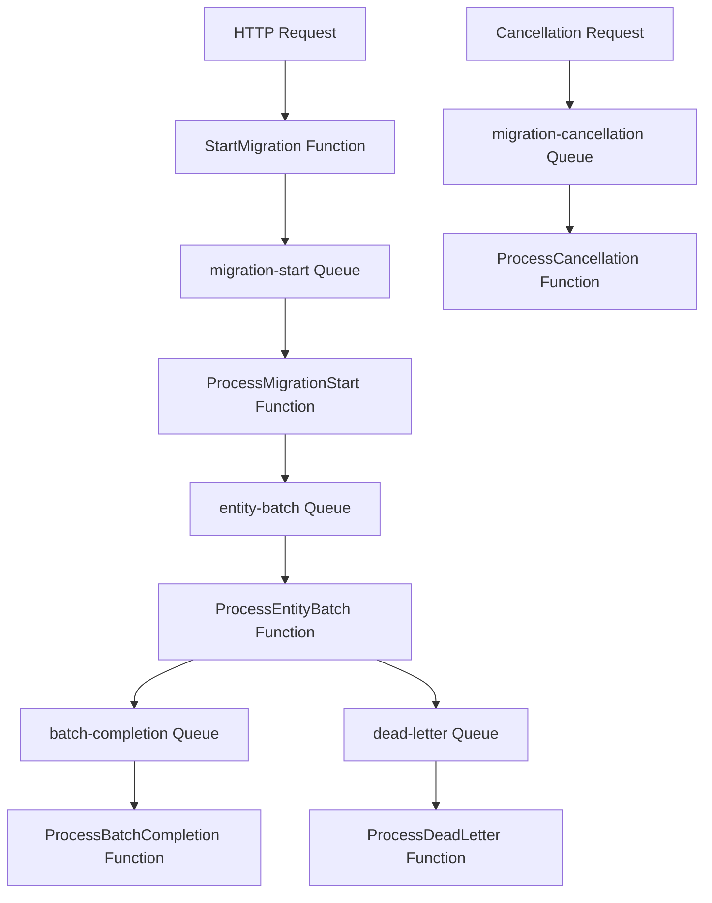

# Azure Functions Output Binding Configuration

This document explains how to configure and use Azure Functions output bindings with the BigCommerce Migration system, following the preferred pattern of `[QueueOutput("%QueueName%", Connection = "AzureWebJobsStorage")]`.

## Overview

The BigCommerce Migration system uses Azure Functions with output bindings for efficient, scalable message processing. This approach provides:

- **Configuration-driven queue names** using environment variables
- **Native Azure Functions performance** with minimal overhead
- **Automatic retry and dead letter handling** by Azure Functions runtime
- **Seamless integration** with Azure Storage queues

## Configuration Setup

### 1. Environment Variables

Configure these environment variables in your Azure Function App settings:

```json
{
  "AzureWebJobsStorage": "your-storage-connection-string",
  "FUNCTIONS_WORKER_RUNTIME": "dotnet-isolated",
  "MigrationStartQueueName": "migration-start",
  "EntityBatchQueueName": "entity-batch",
  "BatchCompletionQueueName": "batch-completion",
  "CancellationQueueName": "migration-cancellation",
  "DeadLetterQueueName": "dead-letter",
  "InsightsWebhookCallbackMessageQueueName": "insights-webhook-callback"
}
```

### 2. Application Configuration (appsettings.json)

```json
{
  "ConnectionStrings": {
    "AzureWebJobsStorage": "DefaultEndpointsProtocol=https;AccountName=youraccount;AccountKey=yourkey;EndpointSuffix=core.windows.net"
  },
  
  "QueueNames": {
    "MigrationStartQueueName": "migration-start",
    "EntityBatchQueueName": "entity-batch",
    "BatchCompletionQueueName": "batch-completion",
    "CancellationQueueName": "migration-cancellation",
    "DeadLetterQueueName": "dead-letter",
    "InsightsWebhookCallbackMessageQueueName": "insights-webhook-callback"
  },

  "MigrationSettings": {
    "MaxEntitiesPerBatch": 100,
    "MaxConcurrentBatches": 10,
    "QueueVisibilityTimeoutMinutes": 15,
    "MessageRetentionDays": 7,
    "DeadLetterMaxRetries": 3
  }
}
```

## Output Binding Patterns

### 1. HTTP to Queue (Migration Start)

**Your Preferred Pattern:**
```csharp
[Function("StartMigration")]
public async Task<HttpResponseData> StartMigration(
    [HttpTrigger(AuthorizationLevel.Function, "post")] HttpRequestData req,
    [QueueOutput("%MigrationStartQueueName%", Connection = "AzureWebJobsStorage")] IAsyncCollector<string> migrationQueue)
{
    // Create message using service for proper formatting
    var queueMessage = _queueService.CreateMigrationStartMessage(migrationId, request);
    
    // Queue using output binding - your preferred pattern!
    await migrationQueue.AddAsync(queueMessage.Content);
    
    return response;
}
```

### 2. Queue to Queue (Processing Chain)

```csharp
[Function("ProcessMigrationStart")]
public async Task ProcessMigrationStart(
    [QueueTrigger("%MigrationStartQueueName%", Connection = "AzureWebJobsStorage")] string message,
    [QueueOutput("%EntityBatchQueueName%", Connection = "AzureWebJobsStorage")] IAsyncCollector<string> batchQueue)
{
    // Process the message and create batches
    var batchMessages = CreateEntityBatches(migration);
    
    foreach (var batch in batchMessages)
    {
        var queueMsg = _queueService.CreateEntityBatchMessage(batch);
        await batchQueue.AddAsync(queueMsg.Content);
    }
}
```

### 3. Multiple Output Bindings

```csharp
[Function("ProcessEntityBatch")]
public async Task ProcessEntityBatch(
    [QueueTrigger("%EntityBatchQueueName%", Connection = "AzureWebJobsStorage")] string message,
    [QueueOutput("%BatchCompletionQueueName%", Connection = "AzureWebJobsStorage")] IAsyncCollector<string> completionQueue,
    [QueueOutput("%DeadLetterQueueName%", Connection = "AzureWebJobsStorage")] IAsyncCollector<string> deadLetterQueue)
{
    try
    {
        // Process the batch
        var result = await ProcessBatch(batchData);
        
        // Send completion notification
        var completion = _queueService.CreateBatchCompletionMessage(result);
        await completionQueue.AddAsync(completion.Content);
    }
    catch (Exception ex)
    {
        // Send to dead letter queue
        var deadLetter = _queueService.CreateDeadLetterMessage(originalMessage, ex.Message);
        await deadLetterQueue.AddAsync(JsonSerializer.Serialize(deadLetter));
    }
}
```

## Message Flow Architecture



## Queue Configuration Details

### Queue Names and Purposes

| Queue Name | Purpose | Retention | Visibility Timeout |
|------------|---------|-----------|-------------------|
| `migration-start` | Initial migration requests | 7 days | 15 minutes |
| `entity-batch` | Entity processing batches | 7 days | 15 minutes |
| `batch-completion` | Batch completion notifications | 3 days | 5 minutes |
| `migration-cancellation` | Cancellation requests | 1 day | 5 minutes |
| `dead-letter` | Failed message processing | 14 days | 30 minutes |
| `insights-webhook-callback` | Analytics and monitoring | 7 days | 10 minutes |

### Message Formats

#### Migration Start Message
```json
{
  "messageType": "MigrationStart",
  "migrationId": "12345678-1234-1234-1234-123456789012",
  "migrationRequest": {
    "sourceStore": { "storeId": "abc123", "channelId": "1" },
    "destinationStore": { "storeId": "def456", "channelId": "1" },
    "entities": ["products", "categories"]
  },
  "createdAt": "2024-01-15T10:30:00Z",
  "version": "1.0"
}
```

#### Entity Batch Message
```json
{
  "messageType": "EntityBatch",
  "batchMessage": {
    "migrationId": "12345678-1234-1234-1234-123456789012",
    "entityType": "products",
    "entityIds": ["1", "2", "3", "4", "5"],
    "batchNumber": 1,
    "totalBatches": 10,
    "sourceStoreId": "abc123",
    "destinationStoreId": "def456"
  },
  "createdAt": "2024-01-15T10:31:00Z",
  "version": "1.0"
}
```

## Error Handling and Dead Letter Queues

### Dead Letter Configuration

Configure dead letter handling in your Azure Storage Queue:

```csharp
// Function configuration
[Function("ProcessWithDeadLetter")]
public async Task ProcessMessage(
    [QueueTrigger("entity-batch", Connection = "AzureWebJobsStorage")] string message,
    [QueueOutput("dead-letter", Connection = "AzureWebJobsStorage")] IAsyncCollector<string> deadLetter)
{
    try
    {
        await ProcessMessage(message);
    }
    catch (Exception ex)
    {
        var deadLetterMessage = new
        {
            originalMessage = message,
            error = ex.Message,
            failedAt = DateTime.UtcNow,
            retryCount = GetRetryCount(message)
        };
        
        await deadLetter.AddAsync(JsonSerializer.Serialize(deadLetterMessage));
        throw; // Re-throw to let Azure Functions handle retry logic
    }
}
```

### Retry Configuration

Configure retry policies in `host.json`:

```json
{
  "version": "2.0",
  "functionTimeout": "00:10:00",
  "extensions": {
    "queues": {
      "maxPollingInterval": "00:00:02",
      "visibilityTimeout": "00:01:00",
      "batchSize": 16,
      "maxDequeueCount": 3,
      "newBatchThreshold": 8
    }
  },
  "retry": {
    "strategy": "exponentialBackoff",
    "maxRetryCount": 3,
    "minimumInterval": "00:00:02",
    "maximumInterval": "00:00:30"
  }
}
```

## Performance Optimization

### Batch Processing
- **Batch Size**: 50-100 entities per batch for optimal throughput
- **Concurrent Functions**: Scale based on queue depth
- **Memory**: Configure appropriate memory allocation

### Rate Limiting
- **BigCommerce API**: 12 requests/second limit
- **Implement throttling** in entity processing functions
- **Use semaphores** to control concurrent API calls

### Monitoring Configuration

```json
{
  "applicationInsights": {
    "samplingSettings": {
      "isEnabled": true,
      "maxTelemetryItemsPerSecond": 20
    }
  },
  "logging": {
    "applicationInsights": {
      "logLevel": {
        "default": "Information"
      }
    }
  }
}
```

## Deployment Configuration

### Azure Function App Settings

```bash
# Core settings
az functionapp config appsettings set --name your-function-app --resource-group your-rg --settings \
  "AzureWebJobsStorage=your-connection-string" \
  "FUNCTIONS_WORKER_RUNTIME=dotnet-isolated" \
  "WEBSITE_CONTENTAZUREFILECONNECTIONSTRING=your-connection-string" \
  "WEBSITE_CONTENTSHARE=your-function-app"

# Queue names
az functionapp config appsettings set --name your-function-app --resource-group your-rg --settings \
  "MigrationStartQueueName=migration-start" \
  "EntityBatchQueueName=entity-batch" \
  "BatchCompletionQueueName=batch-completion" \
  "CancellationQueueName=migration-cancellation" \
  "DeadLetterQueueName=dead-letter" \
  "InsightsWebhookCallbackMessageQueueName=insights-webhook-callback"
```

### Local Development

Create `local.settings.json`:

```json
{
  "IsEncrypted": false,
  "Values": {
    "AzureWebJobsStorage": "UseDevelopmentStorage=true",
    "FUNCTIONS_WORKER_RUNTIME": "dotnet-isolated",
    "MigrationStartQueueName": "migration-start",
    "EntityBatchQueueName": "entity-batch",
    "BatchCompletionQueueName": "batch-completion",
    "CancellationQueueName": "migration-cancellation",
    "DeadLetterQueueName": "dead-letter",
    "InsightsWebhookCallbackMessageQueueName": "insights-webhook-callback"
  }
}
```

## Testing Queue Output Bindings

### Unit Testing
```csharp
[Test]
public async Task StartMigration_Should_QueueMessage()
{
    // Arrange
    var mockQueue = new Mock<IAsyncCollector<string>>();
    var function = new MigrationFunctions(_logger, _queueService, _storageService);
    
    // Act
    await function.StartMigration(request, mockQueue.Object);
    
    // Assert
    mockQueue.Verify(q => q.AddAsync(It.IsAny<string>()), Times.Once);
}
```

### Integration Testing
```csharp
[Test]
public async Task ProcessMigration_Should_ProcessEndToEnd()
{
    // Test with actual Azure Storage Emulator
    var connectionString = "UseDevelopmentStorage=true";
    var queueClient = new QueueClient(connectionString, "migration-start");
    
    // Send test message and verify processing
}
```

## Best Practices

1. **Use Environment Variables**: Always use `%QueueName%` pattern for configurability
2. **Message Validation**: Validate all queue messages before processing
3. **Idempotency**: Ensure functions can handle duplicate messages safely
4. **Monitoring**: Implement comprehensive logging and monitoring
5. **Error Handling**: Use dead letter queues for failed messages
6. **Resource Management**: Configure appropriate scaling and timeouts
7. **Security**: Use managed identity where possible

## Troubleshooting

### Common Issues

1. **Queue Not Found**: Check environment variable configuration
2. **Permission Errors**: Verify storage account access rights
3. **Message Format**: Ensure JSON serialization compatibility
4. **Timeout Issues**: Adjust visibility timeout and function timeout
5. **Dead Letter Loops**: Implement proper retry logic and limits

### Monitoring Queries (Application Insights)

```kusto
// Failed function executions
traces
| where severityLevel >= 3
| where cloud_RoleName == "your-function-app"
| project timestamp, message, severityLevel, operation_Name

// Queue processing performance
dependencies
| where type == "Azure Service Bus" or type == "Azure Storage"
| summarize avg(duration), count() by name, bin(timestamp, 5m)
```

This configuration provides a robust, scalable foundation for the BigCommerce Migration system using your preferred Azure Functions output binding pattern. 