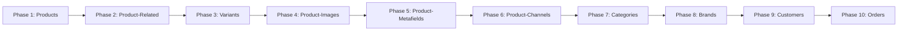

# BigCommerce Migration Workflow Guide

## 📋 **Overview**

This guide documents the complete BigCommerce to BigCommerce migration workflow, including the newly implemented **Product-Images Phase** (Phase 4). The migration system uses a multi-phase approach to ensure data integrity, handle dependencies, and provide optimal performance.

## 🔄 **Migration Phases Overview**

### **Phase Sequence**


### **Phase Dependencies**
- **Phase 1** must complete before all other phases (creates product mappings)
- **Phase 4 (Product-Images)** depends on **Phase 1** completion (requires product mappings)
- **Phase 2 (Product-Related)** should complete before **Phase 4** (optimal performance)
- **Phase 3 (Variants)** can run independently after **Phase 1**

---

## 📦 **Phase 1: Products**

### **Purpose**
Creates base products in the destination store and establishes product ID mappings.

### **Key Features**
- **Entity Type**: `products`
- **API Endpoint**: `POST /v3/catalog/products`
- **Batch Processing**: Up to 10 products per API call
- **Output**: EntityMappings for source → destination product IDs

### **Configuration**
```json
{
  "products": {
    "chunkSize": 50,
    "subBatchSize": 5,
    "maxConcurrency": 5,
    "enableSubBatching": true
  }
}
```

---

## 🔗 **Phase 2: Product-Related**

### **Purpose**
Migrates product relationships (options, modifiers, images, reviews) as separate entities.

### **Key Features**
- **Entity Type**: `product-related`
- **Processing**: Individual product components
- **Dependencies**: Requires Phase 1 completion
- **Skip Logic**: Products without related data are skipped

### **Components Migrated**
- Product Options
- Product Modifiers  
- Product Images (legacy approach)
- Product Reviews

---

## 🔀 **Phase 3: Variants**

### **Purpose**
Migrates product variants with proper option associations.

### **Key Features**
- **Entity Type**: `variants`
- **API Endpoint**: `POST /v3/catalog/products/{product_id}/variants`
- **Dependencies**: Requires product options from Phase 2
- **Complex Logic**: Option value mapping and validation

---

## 🖼️ **Phase 4: Product-Images (NEW)**

### **Purpose**
Updates existing products with image data using individual product API calls for optimal reliability.

### **Key Features**
- **Entity Type**: `product-images`
- **API Endpoint**: `PUT /v3/catalog/products/{product_id}`
- **Processing Model**: Individual product updates (not batch)
- **Memory Management**: Streaming fetch of up to 1000 images per product
- **Image Handling**: 50 images per API call with 300ms delays

### **Architecture Highlights**

#### **Discovery Strategy**
```csharp
// Uses EntityProgress instead of API discovery
var successfulProducts = await storageService.GetSuccessfulEntitiesAsync(migrationId, "products");
return new EntityDiscoveryResult { TotalCount = successfulProducts.SuccessCount };
```

#### **Streaming Fetch**
```csharp
// Memory-efficient streaming
await fetchService.FetchProductImagesStreamingAsync(
    productId, sourceStore, migrationId, 
    async (imageChunk) => {
        // Process 50 images immediately, don't accumulate
        await ProcessImageChunk(imageChunk);
    });
```

#### **Individual Product Updates**
```csharp
// Update existing products, don't create new entities
PUT /v3/catalog/products/{product_id}
{
  "images": [
    {
      "product_id": "123",
      "image_url": "https://store-source.mybigcommerce.com/product_images/image.jpg",
      "is_thumbnail": true,
      "sort_order": 1,
      "description": "Product image"
    }
  ]
}
```

### **Performance Characteristics**
- **Timeout Safety**: Worst case 55.7s < 120s Azure Function limit
- **Memory Efficiency**: <256KB for 5 concurrent products
- **Rate Limiting**: 300ms delays prevent API throttling
- **Concurrency**: 5 products processed simultaneously

### **Configuration**
```json
{
  "product-images": {
    "entityType": "product-images",
    "chunkSize": 20,
    "subBatchSize": 1,
    "maxConcurrency": 5,
    "enableSubBatching": true,
    "processSubBatchesSequentially": false,
    "imageChunkSize": 50,
    "imageChunkDelayMs": 300,
    "maxImagesPerProduct": 1000,
    "cancellationCheckInterval": 5
  }
}
```

### **Error Handling**
- **Continue-on-Error**: Individual image failures don't stop product processing
- **Skip Logic**: Products with no images are marked as skipped
- **Structured Logging**: All errors logged to OpenSearch for analysis
- **Progress Tracking**: Individual image success/failure tracked in EntityProcess

---

## 📋 **Phase 5: Product-Metafields**

### **Purpose**
Migrates custom metafields attached to products.

### **Key Features**
- **Entity Type**: `product-metafields`
- **API Endpoint**: `POST /v3/catalog/products/{product_id}/metafields`
- **Dependencies**: Requires Phase 1 completion

---

## 🏪 **Phase 6: Product-Channels**

### **Purpose**
Associates products with sales channels and channel-specific settings.

### **Key Features**
- **Entity Type**: `product-channels`
- **Dependencies**: Requires Phase 1 completion
- **Channel Logic**: Maps products to appropriate sales channels

---

## 📁 **Phase 7: Categories**

### **Purpose**
Migrates product categories and category tree structure.

### **Key Features**
- **Entity Type**: `categories`
- **API Endpoint**: `POST /v3/catalog/categories`
- **Hierarchy**: Maintains category parent-child relationships

---

## 🏷️ **Phase 8: Brands**

### **Purpose**
Migrates product brands as separate entities.

### **Key Features**
- **Entity Type**: `brands`
- **API Endpoint**: `POST /v3/catalog/brands`
- **Independence**: Can run independently of other phases

---

## 👥 **Phase 9: Customers**

### **Purpose**
Migrates customer accounts and associated data.

### **Key Features**
- **Entity Type**: `customers`
- **API Endpoint**: `POST /v2/customers`
- **Data Privacy**: Handles PII with appropriate security

---

## 🛒 **Phase 10: Orders**

### **Purpose**
Migrates historical order data and order relationships.

### **Key Features**
- **Entity Type**: `orders`
- **API Endpoint**: `POST /v2/orders`
- **Dependencies**: Requires customers and products
- **Complexity**: Most complex phase due to order relationships

---

## 🔧 **Workflow Configuration**

### **Global Settings**
```json
{
  "ParallelProcessing": {
    "defaultChunkSize": 50,
    "defaultSubBatchSize": 5,
    "defaultMaxConcurrency": 5,
    "defaultEnableSubBatching": true,
    "defaultProcessSubBatchesSequentially": false
  }
}
```

### **Phase-Specific Overrides**
Each phase can override global settings based on its specific requirements:

```json
{
  "subBatchConfigurations": {
    "products": { "subBatchSize": 5, "maxConcurrency": 5 },
    "product-related": { "subBatchSize": 1, "maxConcurrency": 3 },
    "variants": { "subBatchSize": 1, "maxConcurrency": 2 },
    "product-images": { 
      "subBatchSize": 1, 
      "maxConcurrency": 5,
      "imageChunkSize": 50,
      "imageChunkDelayMs": 300
    }
  }
}
```

---

## 📊 **Progress Tracking**

### **EntityProgress Table**
Tracks completion status for each phase:
```json
{
  "migrationId": "migration-001",
  "entityType": "products",
  "status": "Completed",
  "totalCount": 1000,
  "successCount": 995,
  "failedCount": 5,
  "lastUpdated": "2024-01-01T10:00:00Z"
}
```

### **EntityMappings Table**
Stores source → destination ID mappings:
```json
{
  "migrationId": "migration-001",
  "entityType": "products",
  "sourceId": "123",
  "destinationId": "456",
  "createdAt": "2024-01-01T10:00:00Z"
}
```

### **Real-Time Updates**
- **SignalR Integration**: Live progress updates to dashboard
- **OpenSearch Logging**: Centralized error and performance logging
- **Application Insights**: Azure monitoring and alerting

---

## 🚀 **Execution Flow**

### **1. Migration Initialization**
```csharp
// Initialize migration with store configurations
var migration = await InitializeMigrationAsync(sourceStore, destinationStore);
```

### **2. Phase Dependency Resolution**
```csharp
// Determine execution order based on dependencies
var phases = await EntityDependencyResolver.GetExecutionOrderAsync();
```

### **3. Phase Execution**
```csharp
foreach (var phase in phases)
{
    // 1. Discovery: Identify entities to migrate
    var entities = await DiscoverEntitiesAsync(phase.EntityType);
    
    // 2. Chunking: Break into manageable chunks
    var chunks = ChunkEntities(entities, phase.ChunkSize);
    
    // 3. Processing: Process each chunk
    foreach (var chunk in chunks)
    {
        await ProcessEntityChunkAsync(chunk, phase);
    }
}
```

### **4. Error Handling and Recovery**
```csharp
// Automatic retry for transient failures
// Manual intervention points for data issues
// Detailed logging for post-migration analysis
```

---

## 🔍 **Monitoring and Troubleshooting**

### **Key Metrics**
- **Processing Rate**: Entities per minute
- **Error Rate**: Failed entities percentage
- **Memory Usage**: Peak memory consumption
- **API Performance**: Response times and rate limiting

### **Dashboard Views**
- **Migration Overview**: High-level progress across all phases
- **Phase Details**: Drill-down into specific phase metrics
- **Error Analysis**: Failed entity investigation tools
- **Performance Monitoring**: Real-time performance metrics

### **Common Issues**
1. **API Rate Limiting**: Adjust delay configurations
2. **Memory Exhaustion**: Review chunk sizes and concurrency
3. **Timeout Errors**: Optimize processing logic or increase limits
4. **Data Validation**: Handle source data quality issues

---

## 📈 **Performance Optimization**

### **Configuration Tuning**
- **Chunk Size**: Balance between throughput and memory usage
- **Concurrency**: Optimize based on API performance and limits
- **Delays**: Prevent rate limiting while maintaining speed

### **Special Considerations for Product-Images**
- **Memory Management**: Streaming approach prevents memory issues
- **API Efficiency**: Individual updates provide better reliability
- **Rate Limiting**: Conservative delays prevent API throttling
- **Error Recovery**: Continue-on-error prevents cascade failures

### **Monitoring and Alerting**
- **Azure Function Timeouts**: Monitor and alert on approaching limits
- **API Error Rates**: Track BigCommerce API response patterns
- **Memory Usage**: Alert on high memory consumption
- **Progress Stalls**: Detect and alert on stuck migrations

---

## 🎯 **Best Practices**

### **Pre-Migration**
1. **Data Assessment**: Analyze source store data volume and quality
2. **Performance Testing**: Test with representative data samples
3. **Configuration Optimization**: Tune settings based on store characteristics

### **During Migration**
1. **Active Monitoring**: Watch dashboards for issues
2. **Progress Validation**: Verify expected progress rates
3. **Error Investigation**: Promptly address any systematic errors

### **Post-Migration**
1. **Data Validation**: Compare source and destination data
2. **Performance Analysis**: Review migration metrics for insights
3. **Documentation Updates**: Record any lessons learned

This comprehensive workflow provides a robust framework for BigCommerce to BigCommerce migrations, with the new Product-Images phase offering enhanced reliability and performance for image migration scenarios.
