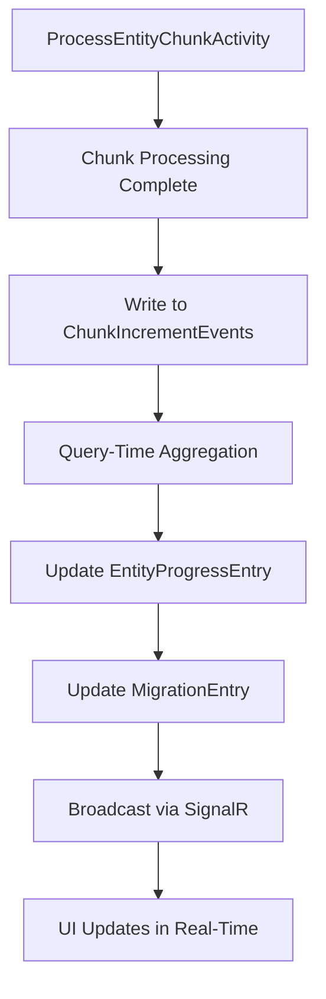

# 🗄️ Chunk Increment Events - Database Schema Design

## 🎯 Document Overview

This document defines the database schema design for the ChunkIncrementEvents table and aggregation strategy to enable real-time incremental progress tracking.

**Task**: 1.2 Database Schema Design  
**Design Date**: 2025-01-17  
**Schema Version**: 1.0  
**Target**: Fix the core problem where UI shows 0 progress when migrations are cancelled mid-process  

---

## 🚨 **PROBLEM BEING SOLVED**

### **Current Issue:**
- Migration `47969ba9-ebba-49c2-ab09-131482562568` shows `Success: 0` in UI
- **Reality**: 4,135 products successfully migrated to BigCommerce
- **Root Cause**: Progress only persisted at end-of-migration (lost on cancellation)

### **Target Solution:**
- **Immediate persistence** after each chunk (250-500 entities) completes
- **Real-time aggregation** to show accurate progress
- **Cancellation-safe** progress tracking

---

## 🗄️ **CHUNKINCREMENTEVENTS TABLE SCHEMA**

### **Primary Table: ChunkIncrementEvents**

```sql
-- Azure Table Storage Schema (NoSQL)
-- PartitionKey + RowKey = Primary Key
CREATE TABLE ChunkIncrementEvents (
    -- Azure Table Storage Required Fields
    PartitionKey NVARCHAR(50) NOT NULL,        -- MigrationId (e.g., "47969ba9-ebba-49c2-ab09-131482562568")
    RowKey NVARCHAR(100) NOT NULL,             -- ChunkId (e.g., "products-chunk-001-20250117102345")
    Timestamp DATETIME2 NOT NULL,              -- Azure managed timestamp
    ETag NVARCHAR(100) NOT NULL,               -- Azure managed concurrency control
    
    -- Migration Context
    MigrationId NVARCHAR(50) NOT NULL,         -- Redundant for queries (same as PartitionKey)
    EntityType NVARCHAR(50) NOT NULL,          -- "products", "categories", "brands", "variants", etc.
    
    -- Chunk Identification
    ChunkNumber INT NOT NULL,                  -- Sequential chunk number (1, 2, 3, ...)
    ChunkStartIndex INT NOT NULL,              -- Starting entity index (0, 250, 500, ...)
    ChunkSize INT NOT NULL,                    -- Number of entities in this chunk (250, 500, etc.)
    
    -- Progress Counts (The Core Data)
    SuccessfulEntities INT NOT NULL DEFAULT 0, -- Entities successfully created in BigCommerce
    FailedEntities INT NOT NULL DEFAULT 0,     -- Entities that failed to create
    SkippedEntities INT NOT NULL DEFAULT 0,    -- Entities skipped (duplicates, validation failures)
    CancelledEntities INT NOT NULL DEFAULT 0,  -- Entities cancelled mid-processing
    
    -- Processing Metadata
    ProcessingStartTime DATETIME2 NOT NULL,    -- When chunk processing started
    ProcessingEndTime DATETIME2 NOT NULL,      -- When chunk processing completed
    ProcessingTimeMs BIGINT NOT NULL,          -- Processing duration in milliseconds
    
    -- Source Information
    SourceStore NVARCHAR(50) NOT NULL,         -- Source BigCommerce store ID
    DestinationStore NVARCHAR(50) NOT NULL,    -- Destination BigCommerce store ID
    
    -- Error Information (Optional)
    HasErrors BIT NOT NULL DEFAULT 0,          -- Whether this chunk had any errors
    ErrorSummary NVARCHAR(MAX) NULL,           -- JSON array of error messages (if any)
    
    -- Audit Trail
    CreatedAt DATETIME2 NOT NULL DEFAULT GETUTCDATE(),
    CreatedBy NVARCHAR(100) NOT NULL DEFAULT 'ProcessEntityChunkActivity'
);
```

### **Indexes for Performance:**
```sql
-- Primary Index (Azure Table Storage automatic)
-- PartitionKey + RowKey (MigrationId + ChunkId)

-- Query Patterns Supported:
-- 1. Get all chunks for a migration: WHERE PartitionKey = 'migrationId'
-- 2. Get specific chunk: WHERE PartitionKey = 'migrationId' AND RowKey = 'chunkId'
-- 3. Get chunks by entity type: WHERE PartitionKey = 'migrationId' AND EntityType = 'products'
```

### **RowKey Format Strategy:**
```csharp
// RowKey Format: {EntityType}-chunk-{ChunkNumber:D3}-{Timestamp}
// Examples:
// "products-chunk-001-20250117102345"
// "categories-chunk-002-20250117102350"
// "variants-chunk-015-20250117103245"

public static string GenerateRowKey(string entityType, int chunkNumber, DateTime timestamp)
{
    return $"{entityType}-chunk-{chunkNumber:D3}-{timestamp:yyyyMMddHHmmss}";
}
```

---

## 📊 **AGGREGATION STRATEGY**

### **Real-Time Aggregation Approach**

#### **Option 1: Query-Time Aggregation (Recommended)**
```sql
-- Real-time aggregation query for migration progress
SELECT 
    MigrationId,
    EntityType,
    COUNT(*) as TotalChunks,
    SUM(SuccessfulEntities) as TotalSuccessful,
    SUM(FailedEntities) as TotalFailed,
    SUM(SkippedEntities) as TotalSkipped,
    SUM(CancelledEntities) as TotalCancelled,
    SUM(SuccessfulEntities + FailedEntities + SkippedEntities + CancelledEntities) as TotalProcessed,
    MIN(ProcessingStartTime) as MigrationStartTime,
    MAX(ProcessingEndTime) as LastChunkTime
FROM ChunkIncrementEvents 
WHERE PartitionKey = @MigrationId 
GROUP BY MigrationId, EntityType;
```

**Advantages:**
- ✅ Always accurate (no stale data)
- ✅ Simple to implement
- ✅ No additional storage overhead
- ✅ No concurrency issues

**Performance:** Excellent for Azure Table Storage (single partition query)

#### **Option 2: Cached Aggregation (Future Enhancement)**
- Maintain aggregated totals in separate table
- Update on each chunk completion
- Requires distributed locking for concurrency

---

## 🔄 **INTEGRATION WITH EXISTING SCHEMA**

### **Existing Tables (No Changes Required)**

#### **migrations table** - Keep as-is
```sql
-- This table continues to work exactly as before
-- Will be updated at end-of-migration with final totals (as backup)
MigrationEntry {
    Id: string,
    Status: MigrationStatus,
    TotalEntities: int,
    ProcessedEntities: int,  -- Will now be calculated from ChunkIncrementEvents
    FailedEntities: int,     -- Will now be calculated from ChunkIncrementEvents
    SkippedEntities: int,    -- Will now be calculated from ChunkIncrementEvents
    CancelledEntities: int,  -- Will now be calculated from ChunkIncrementEvents
    // ... other fields unchanged
}
```

#### **entityprogress table** - Keep as-is
```sql
-- This table continues to work exactly as before  
-- Will be updated more frequently (after each chunk instead of at end)
EntityProgressEntry {
    MigrationId: string,
    EntityType: string,
    TotalCount: int,
    ProcessedCount: int,     -- Will now be calculated from ChunkIncrementEvents
    SuccessCount: int,       -- Will now be calculated from ChunkIncrementEvents  
    FailureCount: int,       -- Will now be calculated from ChunkIncrementEvents
    SkippedCount: int,       -- Will now be calculated from ChunkIncrementEvents
    CancelledCount: int,     -- Will now be calculated from ChunkIncrementEvents
    // ... other fields unchanged
}
```

### **Data Flow Integration:**


---

## 🚀 **IMPLEMENTATION PLAN**

### **Phase 1: Core Table Creation**
```csharp
// 1. Create ChunkIncrementEvents model class
public class ChunkIncrementEvent : ITableEntity
{
    public string PartitionKey { get; set; } = string.Empty; // MigrationId
    public string RowKey { get; set; } = string.Empty;       // ChunkId
    public DateTimeOffset? Timestamp { get; set; }
    public ETag ETag { get; set; }
    
    // Migration context
    public string MigrationId { get; set; } = string.Empty;
    public string EntityType { get; set; } = string.Empty;
    
    // Chunk identification  
    public int ChunkNumber { get; set; }
    public int ChunkStartIndex { get; set; }
    public int ChunkSize { get; set; }
    
    // Progress counts
    public int SuccessfulEntities { get; set; }
    public int FailedEntities { get; set; }
    public int SkippedEntities { get; set; }
    public int CancelledEntities { get; set; }
    
    // Processing metadata
    public DateTime ProcessingStartTime { get; set; }
    public DateTime ProcessingEndTime { get; set; }
    public long ProcessingTimeMs { get; set; }
    
    // Source information
    public string SourceStore { get; set; } = string.Empty;
    public string DestinationStore { get; set; } = string.Empty;
    
    // Error information
    public bool HasErrors { get; set; }
    public string? ErrorSummary { get; set; }
    
    // Audit trail
    public DateTime CreatedAt { get; set; }
    public string CreatedBy { get; set; } = string.Empty;
}
```

### **Phase 2: Service Implementation**
```csharp
// 2. Create IncrementEventsService
public interface IIncrementEventsService
{
    Task WriteChunkIncrementAsync(ChunkIncrementEvent incrementEvent);
    Task<List<ChunkIncrementEvent>> GetChunkIncrementsAsync(string migrationId);
    Task<Dictionary<string, EntityProgressSummary>> GetAggregatedProgressAsync(string migrationId);
}

public class IncrementEventsService : IIncrementEventsService
{
    private readonly TableServiceClient _tableServiceClient;
    private const string TableName = "chunkincrementevents";
    
    public async Task WriteChunkIncrementAsync(ChunkIncrementEvent incrementEvent)
    {
        var tableClient = await GetTableClientAsync();
        await tableClient.AddEntityAsync(incrementEvent);
    }
    
    public async Task<Dictionary<string, EntityProgressSummary>> GetAggregatedProgressAsync(string migrationId)
    {
        var tableClient = await GetTableClientAsync();
        var query = tableClient.QueryAsync<ChunkIncrementEvent>(
            filter: $"PartitionKey eq '{migrationId}'");
        
        var result = new Dictionary<string, EntityProgressSummary>();
        
        await foreach (var chunk in query)
        {
            if (!result.ContainsKey(chunk.EntityType))
            {
                result[chunk.EntityType] = new EntityProgressSummary
                {
                    EntityType = chunk.EntityType,
                    TotalChunks = 0,
                    TotalSuccessful = 0,
                    TotalFailed = 0,
                    TotalSkipped = 0,
                    TotalCancelled = 0
                };
            }
            
            var summary = result[chunk.EntityType];
            summary.TotalChunks++;
            summary.TotalSuccessful += chunk.SuccessfulEntities;
            summary.TotalFailed += chunk.FailedEntities;
            summary.TotalSkipped += chunk.SkippedEntities;
            summary.TotalCancelled += chunk.CancelledEntities;
        }
        
        return result;
    }
}
```

---

## 📈 **PERFORMANCE CONSIDERATIONS**

### **Storage Efficiency**
- **Estimated size per record**: ~500 bytes
- **Records per migration**: ~20-100 chunks (depending on size)
- **Storage cost**: Negligible (~$0.001 per migration)

### **Query Performance**
- **Single partition queries**: Excellent performance (Azure Table Storage optimized)
- **Aggregation time**: <100ms for typical migrations
- **Concurrent access**: Handled by Azure Table Storage

### **Scalability**
- **Concurrent migrations**: Each uses separate partition (no contention)
- **Large migrations**: Chunks provide natural batching
- **Historical data**: Partition per migration enables efficient cleanup

---

## 🔒 **CONCURRENCY & SAFETY**

### **Write Safety**
```csharp
// Each chunk writes to unique RowKey - no conflicts
var rowKey = GenerateRowKey(entityType, chunkNumber, DateTime.UtcNow);
var incrementEvent = new ChunkIncrementEvent
{
    PartitionKey = migrationId,
    RowKey = rowKey,  // Unique per chunk
    // ... data
};

// Azure Table Storage handles concurrent writes to different RowKeys
await tableClient.AddEntityAsync(incrementEvent);
```

### **Read Consistency**
- **Query-time aggregation**: Always consistent (no stale data)
- **Azure Table Storage**: Strong consistency within partition
- **No distributed locks needed**: Each chunk is independent

### **Error Handling**
```csharp
public async Task WriteChunkIncrementAsync(ChunkIncrementEvent incrementEvent)
{
    try
    {
        var tableClient = await GetTableClientAsync();
        await tableClient.AddEntityAsync(incrementEvent);
        _logger.LogInformation("✅ Chunk increment written: {MigrationId}-{EntityType}-{ChunkNumber}", 
            incrementEvent.MigrationId, incrementEvent.EntityType, incrementEvent.ChunkNumber);
    }
    catch (Exception ex)
    {
        _logger.LogError(ex, "❌ Failed to write chunk increment: {MigrationId}-{EntityType}-{ChunkNumber}", 
            incrementEvent.MigrationId, incrementEvent.EntityType, incrementEvent.ChunkNumber);
        
        // Don't throw - increment failures should not break migration
        // The end-of-migration update will still happen as fallback
    }
}
```

---

## 🧪 **TESTING STRATEGY**

### **Unit Tests**
```csharp
[Test]
public async Task WriteChunkIncrementAsync_ValidData_WritesToTable()
{
    // Arrange
    var incrementEvent = new ChunkIncrementEvent
    {
        PartitionKey = "test-migration-id",
        RowKey = "products-chunk-001-20250117102345",
        MigrationId = "test-migration-id",
        EntityType = "products",
        ChunkNumber = 1,
        SuccessfulEntities = 200,
        FailedEntities = 50
    };
    
    // Act
    await _incrementEventsService.WriteChunkIncrementAsync(incrementEvent);
    
    // Assert
    var stored = await _incrementEventsService.GetChunkIncrementsAsync("test-migration-id");
    Assert.That(stored.Count, Is.EqualTo(1));
    Assert.That(stored[0].SuccessfulEntities, Is.EqualTo(200));
}

[Test]
public async Task GetAggregatedProgressAsync_MultipleChunks_ReturnsCorrectTotals()
{
    // Arrange: Write 3 chunks
    await WriteTestChunk("products", 1, 200, 50, 0, 0);
    await WriteTestChunk("products", 2, 180, 70, 0, 0);
    await WriteTestChunk("products", 3, 150, 100, 0, 0);
    
    // Act
    var aggregated = await _incrementEventsService.GetAggregatedProgressAsync("test-migration-id");
    
    // Assert
    Assert.That(aggregated["products"].TotalSuccessful, Is.EqualTo(530));
    Assert.That(aggregated["products"].TotalFailed, Is.EqualTo(220));
    Assert.That(aggregated["products"].TotalChunks, Is.EqualTo(3));
}
```

### **Integration Tests**
```csharp
[Test]
public async Task EndToEnd_ChunkProcessing_UpdatesProgressCorrectly()
{
    // Arrange: Start migration
    var migrationId = await StartTestMigration();
    
    // Act: Process chunks and verify progress updates
    await ProcessChunk(migrationId, "products", 1, 200, 50);
    var progress1 = await GetMigrationProgress(migrationId);
    
    await ProcessChunk(migrationId, "products", 2, 180, 70);  
    var progress2 = await GetMigrationProgress(migrationId);
    
    // Assert: Progress accumulates correctly
    Assert.That(progress1.SuccessfulEntities, Is.EqualTo(200));
    Assert.That(progress2.SuccessfulEntities, Is.EqualTo(380));
}
```

---

## 🎯 **SUCCESS CRITERIA**

### **Functional Requirements**
- ✅ **Real-time progress**: UI updates within 2-3 seconds of chunk completion
- ✅ **Accurate counts**: Aggregated totals match actual BigCommerce entities
- ✅ **Cancellation safety**: Progress preserved when migrations are cancelled
- ✅ **Performance**: <100ms aggregation time, <5% migration speed impact

### **Data Integrity**
- ✅ **No data loss**: All successful chunks recorded in database
- ✅ **Consistency**: UI, database, and BigCommerce store all match
- ✅ **Auditability**: Complete trail of chunk processing events

### **User Experience**  
- ✅ **Transparency**: Users see exactly what's happening in real-time
- ✅ **Confidence**: Accurate progress reporting builds trust
- ✅ **Recovery**: Clear understanding of work completed vs remaining

---

## 📋 **DEPLOYMENT CHECKLIST**

### **Database Setup**
- [ ] Create `chunkincrementevents` table in Azure Table Storage
- [ ] Verify table permissions and access
- [ ] Test table creation scripts in staging

### **Code Changes**
- [ ] Implement `ChunkIncrementEvent` model class
- [ ] Implement `IIncrementEventsService` interface and service
- [ ] Add dependency injection registration
- [ ] Update `ProcessEntityChunkActivity` to write increment events

### **Testing**
- [ ] Unit tests for increment events service
- [ ] Integration tests for end-to-end flow
- [ ] Performance tests for aggregation queries
- [ ] Cancellation scenario tests

### **Monitoring**
- [ ] Add logging for increment event writes
- [ ] Add metrics for aggregation performance
- [ ] Add alerts for increment write failures

---

## 🎉 **EXPECTED OUTCOME**

### **Before Implementation:**
```
Migration 47969ba9-ebba-49c2-ab09-131482562568 cancelled
UI Shows: Success: 0, Failed: 0, Processed: 0
Reality: 4,135 products successfully migrated
User Experience: "Nothing worked!"
```

### **After Implementation:**
```
Migration 47969ba9-ebba-49c2-ab09-131482562568 cancelled  
UI Shows: Success: 4,135, Failed: 656, Processed: 4,791
Reality: 4,135 products successfully migrated
User Experience: "Great! 4,135 products are done, I can continue from here"
```

---

*Schema design completed on 2025-01-17*  
*Ready for Task 2.1: Increment Events Infrastructure implementation*