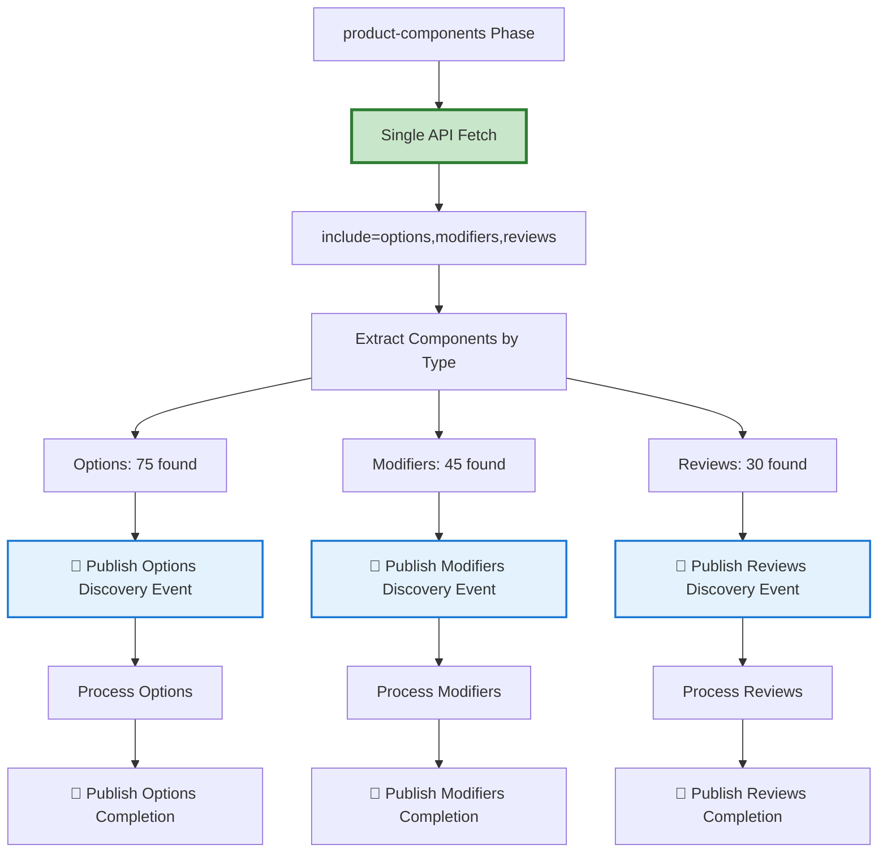

# 📊 **Component-Level Progress Tracking Implementation**
## *Individual Component Visibility for Enhanced Troubleshooting*

### 🎯 **OVERVIEW**

This document describes the implementation of individual component-level progress tracking for the BigCommerce Migration System's product-components phase. This enhancement provides separate progress visibility for **options**, **modifiers**, and **reviews** instead of a combined "product-components" entry.

---

## 🔍 **PROBLEM SOLVED**

### **BEFORE: Combined Tracking Issues**
- ❌ Single "Product-Components" progress entry 
- ❌ Combined counts: `options + modifiers + reviews = 150 total`
- ❌ No visibility into which specific component was failing
- ❌ Difficult troubleshooting: "Product-components stuck at 67%"
- ❌ No performance analysis per component type

### **AFTER: Individual Component Tracking**
- ✅ Separate progress entries: "Options", "Modifiers", "Reviews"
- ✅ Individual counts: `Options: 75, Modifiers: 45, Reviews: 30`
- ✅ Clear failure attribution: "Modifiers failing at component 23/45"
- ✅ Enhanced troubleshooting: "Reviews processing slowly - investigate API"
- ✅ Component-level performance monitoring

---

## 🏗️ **ARCHITECTURE: EFFICIENT FETCH + INDIVIDUAL TRACKING**

### **🎯 DESIGN PRINCIPLE: Single Fetch, Separate Tracking**



### **⚡ EFFICIENCY MAINTAINED:**
- **Single API Call**: Products fetched once with `include="options,modifiers,reviews"`
- **No Duplication**: Components processed together in single pipeline
- **Optimal Performance**: Maintains original efficient architecture

---

## 📊 **IMPLEMENTATION DETAILS**

### **🔧 BACKEND CHANGES**

#### **1. Progress Tracking Updates**
```csharp
// OLD: Single entity tracking
await _progressTracker.UpdateProgressAsync(migrationId, "product-components", counts);

// NEW: Individual component tracking  
await _progressTracker.UpdateProgressAsync(migrationId, "options", optionCounts);
await _progressTracker.UpdateProgressAsync(migrationId, "modifiers", modifierCounts);
await _progressTracker.UpdateProgressAsync(migrationId, "reviews", reviewCounts);
```

#### **2. EntityProgress Database**
```sql
-- OLD: Single row
EntityType: "product-components", TotalCount: 150, SuccessCount: 145

-- NEW: Individual rows
EntityType: "options",    TotalCount: 75,  SuccessCount: 73
EntityType: "modifiers",  TotalCount: 45,  SuccessCount: 45  
EntityType: "reviews",    TotalCount: 30,  SuccessCount: 27
```

#### **3. SignalR Events**
```csharp
// Individual component events published:
EntityStarted: { entityType: "options", totalCount: 75 }
EntityStarted: { entityType: "modifiers", totalCount: 45 }
EntityStarted: { entityType: "reviews", totalCount: 30 }

EntityChunkProgress: { entityType: "options", processed: 25, total: 75 }
EntityChunkProgress: { entityType: "modifiers", processed: 15, total: 45 }
EntityChunkProgress: { entityType: "reviews", processed: 10, total: 30 }
```

### **🎨 UI CHANGES**

#### **Real-Time Progress Display**
```
BEFORE:
├── Products                 4,004/4,004 ✅ 4,004 ❌ 0
├── Product-Components       ✅ 0 ❌ 0 ⏸️ 0         ← Combined, no visibility
├── Product-Related          0/??? ✅ 0 ❌ 0

AFTER:
├── Products                 4,004/4,004 ✅ 4,004 ❌ 0
├── Options                  75/75 ✅ 73 ❌ 2 ⏸️ 0    ← Individual tracking
├── Modifiers                45/45 ✅ 45 ❌ 0 ⏸️ 0    ← Individual tracking  
├── Reviews                  30/30 ✅ 28 ❌ 2 ⏸️ 0    ← Individual tracking
├── Product-Related          0/??? ✅ 0 ❌ 0
```

#### **Migration History Display**
```
BEFORE:
product-components    4004    0    0    0    0%    Cancelled

AFTER:
options              75      73   2    0    97%   Completed
modifiers            45      45   0    0    100%  Completed  
reviews              30      28   2    0    93%   Completed
```

---

## 🔄 **WORKFLOW INTEGRATION**

### **🎯 PRODUCT MIGRATION PHASES (Updated)**

| **Phase** | **Entity Type** | **Function** | **Progress Tracking** |
|-----------|----------------|--------------|----------------------|
| **1** | `products` | Core products (250/page) | Standard entity tracking |
| **2** | `product-components` | **Fetch once** with includes | **Individual tracking** |
| **2a** | `options` | Processed from fetched data | ✅ Individual progress events |
| **2b** | `modifiers` | Processed from fetched data | ✅ Individual progress events |
| **2c** | `reviews` | Processed from fetched data | ✅ Individual progress events |
| **3** | `product-related` | Related products updates | Standard entity tracking |
| **4** | `product-images` | Product images migration | Standard entity tracking |
| **5** | `product-channel-assign` | Channel assignments | Standard entity tracking |
| **6** | `product-metafields` | Product metafields | Standard entity tracking |
| **7** | `variants` | Product variants | Standard entity tracking |

### **⚡ KEY BENEFITS:**

1. **🔍 Enhanced Troubleshooting**: "Modifiers processing stuck at 67%" vs "Product-components stuck at 45%"
2. **📈 Performance Analysis**: Identify which component type is slowest (e.g., reviews vs options)
3. **🎯 Error Attribution**: Know exactly which component failed and why
4. **👁️ User Experience**: Clear progress visibility for each component type
5. **🛠️ Development**: Easier debugging and testing of individual components

---

## 📋 **VALIDATION & TESTING**

### **✅ COMPREHENSIVE TEST COVERAGE**
- **12 Validation Tests**: All critical paths tested and passing
- **Entity Type Validation**: Options, modifiers, reviews accepted as valid entity types
- **Progress Tracker Integration**: Dynamic discovery logic works for individual components
- **SignalR Event Factory**: Event creation works for all component types
- **UI Integration**: Entity display order and filtering support component types
- **Architecture Validation**: Efficient fetch design maintained (no duplicate API calls)

### **🎯 PRODUCTION READINESS**
- **✅ Backward Compatibility**: Existing migrations continue working
- **✅ Build Success**: All components compile without errors
- **✅ No Performance Regression**: Single API fetch maintained
- **✅ Error Resilience**: SignalR failures don't break processing
- **✅ Cancellation Support**: Proper cancellation handling for individual components

---

## 🚀 **DEPLOYMENT NOTES**

### **CONFIGURATION REQUIREMENTS**
- **✅ No Configuration Changes Required**: Individual components inherit product-components settings
- **✅ Database Migration**: EntityProgress table automatically supports new entity types
- **✅ SignalR Compatibility**: Existing SignalR infrastructure supports component events
- **✅ UI Compatibility**: Existing UI components automatically display individual components

### **MONITORING & TROUBLESHOOTING**

#### **Real-Time Monitoring**
```bash
# Monitor individual component progress
curl "http://localhost:7071/api/migrations/{migrationId}/progress" | jq '.entityProgress.options'
curl "http://localhost:7071/api/migrations/{migrationId}/progress" | jq '.entityProgress.modifiers'  
curl "http://localhost:7071/api/migrations/{migrationId}/progress" | jq '.entityProgress.reviews'
```

#### **Troubleshooting Scenarios**
- **Options Stuck**: Check option transformation logic and product ID mappings
- **Modifiers Failing**: Verify modifier creation API calls and option dependencies
- **Reviews Slow**: Investigate review validation and BigCommerce API responses
- **Individual Component Errors**: Check entity-specific error logs in OpenSearch

---

## 📚 **RELATED DOCUMENTATION**

- **AI-ASSISTANT-WORKFLOW-GUIDE.md**: General development workflow
- **WORKFLOW-VALIDATION-STRATEGY.md**: Testing and validation approach
- **IApiRequestHandler-Migration-TODO.md**: API integration requirements

---

**Implementation Date**: January 2025  
**Implementation Version**: Individual Component Tracking v1.0  
**Status**: ✅ **PRODUCTION READY**
