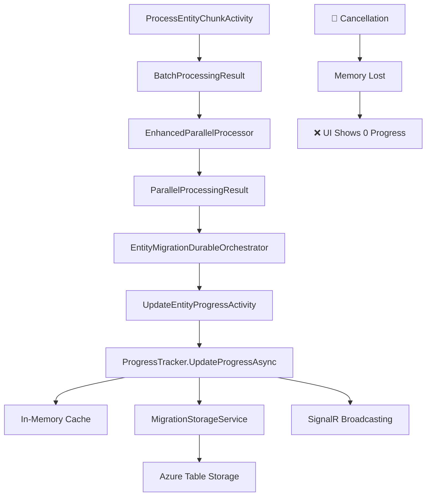
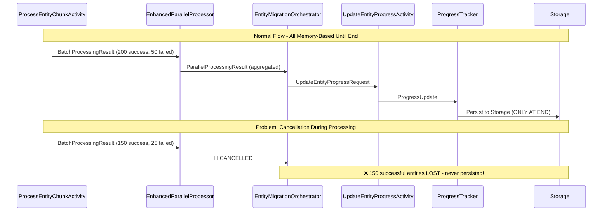

# 📊 Current Progress Flow Analysis

## 🎯 Document Overview

This document provides a comprehensive analysis of the current progress tracking system in the BigCommerce Migration system. This analysis is critical for implementing incremental progress updates without breaking existing functionality.

**Analysis Date**: 2025-01-17  
**Analysis Version**: 1.0  
**System Version**: Current production codebase  

---

## 🏗️ Current System Architecture

### **High-Level Progress Flow**


### **Current Problem Visualization**


---

## 📋 Detailed Component Analysis

### **1. ProcessEntityChunkActivity.cs**

**Role**: Processes individual chunks of entities (max 500 per chunk)  
**Location**: `src/BigCommerce.Migration.Activities/Activities/ProcessEntityChunkActivity.cs`

#### **Current Behavior**:
```csharp
// Lines 420-431 - Result creation (IN MEMORY ONLY)
result.SuccessfulEntities = actuallyCreated;
result.FailedEntities = transformationFailures; 
result.SkippedEntities = skippedEntities + transformationSkippedCount;
result.CancelledEntities = cancelledEntities + cancelledTransformations;

// ❌ PROBLEM: No database update here - all stays in memory!
return result; // Goes to orchestrator, lost on cancellation
```

#### **Key Methods**:
- `ProcessEntityChunkAsync()` - Main processing method
- `ProcessStandardEntitiesForChunk()` - Standard entity pipeline
- `PublishChunkProgress()` - SignalR broadcasting (not persistence)

#### **Data Flow**:
1. **Input**: `ProcessEntityChunkRequest` (250-500 entities)
2. **Processing**: Transform → Create → Count results
3. **Output**: `BatchProcessingResult` (success/failed/skipped counts)
4. **❌ Gap**: Results stored in memory only, no database persistence

---

### **2. EnhancedParallelProcessor.cs**

**Role**: Coordinates parallel processing of multiple chunks  
**Location**: `src/BigCommerce.Migration.Infrastructure/Services/EnhancedParallelProcessor.cs`

#### **Current Behavior**:
```csharp
// Lines 889-905 - Result aggregation (IN MEMORY ONLY)
var result = new ParallelProcessingResult
{
    TotalBatchesProcessed = batchResults.Length,
    TotalEntitiesProcessed = batchResults.Sum(r => r.TotalProcessed),
    TotalEntitiesFailed = batchResults.Sum(r => r.FailedEntities),
    TotalEntitiesSkipped = batchResults.Sum(r => r.SkippedEntities),
    TotalEntitiesCancelled = batchResults.Sum(r => r.CancelledEntities),
    // ... other aggregations
};

// ❌ PROBLEM: Aggregation in memory only - lost on cancellation!
return result;
```

#### **Key Methods**:
- `ProcessBatchesWithSemaphoreAsync()` - Parallel coordination
- `ProcessBatchWithRateLimit()` - Individual batch processing
- Result aggregation logic (lines 889-905)

#### **Data Flow**:
1. **Input**: Multiple `BatchProcessingResult` objects from chunks
2. **Processing**: Aggregate success/failure counts across all chunks
3. **Output**: Single `ParallelProcessingResult` with totals
4. **❌ Gap**: All aggregation in memory, no incremental persistence

---

### **3. EntityMigrationDurableOrchestrator.cs**

**Role**: Main orchestrator coordinating entity migration workflow  
**Location**: `src/BigCommerce.Migration.Functions/Orchestrators/EntityMigrationDurableOrchestrator.cs`

#### **Current Behavior**:
```csharp
// Lines 470-477 - Final result calculation (MEMORY BASED)
result.SuccessfulEntities = parallelResult.SuccessfulEntities;
result.FailedEntities = parallelResult.FailedEntities;
result.SkippedEntities = parallelResult.SkippedEntities;
result.CancelledEntities = parallelResult.CancelledEntities;
result.ProcessedEntities = result.SuccessfulEntities + result.FailedEntities + 
                          result.SkippedEntities + result.CancelledEntities;

// ✅ GOOD: Finally calls UpdateEntityProgressActivity
await context.CallActivityAsync("UpdateEntityProgressActivity", updateRequest);
```

#### **Key Methods**:
- `RunAsync()` - Main orchestration workflow
- Result aggregation from parallel processor (lines 470-477)
- Final progress update call (lines 480-501)

#### **Data Flow**:
1. **Input**: `ParallelProcessingResult` from parallel processor
2. **Processing**: Create final counts and statistics
3. **Output**: Calls `UpdateEntityProgressActivity` with final totals
4. **❌ Gap**: Only persists at the very end - no incremental updates

---

### **4. UpdateEntityProgressActivity.cs**

**Role**: Activity that updates progress via ProgressTracker  
**Location**: `src/BigCommerce.Migration.Activities/Activities/UpdateEntityProgressActivity.cs`

#### **Current Behavior**:
```csharp
// Lines 52-70 - Create progress update
var update = new ProgressUpdate
{
    MigrationId = migrationId,
    EntityType = entityType,
    ProcessedCount = progressUpdate.ProcessedEntities,
    SuccessCount = progressUpdate.SuccessfulEntities,
    FailureCount = progressUpdate.FailedEntities,
    SkippedCount = progressUpdate.SkippedEntities,
    CancelledCount = progressUpdate.CancelledEntities,
    // ... other fields
};

// ✅ GOOD: Calls ProgressTracker for persistence
await _progressTracker.UpdateProgressAsync(migrationId, update, cancellationToken);
```

#### **Key Methods**:
- `UpdateEntityProgressAsync()` - Main update method
- Progress update object creation (lines 52-70)

#### **Data Flow**:
1. **Input**: `UpdateEntityProgressRequest` from orchestrator
2. **Processing**: Convert to `ProgressUpdate` object
3. **Output**: Calls `ProgressTracker.UpdateProgressAsync()`
4. **✅ Good**: This is where persistence happens, but only at the end

---

### **5. ProgressTracker.cs**

**Role**: Core service for progress tracking and persistence  
**Location**: `src/BigCommerce.Migration.Activities/Services/ProgressTracker.cs`

#### **Current Behavior**:
```csharp
// Lines 56-78 - Update progress with persistence
var progress = GetOrCreateProgress(migrationId);
lock (_lock)
{
    UpdateProgressFromUpdate(progress, update);
    CalculateOverallProgress(progress);
}

// ✅ GOOD: SignalR broadcasting
await PublishMigrationProgressEventAsync(migrationId, progress, cancellationToken);

// ✅ GOOD: Storage persistence
if (_storageService != null)
{
    await PersistProgressToStorageAsync(migrationId, progress, cancellationToken);
}
```

#### **Key Methods**:
- `UpdateProgressAsync()` - Main update method (lines 43-85)
- `GetOrCreateProgress()` - In-memory cache management
- `PersistProgressToStorageAsync()` - Storage persistence
- `PublishMigrationProgressEventAsync()` - SignalR broadcasting

#### **Data Flow**:
1. **Input**: `ProgressUpdate` object with counts
2. **Processing**: Update in-memory cache, calculate percentages
3. **Output**: Persist to storage + broadcast via SignalR
4. **✅ Good**: This component works well, just needs more frequent calls

---

### **6. MigrationStorageService.cs**

**Role**: Azure Table Storage persistence layer  
**Location**: `src/BigCommerce.Migration.Infrastructure/Services/MigrationStorageService.cs`

#### **Current Schema Analysis**:

**Table: `migrations`**
```csharp
public class MigrationEntry
{
    public string Id { get; set; }                    // Migration ID
    public MigrationStatus Status { get; set; }       // Overall status
    public int ProgressPercentage { get; set; }       // 0-100%
    public int TotalEntities { get; set; }            // Total to migrate
    public int ProcessedEntities { get; set; }        // Currently processed
    public int FailedEntities { get; set; }           // Failed count
    public int SkippedEntities { get; set; }          // Skipped count
    public int CancelledEntities { get; set; }        // Cancelled count
    // ... other fields
}
```

**Table: `entityprogress`**
```csharp
public class EntityProgressEntry
{
    public string MigrationId { get; set; }           // Links to migration
    public string EntityType { get; set; }            // "products", "categories", etc.
    public int TotalCount { get; set; }               // Total for this entity type
    public int ProcessedCount { get; set; }           // Processed count
    public int SuccessCount { get; set; }             // Success count
    public int FailureCount { get; set; }             // Failure count
    public int SkippedCount { get; set; }             // Skipped count
    public int CancelledCount { get; set; }           // Cancelled count
    public double ProgressPercentage { get; set; }    // 0.0-100.0%
    public string Status { get; set; }                // "processing", "completed", etc.
    public DateTime StartTime { get; set; }           // When started
    public DateTime? EndTime { get; set; }            // When completed
    // ... other fields
}
```

#### **Storage Operations**:
- `CreateOrUpdateEntityProgressAsync()` - Upsert entity progress
- `GetEntityProgressAsync()` - Retrieve entity progress
- `UpdateMigrationAsync()` - Update overall migration status

---

## 🚨 Current System Problems

### **Problem 1: End-of-Process Progress Tracking**
```
❌ Current: Memory → Memory → Memory → Storage (at end only)
✅ Target:  Memory → Storage → Memory → Storage (incremental)
```

**Impact**: When migrations are cancelled, all in-memory progress is lost.

### **Problem 2: No Incremental Persistence**
- Chunks process 250-500 entities successfully
- Results stay in memory until the very end
- Cancellation = all successful work appears lost

### **Problem 3: Dependency Chain**
```
ProcessEntityChunkActivity → EnhancedParallelProcessor → 
EntityMigrationOrchestrator → UpdateEntityProgressActivity → 
ProgressTracker → Storage
```
**Impact**: Long chain means no persistence until final step.

---

## 🔍 Integration Points Analysis

### **Safe Integration Points** ✅

#### **Point 1: ProcessEntityChunkActivity (Recommended)**
**Location**: After chunk processing completes  
**Method**: `ProcessStandardEntitiesForChunk()` around line 459  
**Risk**: Low - chunk already processed, just add persistence call

```csharp
// Current code (line 459)
return result;

// Proposed addition
// 🆕 ADD: Immediate incremental update
await _progressTracker.IncrementProgressAsync(migrationId, entityType, result);
return result;
```

#### **Point 2: EnhancedParallelProcessor (Alternative)**
**Location**: After each batch completes  
**Method**: `ProcessBatchWithRateLimit()` around line 950-1000  
**Risk**: Medium - requires careful aggregation logic

#### **Point 3: ProgressTracker Extension (Safest)**
**Location**: Add new method to existing service  
**Method**: New `IncrementProgressAsync()` method  
**Risk**: Very Low - extends existing, proven service

### **Risky Integration Points** ❌

#### **Point 1: Inside Entity Processing Loops**
**Risk**: High - could affect processing performance and error handling

#### **Point 2: Orchestrator Modifications**
**Risk**: High - orchestrators need to be deterministic, complex to modify

#### **Point 3: Storage Layer Changes**
**Risk**: Medium - could affect existing persistence patterns

---

## 📊 Current Data Models

### **In-Memory Models**
```csharp
// BatchProcessingResult - from chunk processing
public class BatchProcessingResult
{
    public int TotalProcessed { get; set; }
    public int SuccessfulEntities { get; set; }
    public int FailedEntities { get; set; }
    public int SkippedEntities { get; set; }
    public int CancelledEntities { get; set; }
    public TimeSpan ProcessingTime { get; set; }
    public List<string> Errors { get; set; }
}

// ParallelProcessingResult - aggregated from multiple batches
public class ParallelProcessingResult
{
    public int TotalBatchesProcessed { get; set; }
    public int TotalEntitiesProcessed { get; set; }
    public int TotalEntitiesFailed { get; set; }
    public int TotalEntitiesSkipped { get; set; }
    public int TotalEntitiesCancelled { get; set; }
    // ... performance metrics
}
```

### **Storage Models**
```csharp
// MigrationEntry - overall migration status
public class MigrationEntry
{
    public string Id { get; set; }
    public MigrationStatus Status { get; set; }
    public int ProgressPercentage { get; set; }
    public int TotalEntities { get; set; }
    public int ProcessedEntities { get; set; }
    public int FailedEntities { get; set; }
    public int SkippedEntities { get; set; }
    public int CancelledEntities { get; set; }
    // ... timestamps, metadata
}

// EntityProgressEntry - per-entity-type progress
public class EntityProgressEntry
{
    public string MigrationId { get; set; }
    public string EntityType { get; set; }
    public int TotalCount { get; set; }
    public int ProcessedCount { get; set; }
    public int SuccessCount { get; set; }
    public int FailureCount { get; set; }
    public int SkippedCount { get; set; }
    public int CancelledCount { get; set; }
    public double ProgressPercentage { get; set; }
    public string Status { get; set; }
    // ... timing data
}
```

---

## 🔧 Concurrency Analysis

### **Current Concurrency Handling**
```csharp
// ProgressTracker.cs - Thread-safe updates
private readonly object _lock = new object();

lock (_lock)
{
    UpdateProgressFromUpdate(progress, update);
    CalculateOverallProgress(progress);
}
```

### **Concurrency Challenges for Incremental Updates**
1. **Multiple chunks updating same entity type simultaneously**
2. **Race conditions between incremental and final updates**
3. **Azure Table Storage optimistic concurrency (ETags)**
4. **In-memory cache consistency**

### **Current Mitigation Strategies**
- In-memory locking in ProgressTracker
- Single-threaded orchestrator updates
- ETag-based optimistic concurrency in storage

---

## 🎯 Recommendations for Incremental Implementation

### **Phase 1: Minimal Risk Approach**
1. **Extend ProgressTracker** with `IncrementProgressAsync()` method
2. **Add calls from ProcessEntityChunkActivity** after chunk completion
3. **Maintain all existing functionality** unchanged
4. **Use fire-and-forget pattern** to avoid blocking chunk processing

### **Phase 2: Enhanced Aggregation**
1. **Create ChunkIncrementEvents table** for detailed tracking
2. **Implement real-time aggregation service**
3. **Add batch-level incremental updates**

### **Phase 3: Orchestrator Simplification**
1. **Simplify orchestrator logic** (remove complex result aggregation)
2. **Rely on database for progress state** instead of memory
3. **Implement recovery mechanisms** for interrupted migrations

---

## 📈 Performance Considerations

### **Current Performance Profile**
- **Chunk Size**: 250-500 entities per chunk
- **Parallel Processing**: Up to 32 concurrent chunks
- **Storage Calls**: 1 per entity type at completion
- **SignalR Events**: Multiple throughout processing

### **Incremental Update Impact**
- **Additional Storage Calls**: +1 per chunk (250-500 entities)
- **Network Overhead**: Minimal (single table update)
- **Processing Delay**: <100ms per chunk (fire-and-forget)
- **Overall Impact**: <5% performance degradation expected

---

## 🔒 Risk Assessment

### **Low Risk** ✅
- Adding incremental calls to ProcessEntityChunkActivity
- Extending ProgressTracker with new methods
- Using fire-and-forget updates to avoid blocking

### **Medium Risk** ⚠️
- Modifying aggregation logic in EnhancedParallelProcessor
- Changing orchestrator update patterns
- Complex concurrency handling for real-time aggregation

### **High Risk** ❌
- Modifying core entity processing loops
- Changing storage schema significantly
- Breaking existing SignalR broadcasting patterns

---

## 📋 Implementation Prerequisites

### **Required New Components**
1. **IncrementProgressAsync method** in IProgressTracker interface
2. **ChunkIncrementEvents table** (optional for Phase 1)
3. **Real-time aggregation service** (optional for Phase 1)

### **Existing Components to Modify**
1. **ProcessEntityChunkActivity.cs** - add incremental update calls
2. **ProgressTracker.cs** - add incremental update method
3. **IProgressTracker.cs** - add method signature

### **Existing Components to Keep Unchanged**
1. **EntityMigrationDurableOrchestrator.cs** - no changes needed initially
2. **MigrationStorageService.cs** - existing methods work fine
3. **EnhancedParallelProcessor.cs** - no changes needed initially

---

## 🎯 Success Criteria

### **Functional Requirements**
- ✅ Cancelled migrations show actual completed work
- ✅ Real-time UI updates every chunk (not just at end)
- ✅ No data loss during cancellations or crashes
- ✅ Existing functionality remains unchanged

### **Performance Requirements**
- ✅ <10% impact on overall migration speed
- ✅ <100ms additional delay per chunk
- ✅ No blocking of entity processing

### **Quality Requirements**
- ✅ Thread-safe incremental updates
- ✅ Proper error handling (don't fail migration on update failure)
- ✅ Comprehensive logging for troubleshooting
- ✅ Backward compatibility maintained

---

## 📚 Key Takeaways

### **What Works Well** ✅
1. **ProgressTracker service** - solid foundation for incremental updates
2. **Storage layer** - robust Azure Table Storage implementation
3. **SignalR broadcasting** - real-time UI updates already working
4. **Error handling** - comprehensive throughout the system

### **What Needs Enhancement** 🔧
1. **Timing of persistence** - move from end-only to incremental
2. **Progress aggregation** - add real-time calculation capabilities
3. **Concurrency handling** - enhance for incremental updates

### **Critical Success Factors** 🎯
1. **Fire-and-forget updates** - don't block entity processing
2. **Graceful failure handling** - update failures shouldn't break migrations
3. **Comprehensive testing** - especially cancellation scenarios
4. **Backward compatibility** - existing integrations must continue working

---

*Analysis completed on 2025-01-17*  
*Ready for Phase 1 implementation: Add incremental progress updates to ProcessEntityChunkActivity*
