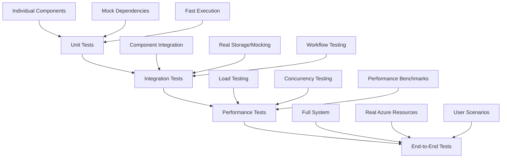

# Unit Testing Guide for Native Cancellation Feature

## 📋 **Overview**

This guide explains how to comprehensively test the blob-based cooperative cancellation feature implemented across all layers of the BigCommerce migration system.

---

## 🧪 **Testing Strategy**

### **1. Testing Pyramid Approach**



### **2. Test Categories**

| Test Category | Purpose | Tools | Coverage |
|---------------|---------|-------|----------|
| **Unit Tests** | Test individual components | xUnit, Moq, FluentAssertions | Classes, Methods |
| **Integration Tests** | Test component interactions | xUnit, Testcontainers | Workflows, Services |
| **Performance Tests** | Test speed and scalability | xUnit, BenchmarkDotNet | Load, Concurrency |
| **Contract Tests** | Test interface compliance | xUnit, Pact | API Contracts |

---

## 🔧 **Unit Test Scenarios**

### **A. CancellationStore Tests**

```csharp
public class CancellationStoreTests
{
    [Fact]
    public async Task SetCancellationFlagAsync_WithValidMigrationId_CreatesBlob()
    {
        // Arrange
        var mockBlobServiceClient = new Mock<BlobServiceClient>();
        var mockContainerClient = new Mock<BlobContainerClient>();
        var mockBlobClient = new Mock<BlobClient>();
        
        // Setup the chain: Service -> Container -> Blob
        mockBlobServiceClient
            .Setup(x => x.GetBlobContainerClient("cancellation-flags"))
            .Returns(mockContainerClient.Object);
            
        mockContainerClient
            .Setup(x => x.GetBlobClient(It.IsAny<string>()))
            .Returns(mockBlobClient.Object);
            
        // Mock successful upload
        var mockResponse = new Mock<Response<BlobContentInfo>>();
        mockBlobClient
            .Setup(x => x.UploadAsync(It.IsAny<Stream>(), It.IsAny<BlobUploadOptions>(), It.IsAny<CancellationToken>()))
            .ReturnsAsync(mockResponse.Object);

        var cancellationStore = new CancellationStore(mockBlobServiceClient.Object, Mock.Of<ILogger<CancellationStore>>());

        // Act
        await cancellationStore.SetCancellationFlagAsync("test-migration-123", "User requested cancellation");

        // Assert
        mockBlobClient.Verify(x => x.UploadAsync(
            It.IsAny<Stream>(),
            It.Is<BlobUploadOptions>(opt => opt.HttpHeaders.ContentType == "text/plain"),
            It.IsAny<CancellationToken>()), Times.Once);
    }

    [Fact]
    public async Task CheckCancellationFlagAsync_WhenBlobExists_ReturnsTrue()
    {
        // Similar setup with mocked blob existence response
        // Test the blob existence check logic
    }

    [Theory]
    [InlineData("")]
    [InlineData(null)]
    [InlineData("   ")]
    public async Task CancellationStore_WithInvalidMigrationId_ThrowsArgumentException(string migrationId)
    {
        // Test input validation
    }
}
```

### **B. Activity Level Tests**

```csharp
public class ProcessEntityChunkActivityTests
{
    [Fact]
    public async Task ProcessEntityChunkAsync_WhenCancellationFlagSet_ThrowsOperationCanceledException()
    {
        // Arrange
        var mockCancellationStore = new Mock<ICancellationStore>();
        mockCancellationStore
            .Setup(x => x.CheckCancellationFlagAsync("test-migration"))
            .ReturnsAsync(true);
        mockCancellationStore
            .Setup(x => x.GetCancellationReasonAsync("test-migration"))
            .ReturnsAsync("User clicked cancel");

        // Mock all required dependencies
        var mockEntityFetchService = new Mock<IEntityFetchService>();
        var mockEntityTransformService = new Mock<IEntityTransformService>();
        var mockEntityCreateService = new Mock<IEntityCreateService>();
        // ... setup other mocks

        var activity = new ProcessEntityChunkActivity(
            /* inject all dependencies including mockCancellationStore.Object */);

        // Act & Assert
        var exception = await Assert.ThrowsAsync<OperationCanceledException>(
            async () => await activity.ProcessEntityChunkAsync(request));
        
        exception.Message.Should().Contain("User clicked cancel");
    }

    [Fact]
    public async Task ProcessEntityChunkAsync_WhenCancellationCheckFails_ContinuesProcessing()
    {
        // Test graceful handling when blob storage is unavailable
        // Should log warning but continue processing
    }
}
```

### **C. Service Level Tests**

```csharp
public class EntityTransformServiceTests
{
    [Fact]
    public async Task TransformEntityAsync_WhenCancellationFlagSet_ThrowsOperationCanceledException()
    {
        // Test cancellation at transform service level
    }

    [Fact]
    public async Task TransformEntityAsync_WhenNoCancellation_ProcessesNormally()
    {
        // Test normal processing path
    }
}

public class EntityCreateServiceTests
{
    [Fact]
    public async Task CreateEntitiesAsync_WhenCancellationFlagSet_ThrowsOperationCanceledException()
    {
        // Test cancellation at creation service level
    }
}
```

### **D. Creation Strategy Tests**

```csharp
public class OptionsCreationStrategyTests
{
    [Fact]
    public async Task CreateEntitiesAsync_WithPeriodicCancellationCheck_StopsAtCorrectInterval()
    {
        // Arrange - Create 10 options to test periodic checking (every 5)
        var entities = CreateMockEntities(10);
        
        var callCount = 0;
        mockCancellationStore
            .Setup(x => x.CheckCancellationFlagAsync(migrationId))
            .Returns(() => {
                callCount++;
                return Task.FromResult(callCount > 1); // Cancel on 2nd check
            });

        // Act & Assert
        var exception = await Assert.ThrowsAsync<OperationCanceledException>(...);
        
        // Verify cancellation occurred after periodic check
        mockCancellationStore.Verify(x => x.CheckCancellationFlagAsync(migrationId), Times.AtLeast(2));
    }
}
```

---

## 🔗 **Integration Test Scenarios**

### **A. End-to-End Workflow Tests**

```csharp
[Fact]
[Trait("Category", "Integration")]
public async Task CancellationWorkflow_ProductComponentsPipeline_CancelsCorrectly()
{
    // Test complete pipeline cancellation from start to finish
    // Use real blob storage (Azurite) for authentic behavior
}

[Fact]
[Trait("Category", "Integration")]
public async Task CancellationWorkflow_MultipleStrategies_OnlyAffectsTargetMigration()
{
    // Test that cancellation is properly scoped to specific migration IDs
    // Run multiple concurrent migrations with selective cancellation
}
```

### **B. Performance Integration Tests**

```csharp
[Fact]
[Trait("Category", "Performance")]
public async Task CancellationFeature_HighVolumeEntities_RespondsQuickly()
{
    // Test cancellation responsiveness with large entity counts
    // Should respond within acceptable timeframes
}

[Fact]
[Trait("Category", "Performance")]
public async Task CancellationFeature_ConcurrentMigrations_HandledIndependently()
{
    // Test multiple concurrent migrations with independent cancellation states
}
```

---

## 🚀 **Performance Test Scenarios**

### **A. Load Testing**

```csharp
[Fact]
[Trait("Category", "LoadTest")]
public async Task CancellationFeature_HighConcurrency_MaintainsStability()
{
    // Run 50+ concurrent migrations with various cancellation states
    // Verify system stability and correct scoping
}

[Fact]
[Trait("Category", "Performance")]
public async Task CancellationCheck_HighFrequency_MaintainsPerformance()
{
    // Test that frequent cancellation checks don't impact performance
    // Process 1000+ entities with periodic checks
}
```

### **B. Response Time Testing**

```csharp
[Fact]
[Trait("Category", "Performance")]
public async Task CancellationResponse_LargeDataset_RespondsWithinTolerance()
{
    // Test cancellation response time with large datasets
    // Should respond within 100ms of cancellation trigger
}
```

---

## 📊 **Test Data Patterns**

### **A. Mock Entity Data**

```csharp
private static List<Dictionary<string, object>> CreateMockProducts(int count)
{
    var products = new List<Dictionary<string, object>>();
    for (int i = 1; i <= count; i++)
    {
        products.Add(new Dictionary<string, object>
        {
            ["id"] = $"product_{i}",
            ["name"] = $"Test Product {i}",
            ["sku"] = $"SKU_{i:D4}",
            ["price"] = 19.99m + i
        });
    }
    return products;
}

private static List<Dictionary<string, object>> CreateMockOptions(int count)
{
    var options = new List<Dictionary<string, object>>();
    for (int i = 1; i <= count; i++)
    {
        options.Add(new Dictionary<string, object>
        {
            ["id"] = $"option_{i}",
            ["display_name"] = $"Option {i}",
            ["product_id"] = "100",
            ["type"] = "dropdown"
        });
    }
    return options;
}
```

### **B. Configuration Helpers**

```csharp
private static StoreConfiguration CreateMockStoreConfig(string name)
{
    return new StoreConfiguration
    {
        // Use actual StoreConfiguration properties from the codebase
        // Adjust based on actual implementation
        ApiBaseUrl = $"https://{name}.bigcommerce.com",
        AccessToken = $"{name}-token-12345"
    };
}

private static BatchProcessingRequest CreateMockBatchRequest(string migrationId, string entityType)
{
    return new BatchProcessingRequest
    {
        MigrationId = migrationId,
        EntityType = entityType,
        EntityIds = new List<string> { "1", "2", "3" },
        SourceStore = CreateMockStoreConfig("source"),
        DestinationStore = CreateMockStoreConfig("destination")
    };
}
```

---

## 🎯 **Test Coverage Goals**

### **A. Coverage Metrics**

| Component | Target Coverage | Priority |
|-----------|-----------------|----------|
| CancellationStore | 95% | High |
| ProcessEntityChunkActivity | 90% | High |
| Service Classes | 85% | Medium |
| Creation Strategies | 80% | Medium |
| Pipeline Classes | 75% | Medium |

### **B. Critical Scenarios**

- ✅ **Cancellation Flag Set**: System stops processing and throws OperationCanceledException
- ✅ **Cancellation Flag Clear**: System continues normal processing
- ✅ **Blob Storage Failure**: System logs warning but continues processing
- ✅ **Multiple Migrations**: Cancellation properly scoped by migration ID
- ✅ **Periodic Checking**: Cancellation checked at appropriate intervals
- ✅ **Performance Impact**: Cancellation checks don't significantly impact speed
- ✅ **Concurrent Access**: Thread-safe blob storage operations
- ✅ **Large Datasets**: Responsive cancellation with high entity counts

---

## 🛠 **Running Tests**

### **A. Test Commands**

```bash
# Run all cancellation tests
dotnet test --filter "Cancellation" --verbosity normal

# Run unit tests only
dotnet test --filter "Category!=Integration&Category!=Performance" tests/BigCommerce.Migration.Tests/

# Run integration tests
dotnet test --filter "Category=Integration" tests/BigCommerce.Migration.Tests/

# Run performance tests
dotnet test --filter "Category=Performance" tests/BigCommerce.Migration.PerformanceTests/

# Run with coverage
dotnet test --collect:"XPlat Code Coverage" --results-directory:./coverage
```

### **B. Test Categories**

```csharp
[Trait("Category", "Unit")]        // Fast, isolated tests
[Trait("Category", "Integration")] // Component interaction tests
[Trait("Category", "Performance")] // Speed and load tests
[Trait("Category", "LoadTest")]    // High-concurrency stress tests
[Trait("Category", "Resilience")]  // Error handling tests
```

---

## 📋 **Test Checklist**

### **✅ Unit Test Checklist**

- [ ] CancellationStore blob operations (create, check, delete)
- [ ] CancellationStore error handling (blob failures, invalid inputs)
- [ ] ProcessEntityChunkActivity cancellation integration
- [ ] EntityTransformService cancellation checks
- [ ] EntityCreateService cancellation checks
- [ ] All creation strategies cancellation (Options, Modifiers, Images, Reviews)
- [ ] ProductComponentsMigrationPipeline cancellation
- [ ] Edge cases (null/empty migration IDs, concurrent access)

### **✅ Integration Test Checklist**

- [ ] End-to-end cancellation workflow
- [ ] Multiple migration independence
- [ ] Performance with large datasets
- [ ] Concurrent migration handling
- [ ] Blob storage resilience
- [ ] Real-world user scenarios

### **✅ Performance Test Checklist**

- [ ] High-frequency cancellation checks
- [ ] Large entity processing (1000+ items)
- [ ] Concurrent migration load (50+ migrations)
- [ ] Memory usage validation
- [ ] Response time benchmarks
- [ ] Network latency tolerance

---

## 🔍 **Debugging Test Issues**

### **A. Common Problems**

1. **Mock Setup Issues**: Ensure proper mock chain setup for Azure Blob dependencies
2. **Constructor Mismatches**: Verify all required dependencies are mocked
3. **Interface Changes**: Update mocks when interfaces evolve
4. **Async/Await**: Ensure proper async test patterns

### **B. Debug Techniques**

```csharp
// Use output helpers for debugging
public class CancellationTests : ITestOutputHelper
{
    private readonly ITestOutputHelper _output;
    
    public CancellationTests(ITestOutputHelper output)
    {
        _output = output;
    }
    
    [Fact]
    public async Task TestWithDebugging()
    {
        _output.WriteLine("Starting cancellation test...");
        // Test implementation
        _output.WriteLine($"Result: {result}");
    }
}

// Use FluentAssertions for better error messages
result.Should().NotBeNull("because cancellation should return a result");
exception.Message.Should().Contain("Migration cancelled", "because cancellation should provide clear reason");
```

---

## 📚 **Additional Resources**

- **xUnit Documentation**: https://xunit.net/docs/getting-started/netcore/cmdline
- **Moq Framework**: https://github.com/moq/moq4
- **FluentAssertions**: https://fluentassertions.com/
- **Azure Storage Testing**: https://docs.microsoft.com/en-us/azure/storage/common/storage-use-azurite
- **Testcontainers**: https://www.testcontainers.org/

---

This comprehensive testing guide ensures that the native cancellation feature is thoroughly validated across all scenarios and maintains high quality and reliability in production environments.