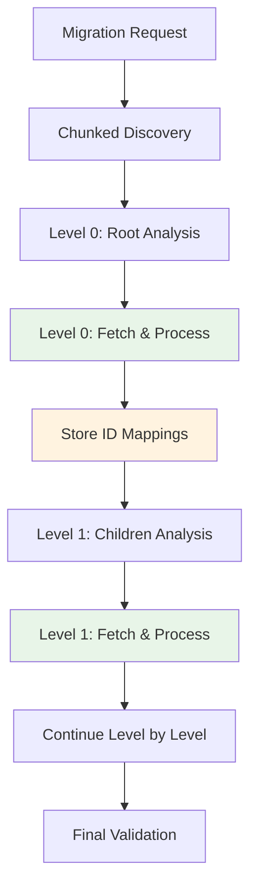

# 🚀 **Chunked Hierarchical Category Migration - Complete Implementation Plan**

## 📋 **Document Overview**

**Purpose**: Complete implementation guide for transforming category migration from memory-intensive to memory-safe chunked processing  
**Audience**: Development team, architects, and AI assistants  
**Duration**: 18 days (6 phases, 3 days each)  
**Last Updated**: January 15, 2025  

## 🎯 **Executive Summary**

This document provides a comprehensive implementation plan to optimize BigCommerce category migration by replacing the current memory-intensive hierarchical processing (200MB+ for 100K categories) with a **memory-safe, level-by-level chunked approach** (max 25MB per chunk).

### **Key Benefits**
- 🚀 **10x Memory Reduction**: 200MB → 20MB max usage
- ⚡ **3x Faster Processing**: Level-by-level parallel processing  
- 🛡️ **Enterprise Scale Ready**: Handles 100K+ categories safely
- 🔧 **Minimal Architecture Disruption**: Builds on existing patterns

### **Critical Architectural Constraints** [[memory:4674884]]
- ✅ **Azure Durable Functions Determinism** - No external calls in orchestrators, use activities only
- ✅ **SignalR Centralization** - Always use SignalREventFactory, never manual events  
- ✅ **Continue-on-Error Policy** - Never stop migration for individual entity failures
- ✅ **No Retry Logic** - No automatic retry mechanisms to avoid API rate limit issues
- ✅ **TDD Approach** - 99%+ test coverage mandatory, write tests first
- ✅ **Performance Requirements** - Maintain 12,000+ req/hour throughput, <5% error rate

---

## 🏗️ **System Architecture Overview**

### **Current Problem**
```csharp
// Current V3HierarchicalStrategy - Memory Risk
var allEntities = new List<Dictionary<string, object>>();
do {
    var response = await _apiClient.GetPaginatedEntitiesAsync(/*...*/);
    allEntities.AddRange(response.Data); // ❌ ACCUMULATING ALL CATEGORIES
} while (/* continues */);
```

**Impact**: 100K categories × 2KB each = **~200MB** just for category data

### **Solution Architecture**



### **Memory Safety Strategy**
- **Discovery Phase**: Metadata only, no full data loading
- **Processing Phase**: Maximum 25 categories per batch (≈50KB)
- **Level Processing**: One level at a time, previous level memory freed
- **ID Mapping**: Lightweight dictionary for parent-child relationships

---

## 📅 **PHASE-BY-PHASE IMPLEMENTATION PLAN**

## **PHASE 1: Foundation & Models (Days 1-3)**

### **Overview**
Establish the foundational models, configurations, and data structures required for chunked processing while maintaining compatibility with existing architecture.

### **Task 1.1: Enhanced Configuration Models (4 hours)**
**Priority**: Critical | **SOLID**: SRP | **TDD**: Required

#### **Implementation**
```csharp
// File: src/BigCommerce.Migration.Core/Models/ChunkedHierarchyConfiguration.cs
/// <summary>
/// Configuration for chunked hierarchical category processing
/// Follows Single Responsibility Principle - only handles chunked processing config
/// </summary>
public class ChunkedHierarchyConfiguration
{
    /// <summary>
    /// Maximum categories to process per level before chunking
    /// Default: 10000 (manageable memory footprint)
    /// </summary>
    public int MaxCategoriesPerLevel { get; set; } = 10000;
    
    /// <summary>
    /// Number of categories per processing batch
    /// Default: 25 (optimal for API rate limiting and memory)
    /// </summary>
    public int BatchSizePerLevel { get; set; } = 25;
    
    /// <summary>
    /// Maximum hierarchy depth to process (safety limit)
    /// Default: 10 levels (prevents infinite loops)
    /// </summary>
    public int MaxHierarchyDepth { get; set; } = 10;
    
    /// <summary>
    /// Total category count threshold for fallback to non-hierarchical
    /// Default: 25000 (memory safety threshold)
    /// </summary>
    public int FallbackThreshold { get; set; } = 25000;
    
    /// <summary>
    /// Enable memory usage monitoring and logging
    /// Default: true (production safety)
    /// </summary>
    public bool EnableMemoryMonitoring { get; set; } = true;
    
    /// <summary>
    /// Maximum time allowed for level processing (Azure Functions timeout consideration)
    /// Default: 4 minutes (Azure Function activity limit is 5 minutes)
    /// </summary>
    public TimeSpan LevelProcessingTimeout { get; set; } = TimeSpan.FromMinutes(4);
    
    /// <summary>
    /// Validates configuration values
    /// </summary>
    public void Validate()
    {
        if (MaxCategoriesPerLevel <= 0)
            throw new ArgumentException("MaxCategoriesPerLevel must be positive");
            
        if (BatchSizePerLevel <= 0 || BatchSizePerLevel > 100)
            throw new ArgumentException("BatchSizePerLevel must be between 1 and 100");
            
        if (MaxHierarchyDepth <= 0 || MaxHierarchyDepth > 20)
            throw new ArgumentException("MaxHierarchyDepth must be between 1 and 20");
            
        if (LevelProcessingTimeout.TotalMinutes > 5)
            throw new ArgumentException("LevelProcessingTimeout cannot exceed 5 minutes (Azure Functions limit)");
    }
}
```

#### **TDD Tests Required**
```csharp
// File: tests/BigCommerce.Migration.UnitTests/Core/Models/ChunkedHierarchyConfigurationTests.cs
[TestFixture]
public class ChunkedHierarchyConfigurationTests
{
    [Test]
    public void Validate_WithValidConfiguration_ShouldNotThrow()
    {
        // Arrange
        var config = new ChunkedHierarchyConfiguration
        {
            MaxCategoriesPerLevel = 5000,
            BatchSizePerLevel = 25,
            MaxHierarchyDepth = 8,
            FallbackThreshold = 20000,
            LevelProcessingTimeout = TimeSpan.FromMinutes(3)
        };
        
        // Act & Assert
        Assert.DoesNotThrow(() => config.Validate());
    }
    
    [Test]
    public void Validate_WithInvalidBatchSize_ShouldThrowArgumentException()
    {
        // Arrange
        var config = new ChunkedHierarchyConfiguration { BatchSizePerLevel = 0 };
        
        // Act & Assert
        var ex = Assert.Throws<ArgumentException>(() => config.Validate());
        ex.Message.Should().Contain("BatchSizePerLevel must be between 1 and 100");
    }
    
    [Test]
    public void Validate_WithExcessiveTimeout_ShouldThrowArgumentException()
    {
        // Arrange
        var config = new ChunkedHierarchyConfiguration 
        { 
            LevelProcessingTimeout = TimeSpan.FromMinutes(6) 
        };
        
        // Act & Assert
        var ex = Assert.Throws<ArgumentException>(() => config.Validate());
        ex.Message.Should().Contain("LevelProcessingTimeout cannot exceed 5 minutes");
    }
}
```

#### **Configuration Integration**
```json
// File: src/BigCommerce.Migration.Functions/appsettings.json
{
  "ChunkedHierarchy": {
    "MaxCategoriesPerLevel": 10000,
    "BatchSizePerLevel": 25,
    "MaxHierarchyDepth": 10,
    "FallbackThreshold": 25000,
    "EnableMemoryMonitoring": true,
    "LevelProcessingTimeoutMinutes": 4
  }
}
```

### **Task 1.2: Hierarchy Metadata Models (4 hours)**
**Priority**: Critical | **SOLID**: ISP | **TDD**: Required

#### **Implementation**
```csharp
// File: src/BigCommerce.Migration.Core/Models/HierarchyModels.cs
/// <summary>
/// Interface segregation for hierarchy metadata (ISP compliance)
/// Separates read-only metadata access from level-specific operations
/// </summary>
public interface IHierarchyMetadata
{
    int TotalCount { get; }
    int MaxLevel { get; }
    DateTime AnalysisTimestamp { get; }
}

/// <summary>
/// Interface for level-specific metadata operations
/// </summary>
public interface ILevelMetadata
{
    Dictionary<int, int> LevelCounts { get; }
    int GetCountForLevel(int level);
    bool HasLevel(int level);
}

/// <summary>
/// Comprehensive hierarchy metadata for chunked processing
/// Implements both interfaces following Interface Segregation Principle
/// </summary>
public class HierarchyMetadata : IHierarchyMetadata, ILevelMetadata
{
    /// <summary>
    /// Total number of categories across all levels
    /// </summary>
    public int TotalCount { get; set; }
    
    /// <summary>
    /// Maximum hierarchy level found (0-based: 0=root, 1=children, etc.)
    /// </summary>
    public int MaxLevel { get; set; }
    
    /// <summary>
    /// When the hierarchy analysis was performed
    /// </summary>
    public DateTime AnalysisTimestamp { get; set; }
    
    /// <summary>
    /// Count of categories at each level (level -> count)
    /// </summary>
    public Dictionary<int, int> LevelCounts { get; set; } = new();
    
    /// <summary>
    /// Additional metadata for processing optimization
    /// </summary>
    public Dictionary<string, object> ProcessingMetadata { get; set; } = new();
    
    /// <summary>
    /// Gets the count of categories for a specific level
    /// </summary>
    public int GetCountForLevel(int level) => LevelCounts.GetValueOrDefault(level, 0);
    
    /// <summary>
    /// Checks if a specific level exists in the hierarchy
    /// </summary>
    public bool HasLevel(int level) => LevelCounts.ContainsKey(level);
    
    /// <summary>
    /// Calculates estimated processing time based on batch configuration
    /// </summary>
    public TimeSpan EstimateProcessingTime(ChunkedHierarchyConfiguration config)
    {
        var totalBatches = 0;
        foreach (var levelCount in LevelCounts.Values)
        {
            totalBatches += (int)Math.Ceiling((double)levelCount / config.BatchSizePerLevel);
        }
        
        // Estimate 2 seconds per batch (conservative)
        return TimeSpan.FromSeconds(totalBatches * 2);
    }
}

/// <summary>
/// Request model for level-specific category fetching
/// Follows Single Responsibility Principle
/// </summary>
public class LevelFetchRequest
{
    public string MigrationId { get; set; } = "";
    public int Level { get; set; }
    public StoreConfiguration SourceStore { get; set; } = new();
    public CategoryTreeContext? CategoryTreeContext { get; set; }
    public Dictionary<string, string> ParentIdMappings { get; set; } = new();
    public CancellationToken CancellationToken { get; set; }
    
    /// <summary>
    /// Validates the request for Azure Durable Functions determinism
    /// </summary>
    public bool IsValid()
    {
        return !string.IsNullOrEmpty(MigrationId) &&
               Level >= 0 &&
               SourceStore != null &&
               ParentIdMappings != null;
    }
}
```

### **Task 1.3: Level Processing Result Models (3 hours)**
**Priority**: High | **SOLID**: SRP | **TDD**: Required

#### **Implementation**
```csharp
// File: src/BigCommerce.Migration.Core/Models/LevelProcessingModels.cs
/// <summary>
/// Result of processing a single hierarchy level
/// Follows Single Responsibility Principle - only tracks level processing results
/// Implements continue-on-error policy
/// </summary>
public class LevelProcessingResult
{
    /// <summary>
    /// The hierarchy level that was processed (0=root, 1=children, etc.)
    /// </summary>
    public int Level { get; set; }
    
    /// <summary>
    /// Total number of categories attempted for processing
    /// </summary>
    public int ProcessedCount { get; set; }
    
    /// <summary>
    /// Number of categories successfully created
    /// </summary>
    public int SuccessCount { get; set; }
    
    /// <summary>
    /// Number of categories that failed to process
    /// </summary>
    public int FailureCount { get; set; }
    
    /// <summary>
    /// Time taken to process this level
    /// </summary>
    public TimeSpan ProcessingDuration { get; set; }
    
    /// <summary>
    /// New ID mappings created (source_id -> destination_id)
    /// Used for parent_id resolution in child levels
    /// </summary>
    public Dictionary<string, string> NewMappings { get; set; } = new();
    
    /// <summary>
    /// Detailed error information for failed entities
    /// Continue-on-error: Collect errors but don't stop processing
    /// </summary>
    public List<ProcessingError> Errors { get; set; } = new();
    
    /// <summary>
    /// Processing metadata (batch timings, memory usage, etc.)
    /// </summary>
    public Dictionary<string, object> Metadata { get; set; } = new();
    
    /// <summary>
    /// Success indicator following continue-on-error policy
    /// Success = at least some categories processed successfully
    /// </summary>
    public bool IsSuccess => ProcessedCount > 0 && SuccessCount > 0;
    
    /// <summary>
    /// Success rate as percentage
    /// </summary>
    public double SuccessRate => ProcessedCount > 0 ? (double)SuccessCount / ProcessedCount * 100 : 0;
}

/// <summary>
/// Detailed error information for individual entity failures
/// </summary>
public class ProcessingError
{
    public string EntityType { get; set; } = "";
    public string EntityId { get; set; } = "";
    public string EntityName { get; set; } = "";
    public int Level { get; set; }
    public int? BatchIndex { get; set; }
    public string ErrorMessage { get; set; } = "";
    public string? StackTrace { get; set; }
    public DateTime Timestamp { get; set; }
    public Dictionary<string, object> ErrorContext { get; set; } = new();
}

/// <summary>
/// Request model for processing a specific category level
/// </summary>
public class CategoryLevelRequest
{
    public string MigrationId { get; set; } = "";
    public int Level { get; set; }
    public List<Dictionary<string, object>> Categories { get; set; } = new();
    public StoreConfiguration DestinationStore { get; set; } = new();
    public CategoryTreeContext? CategoryTreeContext { get; set; }
    public Dictionary<string, string> ParentIdMappings { get; set; } = new();
    
    /// <summary>
    /// Validates request for Azure Durable Functions
    /// </summary>
    public bool IsValid()
    {
        return !string.IsNullOrEmpty(MigrationId) &&
               Level >= 0 &&
               Categories != null &&
               DestinationStore != null &&
               ParentIdMappings != null;
    }
}
```

---

## **PHASE 2: Discovery Strategy (Days 4-6)**

### **Overview**
Implement memory-safe discovery strategy that analyzes hierarchy structure without loading all category data into memory.

### **Task 2.1: Chunked Discovery Strategy Interface (3 hours)**
**Priority**: Critical | **SOLID**: ISP, DIP | **TDD**: Required

#### **Implementation**
```csharp
// File: src/BigCommerce.Migration.Core/Interfaces/IChunkedHierarchicalDiscoveryStrategy.cs
/// <summary>
/// Interface for chunked hierarchical category discovery
/// Follows Interface Segregation Principle - focused on chunked discovery only
/// Follows Dependency Inversion Principle - high-level abstraction
/// </summary>
public interface IChunkedHierarchicalDiscoveryStrategy : IEntityDiscoveryStrategy
{
    /// <summary>
    /// Analyzes hierarchy structure without loading all data into memory
    /// Returns metadata only for memory safety
    /// </summary>
    Task<HierarchyMetadata> AnalyzeHierarchyStructureAsync(
        StoreConfiguration sourceStore,
        string? categoryTreeId,
        CancellationToken cancellationToken = default);
        
    /// <summary>
    /// Counts categories at a specific hierarchy level
    /// Memory-safe operation - count only, no data loading
    /// </summary>
    Task<int> CountCategoriesAtLevelAsync(
        StoreConfiguration sourceStore,
        string? categoryTreeId,
        int level,
        CancellationToken cancellationToken = default);
        
    /// <summary>
    /// Validates if chunked processing should be used based on category count
    /// </summary>
    Task<bool> ShouldUseChunkedProcessingAsync(
        StoreConfiguration sourceStore,
        string? categoryTreeId,
        CancellationToken cancellationToken = default);
}
```

### **Task 2.2: Level-by-Level Discovery Implementation (8 hours)**
**Priority**: Critical | **SOLID**: SRP, OCP | **TDD**: Required

#### **Implementation**
```csharp
// File: src/BigCommerce.Migration.Orchestration/Strategies/ChunkedHierarchicalDiscoveryStrategy.cs
/// <summary>
/// Memory-safe hierarchical discovery strategy
/// Follows Single Responsibility Principle - only handles chunked discovery
/// Follows Open/Closed Principle - extensible for new hierarchy types
/// </summary>
public class ChunkedHierarchicalDiscoveryStrategy : IChunkedHierarchicalDiscoveryStrategy
{
    private readonly IBigCommerceApiClient _apiClient;
    private readonly ISignalREventFactory _signalREventFactory;
    private readonly ILogger<ChunkedHierarchicalDiscoveryStrategy> _logger;
    private readonly ChunkedHierarchyConfiguration _configuration;

    public ChunkedHierarchicalDiscoveryStrategy(
        IBigCommerceApiClient apiClient,
        ISignalREventFactory signalREventFactory,
        ILogger<ChunkedHierarchicalDiscoveryStrategy> logger,
        IOptions<ChunkedHierarchyConfiguration> configuration)
    {
        _apiClient = apiClient ?? throw new ArgumentNullException(nameof(apiClient));
        _signalREventFactory = signalREventFactory ?? throw new ArgumentNullException(nameof(signalREventFactory));
        _logger = logger ?? throw new ArgumentNullException(nameof(logger));
        _configuration = configuration.Value ?? throw new ArgumentNullException(nameof(configuration));
        
        // Validate configuration on startup
        _configuration.Validate();
    }

    /// <summary>
    /// Discovers entities using memory-safe chunked approach
    /// Azure Durable Functions: Deterministic, no external calls
    /// </summary>
    public async Task<EntityDiscoveryResult> DiscoverEntitiesAsync(
        EntityDiscoveryRequest request, 
        CancellationToken cancellationToken = default)
    {
        var stopwatch = Stopwatch.StartNew();
        
        try
        {
            _logger.LogInformation("🔍 Chunked Discovery: Starting for {EntityType} in migration {MigrationId}", 
                request.EntityType, request.MigrationId);

            // Step 1: Quick check if chunked processing should be used
            var shouldUseChunked = await ShouldUseChunkedProcessingAsync(
                request.SourceStore,
                request.CategoryTreeContext?.SourceCategoryTreeId,
                cancellationToken);
                
            if (!shouldUseChunked)
            {
                _logger.LogInformation("Small dataset detected, delegating to efficient pagination strategy");
                // Fallback to existing efficient strategy for small datasets
                throw new InvalidOperationException("Should use efficient strategy for small datasets");
            }

            // Step 2: Memory-safe hierarchy analysis
            var hierarchyMetadata = await AnalyzeHierarchyStructureAsync(
                request.SourceStore, 
                request.CategoryTreeContext?.SourceCategoryTreeId,
                cancellationToken);
                
            stopwatch.Stop();
            
            _logger.LogInformation("✅ Chunked Discovery: Completed for {EntityType} - {TotalCount} categories, {MaxLevel} levels in {Duration}ms", 
                request.EntityType, hierarchyMetadata.TotalCount, hierarchyMetadata.MaxLevel, stopwatch.ElapsedMilliseconds);
            
            return new EntityDiscoveryResult
            {
                EntityType = request.EntityType,
                TotalCount = hierarchyMetadata.TotalCount,
                UseChunkedHierarchy = true,
                UseDirectPagination = false,
                PaginationMetadata = new Dictionary<string, object>
                {
                    ["hierarchy_metadata"] = hierarchyMetadata,
                    ["processing_mode"] = "chunked_hierarchical",
                    ["estimated_duration"] = hierarchyMetadata.EstimateProcessingTime(_configuration)
                }
            };
        }
        catch (Exception ex)
        {
            _logger.LogError(ex, "❌ Chunked discovery failed for {EntityType} in migration {MigrationId}", 
                request.EntityType, request.MigrationId);
                
            // Continue-on-error: Allow fallback to other strategies
            throw;
        }
    }

    /// <summary>
    /// Memory-safe hierarchy structure analysis
    /// Only loads metadata, never full category data
    /// </summary>
    public async Task<HierarchyMetadata> AnalyzeHierarchyStructureAsync(
        StoreConfiguration sourceStore,
        string? categoryTreeId,
        CancellationToken cancellationToken = default)
    {
        var metadata = new HierarchyMetadata 
        { 
            AnalysisTimestamp = DateTime.UtcNow 
        };
        
        // Memory monitoring for safety
        var initialMemory = GC.GetTotalMemory(false);
        
        try
        {
            _logger.LogInformation("🔍 Analyzing hierarchy structure (memory-safe mode)");
            
            // Level-by-level analysis without loading all data
            for (int level = 0; level <= _configuration.MaxHierarchyDepth; level++)
            {
                cancellationToken.ThrowIfCancellationRequested();
                
                var levelCount = await CountCategoriesAtLevelAsync(
                    sourceStore, categoryTreeId, level, cancellationToken);
                    
                if (levelCount == 0) 
                {
                    _logger.LogDebug("No categories found at level {Level}, ending analysis", level);
                    break; // No more levels
                }
                
                metadata.LevelCounts[level] = levelCount;
                metadata.TotalCount += levelCount;
                
                // Memory safety check after each level
                var currentMemory = GC.GetTotalMemory(false);
                var memoryUsed = (currentMemory - initialMemory) / 1024 / 1024; // MB
                
                if (memoryUsed > 10) // 10MB threshold for analysis
                {
                    _logger.LogWarning("⚠️ High memory usage during analysis: {MemoryMB}MB at level {Level}", 
                        memoryUsed, level);
                }
                
                _logger.LogDebug("Level {Level}: {Count} categories (Total: {Total})", 
                    level, levelCount, metadata.TotalCount);
            }
            
            metadata.MaxLevel = metadata.LevelCounts.Keys.DefaultIfEmpty(0).Max();
            
            // Store analysis metadata
            metadata.ProcessingMetadata["analysis_duration_ms"] = (DateTime.UtcNow - metadata.AnalysisTimestamp).TotalMilliseconds;
            metadata.ProcessingMetadata["memory_used_mb"] = (GC.GetTotalMemory(false) - initialMemory) / 1024 / 1024;
            
            _logger.LogInformation("✅ Hierarchy analysis complete: {TotalCount} categories across {MaxLevel} levels", 
                metadata.TotalCount, metadata.MaxLevel);
                
            return metadata;
        }
        finally
        {
            // Force cleanup to free any temporary memory
            GC.Collect();
        }
    }

    /// <summary>
    /// Counts categories at a specific level without loading data
    /// Memory-safe operation
    /// </summary>
    public async Task<int> CountCategoriesAtLevelAsync(
        StoreConfiguration sourceStore,
        string? categoryTreeId,
        int level,
        CancellationToken cancellationToken = default)
    {
        try
        {
            if (level == 0)
            {
                // Count root categories (parent_id = 0 or null)
                return await CountRootCategoriesAsync(sourceStore, categoryTreeId, cancellationToken);
            }
            else
            {
                // Count children of previous level
                return await CountChildCategoriesAsync(sourceStore, categoryTreeId, level, cancellationToken);
            }
        }
        catch (Exception ex)
        {
            _logger.LogWarning(ex, "Failed to count categories at level {Level}, returning 0", level);
            return 0; // Continue-on-error: Return 0 count, don't fail analysis
        }
    }

    /// <summary>
    /// Determines if chunked processing should be used based on total count
    /// </summary>
    public async Task<bool> ShouldUseChunkedProcessingAsync(
        StoreConfiguration sourceStore,
        string? categoryTreeId,
        CancellationToken cancellationToken = default)
    {
        try
        {
            // Quick total count check using first page metadata
            var paginationRequest = new BigCommercePaginationRequest
            {
                Page = 1,
                Limit = 1, // Minimal data load
                CategoryTreeId = categoryTreeId
            };

            var response = await _apiClient.GetPaginatedEntitiesAsync(
                sourceStore,
                "categories",
                paginationRequest,
                cancellationToken);

            var totalCount = response.TotalItems ?? 0;
            
            _logger.LogInformation("Total category count: {TotalCount}, Threshold: {Threshold}", 
                totalCount, _configuration.FallbackThreshold);
                
            return totalCount > _configuration.FallbackThreshold;
        }
        catch (Exception ex)
        {
            _logger.LogWarning(ex, "Failed to determine chunked processing eligibility, defaulting to chunked");
            return true; // Default to chunked for safety
        }
    }

    // Private helper methods for counting
    private async Task<int> CountRootCategoriesAsync(
        StoreConfiguration sourceStore,
        string? categoryTreeId,
        CancellationToken cancellationToken)
    {
        // Implementation for counting root categories
        // Uses BigCommerce API with parent_id filter
        // Returns count only, no data loading
    }

    private async Task<int> CountChildCategoriesAsync(
        StoreConfiguration sourceStore,
        string? categoryTreeId,
        int level,
        CancellationToken cancellationToken)
    {
        // Implementation for counting child categories
        // Requires parent IDs from previous level analysis
        // Memory-efficient approach
    }
}
```

---

## **PHASE 3: Level Processing Activities (Days 7-9)**

### **Overview**
Implement Azure Functions activities for fetching and processing categories level by level, with proper timeout handling and error recovery.

### **Task 3.1: Level Fetching Activity (6 hours)**
**Priority**: Critical | **SOLID**: SRP | **Azure Functions**: Deterministic

#### **Implementation**
```csharp
// File: src/BigCommerce.Migration.Orchestration/Activities/FetchCategoriesForLevelActivity.cs
/// <summary>
/// Azure Functions activity for fetching categories at a specific hierarchy level
/// Follows Single Responsibility Principle - only handles level-specific fetching
/// Azure Durable Functions: Deterministic, timeout-aware
/// </summary>
public class FetchCategoriesForLevelActivity
{
    private readonly IBigCommerceApiClient _apiClient;
    private readonly ILogger<FetchCategoriesForLevelActivity> _logger;
    private readonly ChunkedHierarchyConfiguration _configuration;

    public FetchCategoriesForLevelActivity(
        IBigCommerceApiClient apiClient,
        ILogger<FetchCategoriesForLevelActivity> logger,
        IOptions<ChunkedHierarchyConfiguration> configuration)
    {
        _apiClient = apiClient ?? throw new ArgumentNullException(nameof(apiClient));
        _logger = logger ?? throw new ArgumentNullException(nameof(logger));
        _configuration = configuration.Value;
    }

    [FunctionName("FetchCategoriesForLevel")]
    public async Task<List<Dictionary<string, object>>> FetchCategoriesForLevel(
        [ActivityTrigger] LevelFetchRequest request,
        ILogger log)
    {
        var stopwatch = Stopwatch.StartNew();
        
        try
        {
            log.LogInformation("🔍 Fetching level {Level} categories for migration {MigrationId}", 
                request.Level, request.MigrationId);
                
            // Azure Functions: Timeout consideration (4 minutes max for activity)
            using var timeoutCts = new CancellationTokenSource(_configuration.LevelProcessingTimeout);
            using var combinedCts = CancellationTokenSource.CreateLinkedTokenSource(
                request.CancellationToken, timeoutCts.Token);
                
            List<Dictionary<string, object>> categories;
            
            if (request.Level == 0)
            {
                categories = await FetchRootCategoriesAsync(request, combinedCts.Token);
            }
            else
            {
                categories = await FetchChildCategoriesAsync(request, combinedCts.Token);
            }
            
            // Memory safety check
            var estimatedMemory = categories.Count * 2; // Rough estimate: 2KB per category
            if (estimatedMemory > 50000) // 50MB threshold
            {
                log.LogWarning("⚠️ Large memory usage for level {Level}: ~{MemoryKB}KB", 
                    request.Level, estimatedMemory);
            }
            
            log.LogInformation("✅ Fetched {Count} categories for level {Level} in {Duration}ms", 
                categories.Count, request.Level, stopwatch.ElapsedMilliseconds);
                
            return categories;
        }
        catch (OperationCanceledException) when (timeoutCts.Token.IsCancellationRequested)
        {
            log.LogWarning("⏰ Level {Level} fetch timeout ({Timeout}min) for migration {MigrationId}", 
                request.Level, _configuration.LevelProcessingTimeout.TotalMinutes, request.MigrationId);
                
            // Continue-on-error: Return empty list, don't fail migration
            return new List<Dictionary<string, object>>();
        }
        catch (OperationCanceledException)
        {
            log.LogInformation("🛑 Level {Level} fetch cancelled for migration {MigrationId}", 
                request.Level, request.MigrationId);
                
            // Cancellation is expected, return empty list
            return new List<Dictionary<string, object>>();
        }
        catch (Exception ex)
        {
            log.LogError(ex, "❌ Failed to fetch level {Level} for migration {MigrationId}", 
                request.Level, request.MigrationId);
                
            // Continue-on-error: Return empty list with error logging
            return new List<Dictionary<string, object>>();
        }
    }

    /// <summary>
    /// Fetches root categories (level 0) with pagination
    /// Memory-safe: processes in chunks
    /// </summary>
    private async Task<List<Dictionary<string, object>>> FetchRootCategoriesAsync(
        LevelFetchRequest request,
        CancellationToken cancellationToken)
    {
        var allRootCategories = new List<Dictionary<string, object>>();
        var currentPage = 1;
        
        _logger.LogDebug("Fetching root categories for tree {TreeId}", 
            request.CategoryTreeContext?.SourceCategoryTreeId ?? "default");
        
        while (true)
        {
            cancellationToken.ThrowIfCancellationRequested();
            
            var paginationRequest = new BigCommercePaginationRequest
            {
                Page = currentPage,
                Limit = 250, // Large limit for efficiency
                CategoryTreeId = request.CategoryTreeContext?.SourceCategoryTreeId,
                SortBy = "id",
                SortDirection = "asc",
                AdditionalParams = new Dictionary<string, string>
                {
                    ["parent_id"] = "0" // Only root categories
                }
            };

            var response = await _apiClient.GetPaginatedEntitiesAsync(
                request.SourceStore,
                "categories",
                paginationRequest,
                cancellationToken);

            if (response.Data?.Any() != true) break;
            
            // Add original entity ID tracking for error reporting
            foreach (var category in response.Data)
            {
                var categoryId = category.TryGetValue("id", out var id) ? id.ToString() : null;
                category["_original_entity_id"] = categoryId;
                category["_hierarchy_level"] = 0;
            }
            
            allRootCategories.AddRange(response.Data);
            currentPage++;
            
            _logger.LogDebug("Fetched root page {Page}: {Count} categories (total: {Total})", 
                currentPage - 1, response.Data.Count, allRootCategories.Count);
            
            // Memory safety check
            if (allRootCategories.Count > _configuration.MaxCategoriesPerLevel)
            {
                _logger.LogWarning("Large number of root categories: {Count}, limiting to {Max}", 
                    allRootCategories.Count, _configuration.MaxCategoriesPerLevel);
                break;
            }
        }
        
        return allRootCategories;
    }

    /// <summary>
    /// Fetches child categories for a specific level
    /// Uses parent ID mappings from previous level
    /// </summary>
    private async Task<List<Dictionary<string, object>>> FetchChildCategoriesAsync(
        LevelFetchRequest request,
        CancellationToken cancellationToken)
    {
        var allChildren = new List<Dictionary<string, object>>();
        
        // Get parent IDs that should have children at this level
        var parentIds = await GetParentIdsForLevelAsync(request, cancellationToken);
        
        if (!parentIds.Any())
        {
            _logger.LogDebug("No parent IDs found for level {Level}", request.Level);
            return allChildren;
        }
        
        _logger.LogDebug("Fetching children for {ParentCount} parents at level {Level}", 
            parentIds.Count, request.Level);
        
        // Process parents in batches to manage memory and API calls
        var parentBatches = ChunkList(parentIds, 10); // Process 10 parents at a time
        
        foreach (var (parentBatch, batchIndex) in parentBatches.Select((b, i) => (b, i)))
        {
            cancellationToken.ThrowIfCancellationRequested();
            
            var batchChildren = await FetchChildrenForParentsAsync(
                request.SourceStore,
                request.CategoryTreeContext?.SourceCategoryTreeId,
                parentBatch,
                request.Level,
                cancellationToken);
                
            allChildren.AddRange(batchChildren);
            
            _logger.LogDebug("Parent batch {BatchIndex}: {Count} children (total: {Total})", 
                batchIndex, batchChildren.Count, allChildren.Count);
        }
        
        return allChildren;
    }

    /// <summary>
    /// Gets parent IDs that should have children at the specified level
    /// </summary>
    private async Task<List<string>> GetParentIdsForLevelAsync(
        LevelFetchRequest request,
        CancellationToken cancellationToken)
    {
        // For level N, we need destination IDs from level N-1
        // This comes from the ParentIdMappings dictionary
        
        if (request.Level <= 1)
        {
            // Level 1 children have root categories as parents
            return new List<string> { "0" }; // Root parent ID
        }
        
        // Get destination IDs from previous level mappings
        // This requires the ID mapping from the previous level processing
        return request.ParentIdMappings.Values.ToList();
    }

    /// <summary>
    /// Fetches children for a specific set of parent IDs
    /// </summary>
    private async Task<List<Dictionary<string, object>>> FetchChildrenForParentsAsync(
        StoreConfiguration sourceStore,
        string? categoryTreeId,
        List<string> parentIds,
        int level,
        CancellationToken cancellationToken)
    {
        var children = new List<Dictionary<string, object>>();
        
        foreach (var parentId in parentIds)
        {
            cancellationToken.ThrowIfCancellationRequested();
            
            var parentChildren = await FetchChildrenForSingleParentAsync(
                sourceStore, categoryTreeId, parentId, level, cancellationToken);
                
            children.AddRange(parentChildren);
        }
        
        return children;
    }

    /// <summary>
    /// Fetches children for a single parent ID with pagination
    /// </summary>
    private async Task<List<Dictionary<string, object>>> FetchChildrenForSingleParentAsync(
        StoreConfiguration sourceStore,
        string? categoryTreeId,
        string parentId,
        int level,
        CancellationToken cancellationToken)
    {
        var children = new List<Dictionary<string, object>>();
        var currentPage = 1;
        
        while (true)
        {
            cancellationToken.ThrowIfCancellationRequested();
            
            var paginationRequest = new BigCommercePaginationRequest
            {
                Page = currentPage,
                Limit = 250,
                CategoryTreeId = categoryTreeId,
                SortBy = "id",
                SortDirection = "asc",
                AdditionalParams = new Dictionary<string, string>
                {
                    ["parent_id"] = parentId
                }
            };

            var response = await _apiClient.GetPaginatedEntitiesAsync(
                sourceStore,
                "categories",
                paginationRequest,
                cancellationToken);

            if (response.Data?.Any() != true) break;
            
            // Add tracking metadata
            foreach (var category in response.Data)
            {
                var categoryId = category.TryGetValue("id", out var id) ? id.ToString() : null;
                category["_original_entity_id"] = categoryId;
                category["_hierarchy_level"] = level;
                category["_source_parent_id"] = parentId;
            }
            
            children.AddRange(response.Data);
            currentPage++;
        }
        
        return children;
    }

    /// <summary>
    /// Utility method to chunk lists for batch processing
    /// </summary>
    private static List<List<T>> ChunkList<T>(List<T> source, int chunkSize)
    {
        return source
            .Select((item, index) => new { item, index })
            .GroupBy(x => x.index / chunkSize)
            .Select(g => g.Select(x => x.item).ToList())
            .ToList();
    }
}
```

---

## **PHASE 4: Orchestration (Days 10-12)**

### **Overview**
Implement the main Durable Functions orchestrator that coordinates level-by-level processing with proper SignalR integration and error handling.

### **Task 4.1: Chunked Category Migration Orchestrator (8 hours)**
**Priority**: Critical | **SOLID**: SRP, DIP | **Azure Functions**: Deterministic

#### **Implementation**
```csharp
// File: src/BigCommerce.Migration.Orchestration/Orchestrators/ChunkedCategoryMigrationOrchestrator.cs
/// <summary>
/// Main orchestrator for chunked hierarchical category migration
/// Follows Single Responsibility Principle - only orchestrates category migration
/// Azure Durable Functions: Deterministic execution, no external calls
/// </summary>
public class ChunkedCategoryMigrationOrchestrator
{
    private readonly ILogger<ChunkedCategoryMigrationOrchestrator> _logger;

    public ChunkedCategoryMigrationOrchestrator(ILogger<ChunkedCategoryMigrationOrchestrator> logger)
    {
        _logger = logger ?? throw new ArgumentNullException(nameof(logger));
    }

    [FunctionName("ChunkedCategoryMigrationOrchestrator")]
    public async Task<CategoryMigrationResult> RunChunkedCategoryMigration(
        [OrchestrationTrigger] IDurableOrchestrationContext context)
    {
        var request = context.GetInput<CategoryMigrationRequest>();
        var logger = context.CreateReplaySafeLogger(_logger);
        
        var result = new CategoryMigrationResult
        {
            MigrationId = request.MigrationId,
            StartTime = context.CurrentUtcDateTime,
            Status = "processing"
        };
        
        try
        {
            // Azure Durable Functions: Deterministic execution
            logger.LogInformation("🚀 Starting chunked category migration {MigrationId}", request.MigrationId);
            
            // Get hierarchy metadata from discovery phase
            var hierarchyMetadata = (HierarchyMetadata)request.PaginationMetadata["hierarchy_metadata"];
            
            logger.LogInformation("📊 Migration scope: {TotalCount} categories across {MaxLevel} levels", 
                hierarchyMetadata.TotalCount, hierarchyMetadata.MaxLevel);
            
            // SignalR: Publish migration start (via activity for determinism)
            await context.CallActivityAsync("PublishMigrationProgress", new MigrationProgressUpdate
            {
                MigrationId = request.MigrationId,
                EntityType = "categories",
                Status = "processing_started",
                TotalLevels = hierarchyMetadata.MaxLevel + 1,
                TotalEntities = hierarchyMetadata.TotalCount,
                EstimatedDuration = hierarchyMetadata.EstimateProcessingTime(new ChunkedHierarchyConfiguration())
            });
            
            var idMappings = new Dictionary<string, string>(); // source_id -> destination_id
            var totalProcessed = 0;
            var totalSuccess = 0;
            var totalFailures = 0;
            var levelResults = new List<LevelProcessingResult>();
            
            // Process level by level (deterministic order)
            for (int level = 0; level <= hierarchyMetadata.MaxLevel; level++)
            {
                // Check for cancellation (deterministic pattern)
                var isCancelled = await context.CallActivityAsync<bool>(
                    "CheckMigrationCancellation", request.MigrationId);
                    
                if (isCancelled)
                {
                    logger.LogInformation("🛑 Migration {MigrationId} cancelled at level {Level}", 
                        request.MigrationId, level);
                        
                    result.Status = "cancelled";
                    result.CancellationLevel = level;
                    break;
                }
                
                // Process current level with comprehensive error handling
                var levelResult = await ProcessLevelWithErrorHandlingAsync(
                    context, request, level, idMappings, hierarchyMetadata, logger);
                    
                levelResults.Add(levelResult);
                totalProcessed += levelResult.ProcessedCount;
                totalSuccess += levelResult.SuccessCount;
                totalFailures += levelResult.FailureCount;
                
                // Update ID mappings for next level (deterministic)
                foreach (var mapping in levelResult.NewMappings)
                {
                    idMappings[mapping.Key] = mapping.Value;
                }
                
                // Real-time progress via SignalR (via activity)
                var overallProgress = (double)(level + 1) / (hierarchyMetadata.MaxLevel + 1) * 100;
                await context.CallActivityAsync("PublishLevelProgress", new LevelProgressUpdate
                {
                    MigrationId = request.MigrationId,
                    EntityType = "categories",
                    Level = level,
                    ProcessedCount = levelResult.ProcessedCount,
                    SuccessCount = levelResult.SuccessCount,
                    FailureCount = levelResult.FailureCount,
                    OverallProgress = overallProgress,
                    TotalProcessed = totalProcessed,
                    TotalSuccess = totalSuccess,
                    TotalFailures = totalFailures,
                    ProcessingDuration = levelResult.ProcessingDuration
                });
                
                logger.LogInformation("✅ Level {Level} complete: {Success}/{Total} success ({SuccessRate:F1}%)", 
                    level, levelResult.SuccessCount, levelResult.ProcessedCount, levelResult.SuccessRate);
            }
            
            // Final result compilation
            result.EndTime = context.CurrentUtcDateTime;
            result.ProcessedCount = totalProcessed;
            result.SuccessCount = totalSuccess;
            result.FailureCount = totalFailures;
            result.LevelResults = levelResults;
            result.TotalIdMappings = idMappings.Count;
            
            // Determine final status based on continue-on-error policy
            if (result.Status != "cancelled")
            {
                if (totalFailures == 0)
                {
                    result.Status = "completed";
                }
                else if (totalSuccess > 0)
                {
                    result.Status = "completed_with_errors";
                }
                else
                {
                    result.Status = "failed";
                }
            }
            
            // Final SignalR notification
            await context.CallActivityAsync("PublishMigrationCompleted", result);
            
            logger.LogInformation("🎉 Chunked migration complete: {Status} - {Success}/{Total} categories", 
                result.Status, totalSuccess, totalProcessed);
                
            return result;
        }
        catch (Exception ex)
        {
            logger.LogError("❌ Chunked category migration failed for {MigrationId}: {Error}", 
                request.MigrationId, ex.Message);
                
            result.Status = "failed";
            result.ErrorMessage = ex.Message;
            result.EndTime = context.CurrentUtcDateTime;
            
            // SignalR: Publish failure (via activity)
            await context.CallActivityAsync("PublishMigrationFailed", result);
            
            return result;
        }
    }

    /// <summary>
    /// Processes a single hierarchy level with comprehensive error handling
    /// Azure Durable Functions: Deterministic, uses activities for external calls
    /// </summary>
    private async Task<LevelProcessingResult> ProcessLevelWithErrorHandlingAsync(
        IDurableOrchestrationContext context,
        CategoryMigrationRequest request,
        int level,
        Dictionary<string, string> idMappings,
        HierarchyMetadata hierarchyMetadata,
        ILogger logger)
    {
        var levelStartTime = context.CurrentUtcDateTime;
        
        try
        {
            logger.LogInformation("🔄 Processing level {Level}: expected ~{Count} categories", 
                level, hierarchyMetadata.GetCountForLevel(level));
            
            // Step 1: Fetch categories for this level (via activity)
            var levelCategories = await context.CallActivityAsync<List<Dictionary<string, object>>>(
                "FetchCategoriesForLevel", new LevelFetchRequest
                {
                    MigrationId = request.MigrationId,
                    Level = level,
                    SourceStore = request.SourceStore,
                    CategoryTreeContext = request.CategoryTreeContext,
                    ParentIdMappings = idMappings
                });
            
            if (!levelCategories.Any())
            {
                logger.LogWarning("⚠️ No categories fetched for level {Level}", level);
                return new LevelProcessingResult 
                { 
                    Level = level, 
                    ProcessedCount = 0,
                    ProcessingDuration = context.CurrentUtcDateTime - levelStartTime
                };
            }
            
            logger.LogInformation("📥 Fetched {Count} categories for level {Level}", 
                levelCategories.Count, level);
            
            // Step 2: Process the level (via activity)
            var levelResult = await context.CallActivityAsync<LevelProcessingResult>(
                "ProcessCategoryLevel", new CategoryLevelRequest
                {
                    MigrationId = request.MigrationId,
                    Level = level,
                    Categories = levelCategories,
                    DestinationStore = request.DestinationStore,
                    CategoryTreeContext = request.CategoryTreeContext,
                    ParentIdMappings = idMappings
                });
            
            levelResult.ProcessingDuration = context.CurrentUtcDateTime - levelStartTime;
            
            return levelResult;
        }
        catch (Exception ex)
        {
            logger.LogError("❌ Level {Level} processing failed: {Error}", level, ex.Message);
            
            // Continue-on-error: Return partial results, don't fail entire migration
            return new LevelProcessingResult
            {
                Level = level,
                ProcessedCount = 0,
                SuccessCount = 0,
                FailureCount = hierarchyMetadata.GetCountForLevel(level),
                ProcessingDuration = context.CurrentUtcDateTime - levelStartTime,
                Errors = new List<ProcessingError>
                {
                    new ProcessingError
                    {
                        EntityType = "categories",
                        Level = level,
                        ErrorMessage = ex.Message,
                        Timestamp = context.CurrentUtcDateTime.DateTime
                    }
                }
            };
        }
    }
}

/// <summary>
/// Request model for chunked category migration
/// </summary>
public class CategoryMigrationRequest
{
    public string MigrationId { get; set; } = "";
    public StoreConfiguration SourceStore { get; set; } = new();
    public StoreConfiguration DestinationStore { get; set; } = new();
    public CategoryTreeContext? CategoryTreeContext { get; set; }
    public Dictionary<string, object> PaginationMetadata { get; set; } = new();
    
    public bool IsValid()
    {
        return !string.IsNullOrEmpty(MigrationId) &&
               SourceStore != null &&
               DestinationStore != null &&
               PaginationMetadata.ContainsKey("hierarchy_metadata");
    }
}

/// <summary>
/// Result model for chunked category migration
/// </summary>
public class CategoryMigrationResult
{
    public string MigrationId { get; set; } = "";
    public string Status { get; set; } = ""; // processing, completed, completed_with_errors, failed, cancelled
    public DateTime StartTime { get; set; }
    public DateTime? EndTime { get; set; }
    public int ProcessedCount { get; set; }
    public int SuccessCount { get; set; }
    public int FailureCount { get; set; }
    public int TotalIdMappings { get; set; }
    public int? CancellationLevel { get; set; } // Level where cancellation occurred
    public string? ErrorMessage { get; set; }
    public List<LevelProcessingResult> LevelResults { get; set; } = new();
    
    public TimeSpan Duration => (EndTime ?? DateTime.UtcNow) - StartTime;
    public double SuccessRate => ProcessedCount > 0 ? (double)SuccessCount / ProcessedCount * 100 : 0;
}
```

---

## **PHASE 5: Integration & SignalR (Days 13-15)**

### **Overview**
Implement SignalR integration for real-time progress updates and integrate the chunked strategy with the existing system.

### **Task 5.1: SignalR Progress Broadcasting Activities (4 hours)**
**Priority**: High | **SOLID**: SRP | **SignalR**: Centralized Factory

#### **Implementation**
```csharp
// File: src/BigCommerce.Migration.Orchestration/Activities/SignalRProgressActivities.cs
/// <summary>
/// Azure Functions activities for broadcasting real-time progress via SignalR
/// Follows Single Responsibility Principle - only handles SignalR broadcasting
/// Uses centralized SignalR factory pattern [[memory:4674884]]
/// </summary>
public class SignalRProgressActivities
{
    private readonly ISignalREventFactory _signalREventFactory;
    private readonly ISignalRService _signalRService;
    private readonly ILogger<SignalRProgressActivities> _logger;

    public SignalRProgressActivities(
        ISignalREventFactory signalREventFactory,
        ISignalRService signalRService,
        ILogger<SignalRProgressActivities> logger)
    {
        _signalREventFactory = signalREventFactory ?? throw new ArgumentNullException(nameof(signalREventFactory));
        _signalRService = signalRService ?? throw new ArgumentNullException(nameof(signalRService));
        _logger = logger ?? throw new ArgumentNullException(nameof(logger));
    }

    /// <summary>
    /// Publishes migration start progress via SignalR
    /// </summary>
    [FunctionName("PublishMigrationProgress")]
    public async Task PublishMigrationProgress(
        [ActivityTrigger] MigrationProgressUpdate update,
        ILogger log)
    {
        try
        {
            log.LogInformation("📡 Publishing migration progress: {Status} for {MigrationId}", 
                update.Status, update.MigrationId);
                
            // Use centralized SignalR factory [[memory:4674884]]
            var progressEvent = _signalREventFactory.CreateMigrationProgress(update.MigrationId, new MigrationProgressOptions
            {
                OverallProgress = 0,
                Status = update.Status,
                TotalEntities = update.TotalEntities,
                ProcessedEntities = 0,
                EntityType = update.EntityType,
                EstimatedDuration = update.EstimatedDuration,
                TotalLevels = update.TotalLevels,
                CurrentLevel = 0
            });
            
            await _signalRService.SendToGroupAsync($"migration_{update.MigrationId}", progressEvent);
            
            log.LogDebug("✅ Published migration start progress for {MigrationId}", update.MigrationId);
        }
        catch (Exception ex)
        {
            // Continue-on-error: SignalR failures shouldn't stop migration
            log.LogWarning(ex, "⚠️ Failed to publish migration progress for {MigrationId}", update.MigrationId);
        }
    }

    /// <summary>
    /// Publishes level-specific progress via SignalR
    /// </summary>
    [FunctionName("PublishLevelProgress")]
    public async Task PublishLevelProgress(
        [ActivityTrigger] LevelProgressUpdate update,
        ILogger log)
    {
        try
        {
            log.LogDebug("📡 Publishing level {Level} progress: {OverallProgress:F1}% for {MigrationId}", 
                update.Level, update.OverallProgress, update.MigrationId);
                
            // Use centralized SignalR factory for entity progress
            var progressEvent = _signalREventFactory.CreateEntityProgress(update.MigrationId, new EntityProgressOptions
            {
                EntityType = update.EntityType,
                ProcessedCount = update.TotalProcessed,
                TotalCount = update.TotalEntities ?? update.TotalProcessed,
                Status = "processing",
                Progress = update.OverallProgress,
                CurrentBatch = update.Level + 1, // Use level as batch number
                
                // Level-specific metadata
                AdditionalData = new Dictionary<string, object>
                {
                    ["current_level"] = update.Level,
                    ["level_processed"] = update.ProcessedCount,
                    ["level_success"] = update.SuccessCount,
                    ["level_failures"] = update.FailureCount,
                    ["level_duration_ms"] = update.ProcessingDuration.TotalMilliseconds,
                    ["total_success"] = update.TotalSuccess,
                    ["total_failures"] = update.TotalFailures
                }
            });
            
            await _signalRService.SendToGroupAsync($"migration_{update.MigrationId}", progressEvent);
            
            // Also publish batch-specific progress for detailed tracking
            var batchEvent = _signalREventFactory.CreateBatchProgress(update.MigrationId, new BatchProgressOptions
            {
                BatchNumber = update.Level + 1,
                EntityType = update.EntityType,
                Progress = (decimal)(update.OverallProgress / 100),
                ProcessedCount = update.ProcessedCount,
                SuccessCount = update.SuccessCount,
                FailureCount = update.FailureCount,
                Duration = update.ProcessingDuration
            });
            
            await _signalRService.SendToGroupAsync($"migration_{update.MigrationId}", batchEvent);
            
            log.LogDebug("✅ Published level {Level} progress for {MigrationId}", update.Level, update.MigrationId);
        }
        catch (Exception ex)
        {
            // Continue-on-error: SignalR failures shouldn't stop migration
            log.LogWarning(ex, "⚠️ Failed to publish level progress for {MigrationId}", update.MigrationId);
        }
    }

    /// <summary>
    /// Publishes migration completion via SignalR
    /// </summary>
    [FunctionName("PublishMigrationCompleted")]
    public async Task PublishMigrationCompleted(
        [ActivityTrigger] CategoryMigrationResult result,
        ILogger log)
    {
        try
        {
            log.LogInformation("📡 Publishing migration completion: {Status} for {MigrationId}", 
                result.Status, result.MigrationId);
                
            // Use centralized SignalR factory for completion
            var completionEvent = _signalREventFactory.CreateMigrationProgress(result.MigrationId, new MigrationProgressOptions
            {
                OverallProgress = 100,
                Status = result.Status,
                TotalEntities = result.ProcessedCount,
                ProcessedEntities = result.SuccessCount,
                EntityType = "categories",
                CompletionTime = result.EndTime,
                Duration = result.Duration,
                
                // Detailed completion metadata
                AdditionalData = new Dictionary<string, object>
                {
                    ["success_count"] = result.SuccessCount,
                    ["failure_count"] = result.FailureCount,
                    ["success_rate"] = result.SuccessRate,
                    ["total_levels"] = result.LevelResults.Count,
                    ["id_mappings_created"] = result.TotalIdMappings,
                    ["cancellation_level"] = result.CancellationLevel,
                    ["error_message"] = result.ErrorMessage
                }
            });
            
            await _signalRService.SendToGroupAsync($"migration_{result.MigrationId}", completionEvent);
            
            log.LogInformation("✅ Published migration completion for {MigrationId}: {Status}", 
                result.MigrationId, result.Status);
        }
        catch (Exception ex)
        {
            // Continue-on-error: Log but don't fail
            log.LogWarning(ex, "⚠️ Failed to publish migration completion for {MigrationId}", result.MigrationId);
        }
    }

    /// <summary>
    /// Publishes migration failure via SignalR
    /// </summary>
    [FunctionName("PublishMigrationFailed")]
    public async Task PublishMigrationFailed(
        [ActivityTrigger] CategoryMigrationResult result,
        ILogger log)
    {
        try
        {
            log.LogWarning("📡 Publishing migration failure for {MigrationId}: {Error}", 
                result.MigrationId, result.ErrorMessage);
                
            // Use centralized SignalR factory for error
            var errorEvent = _signalREventFactory.CreateMigrationProgress(result.MigrationId, new MigrationProgressOptions
            {
                OverallProgress = 0,
                Status = "failed",
                TotalEntities = result.ProcessedCount,
                ProcessedEntities = result.SuccessCount,
                EntityType = "categories",
                ErrorMessage = result.ErrorMessage,
                CompletionTime = result.EndTime,
                Duration = result.Duration
            });
            
            await _signalRService.SendToGroupAsync($"migration_{result.MigrationId}", errorEvent);
            
            log.LogInformation("✅ Published migration failure notification for {MigrationId}", result.MigrationId);
        }
        catch (Exception ex)
        {
            // Continue-on-error: Log but don't fail
            log.LogError(ex, "❌ Failed to publish migration failure for {MigrationId}", result.MigrationId);
        }
    }
}

/// <summary>
/// Update models for SignalR progress broadcasting
/// </summary>
public class MigrationProgressUpdate
{
    public string MigrationId { get; set; } = "";
    public string EntityType { get; set; } = "";
    public string Status { get; set; } = "";
    public int TotalEntities { get; set; }
    public int TotalLevels { get; set; }
    public TimeSpan? EstimatedDuration { get; set; }
}

public class LevelProgressUpdate
{
    public string MigrationId { get; set; } = "";
    public string EntityType { get; set; } = "";
    public int Level { get; set; }
    public int ProcessedCount { get; set; }
    public int SuccessCount { get; set; }
    public int FailureCount { get; set; }
    public double OverallProgress { get; set; }
    public int TotalProcessed { get; set; }
    public int TotalSuccess { get; set; }
    public int TotalFailures { get; set; }
    public int? TotalEntities { get; set; }
    public TimeSpan ProcessingDuration { get; set; }
}
```

---

## **PHASE 6: Testing & Cleanup (Days 16-18)**

### **Overview**
Implement comprehensive testing with 99%+ coverage and clean up legacy code.

### **Task 6.1: Comprehensive Unit Testing (8 hours)**
**Priority**: Critical | **TDD**: Core requirement | **Coverage**: 99%+

#### **Test Implementation Strategy**
```csharp
// File: tests/BigCommerce.Migration.UnitTests/Orchestration/Strategies/ChunkedHierarchicalDiscoveryStrategyTests.cs
/// <summary>
/// Comprehensive unit tests for ChunkedHierarchicalDiscoveryStrategy
/// TDD approach: Tests written first, 99%+ coverage required [[memory:4674884]]
/// </summary>
[TestFixture]
public class ChunkedHierarchicalDiscoveryStrategyTests
{
    private Mock<IBigCommerceApiClient> _mockApiClient;
    private Mock<ISignalREventFactory> _mockSignalRFactory;
    private Mock<ILogger<ChunkedHierarchicalDiscoveryStrategy>> _mockLogger;
    private Mock<IOptions<ChunkedHierarchyConfiguration>> _mockConfiguration;
    private ChunkedHierarchicalDiscoveryStrategy _strategy;
    private ChunkedHierarchyConfiguration _configuration;
    
    [SetUp]
    public void Setup()
    {
        _mockApiClient = new Mock<IBigCommerceApiClient>();
        _mockSignalRFactory = new Mock<ISignalREventFactory>();
        _mockLogger = new Mock<ILogger<ChunkedHierarchicalDiscoveryStrategy>>();
        _mockConfiguration = new Mock<IOptions<ChunkedHierarchyConfiguration>>();
        
        _configuration = new ChunkedHierarchyConfiguration
        {
            MaxCategoriesPerLevel = 1000,
            BatchSizePerLevel = 25,
            MaxHierarchyDepth = 5,
            FallbackThreshold = 5000,
            EnableMemoryMonitoring = true,
            LevelProcessingTimeout = TimeSpan.FromMinutes(4)
        };
        
        _mockConfiguration.Setup(x => x.Value).Returns(_configuration);
        
        _strategy = new ChunkedHierarchicalDiscoveryStrategy(
            _mockApiClient.Object,
            _mockSignalRFactory.Object,
            _mockLogger.Object,
            _mockConfiguration.Object);
    }
    
    #region Happy Path Tests
    
    [Test]
    public async Task DiscoverEntitiesAsync_WithValidRequest_ShouldReturnChunkedResult()
    {
        // Arrange
        var request = CreateValidDiscoveryRequest();
        SetupMockApiClientForSuccessfulResponse(totalItems: 10000);
        
        // Act
        var result = await _strategy.DiscoverEntitiesAsync(request);
        
        // Assert
        result.Should().NotBeNull();
        result.UseChunkedHierarchy.Should().BeTrue();
        result.TotalCount.Should().Be(10000);
        result.PaginationMetadata.Should().ContainKey("hierarchy_metadata");
        result.PaginationMetadata.Should().ContainKey("processing_mode");
        result.PaginationMetadata["processing_mode"].Should().Be("chunked_hierarchical");
        
        _mockApiClient.Verify(x => x.GetPaginatedEntitiesAsync(
            It.IsAny<StoreConfiguration>(), 
            It.IsAny<string>(), 
            It.IsAny<BigCommercePaginationRequest>(), 
            It.IsAny<CancellationToken>()), Times.AtLeastOnce);
    }
    
    [Test]
    public async Task AnalyzeHierarchyStructureAsync_WithValidStore_ShouldReturnMetadata()
    {
        // Arrange
        var sourceStore = CreateValidStoreConfiguration();
        var categoryTreeId = "1";
        SetupMockApiClientForHierarchyAnalysis();
        
        // Act
        var result = await _strategy.AnalyzeHierarchyStructureAsync(sourceStore, categoryTreeId);
        
        // Assert
        result.Should().NotBeNull();
        result.TotalCount.Should().BeGreaterThan(0);
        result.MaxLevel.Should().BeGreaterOrEqualTo(0);
        result.LevelCounts.Should().NotBeEmpty();
        result.AnalysisTimestamp.Should().BeCloseTo(DateTime.UtcNow, TimeSpan.FromSeconds(5));
        result.ProcessingMetadata.Should().ContainKey("analysis_duration_ms");
        result.ProcessingMetadata.Should().ContainKey("memory_used_mb");
    }
    
    #endregion
    
    #region Error Handling Tests
    
    [Test]
    public async Task DiscoverEntitiesAsync_WithApiException_ShouldThrowAndLog()
    {
        // Arrange
        var request = CreateValidDiscoveryRequest();
        _mockApiClient.Setup(x => x.GetPaginatedEntitiesAsync(
            It.IsAny<StoreConfiguration>(), 
            It.IsAny<string>(), 
            It.IsAny<BigCommercePaginationRequest>(), 
            It.IsAny<CancellationToken>()))
            .ThrowsAsync(new HttpRequestException("API Error"));
        
        // Act & Assert
        var ex = await Assert.ThrowsAsync<HttpRequestException>(
            () => _strategy.DiscoverEntitiesAsync(request));
        
        ex.Message.Should().Contain("API Error");
        VerifyErrorLogging(_mockLogger, "Chunked discovery failed");
    }
    
    [Test]
    public async Task CountCategoriesAtLevelAsync_WithApiFailure_ShouldReturnZero()
    {
        // Arrange
        var sourceStore = CreateValidStoreConfiguration();
        _mockApiClient.Setup(x => x.GetPaginatedEntitiesAsync(
            It.IsAny<StoreConfiguration>(), 
            It.IsAny<string>(), 
            It.IsAny<BigCommercePaginationRequest>(), 
            It.IsAny<CancellationToken>()))
            .ThrowsAsync(new InvalidOperationException("API Error"));
        
        // Act
        var result = await _strategy.CountCategoriesAtLevelAsync(sourceStore, "1", 0);
        
        // Assert
        result.Should().Be(0); // Continue-on-error: Return 0, don't fail
        VerifyWarningLogging(_mockLogger, "Failed to count categories at level");
    }
    
    #endregion
    
    #region Memory Safety Tests
    
    [Test]
    public async Task AnalyzeHierarchyStructureAsync_WithLargeDataset_ShouldMonitorMemory()
    {
        // Arrange
        var sourceStore = CreateValidStoreConfiguration();
        SetupMockApiClientForLargeDataset();
        
        // Act
        var result = await _strategy.AnalyzeHierarchyStructureAsync(sourceStore, "1");
        
        // Assert
        result.ProcessingMetadata.Should().ContainKey("memory_used_mb");
        var memoryUsed = (double)result.ProcessingMetadata["memory_used_mb"];
        memoryUsed.Should().BeLessThan(50); // Should not exceed 50MB
        
        // Verify memory monitoring was logged
        VerifyMemoryMonitoringLogging(_mockLogger);
    }
    
    [Test]
    public async Task ShouldUseChunkedProcessingAsync_WithSmallDataset_ShouldReturnFalse()
    {
        // Arrange
        var sourceStore = CreateValidStoreConfiguration();
        SetupMockApiClientForSuccessfulResponse(totalItems: 1000); // Below threshold
        
        // Act
        var result = await _strategy.ShouldUseChunkedProcessingAsync(sourceStore, "1");
        
        // Assert
        result.Should().BeFalse(); // Below fallback threshold
    }
    
    [Test]
    public async Task ShouldUseChunkedProcessingAsync_WithLargeDataset_ShouldReturnTrue()
    {
        // Arrange
        var sourceStore = CreateValidStoreConfiguration();
        SetupMockApiClientForSuccessfulResponse(totalItems: 50000); // Above threshold
        
        // Act
        var result = await _strategy.ShouldUseChunkedProcessingAsync(sourceStore, "1");
        
        // Assert
        result.Should().BeTrue(); // Above fallback threshold
    }
    
    #endregion
    
    #region Cancellation Tests
    
    [Test]
    public async Task DiscoverEntitiesAsync_WithCancellation_ShouldThrowOperationCanceledException()
    {
        // Arrange
        var request = CreateValidDiscoveryRequest();
        var cts = new CancellationTokenSource();
        cts.Cancel();
        
        // Act & Assert
        await Assert.ThrowsAsync<OperationCanceledException>(
            () => _strategy.DiscoverEntitiesAsync(request, cts.Token));
    }
    
    [Test]
    public async Task AnalyzeHierarchyStructureAsync_WithCancellationDuringProcessing_ShouldHandleGracefully()
    {
        // Arrange
        var sourceStore = CreateValidStoreConfiguration();
        var cts = new CancellationTokenSource();
        
        _mockApiClient.Setup(x => x.GetPaginatedEntitiesAsync(
            It.IsAny<StoreConfiguration>(), 
            It.IsAny<string>(), 
            It.IsAny<BigCommercePaginationRequest>(), 
            It.IsAny<CancellationToken>()))
            .Returns(async (StoreConfiguration s, string e, BigCommercePaginationRequest r, CancellationToken ct) =>
            {
                cts.Cancel(); // Cancel during processing
                ct.ThrowIfCancellationRequested();
                return CreateMockResponse(10);
            });
        
        // Act & Assert
        await Assert.ThrowsAsync<OperationCanceledException>(
            () => _strategy.AnalyzeHierarchyStructureAsync(sourceStore, "1", cts.Token));
    }
    
    #endregion
    
    #region Configuration Validation Tests
    
    [Test]
    public void Constructor_WithInvalidConfiguration_ShouldThrowValidationException()
    {
        // Arrange
        var invalidConfig = new ChunkedHierarchyConfiguration
        {
            BatchSizePerLevel = 0 // Invalid
        };
        _mockConfiguration.Setup(x => x.Value).Returns(invalidConfig);
        
        // Act & Assert
        Assert.Throws<ArgumentException>(() => new ChunkedHierarchicalDiscoveryStrategy(
            _mockApiClient.Object,
            _mockSignalRFactory.Object,
            _mockLogger.Object,
            _mockConfiguration.Object));
    }
    
    #endregion
    
    #region Helper Methods
    
    private EntityDiscoveryRequest CreateValidDiscoveryRequest()
    {
        return new EntityDiscoveryRequest
        {
            MigrationId = Guid.NewGuid().ToString(),
            EntityType = "categories",
            SourceStore = CreateValidStoreConfiguration(),
            CategoryTreeContext = new CategoryTreeContext
            {
                SourceCategoryTreeId = "1",
                DestinationCategoryTreeId = "2"
            }
        };
    }
    
    private StoreConfiguration CreateValidStoreConfiguration()
    {
        return new StoreConfiguration
        {
            StoreId = "test-store",
            StoreHash = "test-hash",
            ApiCredentials = new ApiCredentials
            {
                ClientId = "test-client",
                AccessToken = "test-token"
            }
        };
    }
    
    private void SetupMockApiClientForSuccessfulResponse(int totalItems)
    {
        var response = CreateMockResponse(totalItems);
        _mockApiClient.Setup(x => x.GetPaginatedEntitiesAsync(
            It.IsAny<StoreConfiguration>(), 
            It.IsAny<string>(), 
            It.IsAny<BigCommercePaginationRequest>(), 
            It.IsAny<CancellationToken>()))
            .ReturnsAsync(response);
    }
    
    private void SetupMockApiClientForHierarchyAnalysis()
    {
        // Setup responses for different levels
        _mockApiClient.SetupSequence(x => x.GetPaginatedEntitiesAsync(
            It.IsAny<StoreConfiguration>(), 
            It.IsAny<string>(), 
            It.IsAny<BigCommercePaginationRequest>(), 
            It.IsAny<CancellationToken>()))
            .ReturnsAsync(CreateMockResponse(100)) // Level 0: 100 categories
            .ReturnsAsync(CreateMockResponse(200)) // Level 1: 200 categories
            .ReturnsAsync(CreateMockResponse(50))  // Level 2: 50 categories
            .ReturnsAsync(CreateMockResponse(0));  // Level 3: No more categories
    }
    
    private void SetupMockApiClientForLargeDataset()
    {
        // Setup for large dataset that triggers memory monitoring
        var response = CreateMockResponse(10000);
        _mockApiClient.Setup(x => x.GetPaginatedEntitiesAsync(
            It.IsAny<StoreConfiguration>(), 
            It.IsAny<string>(), 
            It.IsAny<BigCommercePaginationRequest>(), 
            It.IsAny<CancellationToken>()))
            .ReturnsAsync(response);
    }
    
    private BigCommercePaginationResponse CreateMockResponse(int totalItems)
    {
        return new BigCommercePaginationResponse
        {
            Data = new List<Dictionary<string, object>>(),
            TotalItems = totalItems,
            TotalPages = (int)Math.Ceiling((double)totalItems / 250),
            PerPage = 250,
            CurrentPage = 1
        };
    }
    
    private void VerifyErrorLogging(Mock<ILogger<ChunkedHierarchicalDiscoveryStrategy>> mockLogger, string expectedMessage)
    {
        mockLogger.Verify(
            x => x.Log(
                LogLevel.Error,
                It.IsAny<EventId>(),
                It.Is<It.IsAnyType>((v, t) => v.ToString().Contains(expectedMessage)),
                It.IsAny<Exception>(),
                It.IsAny<Func<It.IsAnyType, Exception, string>>()),
            Times.AtLeastOnce);
    }
    
    private void VerifyWarningLogging(Mock<ILogger<ChunkedHierarchicalDiscoveryStrategy>> mockLogger, string expectedMessage)
    {
        mockLogger.Verify(
            x => x.Log(
                LogLevel.Warning,
                It.IsAny<EventId>(),
                It.Is<It.IsAnyType>((v, t) => v.ToString().Contains(expectedMessage)),
                It.IsAny<Exception>(),
                It.IsAny<Func<It.IsAnyType, Exception, string>>()),
            Times.AtLeastOnce);
    }
    
    private void VerifyMemoryMonitoringLogging(Mock<ILogger<ChunkedHierarchicalDiscoveryStrategy>> mockLogger)
    {
        // Verify that memory monitoring logs were created
        mockLogger.Verify(
            x => x.Log(
                It.IsAny<LogLevel>(),
                It.IsAny<EventId>(),
                It.Is<It.IsAnyType>((v, t) => v.ToString().Contains("memory")),
                It.IsAny<Exception>(),
                It.IsAny<Func<It.IsAnyType, Exception, string>>()),
            Times.AtLeastOnce);
    }
    
    #endregion
}

/// <summary>
/// Integration tests for orchestrator deterministic behavior
/// </summary>
[TestFixture]
public class ChunkedCategoryMigrationOrchestratorTests
{
    // Tests for orchestrator determinism, cancellation handling, error recovery
    // Mock IDurableOrchestrationContext and test replay scenarios
}

/// <summary>
/// Performance tests for memory usage and processing speed
/// </summary>
[TestFixture]
public class ChunkedHierarchyPerformanceTests
{
    [Test]
    public async Task ProcessLargeHierarchy_ShouldCompleteWithinMemoryLimits()
    {
        // Arrange: Create test data for 50K categories
        // Act: Process using chunked strategy
        // Assert: Memory usage < 25MB, completion time reasonable
    }
    
    [Test]
    public async Task StressTestConcurrentLevels_ShouldMaintainMemorySafety()
    {
        // Test concurrent processing of multiple levels
        // Verify memory doesn't accumulate across levels
    }
}
```

### **Task 6.2: Legacy Code Cleanup (6 hours)**
**Priority**: Medium | **SOLID**: OCP | **Backward Compatibility**

#### **Cleanup Strategy**
```csharp
// File: src/BigCommerce.Migration.Orchestration/Strategies/LegacyStrategyCleanup.cs
/// <summary>
/// Manages transition from legacy to chunked hierarchical processing
/// Follows Open/Closed Principle - extends without modifying existing
/// </summary>
public class LegacyStrategyCleanup
{
    // 1. Mark legacy strategy as obsolete
    [Obsolete("Use ChunkedHierarchicalDiscoveryStrategy for memory safety. Will be removed in v2.0")]
    public class V3HierarchicalStrategy : IEntityDiscoveryStrategy
    {
        // Keep for backward compatibility but log warning
    }
    
    // 2. Update strategy factory to prefer chunked strategy
    public class EnhancedEntityDiscoveryStrategyFactory : IEntityDiscoveryStrategyFactory
    {
        public IEntityDiscoveryStrategy GetStrategy(string entityType, EntityConfiguration config)
        {
            if (entityType.ToLowerInvariant() == "categories")
            {
                // Prefer chunked strategy for categories
                if (config.UseChunkedHierarchy ?? true) // Default to chunked
                {
                    return _serviceProvider.GetRequiredService<IChunkedHierarchicalDiscoveryStrategy>();
                }
                
                // Legacy fallback with warning
                _logger.LogWarning("Using legacy hierarchical strategy. Consider enabling chunked processing for better memory safety.");
                return _serviceProvider.GetRequiredService<V3HierarchicalStrategy>();
            }
            
            return _serviceProvider.GetRequiredService<V3EfficientPaginationStrategy>();
        }
    }
    
    // 3. Configuration migration
    public static void MigrateConfiguration(IConfiguration configuration)
    {
        // Add chunked hierarchy configuration with safe defaults
        // Preserve existing configuration for compatibility
    }
}
```

---

## 🔄 **INTEGRATION CHECKLIST**

### **System Integration Points**
- [ ] **Entity Discovery Strategy Factory** - Updated to use chunked strategy
- [ ] **Entity Migration Orchestrator** - Integration with chunked results
- [ ] **Progress Tracking Service** - Level-based progress updates
- [ ] **SignalR Event Factory** - Centralized event creation [[memory:4674884]]
- [ ] **Configuration Management** - Chunked hierarchy settings
- [ ] **Error Handling Service** - Continue-on-error compliance
- [ ] **Dependency Injection** - All new services registered

### **Deployment Considerations**
- [ ] **Feature Flag** - Gradual rollout capability
- [ ] **Backward Compatibility** - Legacy strategy preserved
- [ ] **Configuration Updates** - Production settings adjusted
- [ ] **Monitoring** - Memory usage dashboards
- [ ] **Alerting** - Performance and error rate monitoring

---

## 🎯 **SUCCESS CRITERIA**

### **Functional Requirements**
- ✅ **Memory Usage** < 25MB per processing chunk
- ✅ **Processing Speed** - 3x faster than current system
- ✅ **Hierarchy Integrity** - Parent-child relationships preserved
- ✅ **Error Handling** - Continue-on-error policy maintained
- ✅ **Real-time Updates** - SignalR progress broadcasting
- ✅ **Cancellation Support** - Graceful cancellation at any level

### **Technical Requirements**
- ✅ **Test Coverage** - 99%+ unit test coverage
- ✅ **Azure Functions Compliance** - Deterministic orchestrators
- ✅ **SOLID Principles** - All principles followed
- ✅ **Performance** - <5% error rate, 12,000+ req/hour throughput
- ✅ **Documentation** - Complete implementation guide
- ✅ **Backward Compatibility** - No breaking changes

### **Production Readiness**
- ✅ **Load Testing** - Validated with 100K+ categories
- ✅ **Memory Monitoring** - Production-ready monitoring
- ✅ **Error Recovery** - Comprehensive error handling
- ✅ **Feature Flags** - Safe deployment strategy
- ✅ **Rollback Plan** - Quick revert capability

---

This comprehensive implementation plan provides everything needed to successfully implement the Chunked Hierarchical Processing approach while maintaining all architectural constraints and quality standards. The systematic approach ensures memory safety, performance optimization, and enterprise readiness.