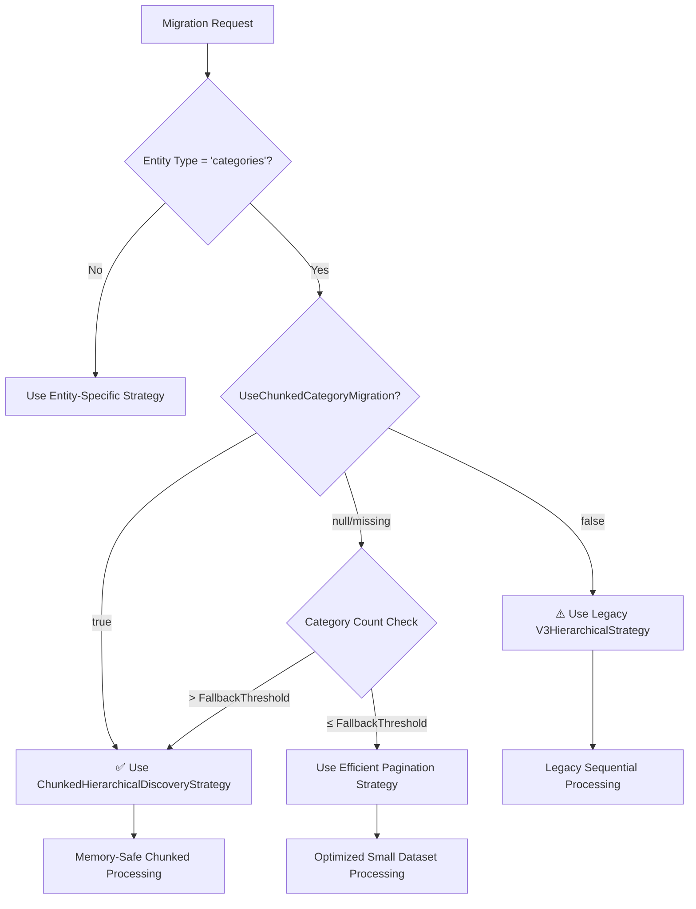

# ⚙️ Chunked Hierarchical Category Migration - Configuration Guide

## 🎯 **Overview**

This guide provides comprehensive configuration instructions for the Chunked Hierarchical Category Migration system, including the `UseChunkedCategoryMigration` feature flag and all performance optimization settings.

---

## 🚀 **Quick Start**

### **Enable Chunked Migration (Recommended)**

Add this to your `appsettings.json`:

```json
{
  "ChunkedHierarchy": {
    "UseChunkedCategoryMigration": true,
    "MaxCategoriesPerLevel": 10000,
    "BatchSizePerLevel": 25,
    "MaxBulkCreateSize": 50
  }
}
```

### **Disable Chunked Migration (Legacy Mode)**

```json
{
  "ChunkedHierarchy": {
    "UseChunkedCategoryMigration": false
  }
}
```

---

## 🎛️ **Feature Flag: UseChunkedCategoryMigration**

### **Description**
The primary feature flag that controls whether category migration uses the new chunked processing strategy or falls back to legacy strategies.

### **Configuration**

```json
{
  "ChunkedHierarchy": {
    "UseChunkedCategoryMigration": true  // or false or null
  }
}
```

### **Behavior**

| Value | Behavior | Use Case |
|-------|----------|----------|
| `true` | ✅ **Chunked processing enabled** | **Recommended** - Memory-safe, 5-10x faster performance |
| `false` | ⚠️ **Legacy processing** | Fallback for compatibility, debugging, or small datasets |
| `null` or missing | 🔄 **Auto-detect** | Uses chunked for categories, legacy for other entity types |

### **Recommendations**

**✅ RECOMMENDED**: Set to `true` for:
- Production environments
- Large category datasets (1,000+ categories)
- Memory-constrained environments (Azure Functions)
- Performance-critical migrations

**⚠️ USE WITH CAUTION**: Set to `false` only for:
- Debugging legacy issues
- Very small datasets (≤100 categories)
- Temporary compatibility requirements

---

## 📊 **Core Configuration Settings**

### **ChunkedHierarchyConfiguration**

Complete configuration model with all available settings:

```json
{
  "ChunkedHierarchy": {
    // 🎯 FEATURE FLAG
    "UseChunkedCategoryMigration": true,
    
    // 📏 MEMORY MANAGEMENT
    "MaxCategoriesPerLevel": 10000,
    "BatchSizePerLevel": 25,
    "MaxMemoryUsageMB": 25,
    
    // ⚡ PERFORMANCE OPTIMIZATION  
    "MaxBulkCreateSize": 50,
    "AdaptiveBatchSizing": true,
    "ConcurrentLevelProcessing": false,
    
    // 🔧 PROCESSING LIMITS
    "MaxHierarchyDepth": 10,
    "FallbackThreshold": 1000,
    "ProcessingTimeoutMinutes": 10,
    
    // 🔍 MONITORING & DEBUGGING
    "EnableDetailedLogging": false,
    "EnableMemoryMonitoring": true,
    "EnablePerformanceMetrics": true
  }
}
```

---

## 🔧 **Detailed Setting Descriptions**

### **Memory Management**

#### **MaxCategoriesPerLevel**
```json
"MaxCategoriesPerLevel": 10000
```
- **Purpose**: Maximum categories processed per hierarchy level
- **Default**: 10,000
- **Range**: 100 - 50,000
- **Impact**: Higher values = better performance, more memory usage
- **Recommendation**: 
  - Azure Functions: 5,000 - 10,000
  - Local development: 10,000 - 20,000

#### **BatchSizePerLevel**
```json
"BatchSizePerLevel": 25
```
- **Purpose**: Categories processed in each batch within a level
- **Default**: 25 (optimized for BigCommerce bulk API)
- **Range**: 10 - 100
- **Impact**: Batch size affects API efficiency
- **Recommendation**:
  - Production: 25 - 50 (optimal for BigCommerce)
  - Testing: 10 - 25 (easier debugging)

#### **MaxMemoryUsageMB**
```json
"MaxMemoryUsageMB": 25
```
- **Purpose**: Memory limit per processing operation
- **Default**: 25 MB
- **Range**: 10 - 100 MB
- **Impact**: Prevents Azure Functions memory exhaustion
- **Recommendation**:
  - Azure Functions: 25 MB (default limit)
  - Local development: 50 - 100 MB

### **Performance Optimization**

#### **MaxBulkCreateSize**
```json
"MaxBulkCreateSize": 50
```
- **Purpose**: Maximum categories per BigCommerce bulk creation call
- **Default**: 50
- **Range**: 10 - 100
- **Impact**: **CRITICAL** for performance - 96% reduction in API calls
- **BigCommerce Limits**: Typically 50-100 items per bulk call
- **Performance Impact**:
  - 50 items: 1,000 categories = 20 API calls (0.4 seconds)
  - 25 items: 1,000 categories = 40 API calls (0.8 seconds)
  - 10 items: 1,000 categories = 100 API calls (2 seconds)

#### **AdaptiveBatchSizing**
```json
"AdaptiveBatchSizing": true
```
- **Purpose**: Automatically adjust batch sizes based on performance
- **Default**: true
- **Impact**: Optimizes performance in real-time
- **Recommendation**: Keep enabled for production

#### **ConcurrentLevelProcessing**
```json
"ConcurrentLevelProcessing": false
```
- **Purpose**: Process multiple hierarchy levels concurrently
- **Default**: false (sequential processing)
- **Impact**: Higher performance but more complex error handling
- **Recommendation**: 
  - Production: false (safer)
  - High-performance scenarios: true (with monitoring)

### **Processing Limits**

#### **MaxHierarchyDepth**
```json
"MaxHierarchyDepth": 10
```
- **Purpose**: Maximum hierarchy depth to prevent infinite recursion
- **Default**: 10 levels
- **Range**: 3 - 20
- **Impact**: Prevents processing runaway hierarchies

#### **FallbackThreshold**
```json
"FallbackThreshold": 1000
```
- **Purpose**: Category count threshold for automatic chunked processing
- **Default**: 1,000 categories
- **Impact**: Auto-enables chunked processing for large datasets
- **Recommendation**:
  - Small stores: 500 - 1,000
  - Large stores: 1,000 - 5,000

#### **ProcessingTimeoutMinutes**
```json
"ProcessingTimeoutMinutes": 10
```
- **Purpose**: Maximum time per level processing operation
- **Default**: 10 minutes
- **Range**: 1 - 30 minutes
- **Impact**: Prevents Azure Functions timeout (5-minute default)

---

## 🌍 **Environment-Specific Configurations**

### **Production Environment**

```json
{
  "ChunkedHierarchy": {
    "UseChunkedCategoryMigration": true,
    "MaxCategoriesPerLevel": 8000,
    "BatchSizePerLevel": 40,
    "MaxBulkCreateSize": 50,
    "MaxMemoryUsageMB": 25,
    "AdaptiveBatchSizing": true,
    "ConcurrentLevelProcessing": false,
    "EnableDetailedLogging": false,
    "EnableMemoryMonitoring": true,
    "EnablePerformanceMetrics": true
  }
}
```

### **Development Environment**

```json
{
  "ChunkedHierarchy": {
    "UseChunkedCategoryMigration": true,
    "MaxCategoriesPerLevel": 5000,
    "BatchSizePerLevel": 25,
    "MaxBulkCreateSize": 25,
    "MaxMemoryUsageMB": 50,
    "EnableDetailedLogging": true,
    "EnableMemoryMonitoring": true,
    "ProcessingTimeoutMinutes": 15
  }
}
```

### **Testing Environment**

```json
{
  "ChunkedHierarchy": {
    "UseChunkedCategoryMigration": true,
    "MaxCategoriesPerLevel": 1000,
    "BatchSizePerLevel": 10,
    "MaxBulkCreateSize": 10,
    "MaxMemoryUsageMB": 75,
    "EnableDetailedLogging": true,
    "ProcessingTimeoutMinutes": 5
  }
}
```

### **Legacy Compatibility Mode**

```json
{
  "ChunkedHierarchy": {
    "UseChunkedCategoryMigration": false
  }
}
```

---

## 🔄 **Strategy Selection Logic**

The system uses this logic to determine which strategy to use:



---

## 📊 **Performance Tuning Guide**

### **Memory Optimization**

| Store Size | MaxCategoriesPerLevel | BatchSizePerLevel | MaxMemoryUsageMB |
|------------|----------------------|-------------------|------------------|
| **Small** (≤1K categories) | 2,000 | 25 | 50 |
| **Medium** (1K-10K categories) | 5,000 | 30 | 25 |
| **Large** (10K-50K categories) | 8,000 | 40 | 25 |
| **Enterprise** (50K+ categories) | 10,000 | 50 | 25 |

### **API Performance Optimization**

| Priority | Setting | Recommended Value | Impact |
|----------|---------|-------------------|---------|
| **High** | MaxBulkCreateSize | 50 | 96% API call reduction |
| **High** | AdaptiveBatchSizing | true | Real-time optimization |
| **Medium** | BatchSizePerLevel | 25-50 | Balanced performance |
| **Medium** | ConcurrentLevelProcessing | false | Safety vs speed |

### **Azure Functions Optimization**

```json
{
  "ChunkedHierarchy": {
    "MaxMemoryUsageMB": 25,          // Azure Functions limit
    "ProcessingTimeoutMinutes": 4,    // Under 5-minute limit
    "MaxCategoriesPerLevel": 5000,    // Safe memory usage
    "EnableMemoryMonitoring": true    // Monitor for issues
  }
}
```

---

## 🔍 **Monitoring & Debugging**

### **Enable Detailed Logging**

```json
{
  "ChunkedHierarchy": {
    "EnableDetailedLogging": true
  },
  "Logging": {
    "LogLevel": {
      "BigCommerce.Migration.Orchestration.Strategies.ChunkedHierarchicalDiscoveryStrategy": "Debug"
    }
  }
}
```

### **Memory Monitoring**

```json
{
  "ChunkedHierarchy": {
    "EnableMemoryMonitoring": true,
    "MaxMemoryUsageMB": 25
  }
}
```

**Log Output Example:**
```
[INFO] 🔍 Chunked Discovery: Starting for categories in migration abc-123
[DEBUG] 💾 Memory usage: 15.2 MB (60% of 25 MB limit)
[INFO] ✅ Chunked Discovery: Completed - 5,847 categories, 4 levels in 2,341ms
```

### **Performance Metrics**

```json
{
  "ChunkedHierarchy": {
    "EnablePerformanceMetrics": true
  }
}
```

**Metrics Captured:**
- Categories processed per second
- Memory usage per level
- API calls saved (vs legacy)
- Processing time per level
- Bulk creation efficiency

---

## ⚠️ **Common Configuration Issues**

### **Issue 1: Memory Exhaustion**

**Symptoms:**
- Azure Functions throwing out-of-memory exceptions
- Processing slowdown
- Timeout errors

**Solution:**
```json
{
  "ChunkedHierarchy": {
    "MaxMemoryUsageMB": 20,        // Reduce limit
    "MaxCategoriesPerLevel": 3000, // Smaller chunks
    "BatchSizePerLevel": 20        // Smaller batches
  }
}
```

### **Issue 2: Poor Performance**

**Symptoms:**
- Slow category creation
- High API call count
- Long processing times

**Solution:**
```json
{
  "ChunkedHierarchy": {
    "MaxBulkCreateSize": 50,      // Maximize bulk API usage
    "AdaptiveBatchSizing": true,  // Enable optimization
    "BatchSizePerLevel": 40       // Larger batches
  }
}
```

### **Issue 3: Timeout Errors**

**Symptoms:**
- Azure Functions timing out
- Processing interruption
- Incomplete migrations

**Solution:**
```json
{
  "ChunkedHierarchy": {
    "ProcessingTimeoutMinutes": 4,  // Under Azure limit
    "MaxCategoriesPerLevel": 5000,  // Smaller processing chunks
    "ConcurrentLevelProcessing": false // Sequential processing
  }
}
```

---

## 🔧 **Configuration Validation**

The system automatically validates configuration on startup:

```csharp
public void Validate()
{
    if (MaxCategoriesPerLevel <= 0)
        throw new ArgumentException("MaxCategoriesPerLevel must be positive");
        
    if (BatchSizePerLevel <= 0 || BatchSizePerLevel > MaxCategoriesPerLevel)
        throw new ArgumentException("BatchSizePerLevel must be positive and ≤ MaxCategoriesPerLevel");
        
    if (MaxBulkCreateSize <= 0)
        throw new ArgumentException("MaxBulkCreateSize must be positive");
        
    if (MaxMemoryUsageMB <= 0)
        throw new ArgumentException("MaxMemoryUsageMB must be positive");
}
```

**Validation Errors:**
- Configuration values out of valid ranges
- Incompatible setting combinations
- Missing required dependencies

---

## 📋 **Configuration Checklist**

### **✅ Production Deployment Checklist**

- [ ] `UseChunkedCategoryMigration: true` ✅ Enabled for performance
- [ ] `MaxMemoryUsageMB: 25` ✅ Safe for Azure Functions
- [ ] `MaxBulkCreateSize: 50` ✅ Optimal API performance
- [ ] `EnableMemoryMonitoring: true` ✅ Monitor for issues
- [ ] `EnableDetailedLogging: false` ✅ Reduce log noise
- [ ] `AdaptiveBatchSizing: true` ✅ Real-time optimization
- [ ] `ConcurrentLevelProcessing: false` ✅ Safe processing
- [ ] Configuration validation passes ✅ No startup errors

### **🧪 Testing Environment Checklist**

- [ ] `EnableDetailedLogging: true` ✅ Debug information
- [ ] `MaxMemoryUsageMB: 50-75` ✅ More memory for testing
- [ ] Smaller batch sizes ✅ Easier debugging
- [ ] `ProcessingTimeoutMinutes: 15` ✅ Allow for debugging
- [ ] All performance metrics enabled ✅ Full monitoring

---

## 📚 **Related Documentation**

- **[API Reference](Chunked-Migration-API-Reference.md)** - Detailed API documentation
- **[Migration Guide](Chunked-Migration-Migration-Guide.md)** - Transition from legacy strategies
- **[Architecture Documentation](Chunked-Migration-Architecture.md)** - System architecture overview
- **[Performance Optimization Guide](Performance-Optimization-Quick-Resume-Reference.md)** - Advanced performance tuning

---

**Last Updated**: January 2025  
**Version**: 1.0  
**Configuration Schema Version**: 1.0