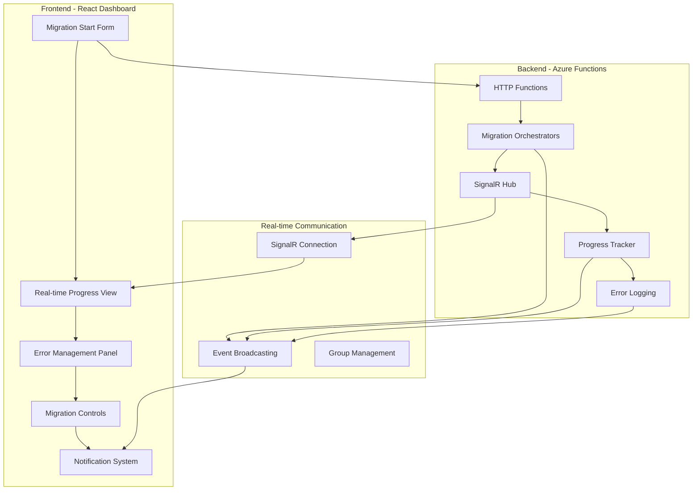

# BigCommerce Migration System - Dashboard E2E Integration Plan

## 📋 Overview

This document provides a comprehensive implementation plan for integrating the Migration Dashboard with real-time notifications to achieve a complete End-to-End migration flow. The integration transforms the dashboard from a monitoring tool to a complete migration management interface.

## 🎯 Objectives

### **Primary Goals**
- **Complete E2E User Experience**: Start → Monitor → Control → Complete migrations from dashboard
- **Real-time Visibility**: Live progress updates, error notifications, status changes
- **Comprehensive Control**: Pause, resume, cancel, retry migration operations
- **Enterprise-grade UX**: Production-ready interface for migration management

### **Technical Goals**
- **SignalR Integration**: Real-time bi-directional communication
- **Performance Optimization**: Handle large migrations (10M+ entities)
- **Error Management**: Comprehensive error visibility and resolution
- **Scalability**: Support multiple concurrent migrations

## 📊 Current State Analysis

### ✅ **Implemented Foundation**
```
Backend Infrastructure:
├── SignalR Hub (MigrationHub.cs) - ✅ Implemented
├── SignalR Service (MigrationSignalRService.cs) - ✅ Implemented  
├── Progress Tracker (ProgressTracker.cs) - ✅ Implemented
├── Migration Orchestrators - ✅ Implemented
├── Error Logging System - ✅ Implemented
└── Authentication & Security - ✅ Implemented

Frontend Infrastructure:
├── React Dashboard Components - ✅ Implemented
├── SignalR Connection Management - ✅ Partially Implemented
├── Progress Visualization - ✅ Implemented
├── Notification System - ✅ Basic Implementation
└── Migration Overview - ✅ Implemented
```

### ❌ **Missing Critical Components**
```
Integration Gaps:
├── Orchestrator → SignalR Event Broadcasting - ❌ Not Connected
├── Dashboard Migration Initiation - ❌ Not Implemented
├── Real-time Error Notifications - ❌ Partial Implementation
├── Migration Lifecycle Management - ❌ Not Implemented
├── Advanced Error Handling UI - ❌ Not Implemented
└── Performance Optimization - ❌ Basic Implementation
```

## 🏗️ Technical Architecture

### **System Architecture Overview**


### **Data Flow Architecture**
```
User Action → HTTP API → Queue → Orchestrator → Activities
     ↓              ↓         ↓         ↓           ↓
Dashboard UI ← SignalR ← Hub ← Events ← Progress Updates
     ↓              ↓         ↓         ↓           ↓
Notifications ← Real-time ← Groups ← Broadcast ← Error Logs
```

## 📋 Implementation Phases

## **Phase 1: SignalR Integration Enhancement (Days 1-2)**

### **Task 1.1: Orchestrator Event Broadcasting**
**Priority**: 🔥 Critical  
**Duration**: 6-8 hours  
**Dependencies**: None  

**Files to Modify**:
```
src/BigCommerce.Migration.Functions/Orchestrators/
├── MigrationDurableOrchestrator.cs
└── EntityMigrationDurableOrchestrator.cs

src/BigCommerce.Migration.Orchestration/Services/
└── ProgressTracker.cs
```

**Implementation Details**:
```csharp
// Add to MigrationDurableOrchestrator.cs
public async Task<string> RunMigrationOrchestrator(
    [OrchestrationTrigger] IDurableOrchestrationContext context)
{
    var migrationRequest = context.GetInput<MigrationRequest>();
    var migrationId = context.NewGuid().ToString();
    
    // Broadcast migration started
    await context.CallActivityAsync("BroadcastMigrationEvent", new {
        MigrationId = migrationId,
        EventType = "MigrationStarted",
        Data = new { 
            Status = "Started",
            TotalEntities = migrationRequest.Entities.Count,
            Timestamp = DateTime.UtcNow
        }
    });
    
    // Process each entity type
    foreach (var entityType in migrationRequest.Entities)
    {
        await context.CallSubOrchestratorAsync(
            "EntityMigrationOrchestrator", 
            new EntityMigrationRequest { MigrationId = migrationId, EntityType = entityType }
        );
    }
    
    // Broadcast migration completed
    await context.CallActivityAsync("BroadcastMigrationEvent", new {
        MigrationId = migrationId,
        EventType = "MigrationCompleted",
        Data = new { 
            Status = "Completed",
            Timestamp = DateTime.UtcNow
        }
    });
    
    return migrationId;
}
```

**Success Criteria**:
- [ ] All migration lifecycle events broadcast to SignalR
- [ ] Dashboard receives real-time orchestrator updates
- [ ] Event payload includes comprehensive migration data

### **Task 1.2: Enhanced Error Broadcasting**
**Priority**: 🔥 Critical  
**Duration**: 4-6 hours  
**Dependencies**: Task 1.1  

**Files to Modify**:
```
src/BigCommerce.Migration.Orchestration/Activities/
└── ProcessEntityBatchActivity.cs

src/BigCommerce.Migration.Functions/Services/
└── MigrationSignalRService.cs
```

**Implementation Details**:
```csharp
// Enhanced error broadcasting in ProcessEntityBatchActivity.cs
private async Task LogStructuredMigrationErrorAsync(...)
{
    // Existing error logging code...
    
    // Add real-time error broadcasting
    if (_signalRService != null)
    {
        await _signalRService.BroadcastErrorNotification(request.MigrationId, new {
            ErrorType = errorType,
            EntityId = entityId,
            EntityName = entityName,
            ErrorMessage = errorMessage,
            HttpStatusCode = httpStatusCode,
            Timestamp = DateTime.UtcNow,
            RequestPayloadBlobUrl = requestBlobUrl,
            ResponsePayloadBlobUrl = responseBlobUrl
        });
    }
}
```

**Success Criteria**:
- [ ] Individual entity errors broadcast in real-time
- [ ] Dashboard shows errors without page refresh
- [ ] Error details include blob storage URLs

### **Task 1.3: SignalR Service Enhancement**
**Priority**: 🔥 Critical  
**Duration**: 4-6 hours  
**Dependencies**: Task 1.2  

**Files to Modify**:
```
src/BigCommerce.Migration.Functions/Services/
└── MigrationSignalRService.cs

src/BigCommerce.Migration.Core/Interfaces/
└── IMigrationSignalRService.cs
```

**Implementation Details**:
```csharp
// Add to IMigrationSignalRService.cs
public interface IMigrationSignalRService
{
    // Existing methods...
    
    Task BroadcastMigrationStartedAsync(string migrationId, object migrationData, CancellationToken cancellationToken = default);
    Task BroadcastMigrationCompletedAsync(string migrationId, object completionData, CancellationToken cancellationToken = default);
    Task BroadcastEntityPhaseStartAsync(string migrationId, string entityType, object phaseData, CancellationToken cancellationToken = default);
    Task BroadcastEntityPhaseCompletedAsync(string migrationId, string entityType, object completionData, CancellationToken cancellationToken = default);
    Task BroadcastErrorNotification(string migrationId, object errorData, CancellationToken cancellationToken = default);
    Task BroadcastSystemAlert(string alertType, object alertData, CancellationToken cancellationToken = default);
}
```

**Success Criteria**:
- [ ] Comprehensive SignalR API for all event types
- [ ] Proper error handling and fallback mechanisms
- [ ] Performance optimization for high-frequency updates

## **Phase 2: Dashboard Migration Management (Days 3-4)**

### **Task 2.1: Migration Start Form Component**
**Priority**: 🔥 Critical  
**Duration**: 6-8 hours  
**Dependencies**: Phase 1 Complete  

**Files to Create**:
```
src/BigCommerce.Migration.Dashboard/src/components/Migration/
├── MigrationStartForm.tsx
├── StoreConfigurationPanel.tsx
├── EntitySelectionPanel.tsx
└── MigrationPreviewPanel.tsx

src/BigCommerce.Migration.Dashboard/src/types/
└── migration.ts
```

**Implementation Details**:
```typescript
// MigrationStartForm.tsx
export interface MigrationStartFormProps {
  onMigrationStarted: (migrationId: string) => void;
  onError: (error: string) => void;
}

export const MigrationStartForm: React.FC<MigrationStartFormProps> = ({
  onMigrationStarted,
  onError
}) => {
  const [sourceStore, setSourceStore] = useState<StoreConfiguration | null>(null);
  const [destinationStore, setDestinationStore] = useState<StoreConfiguration | null>(null);
  const [selectedEntities, setSelectedEntities] = useState<string[]>([]);
  const [isStarting, setIsStarting] = useState(false);

  const handleStartMigration = async () => {
    try {
      setIsStarting(true);
      
      const migrationRequest = {
        sourceStore,
        destinationStore,
        entities: selectedEntities,
        configuration: {
          batchSize: 100,
          enableDuplicateDetection: true,
          enableErrorRecovery: true
        }
      };

      const response = await apiService.startMigration(migrationRequest);
      onMigrationStarted(response.migrationId);
      
      // Show success notification
      notificationService.success(
        'Migration Started',
        `Migration ${response.migrationId} has been queued for processing`
      );
      
    } catch (error) {
      onError(error.message);
      notificationService.error('Migration Failed', error.message);
    } finally {
      setIsStarting(false);
    }
  };

  return (
    <Card sx={{ p: 3 }}>
      <Typography variant="h5" gutterBottom>
        Start New Migration
      </Typography>
      
      <Stepper activeStep={activeStep} sx={{ mb: 3 }}>
        <Step><StepLabel>Source Store</StepLabel></Step>
        <Step><StepLabel>Destination Store</StepLabel></Step>
        <Step><StepLabel>Select Entities</StepLabel></Step>
        <Step><StepLabel>Review & Start</StepLabel></Step>
      </Stepper>
      
      {/* Step content components */}
      {activeStep === 0 && <StoreConfigurationPanel {...} />}
      {activeStep === 1 && <StoreConfigurationPanel {...} />}
      {activeStep === 2 && <EntitySelectionPanel {...} />}
      {activeStep === 3 && <MigrationPreviewPanel {...} />}
      
      <Box sx={{ display: 'flex', justifyContent: 'space-between', mt: 3 }}>
        <Button disabled={activeStep === 0} onClick={handleBack}>
          Back
        </Button>
        <Button 
          variant="contained" 
          onClick={activeStep === 3 ? handleStartMigration : handleNext}
          disabled={isStarting}
        >
          {activeStep === 3 ? 'Start Migration' : 'Next'}
        </Button>
      </Box>
    </Card>
  );
};
```

**Success Criteria**:
- [ ] Users can configure source and destination stores
- [ ] Entity selection with validation
- [ ] Migration preview with estimated time
- [ ] Successful migration initiation from dashboard

### **Task 2.2: Real-time Migration Detail View**
**Priority**: 🔥 Critical  
**Duration**: 8-10 hours  
**Dependencies**: Task 2.1  

**Files to Create**:
```
src/BigCommerce.Migration.Dashboard/src/components/Migration/
├── MigrationDetailView.tsx
├── EntityProgressTable.tsx
├── ErrorLogPanel.tsx
└── MigrationTimeline.tsx
```

**Implementation Details**:
```typescript
// MigrationDetailView.tsx
export const MigrationDetailView: React.FC<{ migrationId: string }> = ({ migrationId }) => {
  const { migration, isLoading, error } = useMigrationProgress({ migrationId });
  const { errors } = useMigrationErrors({ migrationId });
  const [selectedTab, setSelectedTab] = useState(0);

  return (
    <Container maxWidth="xl" sx={{ py: 3 }}>
      <Typography variant="h4" gutterBottom>
        Migration {migrationId}
      </Typography>
      
      {/* Status Overview */}
      <Paper sx={{ p: 3, mb: 3 }}>
        <Grid container spacing={3}>
          <Grid item xs={12} md={3}>
            <StatusCard
              status={migration?.status}
              progress={migration?.overallProgressPercentage}
              isRealTime={true}
            />
          </Grid>
          <Grid item xs={12} md={3}>
            <MetricsCard
              processedEntities={migration?.processedEntities}
              totalEntities={migration?.totalEntities}
              entitiesPerSecond={migration?.entitiesPerSecond}
            />
          </Grid>
          <Grid item xs={12} md={3}>
            <TimeCard
              startTime={migration?.startTime}
              estimatedCompletion={migration?.estimatedCompletionTime}
              elapsedTime={migration?.elapsedTime}
            />
          </Grid>
          <Grid item xs={12} md={3}>
            <ErrorCard
              errorCount={errors?.length || 0}
              criticalErrors={errors?.filter(e => e.level === 'critical').length || 0}
            />
          </Grid>
        </Grid>
      </Paper>

      {/* Tabs */}
      <Tabs value={selectedTab} onChange={(e, v) => setSelectedTab(v)} sx={{ mb: 2 }}>
        <Tab label="Entity Progress" />
        <Tab label="Error Logs" />
        <Tab label="Timeline" />
        <Tab label="Configuration" />
      </Tabs>

      {/* Tab Content */}
      {selectedTab === 0 && <EntityProgressTable migration={migration} />}
      {selectedTab === 1 && <ErrorLogPanel errors={errors} migrationId={migrationId} />}
      {selectedTab === 2 && <MigrationTimeline migrationId={migrationId} />}
      {selectedTab === 3 && <ConfigurationPanel migration={migration} />}
    </Container>
  );
};
```

**Success Criteria**:
- [ ] Comprehensive migration detail view
- [ ] Real-time progress updates
- [ ] Error log integration with blob payload access
- [ ] Migration timeline visualization

### **Task 2.3: Migration Control Interface**
**Priority**: 🔥 Critical  
**Duration**: 6-8 hours  
**Dependencies**: Task 2.2  

**Files to Create**:
```
src/BigCommerce.Migration.Dashboard/src/components/Controls/
├── MigrationControls.tsx
├── PauseResumeControl.tsx
├── CancelControl.tsx
└── RetryControl.tsx
```

**Implementation Details**:
```typescript
// MigrationControls.tsx
export const MigrationControls: React.FC<{ migrationId: string, status: string }> = ({ 
  migrationId, 
  status 
}) => {
  const [isActioning, setIsActioning] = useState(false);
  const [confirmAction, setConfirmAction] = useState<string | null>(null);

  const handlePause = async () => {
    try {
      setIsActioning(true);
      await apiService.pauseMigration(migrationId);
      notificationService.info('Migration Paused', `Migration ${migrationId} has been paused`);
    } catch (error) {
      notificationService.error('Pause Failed', error.message);
    } finally {
      setIsActioning(false);
    }
  };

  const handleResume = async () => {
    try {
      setIsActioning(true);
      await apiService.resumeMigration(migrationId);
      notificationService.info('Migration Resumed', `Migration ${migrationId} has been resumed`);
    } catch (error) {
      notificationService.error('Resume Failed', error.message);
    } finally {
      setIsActioning(false);
    }
  };

  const handleCancel = async () => {
    try {
      setIsActioning(true);
      await apiService.cancelMigration(migrationId);
      notificationService.warning('Migration Cancelled', `Migration ${migrationId} has been cancelled`);
    } catch (error) {
      notificationService.error('Cancel Failed', error.message);
    } finally {
      setIsActioning(false);
      setConfirmAction(null);
    }
  };

  return (
    <Paper sx={{ p: 2 }}>
      <Typography variant="h6" gutterBottom>
        Migration Controls
      </Typography>
      
      <Stack direction="row" spacing={2}>
        {status === 'running' && (
          <Button
            variant="outlined"
            startIcon={<PauseIcon />}
            onClick={handlePause}
            disabled={isActioning}
          >
            Pause
          </Button>
        )}
        
        {status === 'paused' && (
          <Button
            variant="contained"
            startIcon={<PlayArrowIcon />}
            onClick={handleResume}
            disabled={isActioning}
          >
            Resume
          </Button>
        )}
        
        {['running', 'paused'].includes(status) && (
          <Button
            variant="outlined"
            color="error"
            startIcon={<StopIcon />}
            onClick={() => setConfirmAction('cancel')}
            disabled={isActioning}
          >
            Cancel
          </Button>
        )}
      </Stack>

      {/* Confirmation Dialogs */}
      <ConfirmationDialog
        open={confirmAction === 'cancel'}
        title="Cancel Migration"
        message="Are you sure you want to cancel this migration? This action cannot be undone."
        onConfirm={handleCancel}
        onCancel={() => setConfirmAction(null)}
        confirmColor="error"
      />
    </Paper>
  );
};
```

**Success Criteria**:
- [ ] Complete migration control interface
- [ ] Pause, resume, cancel functionality
- [ ] Confirmation dialogs for destructive actions
- [ ] Real-time status updates

## **Phase 3: Advanced Features & Optimization (Days 5-6)**

### **Task 3.1: Enhanced Notification System**
**Priority**: 🟡 High  
**Duration**: 4-6 hours  
**Dependencies**: Phase 2 Complete  

**Files to Modify**:
```
src/BigCommerce.Migration.Dashboard/src/services/
└── notificationService.ts

src/BigCommerce.Migration.Dashboard/src/components/Notifications/
├── NotificationProvider.tsx
├── ToastNotification.tsx
└── BrowserNotification.tsx
```

**Implementation Details**:
```typescript
// Enhanced notificationService.ts
class NotificationService {
  // Existing methods...

  // Migration-specific notifications
  migrationPhaseStarted(migrationId: string, entityType: string, totalCount: number) {
    this.info(
      'Phase Started',
      `${entityType} migration started (${totalCount} entities)`,
      { migrationId, entityType, totalCount }
    );
  }

  migrationPhaseCompleted(migrationId: string, entityType: string, processedCount: number, duration: string) {
    this.success(
      'Phase Completed',
      `${entityType} migration completed (${processedCount} entities in ${duration})`,
      { migrationId, entityType, processedCount, duration }
    );
  }

  migrationErrorAlert(migrationId: string, entityType: string, errorCount: number) {
    this.error(
      'Migration Errors',
      `${errorCount} errors occurred in ${entityType} migration`,
      { migrationId, entityType, errorCount }
    );
  }

  // Browser notifications for background operations
  async sendBrowserNotification(title: string, body: string, data?: any) {
    if ('Notification' in window && Notification.permission === 'granted') {
      new Notification(title, {
        body,
        icon: '/favicon.ico',
        badge: '/favicon.ico',
        data
      });
    }
  }
}
```

**Success Criteria**:
- [ ] Rich notification system with migration context
- [ ] Browser notifications for background operations
- [ ] Notification persistence and history
- [ ] Integration with SignalR real-time events

### **Task 3.2: Performance Optimization**
**Priority**: 🟡 High  
**Duration**: 6-8 hours  
**Dependencies**: Task 3.1  

**Files to Modify**:
```
src/BigCommerce.Migration.Dashboard/src/hooks/
├── useMigrationProgress.ts
├── useSignalRConnection.ts
└── useVirtualization.ts

src/BigCommerce.Migration.Dashboard/src/services/
└── dataOptimizationService.ts
```

**Implementation Details**:
```typescript
// Performance optimizations for large datasets
export const useMigrationProgress = (options: UseMigrationProgressOptions) => {
  const [progress, setProgress] = useState<MigrationProgress | null>(null);
  const [isLoading, setIsLoading] = useState(true);
  const progressBuffer = useRef<MigrationProgress[]>([]);
  
  // Debounced progress updates to prevent UI thrashing
  const debouncedProgressUpdate = useMemo(
    () => debounce((newProgress: MigrationProgress) => {
      setProgress(newProgress);
    }, 100),
    []
  );

  // Batch progress updates for performance
  const handleProgressUpdate = useCallback((progressData: MigrationProgress) => {
    progressBuffer.current.push(progressData);
    
    // Process buffer every 100ms
    if (progressBuffer.current.length >= 10) {
      const latestProgress = progressBuffer.current[progressBuffer.current.length - 1];
      debouncedProgressUpdate(latestProgress);
      progressBuffer.current = [];
    }
  }, [debouncedProgressUpdate]);

  // Connection optimization
  const signalRService = getSignalRService();
  const connectionRef = useRef<HubConnection | null>(null);

  useEffect(() => {
    const setupConnection = async () => {
      try {
        if (!connectionRef.current) {
          connectionRef.current = await signalRService.createConnection();
          
          // Subscribe to optimized event channels
          connectionRef.current.on('MigrationProgressBatch', handleProgressUpdate);
          connectionRef.current.on('MigrationStatusUpdate', handleStatusUpdate);
          
          await connectionRef.current.start();
          await signalRService.joinMigrationGroup(options.migrationId);
        }
      } catch (error) {
        console.error('SignalR connection failed:', error);
      }
    };

    setupConnection();

    return () => {
      if (connectionRef.current) {
        connectionRef.current.off('MigrationProgressBatch', handleProgressUpdate);
        connectionRef.current.off('MigrationStatusUpdate', handleStatusUpdate);
      }
    };
  }, [options.migrationId, handleProgressUpdate]);

  return { progress, isLoading, error };
};
```

**Success Criteria**:
- [ ] Optimized data handling for large migrations
- [ ] Debounced UI updates to prevent performance issues
- [ ] Efficient SignalR connection management
- [ ] Virtual scrolling for large data tables

## **Phase 4: Testing & Documentation (Days 7-8)**

### **Task 4.1: Comprehensive E2E Testing**
**Priority**: 🟡 High  
**Duration**: 8-10 hours  
**Dependencies**: Phase 3 Complete  

**Files to Create**:
```
tests/BigCommerce.Migration.E2ETests/Dashboard/
├── MigrationStartFlowTests.cs
├── RealTimeUpdatesTests.cs
├── ErrorHandlingTests.cs
└── PerformanceTests.cs

src/BigCommerce.Migration.Dashboard/src/tests/e2e/
├── migration-flow.spec.ts
├── real-time-updates.spec.ts
└── error-handling.spec.ts
```

**Test Coverage**:
- [ ] Complete migration start-to-finish flow
- [ ] Real-time update functionality
- [ ] Error handling and recovery
- [ ] Performance under load
- [ ] Browser compatibility

### **Task 4.2: Integration Documentation**
**Priority**: 🟡 High  
**Duration**: 4-6 hours  
**Dependencies**: Task 4.1  

**Files to Create**:
```
docs/
├── Dashboard-User-Guide.md
├── Dashboard-API-Reference.md
├── SignalR-Integration-Guide.md
└── Troubleshooting-Guide.md
```

**Documentation Coverage**:
- [ ] User guide for dashboard operations
- [ ] API reference for developers
- [ ] SignalR integration details
- [ ] Troubleshooting and FAQ

## 📊 Task Tracking & Status

### **Phase Progress Overview**
| Phase | Tasks | Status | Duration | Dependencies |
|-------|-------|--------|----------|--------------|
| **Phase 1** | 3 tasks | 🟡 Pending | 14-20 hours (2 days) | None |
| **Phase 2** | 3 tasks | 🟡 Pending | 20-26 hours (2-3 days) | Phase 1 |
| **Phase 3** | 2 tasks | 🟡 Pending | 10-14 hours (1-2 days) | Phase 2 |
| **Phase 4** | 2 tasks | 🟡 Pending | 12-16 hours (1-2 days) | Phase 3 |

### **Critical Path Analysis**
```
Phase 1.1 → Phase 1.2 → Phase 1.3 → Phase 2.1 → Phase 2.2 → Phase 2.3
    ↓                                                               ↓
Phase 3.1 → Phase 3.2 → Phase 4.1 → Phase 4.2
```

### **Resource Requirements**
- **Development Time**: 56-76 hours (7-10 days)
- **Team Size**: 1-2 developers
- **Testing Time**: 12-16 hours
- **Documentation**: 4-6 hours

## 🎯 Success Metrics

### **Technical Metrics**
- [ ] **Real-time Latency**: < 100ms for status updates
- [ ] **Dashboard Performance**: < 2s load time for large migrations
- [ ] **SignalR Stability**: 99.9% connection uptime
- [ ] **Error Recovery**: < 5s automatic reconnection

### **User Experience Metrics**
- [ ] **Migration Start**: < 30s from configuration to queue
- [ ] **Error Visibility**: < 1s error notification delay
- [ ] **Control Responsiveness**: < 500ms for pause/resume actions
- [ ] **Data Accuracy**: 100% real-time data synchronization

### **Business Metrics**
- [ ] **User Adoption**: 90% of migrations started via dashboard
- [ ] **Error Resolution**: 50% reduction in support tickets
- [ ] **Operational Efficiency**: 75% reduction in manual monitoring
- [ ] **System Reliability**: 99.5% successful migration completion

## 🔄 Maintenance & Support

### **Monitoring Requirements**
- [ ] SignalR connection health monitoring
- [ ] Dashboard performance metrics
- [ ] Real-time update latency tracking
- [ ] Error rate monitoring

### **Support Documentation**
- [ ] Troubleshooting guide for common issues
- [ ] Performance tuning guidelines
- [ ] Scaling recommendations
- [ ] Security best practices

This comprehensive integration plan transforms the BigCommerce Migration System into a complete, enterprise-grade migration management platform with real-time visibility and control capabilities. 