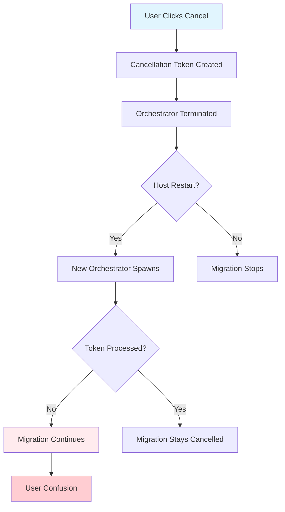

# Durable Functions Cancellation Fix Plan
## Comprehensive Solution for Orchestrator Restart & Cancellation Issues

### 📋 **Executive Summary**

This document outlines a systematic approach to fixing critical cancellation issues in the BigCommerce Migration system's Durable Functions implementation. The current system has **7 critical problems** that cause migrations to restart and complete even after user cancellation.

**Impact**: Users see "Cancelled" in UI while migrations continue running, consuming API quotas and creating data inconsistencies.

**Solution**: 6-phase implementation plan with 33 discrete tasks, addressing determinism, activity-level cancellation, instance protection, and comprehensive testing.

---

## 🚨 **Problem Analysis**

### **Critical Issues Identified**

| **Problem** | **Severity** | **Impact** | **Status** |
|-------------|--------------|------------|------------|
| 1. Race Condition (Token Processing) | **CRITICAL** | Migrations restart after cancellation | ✅ **FIXED** |
| 2. Queue Message Independence | **HIGH** | Background processing continues | 🔶 **PARTIAL** |
| 3. Orchestrator Replay Conflicts | **CRITICAL** | Non-deterministic behavior | ❌ **PENDING** |
| 4. Activity Execution Continuation | **HIGH** | Long operations ignore cancellation | ❌ **PENDING** |
| 5. Multiple Instance Spawning | **HIGH** | Parallel orchestrator conflicts | ❌ **PENDING** |
| 6. Status Update Race Conditions | **MEDIUM** | UI/Backend state mismatch | ❌ **PENDING** |
| 7. Insufficient Token Propagation | **MEDIUM** | No native .NET cancellation | ❌ **PENDING** |

### **Root Cause Analysis**



---

## 🛠️ **Solution Phases**

### **Phase 1: Orchestrator Replay Determinism** ⚡ **CRITICAL**
**Goal**: Fix Durable Functions determinism violations that cause unpredictable cancellation behavior.

**Problem**: `CheckMigrationCancellation` returns different values during orchestrator replay, violating Durable Functions core requirements.

**Solution**: Implement replay-safe cancellation state management using orchestrator context.

#### **Tasks**:
1. **Task 1.1**: Create deterministic cancellation state management
2. **Task 1.2**: Implement replay-safe cancellation checking  
3. **Task 1.3**: Update all orchestrators to use deterministic pattern
4. **Task 1.4**: Add unit tests for replay determinism

---

### **Phase 2: Activity-Level Cancellation** 🎯 **HIGH PRIORITY**
**Goal**: Stop long-running activities from continuing after orchestrator cancellation.

**Problem**: Activities like `ProcessEntityBatchActivity` run for 5-10 minutes after cancellation without checking cancellation status.

**Solution**: Add periodic cancellation checks throughout activity execution and API operations.

#### **Tasks**:
1. **Task 2.1**: Add periodic cancellation checks to ProcessEntityBatchActivity
2. **Task 2.2**: Implement cancellation-aware API request handling
3. **Task 2.3**: Add cancellation checks to entity strategies
4. **Task 2.4**: Create cancellation middleware for long operations

---

### **Phase 3: Instance Protection** 🛡️ **HIGH PRIORITY**
**Goal**: Prevent multiple orchestrator instances from running simultaneously.

**Problem**: Host restarts, activity timeouts, and queue backlogs can spawn multiple orchestrator instances processing the same migration.

**Solution**: Implement distributed locking and instance collision detection.

#### **Tasks**:
1. **Task 3.1**: Implement distributed locks for orchestrator instances
2. **Task 3.2**: Add instance heartbeat mechanism
3. **Task 3.3**: Create orchestrator cleanup service

---

### **Phase 4: Progress Update Consistency** 📊 **MEDIUM PRIORITY**
**Goal**: Prevent progress updates from bypassing cancellation checks.

**Problem**: Progress activities continue updating status even after migration cancellation, causing UI confusion.

**Solution**: Add cancellation checks to all progress update activities.

#### **Tasks**:
1. **Task 4.1**: Add cancellation checks to UpdateEntityProgressActivity
2. **Task 4.2**: Implement cancellation-aware SignalR broadcasts
3. **Task 4.3**: Create progress state consistency validation

---

### **Phase 5: Queue Message Consistency** 📨 **MEDIUM PRIORITY**
**Goal**: Ensure all queue message processors respect cancellation state.

**Problem**: Various queue functions may not consistently check cancellation before processing.

**Solution**: Standardize cancellation checking across all queue processors.

#### **Tasks**:
1. **Task 5.1**: Audit all queue message processors for cancellation checks
2. **Task 5.2**: Implement standard cancellation middleware for queue functions
3. **Task 5.3**: Add cancellation headers to queue messages

---

### **Phase 6: Native CancellationToken Integration** 🔧 **ENHANCEMENT**
**Goal**: Integrate .NET CancellationToken throughout the pipeline for true cancellation support.

**Problem**: Current system uses custom cancellation table instead of native .NET cancellation mechanisms.

**Solution**: Add CancellationToken parameters and propagation throughout the codebase.

#### **Tasks**:
1. **Task 6.1**: Add CancellationToken to API client methods
2. **Task 6.2**: Implement cancellation token propagation in services
3. **Task 6.3**: Add cancellation support to database operations

---

## 🔧 **Phase 1 Implementation Details**

### **Phase 1.1: Deterministic Cancellation State Management**

**Problem**: Current approach violates Durable Functions determinism
```csharp
// ❌ NON-DETERMINISTIC: External state can change between replays
var isCancelled = await context.CallActivityAsync<bool>("CheckMigrationCancellation", migrationId);
```

**Solution**: Use orchestrator context state management
```csharp
// ✅ DETERMINISTIC: State stored in orchestrator context
public class DeterministicCancellationState
{
    public bool IsCancelled { get; set; }
    public DateTime? CancelledAt { get; set; }
    public string CancellationReason { get; set; }
    public bool StateChecked { get; set; }
}
```

**Implementation**:
1. Create `DeterministicCancellationState` class
2. Store cancellation state in orchestrator context
3. Check external cancellation token only once per orchestrator execution
4. Use stored state for all subsequent checks

### **Phase 1.2: Replay-Safe Cancellation Pattern**

**New Pattern**:
```csharp
[Function("MigrationOrchestrator")]
public static async Task<MigrationResult> Run([OrchestrationTrigger] TaskOrchestrationContext context)
{
    // Get or initialize cancellation state (deterministic)
    var cancellationState = context.GetInput<DeterministicCancellationState>() 
        ?? new DeterministicCancellationState();
    
    // Check cancellation only once per orchestrator run
    if (!cancellationState.StateChecked)
    {
        cancellationState.IsCancelled = await context.CallActivityAsync<bool>(
            "CheckExternalCancellationOnce", request.MigrationId);
        cancellationState.StateChecked = true;
        
        if (cancellationState.IsCancelled)
        {
            cancellationState.CancelledAt = context.CurrentUtcDateTime;
            cancellationState.CancellationReason = "User requested cancellation";
        }
    }
    
    // Use deterministic state for all checks
    if (cancellationState.IsCancelled)
    {
        return CreateCancelledResult(cancellationState);
    }
    
    // Continue processing...
}
```

---

## 🧪 **Testing Strategy**

### **Unit Tests Required**:

1. **Determinism Tests**:
   - Orchestrator replay with cancellation state changes
   - Multiple replay iterations return consistent results
   - State persistence across orchestrator restarts

2. **Activity Cancellation Tests**:
   - Long-running activity respects cancellation checks
   - API operations abort when cancellation detected
   - Cleanup operations execute on cancellation

3. **Instance Protection Tests**:
   - Multiple orchestrator instances detect collision
   - Distributed lock acquisition and release
   - Orphaned instance cleanup

4. **Integration Tests**:
   - End-to-end cancellation flow
   - UI state consistency with backend
   - Queue message processing during cancellation

### **Performance Tests**:
- Cancellation detection latency (< 10 seconds)
- Resource cleanup completion time
- Impact on normal migration performance

---

## 📊 **Success Criteria**

### **Phase 1 Success Metrics**:
- ✅ All orchestrator replay tests pass deterministically
- ✅ No `NonDeterministicOrchestrationException` errors in logs
- ✅ Cancellation state consistent across all replay iterations

### **Phase 2 Success Metrics**:
- ✅ Activities stop within 30 seconds of cancellation
- ✅ No API calls made after cancellation detected
- ✅ Resource cleanup completes successfully

### **Phase 3 Success Metrics**:
- ✅ Zero duplicate orchestrator instances in logs
- ✅ Instance collision detection working 100% of time
- ✅ Orphaned instance cleanup within 5 minutes

### **Overall System Success**:
- ✅ **Zero instances** of "cancelled migration continuing to completion"
- ✅ UI state matches backend state within 10 seconds
- ✅ Cancellation effective within 30 seconds maximum
- ✅ No resource leaks or zombie processes

---

## ⚠️ **Risk Assessment**

### **High Risks**:
1. **Breaking Existing Functionality**: Changes to core orchestrator patterns
   - **Mitigation**: Comprehensive testing, feature flags, gradual rollout

2. **Performance Impact**: Additional cancellation checks
   - **Mitigation**: Benchmark tests, optimize check frequency

3. **Data Consistency**: State changes during active migrations
   - **Mitigation**: Migration state validation, rollback procedures

### **Medium Risks**:
1. **Deployment Complexity**: Multiple service dependencies
   - **Mitigation**: Staged deployment, monitoring alerts

2. **Testing Coverage**: Complex distributed scenarios
   - **Mitigation**: Chaos engineering, load testing

---

## 🚀 **Implementation Timeline**

| **Phase** | **Duration** | **Dependencies** | **Critical Path** |
|-----------|--------------|------------------|-------------------|
| Phase 1 | 3-4 days | None | ✅ **Critical** |
| Phase 2 | 4-5 days | Phase 1 complete | ✅ **Critical** |
| Phase 3 | 3-4 days | Phase 1 complete | ✅ **Critical** |
| Phase 4 | 2-3 days | Phase 2 complete | Standard |
| Phase 5 | 2-3 days | Phase 2 complete | Standard |
| Phase 6 | 4-5 days | All phases complete | Enhancement |

**Total Timeline**: 18-24 days for full implementation

**Minimum Viable Fix**: Phases 1-3 (10-13 days) address all critical issues

---

## 📚 **Reference Documentation**

- [Azure Durable Functions Deterministic Execution](https://docs.microsoft.com/en-us/azure/azure-functions/durable/durable-functions-code-constraints)
- [Durable Functions Orchestrator Constraints](https://docs.microsoft.com/en-us/azure/azure-functions/durable/durable-functions-orchestrations)
- [.NET CancellationToken Best Practices](https://docs.microsoft.com/en-us/dotnet/standard/threading/cancellation-in-managed-threads)
- [Azure Storage Distributed Locking Patterns](https://docs.microsoft.com/en-us/azure/architecture/patterns/distributed-lock)

---

## 🎯 **Next Steps**

1. **Review and Approve** this implementation plan
2. **Start Phase 1** with deterministic cancellation state management
3. **Set up monitoring** for cancellation effectiveness metrics
4. **Prepare rollback strategy** for each phase implementation

**Ready to begin Phase 1 implementation?** 🚀 