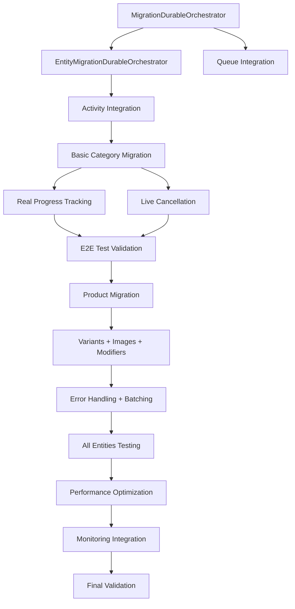

# E2E Migration Implementation Roadmap

## 🎯 **Objective: Complete End-to-End Migration Functionality**

This document outlines the comprehensive implementation plan to achieve fully functional E2E migration testing for the BigCommerce Migration System.

---

## 📊 **Current Status Assessment**

### ✅ **IMPLEMENTED (Strong Foundation)**
- **HTTP API Endpoints**: Start, Status, Cancel, List migrations
- **Queue Infrastructure**: Message creation and basic processing
- **Activity Functions**: All 8 activities implemented with cancellation support
- **Service Layer**: Complete implementation (867-877 lines per service)
- **Authentication & Security**: API keys, rate limiting, validation middleware
- **Monitoring**: Health checks, metrics, logging endpoints
- **Test Framework**: Integration test infrastructure ready

### ❌ **MISSING (Critical Blockers)**
- **Durable Function Orchestrators**: No actual migration processing workflow
- **Queue → Orchestrator Integration**: Messages created but not processed
- **Real Migration Logic**: No actual BigCommerce entity transfer
- **Live Progress Tracking**: Placeholder values instead of real progress
- **End-to-End Flow**: HTTP → Queue → Process → Complete chain broken

---

## 🚀 **3-Phase Implementation Strategy**

### **Phase 1: Core Migration Engine (CRITICAL - 3-4 days)**
*Priority: Get basic migration working end-to-end*

#### **Phase 1A: Orchestration Foundation (Day 1-2)**
1. **Create MigrationDurableOrchestrator** - Main workflow
2. **Create EntityMigrationDurableOrchestrator** - Per-entity processing  
3. **Integrate Queue → Orchestrator** - Start orchestrators from queue messages
4. **Connect Existing Activities** - Wire up 8 existing activities to orchestrators

#### **Phase 1B: Basic Migration Logic (Day 2-3)**
5. **Implement Category Migration** - Real BigCommerce API operations
6. **Real Progress Tracking** - Connect IProgressTracker to actual progress
7. **Live Cancellation** - Integrate cancellation with running orchestrators

#### **Phase 1C: Validation (Day 3-4)**
8. **E2E Test Validation** - Ensure basic migration workflow passes all tests

**Success Criteria:** Categories migrate successfully from source to destination with real progress tracking and cancellation support.

---

### **Phase 2: Complete Entity Support (CRITICAL - 4-5 days)**
*Priority: All entity types working with robust error handling*

#### **Phase 2A: Core Entities (Day 1-2)**
9. **Product Migration** - Complex entity with variants and attributes
10. **Product Variants** - Parent-child relationships and SKU management
11. **Brand Migration** - Simple entity with dependency validation

#### **Phase 2B: Complex Entities (Day 2-3)**
12. **Image Migration** - File transfer, URL mapping, asset management
13. **Product Modifiers** - Options, choices, and pricing rules

#### **Phase 2C: Data & Error Handling (Day 3-4)**
14. **Data Transformation Engine** - Handle BigCommerce schema differences
15. **Comprehensive Error Handling** - Continue-on-failure with detailed tracking
16. **Advanced Batching** - Dynamic batch sizes based on entity complexity

#### **Phase 2D: Full Validation (Day 4-5)**
17. **All Entities E2E Testing** - Complete workflow with all entity types

**Success Criteria:** All 6 entity types (categories, brands, products, variants, images, modifiers) migrate successfully with comprehensive error handling.

---

### **Phase 3: Production Readiness (IMPORTANT - 3-4 days)**
*Priority: Performance, monitoring, and enterprise features*

#### **Phase 3A: Performance (Day 1-2)**
18. **Performance Optimization** - Parallel processing, memory management
19. **Intelligent Retry Logic** - Exponential backoff, circuit breakers

#### **Phase 3B: Monitoring & Scale (Day 2-3)**
20. **Real-time Monitoring Integration** - OpenSearch events and metrics
21. **Large Dataset Handling** - 10M+ entities with streaming

#### **Phase 3C: Final Validation (Day 3-4)**
22. **Comprehensive Testing** - Performance, load, stress testing

**Success Criteria:** System handles enterprise-scale migrations (10M+ entities) with production-grade monitoring and performance.

---

## 🔥 **Immediate Critical Path (Next 24-48 Hours)**

### **Step 1: Create Durable Function Orchestrators**
```csharp
// Files to create:
src/BigCommerce.Migration.Functions/Orchestrators/
├── MigrationDurableOrchestrator.cs          # Main workflow
└── EntityMigrationDurableOrchestrator.cs    # Per-entity processing
```

### **Step 2: Integrate Queue Processing**
```csharp
// Modify existing file:
src/BigCommerce.Migration.Functions/Functions/MigrationQueueFunctions.cs
// Add: DurableTaskClient integration to start orchestrators
```

### **Step 3: Connect Existing Activities**
```csharp
// Use existing activities in orchestrators:
- DiscoverEntitiesActivity
- ProcessEntityBatchActivity  
- UpdateEntityProgressActivity
- CheckMigrationCancellationActivity
- etc.
```

---

## 📋 **Task Dependencies & Flow**



---

## 🎯 **Success Metrics**

### **Phase 1 Success:**
- [ ] HTTP POST `/migrations` → Queue → Orchestrator → Complete
- [ ] Categories migrate from source to destination store
- [ ] Real progress updates (0% → 100%)
- [ ] Cancellation works during active migration
- [ ] E2E tests pass for basic workflow

### **Phase 2 Success:**
- [ ] All 6 entity types migrate successfully
- [ ] Complex entity relationships preserved (product → variants)
- [ ] Error handling with continue-on-failure
- [ ] 1000+ entities migrate without memory issues

### **Phase 3 Success:**
- [ ] 10M+ entity migration completes
- [ ] Performance < 10 seconds per 1000 entities
- [ ] Real-time monitoring and alerting
- [ ] Production-ready error recovery

---

## 🛠️ **Implementation Notes**

### **Existing Infrastructure (Reuse)**
- **All Activity Functions**: Already implemented with cancellation
- **Service Layer**: 90%+ complete, enterprise-grade
- **HTTP APIs**: RESTful endpoints with OpenAPI docs
- **Queue Infrastructure**: Message creation and validation
- **Authentication**: API key middleware with rate limiting

### **Key Integration Points**
1. **Queue → Orchestrator**: Modify `ProcessMigrationStartMessage()` 
2. **Activities → Orchestrator**: Call existing activities in sequence
3. **Progress → Real**: Update IProgressTracker with actual entity counts
4. **Cancellation → Live**: Check cancellation tokens in orchestrator loops

### **Critical Success Factors**
- Reuse existing infrastructure (don't rebuild)
- Focus on connecting existing components
- Implement minimal viable migration first
- Iterate and expand entity support
- Test continuously with real API calls

---

## 📅 **Timeline Estimate**

| Phase | Duration | Critical Tasks | Success Criteria |
|-------|----------|----------------|------------------|
| **Phase 1** | 3-4 days | Orchestrators + Basic Migration | Categories work E2E |
| **Phase 2** | 4-5 days | All Entities + Error Handling | Complete entity support |
| **Phase 3** | 3-4 days | Performance + Monitoring | Production ready |
| **Total** | **10-13 days** | **22 critical tasks** | **Full E2E capability** |

---

## 🔍 **Risk Mitigation**

### **High Risk Items**
1. **Durable Functions Complexity** - Start simple, iterate
2. **BigCommerce API Rate Limits** - Use existing IRateLimitService  
3. **Large Dataset Memory** - Implement streaming early
4. **Complex Entity Relationships** - Handle incrementally

### **Contingency Plans**
- **Orchestrator Issues**: Implement basic state machine first
- **API Integration Problems**: Use existing mock infrastructure for testing
- **Performance Issues**: Focus on correctness first, optimize later
- **Timeline Pressure**: Deliver Phase 1 as MVP, iterate on Phase 2-3

---

*Next Action: Start with Task 1 - Create MigrationDurableOrchestrator.cs* 