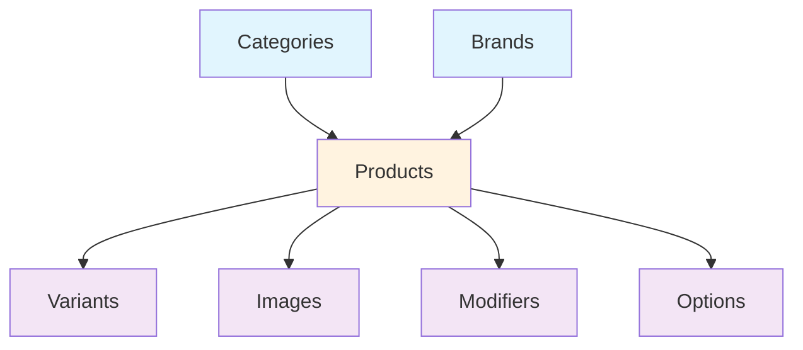

# Entity Configuration Management Guide

## BigCommerce Migration System - Entity Configuration Management

---

**Document Version:** 1.0  
**Created:** January 2025  
**Purpose:** Comprehensive guide for configuring entity-specific settings and optimization strategies  
**Target Audience:** System administrators, DevOps engineers, and migration specialists

---

## 🏪 **Multi-Storefront Configuration**

### **Channel-Specific Migration Setup**

The BigCommerce Migration System now supports multi-storefront architecture with channel-specific configurations:

#### **Enhanced Migration Request Structure**

```json
{
  "sourceStoreId": "v6q95r5n91",
  "destinationStoreId": "in2msaitrc",
  "sourceChannelId": "1",
  "destinationChannelId": "1",
  "entities": ["Categories", "Products", "Customers"]
}
```

#### **Category Tree ID Resolution**

**🚨 Critical Requirement**: Before any category migration, the system automatically resolves category tree IDs for each channel:

```csharp
public class CategoryTreeResolver
{
    public async Task<CategoryTreeContext> ResolveTreeIdsAsync(
        string sourceStoreId, 
        string sourceChannelId,
        string destinationStoreId, 
        string destinationChannelId)
    {
        // Get source category tree ID
        var sourceTreeId = await _bigCommerceClient.GetCategoryTreeIdAsync(
            sourceStoreId, sourceChannelId);
        
        // Get destination category tree ID
        var destinationTreeId = await _bigCommerceClient.GetCategoryTreeIdAsync(
            destinationStoreId, destinationChannelId);
        
        return new CategoryTreeContext
        {
            SourceTreeId = sourceTreeId,
            DestinationTreeId = destinationTreeId,
            SourceChannelId = sourceChannelId,
            DestinationChannelId = destinationChannelId
        };
    }
}
```

#### **Channel-Specific Entity Processing**

All entities now process with channel context:

```csharp
public class ChannelEntityConfiguration
{
    public string ChannelId { get; set; }
    public string CategoryTreeId { get; set; }
    public Dictionary<string, object> ChannelSpecificSettings { get; set; }
    public List<string> ChannelRestrictedEntities { get; set; }
}
```

### **Multi-Channel Rate Limiting**

Rate limiting now considers channel-specific operations:

```csharp
public class ChannelRateLimitConfiguration
{
    public string StoreId { get; set; }
    public string ChannelId { get; set; }
    public int MaxRequestsPerSecond { get; set; } = 12;
    public int BurstLimit { get; set; } = 60;
    public TimeSpan WindowSize { get; set; } = TimeSpan.FromMinutes(1);
}
```

### **Channel Context in Configuration**

```csharp
public class EntityConfiguration
{
    // ... existing properties ...
    
    // New multi-storefront properties
    public string SourceChannelId { get; set; }
    public string DestinationChannelId { get; set; }
    public string SourceCategoryTreeId { get; set; }
    public string DestinationCategoryTreeId { get; set; }
    public ChannelEntityConfiguration ChannelConfig { get; set; }
}
```

---

## Overview

This guide explains how to configure entity-level batch sizes, concurrency, and processing parameters for optimal BigCommerce migration performance. The system supports granular configuration for each entity type to maximize throughput while respecting API rate limits.

## Table of Contents
1. [Entity Types and Default Configurations](#entity-types-and-default-configurations)
2. [Configuration Parameters](#configuration-parameters)
3. [Performance Profiles](#performance-profiles)
4. [Configuration API Usage](#configuration-api-usage)
5. [Best Practices](#best-practices)
6. [Troubleshooting](#troubleshooting)
7. [Performance Tuning](#performance-tuning)

## Entity Types and Default Configurations

### Supported Entity Types

| Entity Type | Default Batch Size | Default Concurrency | Priority | Complexity | Avg Processing Time |
|-------------|-------------------|---------------------|----------|------------|-------------------|
| Categories  | 50                | 2                   | 1        | Low        | 0.5s              |
| Brands      | 30                | 2                   | 1        | Low        | 0.6s              |
| Products    | 10                | 4                   | 2        | High       | 2.1s              |
| Variants    | 20                | 3                   | 3        | Medium     | 1.2s              |
| Images      | 5                 | 2                   | 3        | High       | 4.2s              |
| Modifiers   | 15                | 2                   | 3        | Medium     | 1.5s              |
| Options     | 25                | 3                   | 3        | Low        | 0.8s              |

### Entity Dependencies



## Configuration Parameters

### Batch Size Configuration

**Purpose:** Controls how many entities are processed in a single API batch.

**Guidelines:**
- **Small batches (5-10):** High error isolation, slower overall processing
- **Medium batches (10-25):** Balanced performance and error handling
- **Large batches (25-100):** Fast processing, less error isolation

**Constraints:**
```json
{
  "Categories": {"min": 10, "max": 100, "recommended": 50},
  "Brands": {"min": 10, "max": 75, "recommended": 30},
  "Products": {"min": 5, "max": 25, "recommended": 10},
  "Variants": {"min": 10, "max": 50, "recommended": 20},
  "Images": {"min": 3, "max": 15, "recommended": 5},
  "Modifiers": {"min": 5, "max": 30, "recommended": 15},
  "Options": {"min": 10, "max": 50, "recommended": 25}
}
```

### Concurrency Configuration

**Purpose:** Controls how many parallel workers process batches simultaneously.

**Rate Limit Considerations:**
- Total API calls/second = (BatchSize × Concurrency) ÷ ProcessingTime
- Must stay under 12 calls/second (80% of BigCommerce limit)

**Recommended Concurrency:**
```json
{
  "Categories": {"max": 3, "recommended": 2},
  "Brands": {"max": 3, "recommended": 2}, 
  "Products": {"max": 6, "recommended": 4},
  "Variants": {"max": 4, "recommended": 3},
  "Images": {"max": 3, "recommended": 2},
  "Modifiers": {"max": 3, "recommended": 2},
  "Options": {"max": 4, "recommended": 3}
}
```

### Priority Configuration

**Purpose:** Determines processing order based on entity dependencies.

**Priority Levels:**
- **Priority 1:** Independent entities (Categories, Brands)
- **Priority 2:** Primary entities (Products) 
- **Priority 3:** Dependent entities (Variants, Images, Modifiers, Options)

## Performance Profiles

### Conservative Profile (Maximum Reliability)

```json
{
  "profileName": "Conservative",
  "description": "Optimized for reliability and error isolation",
  "entities": [
    {
      "entityType": "Categories",
      "batchSize": 25,
      "maxConcurrency": 1,
      "priority": 1
    },
    {
      "entityType": "Brands", 
      "batchSize": 20,
      "maxConcurrency": 1,
      "priority": 1
    },
    {
      "entityType": "Products",
      "batchSize": 5,
      "maxConcurrency": 2,
      "priority": 2
    },
    {
      "entityType": "Variants",
      "batchSize": 10,
      "maxConcurrency": 2,
      "priority": 3
    },
    {
      "entityType": "Images",
      "batchSize": 3,
      "maxConcurrency": 1,
      "priority": 3
    }
  ],
  "estimatedTimeFor10K": "8-12 hours",
  "errorTolerance": "High",
  "throughput": "Low"
}
```

### Balanced Profile (Recommended)

```json
{
  "profileName": "Balanced",
  "description": "Optimized balance of speed and reliability",
  "entities": [
    {
      "entityType": "Categories",
      "batchSize": 50,
      "maxConcurrency": 2,
      "priority": 1
    },
    {
      "entityType": "Brands",
      "batchSize": 30, 
      "maxConcurrency": 2,
      "priority": 1
    },
    {
      "entityType": "Products",
      "batchSize": 10,
      "maxConcurrency": 4,
      "priority": 2
    },
    {
      "entityType": "Variants", 
      "batchSize": 20,
      "maxConcurrency": 3,
      "priority": 3
    },
    {
      "entityType": "Images",
      "batchSize": 5,
      "maxConcurrency": 2,
      "priority": 3
    }
  ],
  "estimatedTimeFor10K": "4-6 hours",
  "errorTolerance": "Medium",
  "throughput": "Medium"
}
```

### Aggressive Profile (Maximum Speed)

```json
{
  "profileName": "Aggressive",
  "description": "Optimized for maximum processing speed",
  "entities": [
    {
      "entityType": "Categories",
      "batchSize": 100,
      "maxConcurrency": 3,
      "priority": 1
    },
    {
      "entityType": "Brands",
      "batchSize": 50,
      "maxConcurrency": 2,
      "priority": 1
    },
    {
      "entityType": "Products", 
      "batchSize": 20,
      "maxConcurrency": 6,
      "priority": 2
    },
    {
      "entityType": "Variants",
      "batchSize": 30,
      "maxConcurrency": 4,
      "priority": 3
    },
    {
      "entityType": "Images",
      "batchSize": 10,
      "maxConcurrency": 3,
      "priority": 3
    }
  ],
  "estimatedTimeFor10K": "2-3 hours",
  "errorTolerance": "Low",
  "throughput": "High"
}
```

## Configuration API Usage

### 1. Get Default Entity Configurations

```bash
GET /entity-configurations
```

**Response:**
```json
{
  "entities": [
    {
      "entityType": "Products",
      "defaultBatchSize": 10,
      "minBatchSize": 5,
      "maxBatchSize": 25,
      "recommendedConcurrency": 4,
      "maxConcurrency": 6,
      "complexityLevel": "High",
      "averageProcessingTime": "2.1s",
      "dependsOn": ["Categories", "Brands"]
    }
  ]
}
```

### 2. Start Migration with Custom Configuration

```bash
POST /migrations
```

**Request Body:**
```json
{
  "sourceStore": "https://store-a.mybigcommerce.com", 
  "destinationStore": "https://store-b.mybigcommerce.com",
  "entities": [
    {
      "entityType": "Categories",
      "batchSize": 75,
      "maxConcurrency": 2,
      "priority": 1,
      "filters": {
        "status": "active",
        "includeChildren": true
      }
    },
    {
      "entityType": "Products",
      "batchSize": 15,
      "maxConcurrency": 3,
      "priority": 2,
      "filters": {
        "categories": [1, 2, 3],
        "minPrice": 10.00,
        "status": "published"
      }
    }
  ],
  "globalSettings": {
    "maxApiCallsPerSecond": 10,
    "enableAdaptiveBatching": true,
    "logLevel": "INFO"
  }
}
```

### 3. Monitor Migration Performance

```bash
GET /migrations/{migrationId}/entity-configurations
```

**Response:**
```json
{
  "migrationId": "550e8400-e29b-41d4-a716-446655440000",
  "entities": [
    {
      "entityType": "Products",
      "currentBatchSize": 12,
      "originalBatchSize": 10,
      "maxConcurrency": 3,
      "performanceMetrics": {
        "averageProcessingTime": 1.8,
        "errorRate": 0.03,
        "throughputPerSecond": 1.9,
        "adaptations": 2
      },
      "lastAdaptation": "2024-01-15T10:45:00Z"
    }
  ]
}
```

## Best Practices

### 1. Configuration Selection

**For First-Time Migrations:**
- Start with **Balanced Profile**
- Monitor performance for 30-60 minutes
- Adjust based on observed metrics

**For Production Migrations:**
- Use **Conservative Profile** for critical data
- Use **Aggressive Profile** only after testing

**For Testing/Development:**
- Use **Aggressive Profile** for faster iterations
- Reduce batch sizes if experiencing errors

### 2. Rate Limit Management

**Calculate Total Load:**
```
Total API Calls/Second = Σ(EntityBatchSize × EntityConcurrency) ÷ ProcessingTime
```

**Example Calculation:**
```
Categories: (50 × 2) ÷ 0.5s = 200 calls/sec
Products: (10 × 4) ÷ 2.1s = 19 calls/sec
Total: 219 calls/sec (EXCEEDS LIMIT!)
```

**Optimization:**
- Reduce concurrency or batch sizes
- Stagger entity processing
- Use adaptive batching

### 3. Error Handling Strategy

**High Error Rates (>5%):**
- Reduce batch size by 25-50%
- Decrease concurrency
- Enable detailed logging

**Slow Processing:**
- Check API response times
- Reduce batch size
- Monitor resource utilization

### 4. Performance Monitoring

**Key Metrics to Track:**
- Average processing time per entity
- Error rates by entity type
- API rate limit utilization
- Memory and CPU usage

**Alerting Thresholds:**
- Error rate > 5%
- Processing time > 150% of baseline
- Rate limit utilization > 90%

## Troubleshooting

### Common Issues and Solutions

#### 1. Rate Limit Exceeded

**Symptoms:**
- HTTP 429 errors
- Migration slowing down
- API timeouts

**Solutions:**
```json
{
  "reduceGlobalConcurrency": "Lower maxConcurrency for all entities",
  "increaseBatchInterval": "Add delays between batches", 
  "reduceBatchSizes": "Use smaller batch sizes",
  "staggerProcessing": "Process entities sequentially"
}
```

#### 2. High Error Rates

**Symptoms:**
- Error rate > 5%
- Frequent retries
- Data validation failures

**Solutions:**
```json
{
  "reduceBatchSize": "Smaller batches for better isolation",
  "validateData": "Check source data quality",
  "updateFilters": "Add stricter entity filters",
  "checkMappings": "Verify ID mappings are correct"
}
```

#### 3. Slow Processing

**Symptoms:**
- Processing time > expected
- Low throughput
- Worker idle time

**Solutions:**
```json
{
  "increaseConcurrency": "Add more parallel workers",
  "optimizeBatchSize": "Find optimal batch size",
  "checkApiPerformance": "Monitor BigCommerce API response times",
  "enableAdaptiveBatching": "Let system auto-optimize"
}
```

#### 4. Memory Issues

**Symptoms:**
- Out of memory errors
- Function timeouts
- Slow garbage collection

**Solutions:**
```json
{
  "reduceBatchSize": "Process fewer items per batch",
  "reduceConcurrency": "Lower parallel processing",
  "enableStreaming": "Use streaming for large payloads",
  "optimizeDataStructures": "Review memory usage patterns"
}
```

#### 5. Complex Product Timeouts

**Symptoms:**
- Function timeouts on products with 500+ variants/images
- Incomplete product migrations
- Sub-orchestration failures

**Solutions:**
```json
{
  "enableSubOrchestration": "Use sub-orchestration pattern for complex products",
  "reduceBatchSizes": "Smaller batches for variants (10) and images (2)",
  "increaseDelays": "Longer delays between batches (5s for images)",
  "implementCheckpointing": "Progress tracking and resume capability",
  "separateProcessing": "Process components in parallel sub-orchestrations"
}
```

**Implementation Example:**
```csharp
// Complexity-based processing decision
if (product.TotalComponents > 500)
{
    // Use sub-orchestration pattern
    await context.CallSubOrchestratorAsync("ProcessComplexProduct", product);
}
else if (product.TotalComponents > 50)
{
    // Use enhanced batching
    await context.CallActivityAsync("ProcessMediumProduct", product);
}
else
{
    // Direct processing
    await context.CallActivityAsync("ProcessSimpleProduct", product);
}
```

## Performance Tuning

### Adaptive Batch Sizing

The system can automatically adjust batch sizes based on real-time performance:

```json
{
  "enableAdaptiveBatching": true,
  "adaptationRules": {
    "increaseThreshold": {
      "errorRate": "< 2%",
      "processingTime": "< 50% of target"
    },
    "decreaseThreshold": {
      "errorRate": "> 5%", 
      "processingTime": "> 150% of target"
    },
    "adaptationAmount": 2,
    "maxAdaptations": 5
  }
}
```

### Entity-Specific Optimization

**Categories/Brands (Low Complexity):**
- Use larger batch sizes (50-100)
- Higher concurrency (2-3)
- Focus on throughput
- Single activity function processing

**Products (High Complexity):**
- Medium batch sizes (10-15)
- Balanced concurrency (3-4)
- Focus on reliability
- **Complex Products**: Use sub-orchestration pattern

**Images (High Volume):**
- Small batch sizes (3-8)
- Lower concurrency (1-2)
- Focus on error isolation
- **Large Image Sets**: Chunked processing with sub-orchestrations

### Handling Complex Products (500+ Components)

**Timeout Prevention Strategy:**
```json
{
  "complexityThresholds": {
    "simple": "< 50 total components",
    "complex": "50-500 components", 
    "veryComplex": "500+ components"
  },
  "processingStrategy": {
    "simple": "Direct activity function",
    "complex": "Sub-orchestration pattern",
    "veryComplex": "Multiple sub-orchestrations + smaller batches"
  },
  "batchSizeAdjustment": {
    "variants": {
      "simple": 20,
      "complex": 15,
      "veryComplex": 10
    },
    "images": {
      "simple": 5,
      "complex": 3,
      "veryComplex": 2
    }
  }
}
```

**Real-World Example:**
```
Product with 500 variants + 1000 images:
├── Main Product Creation: 2 minutes
├── Variants Sub-Orchestrator: 
│   ├── 500 variants ÷ 10 = 50 batches
│   ├── 50 batches × 2s delay = ~50 minutes
│   └── Parallel processing capability
├── Images Sub-Orchestrator:
│   ├── 1000 images ÷ 2 = 500 batches  
│   ├── 500 batches × 5s delay = ~16.7 hours
│   └── Parallel processing capability
└── Total: ~17.5 hours (no timeout risk)
```

### Configuration Testing

**A/B Testing Approach:**
1. Run small subset with different configurations
2. Measure performance metrics
3. Choose optimal configuration
4. Apply to full migration

**Test Metrics:**
- Total processing time
- Error rates
- Resource utilization
- API rate limit usage

### Performance Baselines

**Expected Performance (Balanced Profile):**
```
10K Products Migration:
├── Categories (500): ~1.25 minutes
├── Brands (200): ~1 minute  
├── Products (10,000): ~14 minutes
├── Variants (30,000): ~17.5 minutes
├── Images (50,000): ~5.8 hours
└── Total: ~6.2 hours
```

**Optimization Targets:**
- 20-30% faster with aggressive profile
- 50% slower but more reliable with conservative profile
- Adaptive batching can improve by 15-25%

## Migration Cancellation

### Multi-Level Cancellation Support

The migration system supports **granular cancellation** at every level of the processing hierarchy:

**1. Migration Level** - Cancel entire migration
**2. Product Level** - Cancel specific products
**3. Component Level** - Cancel variants, images, or modifiers
**4. Batch Level** - Cancel current processing batch
**5. API Call Level** - Cancel individual API operations

### Cancellation Request

```bash
DELETE /migrations/{migrationId}
```

**Response:**
```json
{
  "migrationId": "550e8400-e29b-41d4-a716-446655440000",
  "status": "Cancelling",
  "message": "Migration cancellation initiated",
  "cancellationDetails": {
    "requestTime": "2024-01-15T10:30:00Z",
    "expectedCompletionTime": "2024-01-15T10:35:00Z",
    "currentPhase": "Products",
    "granularCancellation": true
  }
}
```

### Cancellation Behavior by Entity Type

**Categories/Brands (Simple Processing):**
- Cancellation checked before each batch
- Current batch completes gracefully
- Remaining batches are cancelled immediately

**Products (Complex Processing):**
- Cancellation checked at product level
- Sub-orchestrators receive cancellation signals
- In-progress components complete current batch
- Remaining components are cancelled

**Variants/Images (Sub-Orchestrations):**
- Cancellation checked before each batch
- Current API calls complete
- Remaining batches are cancelled
- Progress is saved for potential resume

### Cancellation Timing

**Immediate Cancellation Points:**
- Between phases (Dependencies → Products → Components)
- Between product processing
- Between component batches
- Between individual API calls

**Graceful Completion:**
- Current API calls are allowed to complete
- Current batch processing finishes
- State is saved to OpenSearch
- Resources are cleaned up properly

### Cancellation Status Tracking

**Real-Time Status:**
```json
{
  "migrationId": "550e8400-e29b-41d4-a716-446655440000",
  "status": "Cancelled",
  "cancellationSummary": {
    "totalEntities": 10000,
    "processedEntities": 6000,
    "cancelledEntities": 4000,
    "entityBreakdown": {
      "Categories": {"processed": 500, "cancelled": 0},
      "Products": {"processed": 2500, "cancelled": 1500},
      "Variants": {"processed": 3000, "cancelled": 2500}
    }
  }
}
```

### Resume After Cancellation

**Partial Migration Resume:**
- System tracks exactly where processing stopped
- Resume skips already processed entities
- Cancelled entities can be retried individually
- Full audit trail maintained

**Resume Configuration:**
```json
{
  "resumeMode": "FromLastCheckpoint",
  "skipCancelledEntities": true,
  "retryFailedEntities": true,
  "preserveProgress": true
}
```

---

This guide provides comprehensive information for configuring and optimizing entity-level batch processing in the BigCommerce migration system. The granular cancellation capability ensures that migrations can be stopped at any level with full state preservation and resume capability. For additional support or advanced configuration scenarios, consult the main architecture documentation or contact the development team. 