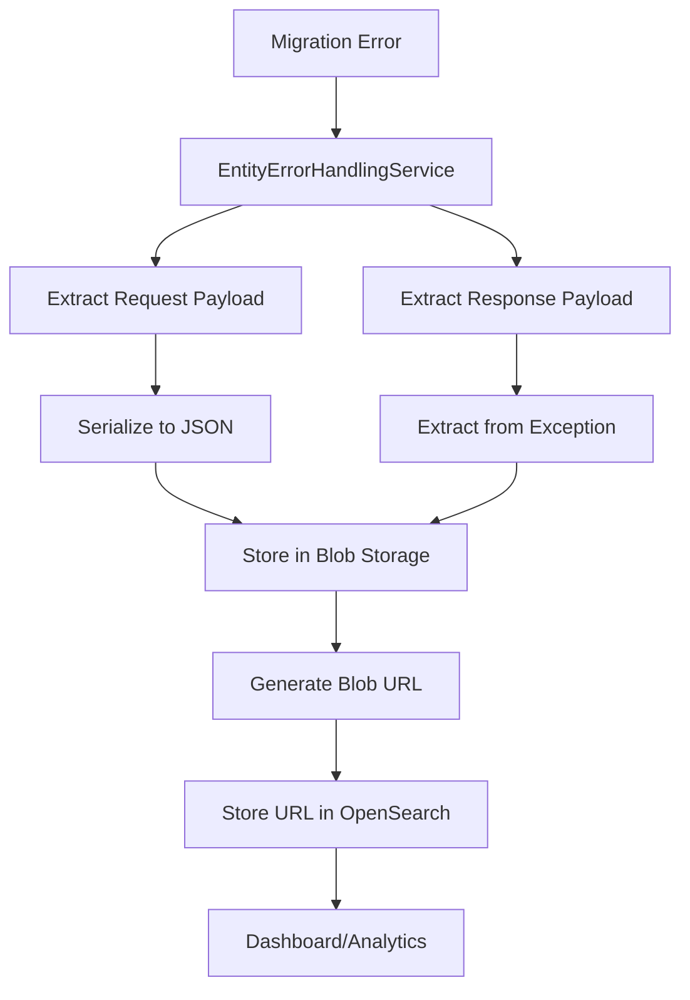

# Error Logging and Blob Storage Guide

## 📋 Overview

This guide explains how the BigCommerce Migration System handles error logging, stores payload JSON files in blob storage, and provides access to these files for debugging and analysis.

## 🏗️ Architecture Overview

The error logging system uses a **multi-storage approach** to efficiently handle different types of data:



### **Storage Distribution:**
- **📊 OpenSearch**: Error metadata, searchable fields, blob URLs
- **📁 Blob Storage**: Large JSON payloads (request/response data)
- **🔍 Error Analysis**: Direct access via blob URLs

---

## 🔧 Base URL Configuration

### **Configuration Options**

The blob storage base URL is fully configurable through the `ExternalBlobUrl` setting:

#### **Local Development (Azurite):**
```json
{
  "ExternalBlobUrl": "http://localhost:10000/devstoreaccount1"
}
```

#### **Production Azure:**
```json
{
  "ExternalBlobUrl": "https://yourstorageaccount.blob.core.windows.net"
}
```

#### **Configuration Locations:**

**appsettings.json:**
```json
{
  "ExternalBlobUrl": "http://localhost:10000/devstoreaccount1"
}
```

**Environment Variables:**
```bash
ExternalBlobUrl=http://localhost:10000/devstoreaccount1
```

**Azure Functions Configuration:**
```json
{
  "Values": {
    "ExternalBlobUrl": "http://localhost:10000/devstoreaccount1"
  }
}
```

### **How URL Generation Works**

The `BlobService` generates URLs using this logic:

```csharp
// ✅ Return external URL if configured, otherwise return local URL
if (!string.IsNullOrEmpty(ExternalBlobUrl))
{
    var localUri = blobClient.Uri;
    var externalUri = new Uri(ExternalBlobUrl);
    var externalBlobUrl = $"{externalUri.Scheme}://{externalUri.Host}:{externalUri.Port}{localUri.AbsolutePath}";
    return externalBlobUrl;
}

return blobClient.Uri.ToString();
```

**Example URL Generation:**
- **Internal URI**: `http://azurite:10000/devstoreaccount1/migration-payloads/...`
- **External URL**: `http://localhost:10000/devstoreaccount1/migration-payloads/...`

---

## 📝 Error Logging Flow

### **Step 1: Error Preparation**

When an error occurs during migration, the system:

1. **Extracts Request Payload**: Serializes entity data to JSON
2. **Extracts Response Payload**: Parses error response from BigCommerce API
3. **Generates Request ID**: Creates unique identifier for the error

```csharp
// Create request payload from entities data
var requestPayload = JsonSerializer.Serialize(entities, new JsonSerializerOptions 
{ 
    WriteIndented = true,
    PropertyNamingPolicy = JsonNamingPolicy.CamelCase
});

// Extract response payload from exception
var responsePayload = ExtractResponsePayloadFromException(exception);
```

### **Step 2: Blob Storage**

The system stores both payloads in blob storage:

```csharp
// Store error payloads to blob storage
var requestId = $"{request.EntityType}_{errorType}_{DateTime.UtcNow:yyyyMMddHHmmss}";
var (requestPayloadRef, responsePayloadRef) = await StoreErrorPayloadsAsync(
    request.MigrationId, 
    requestId, 
    requestPayload, 
    responsePayload, 
    $"{request.EntityType}_{errorType}",
    cancellationToken);
```

### **Step 3: OpenSearch Logging**

Only metadata and blob URLs are stored in OpenSearch:

```csharp
var errorData = new
{
    migrationId = request.MigrationId,
    entityType = request.EntityType,
    entityId = finalEntityId,
    entityName = entityName,
    errorMessage = simpleErrorMessage ?? exception.Message,
    detailedErrorMessage = exception.Message,
    stackTrace = GetTruncatedStackTrace(exception.StackTrace),
    httpStatusCode = ExtractHttpStatusFromException(exception),
    requestPayloadBlobUrl = requestPayloadRef.BlobUrl,
    responsePayloadBlobUrl = responsePayloadRef.BlobUrl,
    sourceStoreId = request.SourceStore?.StoreId,
    destinationStoreId = request.DestinationStore?.StoreId,
    batchNumber = request.BatchNumber
};
```

---

## 🗂️ File Organization

### **Blob Storage Structure**

The system organizes files in a hierarchical structure:

```
migration-payloads/
├── {migrationId}/
│   ├── requests/
│   │   ├── products_123_20240315_143022.json
│   │   ├── categories_456_20240315_143525.json
│   │   └── brands_789_20240315_144012.json
│   └── responses/
│       ├── products_123_20240315_143022.json
│       ├── categories_456_20240315_143525.json
│       └── brands_789_20240315_144012.json
```

### **File Naming Convention**

```
{entityType}_{entityId}_{timestamp}.json
```

**Examples:**
- `products_123_20240315_143022.json`
- `categories_electronics_20240315_143525.json`
- `brands_nike_20240315_144012.json`

### **URL Format Examples**

**Local Development (Azurite):**
```
http://localhost:10000/devstoreaccount1/migration-payloads/mig-123/requests/products_123_20240315_143022.json
```

**Production Azure:**
```
https://mystorageaccount.blob.core.windows.net/migration-payloads/mig-123/requests/products_123_20240315_143022.json
```

---

## 🔍 Accessing Payload JSON Files

### **1. 🌐 Direct Browser Access**

The simplest method - copy URLs directly from OpenSearch:

1. Open your OpenSearch dashboard
2. Find the error log entry
3. Copy the `requestPayloadBlobUrl` or `responsePayloadBlobUrl`
4. Paste into browser address bar

**Example URL:**
```
http://localhost:10000/devstoreaccount1/migration-payloads/migration-123/requests/products_456_20240315_143022.json
```

### **2. 🛠️ Azure Storage Explorer**

#### **Installation:**
1. Download from: https://azure.microsoft.com/en-us/products/storage/storage-explorer/
2. Install and launch Azure Storage Explorer

#### **Connect to Azurite:**
1. Click **"Connect to Azure Storage"**
2. Select **"Local storage emulator"**
3. Configure connection:
   - **Display Name**: `Local Azurite`
   - **Blob Port**: `10000`
   - **Queue Port**: `10001`
   - **Table Port**: `10002`
4. Click **"Connect"**

#### **Navigate to Payloads:**
```
📁 Local Azurite
  └── 📁 Blob Containers
      └── 📁 migration-payloads
          └── 📁 {migrationId}
              ├── 📁 requests/
              │   └── 📄 products_123_20240315_143022.json
              └── 📁 responses/
                  └── 📄 products_123_20240315_143022.json
```

#### **Download Files:**
- Right-click on any JSON file
- Select **"Download"**
- Choose destination folder

### **3. 📋 Command Line Access**

#### **Using cURL:**
```bash
# Download request payload
curl "http://localhost:10000/devstoreaccount1/migration-payloads/migration-123/requests/products_456_20240315_143022.json" -o request_payload.json

# Download response payload
curl "http://localhost:10000/devstoreaccount1/migration-payloads/migration-123/responses/products_456_20240315_143022.json" -o response_payload.json

# Pretty print JSON
curl "http://localhost:10000/devstoreaccount1/migration-payloads/migration-123/requests/products_456_20240315_143022.json" | jq .
```

#### **Using PowerShell:**
```powershell
# Download request payload
Invoke-WebRequest -Uri "http://localhost:10000/devstoreaccount1/migration-payloads/migration-123/requests/products_456_20240315_143022.json" -OutFile "request_payload.json"

# Download and display content
$response = Invoke-WebRequest -Uri "http://localhost:10000/devstoreaccount1/migration-payloads/migration-123/requests/products_456_20240315_143022.json"
$response.Content | ConvertFrom-Json | ConvertTo-Json -Depth 10
```

#### **Using wget:**
```bash
# Download request payload
wget "http://localhost:10000/devstoreaccount1/migration-payloads/migration-123/requests/products_456_20240315_143022.json" -O request_payload.json
```

### **4. 🔗 Programmatic Access**

#### **Using BlobService API:**
```csharp
// Get payload content programmatically
var payloadContent = await _blobService.GetStoredPayloadAsync(blobUrl);
Console.WriteLine(payloadContent);

// Parse JSON content
var jsonDocument = JsonDocument.Parse(payloadContent);
var entityData = jsonDocument.RootElement;
```

#### **Using Azure SDK:**
```csharp
var blobServiceClient = new BlobServiceClient(connectionString);
var containerClient = blobServiceClient.GetBlobContainerClient("migration-payloads");
var blobClient = containerClient.GetBlobClient("migration-123/requests/products_456_20240315_143022.json");

var response = await blobClient.DownloadContentAsync();
var jsonContent = response.Value.Content.ToString();
```

### **5. 🗂️ Docker Container Access**

If running Azurite in Docker, you can access files directly:

```bash
# List running containers
docker ps

# Access Azurite container
docker exec -it bigcommerce-azurite bash

# Navigate to data directory
cd /data

# Find payload files
find . -name "*.json" -type f

# View file content
cat ./blobstorage/migration-payloads/migration-123/requests/products_456_20240315_143022.json
```

---

## ⚙️ Local Development Setup

### **Docker Compose Configuration**

Your local environment automatically configures:

```yaml
azurite:
  image: mcr.microsoft.com/azure-storage/azurite:latest
  container_name: bigcommerce-azurite
  ports:
    - "10000:10000"  # Blob service
    - "10001:10001"  # Queue service  
    - "10002:10002"  # Table service
  volumes:
    - azurite-data:/data
```

### **Connection Details**

**Service URLs:**
- **Blob Storage**: `http://localhost:10000/devstoreaccount1`
- **Queue Storage**: `http://localhost:10001/devstoreaccount1`  
- **Table Storage**: `http://localhost:10002/devstoreaccount1`

**Connection String:**
```
DefaultEndpointsProtocol=http;AccountName=devstoreaccount1;AccountKey=Eby8vdM02xNOcqFlqUwJPLlmEtlCDXJ1OUzFT50uSRZ6IFsuFq2UVErCz4I6tq/K1SZFPTOtr/KBHBeksoGMGw==;BlobEndpoint=http://localhost:10000/devstoreaccount1;QueueEndpoint=http://localhost:10001/devstoreaccount1;TableEndpoint=http://azurite:10002/devstoreaccount1;
```

### **Starting the Environment**

```bash
# Start all services
docker-compose up -d

# Check service health
curl http://localhost:10000/devstoreaccount1
curl http://localhost:7071/api/health

# View logs
docker-compose logs -f bigcommerce-functions
docker-compose logs -f azurite
```

---

## 🔍 Response Payload Extraction

The system intelligently extracts response payloads from exceptions using multiple strategies:

### **1. Enhanced Exception Data**

First checks if response payload is stored in exception data:

```csharp
if (exception.Data.Contains("ResponsePayload"))
{
    var responsePayload = exception.Data["ResponsePayload"]?.ToString();
    if (!string.IsNullOrEmpty(responsePayload))
    {
        return responsePayload;
    }
}
```

### **2. HTTP Exception Content**

Extracts from HTTP request exceptions:

```csharp
if (exception is HttpRequestException httpEx)
{
    if (httpEx.Data.Contains("ResponseContent"))
    {
        return httpEx.Data["ResponseContent"]?.ToString();
    }
}
```

### **3. BigCommerce API Error Pattern**

Parses BigCommerce-specific error format:

```csharp
// Look for pattern: "API request failed with status XXX: {JSON_CONTENT}"
if (message.Contains("API request failed with status"))
{
    var colonIndex = message.LastIndexOf(':');
    if (colonIndex > 0 && colonIndex < message.Length - 1)
    {
        var content = message.Substring(colonIndex + 1).Trim();
        
        // Validate it's actually JSON
        try
        {
            JsonDocument.Parse(content);
            return content;
        }
        catch (JsonException)
        {
            // Not valid JSON, continue to other extraction methods
        }
    }
}
```

### **4. JSON Content Detection**

Searches for JSON-like content in exception messages:

```csharp
if (message.Contains("{") && message.Contains("}"))
{
    var startIndex = message.IndexOf('{');
    var endIndex = message.LastIndexOf('}');
    if (startIndex >= 0 && endIndex > startIndex)
    {
        var jsonContent = message.Substring(startIndex, endIndex - startIndex + 1);
        try
        {
            JsonDocument.Parse(jsonContent);
            return jsonContent;
        }
        catch (JsonException)
        {
            // Not valid JSON, continue
        }
    }
}
```

---

## 📊 Example Payload Files

### **Request Payload Example**

```json
{
  "name": "Gaming Laptop",
  "type": "physical",
  "sku": "GAMING-LAPTOP-001",
  "description": "High-performance gaming laptop with RTX graphics",
  "weight": 2.5,
  "width": 35.0,
  "depth": 25.0,
  "height": 2.0,
  "price": 1299.99,
  "cost_price": 950.00,
  "retail_price": 1299.99,
  "sale_price": 1199.99,
  "categories": [15, 22],
  "brand_id": 5,
  "inventory_level": 25,
  "inventory_warning_level": 5,
  "is_visible": true,
  "is_featured": false,
  "availability": "available"
}
```

### **Response Payload Example (Error)**

```json
{
  "status": 422,
  "title": "The product was not created.",
  "type": "https://developer.bigcommerce.com/docs/rest-errors/422",
  "errors": {
    "sku": "SKU must be unique. The submitted SKU 'GAMING-LAPTOP-001' is already in use."
  }
}
```

---

## 💡 Best Practices

### **1. Configuration Management**
- ✅ Always set `ExternalBlobUrl` for proper OpenSearch integration
- ✅ Use environment-specific configuration files
- ✅ Keep connection strings secure in production

### **2. File Access**
- ✅ Use Azure Storage Explorer for browsing during development
- ✅ Use direct URLs from OpenSearch for quick access
- ✅ Implement retry logic for programmatic access

### **3. Storage Management**
- ✅ Configure blob retention policies
- ✅ Use lifecycle management for cost optimization
- ✅ Monitor storage usage and costs

### **4. Security**
- ✅ Use SAS tokens for production blob access
- ✅ Implement proper access controls
- ✅ Encrypt sensitive payload data

### **5. Performance**
- ✅ Use async methods for all blob operations
- ✅ Implement caching for frequently accessed payloads
- ✅ Consider compression for large payloads

---

## 🔧 Troubleshooting

### **Common Issues**

#### **URLs Not Working**
```bash
# Check if ExternalBlobUrl is configured
curl http://localhost:7071/api/health

# Verify Azurite is running
curl http://localhost:10000/devstoreaccount1

# Check Docker container status
docker ps | grep azurite
```

#### **Files Not Found**
```bash
# List containers
curl "http://localhost:10000/devstoreaccount1?comp=list"

# Check specific container
curl "http://localhost:10000/devstoreaccount1/migration-payloads?restype=container&comp=list"
```

#### **JSON Parsing Errors**
```csharp
// Always validate JSON before processing
try
{
    var jsonDocument = JsonDocument.Parse(payload);
    // Process valid JSON
}
catch (JsonException ex)
{
    _logger.LogWarning("Invalid JSON payload: {Error}", ex.Message);
    // Handle invalid JSON
}
```

### **Debug Commands**

```bash
# View Azurite logs
docker logs bigcommerce-azurite

# Check Azure Functions logs
docker logs bigcommerce-functions

# Test blob service directly
curl -X GET "http://localhost:10000/devstoreaccount1?comp=list"

# List all blobs in container
curl -X GET "http://localhost:10000/devstoreaccount1/migration-payloads?restype=container&comp=list"
```

---

## 📚 Additional Resources

### **Documentation Links**
- [Azure Storage Explorer](https://azure.microsoft.com/en-us/products/storage/storage-explorer/)
- [Azurite Documentation](https://docs.microsoft.com/en-us/azure/storage/common/storage-use-azurite)
- [Azure Blob Storage REST API](https://docs.microsoft.com/en-us/rest/api/storageservices/blob-service-rest-api)

### **Related Guides**
- [OpenSearch Integration Guide](./OpenSearch-Integration-Guide.md)
- [Docker Local Testing Guide](./Docker-Local-Testing-Guide.md)
- [Error Handling Strategy](./Error-Handling-Strategy.md)

---

This comprehensive guide provides everything needed to understand, configure, and access the error logging and blob storage system in the BigCommerce Migration System. 