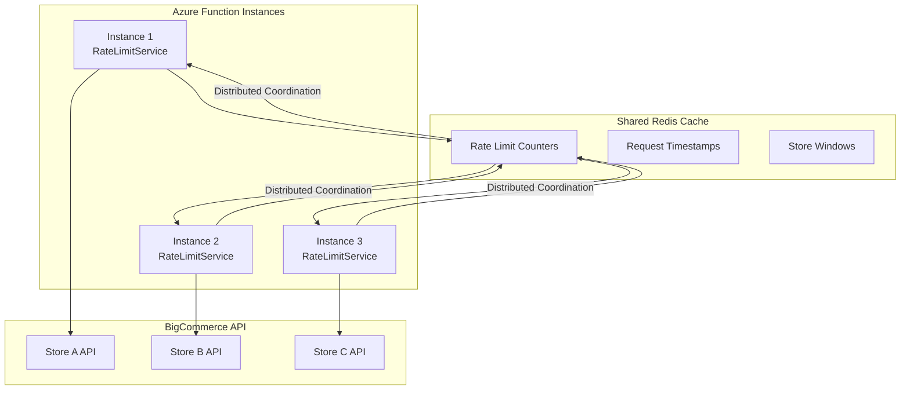

# Feature Enhancement: Distributed Rate Limiting with Redis

## 📋 Overview

**Feature**: Distributed Rate Limiting for Multi-Instance Azure Functions  
**Status**: Future Enhancement (Not Currently Needed)  
**Priority**: Low (Implement when Azure Functions auto-scales to 3+ instances)  
**Estimated Effort**: 2-3 weeks  
**Dependencies**: Redis infrastructure, distributed caching patterns

---

## 🎯 Problem Statement

### **Current State (Working Perfectly)**
```csharp
// Single Azure Function Instance
├── Instance 1
    ├── RateLimitService (In-Memory)
    ├── Migration A → BigCommerce API
    ├── Migration B → BigCommerce API
    └── Migration C → BigCommerce API
    // Perfect coordination: Never exceeds 12 req/sec ✅
```

### **Future Problem (High Load Scenario)**
```csharp
// Multiple Azure Function Instances (Auto-Scaled)
├── Instance 1: RateLimitService (Memory A) → Thinks 4/12 requests used
├── Instance 2: RateLimitService (Memory B) → Thinks 4/12 requests used
└── Instance 3: RateLimitService (Memory C) → Thinks 4/12 requests used
// Reality: 12/12 requests sent to BigCommerce = RATE LIMIT VIOLATION ❌
```

### **When This Enhancement is Needed**
- Azure Functions auto-scales to **3+ instances**
- **20+ concurrent migrations** running simultaneously
- **High API call volume** (500+ requests/minute)
- Rate limit violations appearing in BigCommerce API responses

---

## 🔧 Technical Solution

### **Architecture Overview**



### **Implementation Strategy**

#### **1. Create Distributed Rate Limit Interface**
```csharp
namespace BigCommerce.Migration.Core.Interfaces;

/// <summary>
/// Distributed rate limiting service interface
/// Supports both in-memory (single instance) and Redis (multi-instance) implementations
/// </summary>
public interface IDistributedRateLimitService : IRateLimitService
{
    /// <summary>
    /// Gets the implementation type for monitoring/diagnostics
    /// </summary>
    string ImplementationType { get; }
    
    /// <summary>
    /// Checks if the service is healthy and available
    /// </summary>
    Task<bool> IsHealthyAsync(CancellationToken cancellationToken = default);
    
    /// <summary>
    /// Gets distributed rate limit statistics across all instances
    /// </summary>
    Task<DistributedRateLimitStats> GetDistributedStatsAsync(string storeId, CancellationToken cancellationToken = default);
    
    /// <summary>
    /// Forces synchronization of rate limit data across instances
    /// </summary>
    Task SynchronizeAsync(CancellationToken cancellationToken = default);
}

/// <summary>
/// Statistics for distributed rate limiting
/// </summary>
public class DistributedRateLimitStats
{
    public string StoreId { get; set; } = string.Empty;
    public int TotalInstancesActive { get; set; }
    public int RequestsAcrossAllInstances { get; set; }
    public int RequestsFromThisInstance { get; set; }
    public DateTime LastSyncTime { get; set; }
    public TimeSpan SyncLatency { get; set; }
    public bool IsCoordinated { get; set; }
}
```

#### **2. Redis-Based Implementation**
```csharp
namespace BigCommerce.Migration.Infrastructure.Services;

/// <summary>
/// Redis-based distributed rate limiting service
/// Coordinates rate limits across multiple Azure Function instances
/// </summary>
public class RedisDistributedRateLimitService : IDistributedRateLimitService
{
    private readonly IDatabase _redisDatabase;
    private readonly ILogger<RedisDistributedRateLimitService> _logger;
    private readonly string _instanceId;
    private readonly Timer _syncTimer;
    
    // Redis key patterns
    private const string RATE_LIMIT_KEY_PATTERN = "rate_limit:{storeId}";
    private const string REQUEST_TIMESTAMPS_KEY_PATTERN = "rate_limit_timestamps:{storeId}";
    private const string INSTANCE_HEARTBEAT_PATTERN = "instance_heartbeat:{instanceId}";
    
    public string ImplementationType => "Redis-Distributed";
    
    public RedisDistributedRateLimitService(
        IConnectionMultiplexer redis,
        ILogger<RedisDistributedRateLimitService> logger)
    {
        _redisDatabase = redis.GetDatabase();
        _logger = logger;
        _instanceId = Environment.MachineName + "_" + Guid.NewGuid().ToString("N")[..8];
        
        // Start heartbeat timer for instance tracking
        _syncTimer = new Timer(SendHeartbeat, null, TimeSpan.Zero, TimeSpan.FromSeconds(30));
        
        _logger.LogInformation("Redis distributed rate limiting initialized for instance {InstanceId}", _instanceId);
    }
    
    public async Task<bool> CanMakeRequestAsync(string storeId, CancellationToken cancellationToken = default)
    {
        cancellationToken.ThrowIfCancellationRequested();
        
        try
        {
            // Use Redis Lua script for atomic check-and-increment
            const string luaScript = @"
                local key = KEYS[1]
                local timestampKey = KEYS[2]
                local currentTime = tonumber(ARGV[1])
                local windowStart = currentTime - 60000  -- 60 seconds ago
                local maxRequests = 12
                
                -- Clean up old timestamps
                redis.call('ZREMRANGEBYSCORE', timestampKey, '-inf', windowStart)
                
                -- Count current requests in window
                local currentCount = redis.call('ZCARD', timestampKey)
                
                -- Check if we can make request
                if currentCount < maxRequests then
                    return 1  -- Can make request
                else
                    return 0  -- Rate limited
                end
            ";
            
            var currentTimeMs = DateTimeOffset.UtcNow.ToUnixTimeMilliseconds();
            var result = await _redisDatabase.ScriptEvaluateAsync(
                luaScript,
                new RedisKey[] { 
                    string.Format(RATE_LIMIT_KEY_PATTERN, storeId),
                    string.Format(REQUEST_TIMESTAMPS_KEY_PATTERN, storeId)
                },
                new RedisValue[] { currentTimeMs }
            );
            
            return result.ToString() == "1";
        }
        catch (Exception ex)
        {
            _logger.LogError(ex, "Error checking rate limit for store {StoreId}", storeId);
            // Fallback: allow request if Redis is down (fail open)
            return true;
        }
    }
    
    public async Task RecordApiCallAsync(string storeId, string endpoint, double responseTime, bool isSuccessful, CancellationToken cancellationToken = default)
    {
        cancellationToken.ThrowIfCancellationRequested();
        
        try
        {
            // Use Redis Lua script for atomic record operation
            const string luaScript = @"
                local key = KEYS[1]
                local timestampKey = KEYS[2]
                local currentTime = tonumber(ARGV[1])
                local windowStart = currentTime - 60000  -- 60 seconds ago
                local instanceId = ARGV[2]
                
                -- Clean up old timestamps
                redis.call('ZREMRANGEBYSCORE', timestampKey, '-inf', windowStart)
                
                -- Add current request timestamp
                redis.call('ZADD', timestampKey, currentTime, instanceId .. ':' .. currentTime)
                
                -- Set expiration for cleanup (2 minutes)
                redis.call('EXPIRE', timestampKey, 120)
                
                -- Update rate limit counter
                local currentCount = redis.call('ZCARD', timestampKey)
                redis.call('SET', key, currentCount, 'EX', 120)
                
                return currentCount
            ";
            
            var currentTimeMs = DateTimeOffset.UtcNow.ToUnixTimeMilliseconds();
            await _redisDatabase.ScriptEvaluateAsync(
                luaScript,
                new RedisKey[] { 
                    string.Format(RATE_LIMIT_KEY_PATTERN, storeId),
                    string.Format(REQUEST_TIMESTAMPS_KEY_PATTERN, storeId)
                },
                new RedisValue[] { currentTimeMs, _instanceId }
            );
            
            _logger.LogDebug("Recorded API call for store {StoreId} via Redis", storeId);
        }
        catch (Exception ex)
        {
            _logger.LogError(ex, "Error recording API call for store {StoreId}", storeId);
            // Non-critical error - continue execution
        }
    }
    
    public async Task<RateLimitStatus> GetRateLimitStatusAsync(string storeId, CancellationToken cancellationToken = default)
    {
        cancellationToken.ThrowIfCancellationRequested();
        
        try
        {
            const string luaScript = @"
                local timestampKey = KEYS[1]
                local currentTime = tonumber(ARGV[1])
                local windowStart = currentTime - 60000  -- 60 seconds ago
                
                -- Clean up old timestamps
                redis.call('ZREMRANGEBYSCORE', timestampKey, '-inf', windowStart)
                
                -- Get current count and oldest timestamp
                local currentCount = redis.call('ZCARD', timestampKey)
                local oldestTimestamp = redis.call('ZRANGE', timestampKey, 0, 0, 'WITHSCORES')
                
                return {currentCount, oldestTimestamp[2] or currentTime}
            ";
            
            var currentTimeMs = DateTimeOffset.UtcNow.ToUnixTimeMilliseconds();
            var result = await _redisDatabase.ScriptEvaluateAsync(
                luaScript,
                new RedisKey[] { string.Format(REQUEST_TIMESTAMPS_KEY_PATTERN, storeId) },
                new RedisValue[] { currentTimeMs }
            );
            
            var resultArray = (RedisValue[])result;
            var currentCount = (int)resultArray[0];
            var oldestTimestamp = (long)resultArray[1];
            
            var isLimited = currentCount >= 12;
            var windowResetTime = DateTimeOffset.FromUnixTimeMilliseconds(oldestTimestamp + 60000);
            var delayMs = isLimited ? Math.Max(0, (int)(windowResetTime.ToUnixTimeMilliseconds() - currentTimeMs)) : 0;
            
            return new RateLimitStatus
            {
                StoreId = storeId,
                RequestsPerMinute = currentCount,
                RequestsRemaining = Math.Max(0, 12 - currentCount),
                WindowResetTime = windowResetTime.DateTime,
                IsLimited = isLimited,
                RecommendedDelayMs = delayMs
            };
        }
        catch (Exception ex)
        {
            _logger.LogError(ex, "Error getting rate limit status for store {StoreId}", storeId);
            
            // Return safe fallback status
            return new RateLimitStatus
            {
                StoreId = storeId,
                RequestsPerMinute = 0,
                RequestsRemaining = 12,
                WindowResetTime = DateTime.UtcNow.AddMinutes(1),
                IsLimited = false,
                RecommendedDelayMs = 0
            };
        }
    }
    
    public async Task<DistributedRateLimitStats> GetDistributedStatsAsync(string storeId, CancellationToken cancellationToken = default)
    {
        try
        {
            // Get active instances
            var activeInstances = await _redisDatabase.HashLenAsync("active_instances");
            
            // Get rate limit data
            var status = await GetRateLimitStatusAsync(storeId, cancellationToken);
            
            // Get this instance's contribution
            var timestampKey = string.Format(REQUEST_TIMESTAMPS_KEY_PATTERN, storeId);
            var thisInstanceRequests = await _redisDatabase.SortedSetLengthByValueAsync(
                timestampKey, $"{_instanceId}:*", Exclude.None);
            
            return new DistributedRateLimitStats
            {
                StoreId = storeId,
                TotalInstancesActive = (int)activeInstances,
                RequestsAcrossAllInstances = status.RequestsPerMinute,
                RequestsFromThisInstance = (int)thisInstanceRequests,
                LastSyncTime = DateTime.UtcNow,
                SyncLatency = TimeSpan.FromMilliseconds(10), // Estimate
                IsCoordinated = true
            };
        }
        catch (Exception ex)
        {
            _logger.LogError(ex, "Error getting distributed stats for store {StoreId}", storeId);
            return new DistributedRateLimitStats { StoreId = storeId, IsCoordinated = false };
        }
    }
    
    public async Task<bool> IsHealthyAsync(CancellationToken cancellationToken = default)
    {
        try
        {
            await _redisDatabase.PingAsync();
            return true;
        }
        catch
        {
            return false;
        }
    }
    
    public async Task SynchronizeAsync(CancellationToken cancellationToken = default)
    {
        try
        {
            // Send heartbeat to indicate this instance is active
            await SendHeartbeat(null);
            _logger.LogDebug("Rate limit synchronization completed for instance {InstanceId}", _instanceId);
        }
        catch (Exception ex)
        {
            _logger.LogError(ex, "Error during rate limit synchronization");
        }
    }
    
    private async void SendHeartbeat(object? state)
    {
        try
        {
            var heartbeatKey = string.Format(INSTANCE_HEARTBEAT_PATTERN, _instanceId);
            await _redisDatabase.HashSetAsync("active_instances", _instanceId, DateTimeOffset.UtcNow.ToUnixTimeSeconds());
            await _redisDatabase.KeyExpireAsync(heartbeatKey, TimeSpan.FromMinutes(2));
        }
        catch (Exception ex)
        {
            _logger.LogWarning(ex, "Failed to send heartbeat for instance {InstanceId}", _instanceId);
        }
    }
    
    // Implement other IRateLimitService methods...
    public async Task<int> CalculateDelayAsync(string storeId, CancellationToken cancellationToken = default)
    {
        var status = await GetRateLimitStatusAsync(storeId, cancellationToken);
        return status.RecommendedDelayMs;
    }
    
    public async Task<RateLimitResult> CheckRateLimitAsync(string storeId, CancellationToken cancellationToken = default)
    {
        var canProceed = await CanMakeRequestAsync(storeId, cancellationToken);
        var status = await GetRateLimitStatusAsync(storeId, cancellationToken);
        
        return new RateLimitResult
        {
            CanProceed = canProceed,
            DelayMs = canProceed ? 0 : status.RecommendedDelayMs,
            CurrentRequestCount = status.RequestsPerMinute,
            RequestLimit = 12,
            WindowResetTime = TimeSpan.FromMinutes(1)
        };
    }
    
    public async Task CheckAndWaitAsync(string storeId, CancellationToken cancellationToken = default)
    {
        var result = await CheckRateLimitAsync(storeId, cancellationToken);
        
        if (!result.CanProceed && result.DelayMs > 0)
        {
            _logger.LogInformation("Rate limit hit for store {StoreId}, waiting {DelayMs}ms", storeId, result.DelayMs);
            await Task.Delay(result.DelayMs, cancellationToken);
        }
    }
    
    public void Dispose()
    {
        _syncTimer?.Dispose();
    }
}
```

#### **3. Automatic Implementation Selection**
```csharp
namespace BigCommerce.Migration.Functions.Extensions;

public static class ServiceCollectionExtensions
{
    public static IServiceCollection AddDistributedRateLimiting(
        this IServiceCollection services,
        IConfiguration configuration)
    {
        var redisConnectionString = configuration.GetConnectionString("Redis");
        var forceRedis = configuration.GetValue<bool>("RateLimiting:ForceRedis");
        var instanceCount = GetEstimatedInstanceCount(configuration);
        
        if (!string.IsNullOrEmpty(redisConnectionString) && (forceRedis || instanceCount > 2))
        {
            // Use Redis for distributed rate limiting
            services.AddSingleton<IConnectionMultiplexer>(sp =>
            {
                var config = ConfigurationOptions.Parse(redisConnectionString);
                config.AbortOnConnectFail = false;
                config.ConnectRetry = 3;
                config.ConnectTimeout = 5000;
                return ConnectionMultiplexer.Connect(config);
            });
            
            services.AddSingleton<IDistributedRateLimitService, RedisDistributedRateLimitService>();
            services.AddSingleton<IRateLimitService>(sp => sp.GetRequiredService<IDistributedRateLimitService>());
            
            Console.WriteLine("✅ Configured Redis distributed rate limiting");
        }
        else
        {
            // Use in-memory rate limiting (current implementation)
            services.AddSingleton<IRateLimitService, RateLimitService>();
            
            Console.WriteLine("✅ Configured in-memory rate limiting");
        }
        
        return services;
    }
    
    private static int GetEstimatedInstanceCount(IConfiguration configuration)
    {
        // Try to detect if we're in a scaled environment
        var websiteInstanceId = Environment.GetEnvironmentVariable("WEBSITE_INSTANCE_ID");
        var kubernetesReplicas = Environment.GetEnvironmentVariable("KUBERNETES_REPLICA_COUNT");
        
        if (!string.IsNullOrEmpty(websiteInstanceId))
        {
            // Azure Functions - estimate based on instance ID pattern
            return 1; // Default to 1, will be overridden by runtime detection
        }
        
        if (int.TryParse(kubernetesReplicas, out var replicas))
        {
            return replicas;
        }
        
        return 1; // Default to single instance
    }
}
```

---

## 🚀 Implementation Plan

### **Phase 1: Infrastructure Setup (Week 1)**

#### **1.1 Add Redis Configuration**
```csharp
// appsettings.json
{
  "RateLimiting": {
    "Implementation": "Auto", // Auto, InMemory, Redis
    "ForceRedis": false,
    "RedisOptions": {
      "ConnectionString": "localhost:6379",
      "Database": 0,
      "KeyPrefix": "bcmigration:",
      "HeartbeatInterval": "00:00:30",
      "SyncInterval": "00:00:05"
    }
  },
  "ConnectionStrings": {
    "Redis": "localhost:6379"
  }
}
```

#### **1.2 Add Redis Package Dependencies**
```xml
<!-- BigCommerce.Migration.Infrastructure.csproj -->
<PackageReference Include="StackExchange.Redis" Version="2.7.10" />
<PackageReference Include="Microsoft.Extensions.Caching.StackExchangeRedis" Version="8.0.0" />
```

#### **1.3 Update Docker Compose for Local Testing**
```yaml
# docker-compose.enhanced.yml (add Redis service)
redis:
  image: redis:7.2-alpine
  container_name: bigcommerce-redis
  ports:
    - "6379:6379"
  volumes:
    - redis-data:/data
  command: redis-server --appendonly yes --maxmemory 1gb --maxmemory-policy allkeys-lru
```

### **Phase 2: Core Implementation (Week 2)**

#### **2.1 Implement Redis Rate Limiting Service**
- Create `IDistributedRateLimitService` interface
- Implement `RedisDistributedRateLimitService`
- Add Lua scripts for atomic operations
- Implement heartbeat and instance tracking

#### **2.2 Add Automatic Selection Logic**
- Detect multi-instance environment
- Fallback mechanisms for Redis failures
- Configuration-based override options

#### **2.3 Add Monitoring and Diagnostics**
- Rate limiting metrics endpoint
- Health checks for Redis connectivity
- Distributed stats dashboard

### **Phase 3: Testing and Validation (Week 3)**

#### **3.1 Unit Tests**
```csharp
[Fact]
public async Task RedisRateLimiting_MultiplInstances_CoordinatesCorrectly()
{
    // Setup multiple service instances
    var redis1 = new RedisDistributedRateLimitService(_redis, _logger);
    var redis2 = new RedisDistributedRateLimitService(_redis, _logger);
    
    // Make requests from both instances
    var tasks = new List<Task<bool>>();
    for (int i = 0; i < 15; i++) // Exceed rate limit
    {
        var service = i % 2 == 0 ? redis1 : redis2;
        tasks.Add(service.CanMakeRequestAsync("test-store"));
    }
    
    var results = await Task.WhenAll(tasks);
    var allowedRequests = results.Count(r => r);
    
    // Should allow exactly 12 requests total across both instances
    Assert.Equal(12, allowedRequests);
}
```

#### **3.2 Load Testing**
```bash
# Test multi-instance coordination
az functionapp scale set --name bigcommerce-migration-functions --resource-group test-rg --instance-count 3

# Run concurrent migration load test
curl -X POST "https://test-functions.azurewebsites.net/api/migrations/start" \
  -H "Content-Type: application/json" \
  -d @large-migration-request.json
```

#### **3.3 Failure Scenarios**
- Redis connectivity loss
- Redis performance degradation
- Instance heartbeat failures
- Network partitions

---

## 📊 Monitoring and Observability

### **Key Metrics to Track**

#### **1. Rate Limiting Coordination**
```csharp
// Custom metrics
public class RateLimitingMetrics
{
    public int TotalInstancesActive { get; set; }
    public int RedisLatencyMs { get; set; }
    public int CoordinationFailures { get; set; }
    public double RequestDistribution { get; set; } // How evenly distributed
    public int RateLimitViolations { get; set; }
}
```

#### **2. Dashboard Queries**
```kusto
// Application Insights queries
customMetrics
| where name == "RateLimiting.InstanceCount"
| summarize avg(value) by bin(timestamp, 5m)

customMetrics  
| where name == "RateLimiting.RedisLatency"
| summarize avg(value), max(value) by bin(timestamp, 1m)

customMetrics
| where name == "RateLimiting.Violations" 
| where value > 0
| project timestamp, value, cloud_RoleInstance
```

#### **3. Alerting Rules**
```yaml
# Azure Monitor Alert Rules
- name: "Rate Limiting Redis Latency High"
  condition: "avg(redis_latency_ms) > 100"
  threshold: "5 minutes"
  action: "Send notification to dev team"

- name: "Rate Limit Violations Detected"  
  condition: "count(rate_limit_violations) > 0"
  threshold: "1 minute"
  action: "Send urgent alert"

- name: "Multiple Instances Not Coordinating"
  condition: "instances_active > 1 AND coordination_failures > 0"
  threshold: "2 minutes" 
  action: "Send warning notification"
```

---

## 🎯 Testing Strategy

### **Automated Test Scenarios**

#### **1. Coordination Verification**
```csharp
[Fact]
public async Task DistributedRateLimiting_WithThreeInstances_NeverExceedsLimit()
{
    // Simulate 3 Function instances
    var services = new[]
    {
        new RedisDistributedRateLimitService(_redis, _logger),
        new RedisDistributedRateLimitService(_redis, _logger), 
        new RedisDistributedRateLimitService(_redis, _logger)
    };
    
    // Fire 100 concurrent requests across all instances
    var semaphore = new SemaphoreSlim(0, 100);
    var tasks = Enumerable.Range(0, 100)
        .Select(async i =>
        {
            await semaphore.WaitAsync();
            var service = services[i % 3];
            return await service.CanMakeRequestAsync("test-store");
        })
        .ToList();
    
    // Release all requests simultaneously
    semaphore.Release(100);
    var results = await Task.WhenAll(tasks);
    
    // Count allowed requests in each 1-second window
    // Should never exceed 12 per second
    Assert.True(ValidateRateLimit(results, maxPerSecond: 12));
}
```

#### **2. Failover Testing**
```csharp
[Fact]
public async Task DistributedRateLimiting_RedisDown_FallsBackGracefully()
{
    var service = new RedisDistributedRateLimitService(_failingRedis, _logger);
    
    // Should fail open when Redis is unavailable
    var canMakeRequest = await service.CanMakeRequestAsync("test-store");
    Assert.True(canMakeRequest); // Fail open for availability
    
    // Should log appropriate warnings
    _logger.Verify(x => x.LogError(It.IsAny<Exception>(), It.IsAny<string>()), Times.AtLeastOnce);
}
```

### **Manual Testing Checklist**

#### **Pre-Deployment**
- [ ] Deploy Redis instance and validate connectivity
- [ ] Test configuration auto-detection logic
- [ ] Verify fallback to in-memory when Redis unavailable
- [ ] Test instance heartbeat and cleanup

#### **Post-Deployment**  
- [ ] Monitor rate limiting coordination across instances
- [ ] Validate no rate limit violations under load
- [ ] Test Redis failover scenarios
- [ ] Verify performance impact is minimal

---

## 💰 Cost Analysis

### **Infrastructure Costs**

#### **Redis Cache (Azure)**
```bash
# Development/Staging
Basic C1 (1GB): ~$73/month
  - 1GB memory
  - 20,000 concurrent connections
  - Sufficient for testing

# Production  
Standard C2 (2.5GB): ~$146/month
  - 2.5GB memory  
  - 20,000 concurrent connections
  - High availability
  
# Enterprise (if needed)
Premium P2 (13GB): ~$493/month
  - 13GB memory
  - Clustering support
  - 99.95% SLA
```

#### **Development Cost**
```bash
# Implementation effort
Week 1 (Infrastructure): 40 hours
Week 2 (Implementation): 40 hours  
Week 3 (Testing): 40 hours
Total: 120 hours at $150/hour = $18,000

# Ongoing maintenance
Monthly: 8 hours = $1,200/month
```

### **ROI Analysis**
```bash
# Cost of NOT implementing (if needed)
Rate limit violations: API suspension risk
Potential revenue loss: $10,000+ per incident
Customer satisfaction impact: High

# Break-even point
Monthly Redis cost: $146
Monthly maintenance: $1,200
Break-even: Prevents 1 rate limit incident every 8 months
```

---

## 📋 Migration Strategy

### **Rollout Plan**

#### **Phase 1: Preparation**
```bash
# 1. Deploy Redis infrastructure
terraform apply -var="enable_redis=true"

# 2. Update application configuration
# Add Redis connection string to Key Vault

# 3. Deploy code with feature flag disabled
ForceRedis = false  # Use in-memory initially
```

#### **Phase 2: Gradual Activation**
```bash  
# 1. Enable Redis in staging environment
ForceRedis = true

# 2. Monitor for 1 week, validate functionality

# 3. Enable auto-detection in production
Implementation = "Auto"  # Will activate when needed
```

#### **Phase 3: Full Activation**
```bash
# When Azure Functions scales to 3+ instances:
# System automatically switches to Redis
# Monitor coordination and performance
# Validate no rate limit violations
```

### **Rollback Plan**
```bash
# Emergency rollback if issues occur
ForceRedis = false  # Switch back to in-memory
Implementation = "InMemory"

# Or via feature flag
DistributedRateLimiting__Enabled = false
```

---

## 🔍 Decision Points

### **When to Implement This Enhancement**

#### **Trigger Conditions (Implement When You See)**
1. **Azure Functions scaling to 3+ instances** consistently
2. **Rate limit violations** appearing in BigCommerce API responses
3. **20+ concurrent migrations** running simultaneously  
4. **High API call volume** (500+ requests/minute)

#### **Monitoring Indicators**
```bash
# Azure Functions metrics to watch
- WEBSITE_INSTANCE_ID count > 2
- Function execution count > 1000/minute
- Rate limit HTTP 429 responses from BigCommerce

# System performance indicators  
- Migration throughput decreasing
- API call coordination issues
- Customer reports of slow migrations
```

### **Implementation Priority**
- **Current Priority**: Low ⬇️
- **Triggers for High Priority**: ⬆️
  - Multiple enterprise customers
  - Consistent multi-instance scaling
  - Rate limit violations detected

---

## 📝 Summary

### **Feature Enhancement: Distributed Rate Limiting**

**Current State**: ✅ Single-instance in-memory rate limiting works perfectly  
**Future Enhancement**: 🔄 Redis-based coordination for multi-instance scenarios  
**Implementation Ready**: ✅ Complete technical specification provided  
**When Needed**: 📊 When Azure Functions auto-scales to 3+ instances  

### **Next Steps**
1. **Monitor scaling patterns**: Watch for multi-instance deployment
2. **Prepare infrastructure**: Have Redis deployment ready 
3. **Implement when triggered**: Deploy enhancement when scaling occurs
4. **Continuous monitoring**: Ensure coordination works correctly

This enhancement is **future-proofing** for high-scale scenarios while maintaining the simplicity and effectiveness of your current architecture for typical usage patterns. 