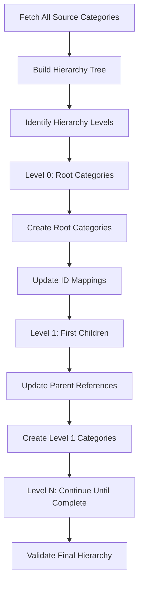

# Hierarchical Categories Migration Strategy

## 📋 Document Overview

This document provides a comprehensive strategy for migrating BigCommerce Categories while preserving their hierarchical parent-child relationships. Categories migration requires special treatment due to dependency chains within the same entity type.

**Purpose:** Technical specification for hierarchical categories migration  
**Audience:** Developers, architects, and technical stakeholders  
**Related Documents:** Migration-Architecture-and-Execution-Flow.md, ID-Mapping-and-Dependency-Resolution.md

---

## 🎯 **The Hierarchical Categories Challenge**

### **BigCommerce Category Structure**

Categories in BigCommerce form complex hierarchical trees:

```
Electronics (ID: 1, parent_id: null)
├── Computers (ID: 2, parent_id: 1)
│   ├── Laptops (ID: 3, parent_id: 2)
│   ├── Desktops (ID: 4, parent_id: 2)
│   └── Accessories (ID: 5, parent_id: 2)
│       ├── Keyboards (ID: 6, parent_id: 5)
│       └── Mice (ID: 7, parent_id: 5)
├── Mobile Phones (ID: 8, parent_id: 1)
│   ├── Android (ID: 9, parent_id: 8)
│   └── iPhone (ID: 10, parent_id: 8)
└── Gaming (ID: 11, parent_id: 1)
    ├── Consoles (ID: 12, parent_id: 11)
    └── Games (ID: 13, parent_id: 11)
```

### **Migration Challenges**

**1. ID Mapping Complexity**
- Source category IDs will change in destination store
- Parent-child references must be updated with new IDs
- Deep hierarchies require careful ordering

**2. Dependency Within Same Entity Type**
- Parent categories must exist before children can be created
- Traditional entity-level dependency resolution doesn't handle intra-entity dependencies

**3. BigCommerce API Constraints**
- Categories API requires valid parent_id references
- Cannot create orphaned categories with invalid parent_id
- Bulk operations don't handle hierarchy automatically

**4. Error Recovery Complexity**
- Failed parent migration blocks all descendants
- Retry logic must respect hierarchy levels
- Partial failures require sophisticated rollback

---

## 🏗️ **Efficient Hierarchical Migration Strategy**

### **Multi-Level Processing Approach**

**Strategy Overview:**
1. **Hierarchy Analysis**: Build complete category tree from source
2. **Level-by-Level Migration**: Process categories by depth level
3. **ID Mapping Tracking**: Maintain source→destination ID mappings
4. **Reference Updates**: Update parent_id references after each level

### **Processing Flow**



### **Integration with Existing Architecture**

**Categories remain Priority 1** in our dependency resolution, but with **special hierarchical processing**:

```csharp
// Enhanced Entity Configuration for Categories
["Categories"] = new EntityConfiguration
{
    Priority = 1,
    Dependencies = new List<string>(), // No external dependencies
    Dependants = new List<string> { "Products", "CategoryTrees" },
    OptionalDependancies = new List<string>(),
    
    // NEW: Hierarchical processing configuration
    IsHierarchical = true,
    HierarchicalProcessing = new HierarchicalConfiguration
    {
        ParentFieldName = "parent_id",
        RootValue = null,
        MaxDepth = 10,
        ProcessingStrategy = HierarchicalStrategy.LevelByLevel,
        EnableCircularReferenceDetection = true,
        OrphanHandling = OrphanStrategy.CreateAsRoot
    }
}
```

---

## 🔧 **Implementation Architecture**

### **1. Hierarchical Categories Orchestrator**

```csharp
[FunctionName("ProcessCategoriesHierarchical")]
public async Task ProcessCategoriesHierarchical(
    [OrchestrationTrigger] IDurableOrchestrationContext context)
{
    var request = context.GetInput<CategoriesHierarchicalRequest>();
    
    try
    {
        // Step 1: Analyze source hierarchy
        var hierarchyAnalysis = await context.CallActivityAsync<CategoryHierarchyAnalysis>(
            "AnalyzeCategoryHierarchy", request);
        
        // Step 2: Validate hierarchy integrity
        await context.CallActivityAsync("ValidateHierarchyIntegrity", hierarchyAnalysis);
        
        // Step 3: Process level by level
        var totalLevels = hierarchyAnalysis.MaxDepth;
        var idMappings = new Dictionary<int, int>(); // source_id -> destination_id
        
        for (int level = 0; level <= totalLevels; level++)
        {
            var levelCategories = hierarchyAnalysis.CategoriesByLevel[level];
            
            // Process current level
            var levelResult = await context.CallActivityAsync<CategoryLevelResult>(
                "ProcessCategoryLevel", new CategoryLevelRequest
                {
                    MigrationId = request.MigrationId,
                    Level = level,
                    Categories = levelCategories,
                    IdMappings = idMappings,
                    SourceStoreId = request.SourceStoreId,
                    DestinationStoreId = request.DestinationStoreId
                });
            
            // Update ID mappings with new categories
            foreach (var mapping in levelResult.NewIdMappings)
            {
                idMappings[mapping.Key] = mapping.Value;
            }
            
            // Log progress
            await context.CallActivityAsync("LogHierarchyProgress", new
            {
                MigrationId = request.MigrationId,
                Level = level,
                ProcessedCategories = levelResult.ProcessedCount,
                TotalLevels = totalLevels,
                CumulativeProgress = (double)(level + 1) / (totalLevels + 1) * 100
            });
        }
        
        // Step 4: Final validation
        await context.CallActivityAsync("ValidateFinalHierarchy", new
        {
            MigrationId = request.MigrationId,
            DestinationStoreId = request.DestinationStoreId,
            ExpectedStructure = hierarchyAnalysis,
            IdMappings = idMappings
        });
        
        return new CategoriesHierarchicalResult
        {
            Success = true,
            TotalCategories = hierarchyAnalysis.TotalCategories,
            ProcessedLevels = totalLevels + 1,
            IdMappings = idMappings,
            ProcessingTime = context.CurrentUtcDateTime - request.StartTime
        };
    }
    catch (Exception ex)
    {
        await context.CallActivityAsync("LogHierarchyError", new
        {
            MigrationId = request.MigrationId,
            Error = ex.Message,
            StackTrace = ex.StackTrace
        });
        
        throw;
    }
}
```

### **2. Hierarchy Analysis Activity**

```csharp
[FunctionName("AnalyzeCategoryHierarchy")]
public async Task<CategoryHierarchyAnalysis> AnalyzeCategoryHierarchy(
    [ActivityTrigger] CategoriesHierarchicalRequest request,
    ILogger log)
{
    // Fetch all categories from source store
    var allCategories = await _bigCommerceService.GetAllCategoriesAsync(request.SourceStoreId);
    
    log.LogInformation("Analyzing hierarchy for {CategoryCount} categories", allCategories.Count);
    
    // Build hierarchy tree
    var hierarchyTree = BuildHierarchyTree(allCategories);
    
    // Organize by levels
    var categoriesByLevel = new Dictionary<int, List<Category>>();
    OrganizeByLevels(hierarchyTree, categoriesByLevel, 0);
    
    // Detect issues
    var orphanedCategories = DetectOrphanedCategories(allCategories);
    var circularReferences = DetectCircularReferences(allCategories);
    var duplicateNames = DetectDuplicateNames(allCategories);
    
    return new CategoryHierarchyAnalysis
    {
        TotalCategories = allCategories.Count,
        MaxDepth = categoriesByLevel.Keys.Max(),
        CategoriesByLevel = categoriesByLevel,
        HierarchyTree = hierarchyTree,
        OrphanedCategories = orphanedCategories,
        CircularReferences = circularReferences,
        DuplicateNames = duplicateNames,
        HasIssues = orphanedCategories.Any() || circularReferences.Any()
    };
}

private List<CategoryTreeNode> BuildHierarchyTree(List<Category> categories)
{
    var categoryDict = categories.ToDictionary(c => c.Id, c => c);
    var rootNodes = new List<CategoryTreeNode>();
    var nodeDict = new Dictionary<int, CategoryTreeNode>();
    
    // Create nodes for all categories
    foreach (var category in categories)
    {
        nodeDict[category.Id] = new CategoryTreeNode
        {
            Category = category,
            Children = new List<CategoryTreeNode>(),
            Level = 0
        };
    }
    
    // Build parent-child relationships
    foreach (var category in categories)
    {
        var node = nodeDict[category.Id];
        
        if (category.ParentId == null)
        {
            // Root category
            rootNodes.Add(node);
        }
        else if (nodeDict.ContainsKey(category.ParentId.Value))
        {
            // Has valid parent
            var parentNode = nodeDict[category.ParentId.Value];
            parentNode.Children.Add(node);
            node.Parent = parentNode;
            node.Level = parentNode.Level + 1;
        }
        else
        {
            // Orphaned category - parent doesn't exist
            log.LogWarning("Orphaned category detected: {CategoryId} references non-existent parent {ParentId}", 
                category.Id, category.ParentId);
            rootNodes.Add(node); // Treat as root for migration
        }
    }
    
    return rootNodes;
}
```

### **3. Level-by-Level Processing Activity**

```csharp
[FunctionName("ProcessCategoryLevel")]
public async Task<CategoryLevelResult> ProcessCategoryLevel(
    [ActivityTrigger] CategoryLevelRequest request,
    ILogger log)
{
    log.LogInformation("Processing category level {Level} with {CategoryCount} categories", 
        request.Level, request.Categories.Count);
    
    var newIdMappings = new Dictionary<int, int>();
    var processedCount = 0;
    var failedCategories = new List<CategoryProcessingError>();
    
    // Process categories in parallel within the level
    var semaphore = new SemaphoreSlim(3); // Limit concurrency for API rate limiting
    var tasks = request.Categories.Select(async category =>
    {
        await semaphore.WaitAsync();
        try
        {
            return await ProcessSingleCategory(category, request, log);
        }
        finally
        {
            semaphore.Release();
        }
    });
    
    var results = await Task.WhenAll(tasks);
    
    foreach (var result in results)
    {
        if (result.Success)
        {
            newIdMappings[result.SourceId] = result.DestinationId;
            processedCount++;
        }
        else
        {
            failedCategories.Add(new CategoryProcessingError
            {
                SourceId = result.SourceId,
                CategoryName = result.CategoryName,
                ErrorMessage = result.ErrorMessage,
                Level = request.Level
            });
        }
    }
    
    log.LogInformation("Level {Level} completed: {ProcessedCount}/{TotalCount} categories processed successfully", 
        request.Level, processedCount, request.Categories.Count);
    
    return new CategoryLevelResult
    {
        Level = request.Level,
        ProcessedCount = processedCount,
        FailedCount = failedCategories.Count,
        NewIdMappings = newIdMappings,
        FailedCategories = failedCategories
    };
}

private async Task<CategoryProcessingResult> ProcessSingleCategory(
    Category sourceCategory, 
    CategoryLevelRequest request, 
    ILogger log)
{
    try
    {
        // Create destination category with updated parent_id
        var destinationCategory = MapCategoryForDestination(sourceCategory, request.IdMappings);
        
        // Create in destination store
        var createdCategory = await _bigCommerceService.CreateCategoryAsync(
            request.DestinationStoreId, destinationCategory);
        
        // Log successful creation
        await _migrationLogger.LogEntityProcessing(new EntityProcessingLog
        {
            MigrationId = request.MigrationId,
            EntityType = "Categories",
            EntityId = sourceCategory.Id.ToString(),
            EntityName = sourceCategory.Name,
            SourceId = sourceCategory.Id.ToString(),
            DestinationId = createdCategory.Id.ToString(),
            Status = "Completed",
            ProcessingTime = (DateTime.UtcNow - DateTime.UtcNow).TotalSeconds,
            Metadata = new
            {
                Level = request.Level,
                OriginalParentId = sourceCategory.ParentId,
                NewParentId = destinationCategory.ParentId,
                HasChildren = sourceCategory.HasChildren
            }
        });
        
        return new CategoryProcessingResult
        {
            Success = true,
            SourceId = sourceCategory.Id,
            DestinationId = createdCategory.Id,
            CategoryName = sourceCategory.Name
        };
    }
    catch (Exception ex)
    {
        log.LogError(ex, "Failed to process category {CategoryId}: {CategoryName}", 
            sourceCategory.Id, sourceCategory.Name);
        
        return new CategoryProcessingResult
        {
            Success = false,
            SourceId = sourceCategory.Id,
            CategoryName = sourceCategory.Name,
            ErrorMessage = ex.Message
        };
    }
}

private Category MapCategoryForDestination(Category sourceCategory, Dictionary<int, int> idMappings)
{
    var destinationCategory = new Category
    {
        Name = sourceCategory.Name,
        Description = sourceCategory.Description,
        SortOrder = sourceCategory.SortOrder,
        IsVisible = sourceCategory.IsVisible,
        PageTitle = sourceCategory.PageTitle,
        MetaKeywords = sourceCategory.MetaKeywords,
        MetaDescription = sourceCategory.MetaDescription,
        LayoutFile = sourceCategory.LayoutFile,
        ImageUrl = sourceCategory.ImageUrl
    };
    
    // Map parent_id using ID mappings
    if (sourceCategory.ParentId.HasValue && idMappings.ContainsKey(sourceCategory.ParentId.Value))
    {
        destinationCategory.ParentId = idMappings[sourceCategory.ParentId.Value];
    }
    else
    {
        destinationCategory.ParentId = null; // Root category
    }
    
    return destinationCategory;
}
```

---

## 📊 **Enhanced OpenSearch Schema for Hierarchical Tracking**

### **Categories Hierarchy Index (`migration-categories-hierarchy-{date}`)**

```json
{
  "mappings": {
    "properties": {
      "migrationId": { "type": "keyword" },
      "sourceStoreId": { "type": "keyword" },
      "destinationStoreId": { "type": "keyword" },
      "hierarchyAnalysis": {
        "properties": {
          "totalCategories": { "type": "long" },
          "maxDepth": { "type": "integer" },
          "rootCategoriesCount": { "type": "integer" },
          "hasIssues": { "type": "boolean" },
          "orphanedCategoriesCount": { "type": "integer" },
          "circularReferencesCount": { "type": "integer" }
        }
      },
      "levelProcessing": {
        "type": "nested",
        "properties": {
          "level": { "type": "integer" },
          "categoriesCount": { "type": "integer" },
          "processedCount": { "type": "integer" },
          "failedCount": { "type": "integer" },
          "startTime": { "type": "date" },
          "endTime": { "type": "date" },
          "processingTime": { "type": "float" },
          "status": { "type": "keyword" }
        }
      },
      "categoryMappings": {
        "type": "nested",
        "properties": {
          "sourceId": { "type": "integer" },
          "destinationId": { "type": "integer" },
          "categoryName": { "type": "text", "fields": { "keyword": { "type": "keyword" } } },
          "level": { "type": "integer" },
          "sourceParentId": { "type": "integer" },
          "destinationParentId": { "type": "integer" },
          "hasChildren": { "type": "boolean" },
          "childrenCount": { "type": "integer" },
          "processingTime": { "type": "float" },
          "status": { "type": "keyword" }
        }
      },
      "hierarchyValidation": {
        "properties": {
          "isValid": { "type": "boolean" },
          "validationTime": { "type": "date" },
          "missingParents": { "type": "integer" },
          "orphanedCategories": { "type": "integer" },
          "depthConsistency": { "type": "boolean" },
          "structureMatch": { "type": "boolean" }
        }
      },
      "performanceMetrics": {
        "properties": {
          "totalProcessingTime": { "type": "float" },
          "averageTimePerCategory": { "type": "float" },
          "averageTimePerLevel": { "type": "float" },
          "apiCallsTotal": { "type": "long" },
          "apiSuccessRate": { "type": "float" }
        }
      },
      "timestamp": { "type": "date" },
      "status": { "type": "keyword" },
      "tags": { "type": "keyword" }
    }
  }
}
```

**Sample Document:**
```json
{
  "migrationId": "550e8400-e29b-41d4-a716-446655440000",
  "sourceStoreId": "store-abc123",
  "destinationStoreId": "store-xyz789",
  "hierarchyAnalysis": {
    "totalCategories": 47,
    "maxDepth": 4,
    "rootCategoriesCount": 3,
    "hasIssues": false,
    "orphanedCategoriesCount": 0,
    "circularReferencesCount": 0
  },
  "levelProcessing": [
    {
      "level": 0,
      "categoriesCount": 3,
      "processedCount": 3,
      "failedCount": 0,
      "startTime": "2024-01-15T10:00:00Z",
      "endTime": "2024-01-15T10:02:00Z",
      "processingTime": 120,
      "status": "Completed"
    },
    {
      "level": 1,
      "categoriesCount": 8,
      "processedCount": 8,
      "failedCount": 0,
      "startTime": "2024-01-15T10:02:00Z",
      "endTime": "2024-01-15T10:05:00Z",
      "processingTime": 180,
      "status": "Completed"
    }
  ],
  "categoryMappings": [
    {
      "sourceId": 1,
      "destinationId": 101,
      "categoryName": "Electronics",
      "level": 0,
      "sourceParentId": null,
      "destinationParentId": null,
      "hasChildren": true,
      "childrenCount": 3,
      "processingTime": 2.5,
      "status": "Completed"
    },
    {
      "sourceId": 2,
      "destinationId": 102,
      "categoryName": "Computers",
      "level": 1,
      "sourceParentId": 1,
      "destinationParentId": 101,
      "hasChildren": true,
      "childrenCount": 3,
      "processingTime": 1.8,
      "status": "Completed"
    }
  ],
  "hierarchyValidation": {
    "isValid": true,
    "validationTime": "2024-01-15T10:15:00Z",
    "missingParents": 0,
    "orphanedCategories": 0,
    "depthConsistency": true,
    "structureMatch": true
  },
  "performanceMetrics": {
    "totalProcessingTime": 900,
    "averageTimePerCategory": 19.1,
    "averageTimePerLevel": 180,
    "apiCallsTotal": 94,
    "apiSuccessRate": 100.0
  },
  "timestamp": "2024-01-15T10:15:00Z",
  "status": "Completed",
  "tags": ["hierarchical", "categories", "level-by-level"]
}
```

---

## 🔍 **Integration with Main Migration Flow**

### **Enhanced Categories Processing in Main Orchestrator**

```csharp
[FunctionName("MigrationOrchestrator")]
public async Task MigrationOrchestrator(
    [OrchestrationTrigger] IDurableOrchestrationContext context)
{
    var request = context.GetInput<MigrationRequest>();
    var resolvedEntities = await context.CallActivityAsync<EntityResolutionResult>(
        "ResolveEntityDependencies", request);
    
    // Process by priority groups
    foreach (var priorityGroup in resolvedEntities.PriorityGroups)
    {
        var tasks = new List<Task>();
        
        foreach (var entityType in priorityGroup)
        {
            if (entityType == "Categories")
            {
                // Special hierarchical processing for categories
                tasks.Add(context.CallSubOrchestratorAsync(
                    "ProcessCategoriesHierarchical", 
                    new CategoriesHierarchicalRequest
                    {
                        MigrationId = request.MigrationId,
                        SourceStoreId = request.SourceStoreId,
                        DestinationStoreId = request.DestinationStoreId,
                        StartTime = context.CurrentUtcDateTime
                    }));
            }
            else
            {
                // Standard entity processing
                tasks.Add(context.CallSubOrchestratorAsync(
                    "ProcessEntityType", 
                    new EntityProcessingRequest
                    {
                        MigrationId = request.MigrationId,
                        EntityType = entityType,
                        SourceStoreId = request.SourceStoreId,
                        DestinationStoreId = request.DestinationStoreId
                    }));
            }
        }
        
        // Wait for all entities in this priority group to complete
        await Task.WhenAll(tasks);
    }
}
```

---

## 🎯 **Performance and Error Handling**

### **Performance Optimizations**

**1. Parallel Processing Within Levels**
```csharp
// Process categories at same level in parallel
var semaphore = new SemaphoreSlim(3); // Respect API rate limits
var tasks = levelCategories.Select(async category =>
{
    await semaphore.WaitAsync();
    try
    {
        return await ProcessSingleCategory(category, request, log);
    }
    finally
    {
        semaphore.Release();
    }
});
```

**2. Optimized BigCommerce API Calls**
```csharp
// Batch fetch all categories in single call
var allCategories = await _bigCommerceService.GetAllCategoriesAsync(
    storeId, includeFields: "id,name,parent_id,sort_order");

// Use minimal required fields for faster processing
```

**3. Smart Caching**
```csharp
// Cache category hierarchy analysis for retry scenarios
await _cacheService.SetAsync($"hierarchy-{migrationId}", hierarchyAnalysis, TimeSpan.FromHours(1));
```

### **Error Recovery Strategies**

**1. Level-Based Retry**
```csharp
// If level fails, retry only that level
if (levelResult.FailedCount > 0)
{
    await context.CallActivityAsync("RetryFailedCategoriesInLevel", new
    {
        MigrationId = request.MigrationId,
        Level = level,
        FailedCategories = levelResult.FailedCategories,
        IdMappings = idMappings
    });
}
```

**2. Orphan Recovery**
```csharp
// Handle orphaned categories gracefully
public enum OrphanStrategy
{
    CreateAsRoot,       // Make orphans root categories
    SkipOrphans,        // Skip categories with missing parents
    CreatePlaceholder,  // Create placeholder parent categories
    ManualReview        // Queue for manual resolution
}
```

---

## 📈 **Monitoring and Analytics**

### **Hierarchy-Specific Queries**

**1. Processing Performance by Level**
```json
GET migration-categories-hierarchy-*/_search
{
  "aggs": {
    "processing_by_level": {
      "nested": { "path": "levelProcessing" },
      "aggs": {
        "levels": {
          "terms": { "field": "levelProcessing.level" },
          "aggs": {
            "avg_processing_time": {
              "avg": { "field": "levelProcessing.processingTime" }
            },
            "success_rate": {
              "bucket_script": {
                "buckets_path": {
                  "processed": "processed_sum",
                  "total": "total_sum"
                },
                "script": "params.processed / params.total * 100"
              }
            }
          }
        }
      }
    }
  }
}
```

**2. Hierarchy Complexity Analysis**
```json
GET migration-categories-hierarchy-*/_search
{
  "aggs": {
    "complexity_distribution": {
      "histogram": {
        "field": "hierarchyAnalysis.maxDepth",
        "interval": 1
      }
    },
    "categories_per_store": {
      "terms": { "field": "hierarchyAnalysis.totalCategories" }
    }
  }
}
```

---

## 🎯 **Summary**

### **✅ Efficient Hierarchical Categories Migration**

**Level-by-Level Strategy:**
1. **Hierarchy Analysis**: Complete tree structure analysis before migration
2. **Sequential Level Processing**: Parents always created before children
3. **Parallel Within Levels**: Categories at same level processed concurrently
4. **ID Mapping Management**: Comprehensive source→destination tracking
5. **Validation**: Multi-stage validation ensures hierarchy integrity

**Integration with Existing Architecture:**
- **Priority 1 Processing**: Categories remain foundational entities
- **Special Orchestrator**: Dedicated hierarchical sub-orchestrator
- **Standard Error Handling**: Reuses existing retry and monitoring systems
- **Enhanced Logging**: Detailed hierarchy-specific tracking in OpenSearch

**Performance Benefits:**
- **Parallel Processing**: Within-level concurrency respects API limits
- **Optimized API Calls**: Batch fetching and minimal field selection
- **Smart Caching**: Hierarchy analysis cached for retry scenarios
- **Progressive Validation**: Early error detection prevents cascade failures

**Error Recovery:**
- **Level-Based Retry**: Failed levels can be retried independently
- **Orphan Handling**: Multiple strategies for missing parent scenarios
- **Rollback Capability**: Level-by-level rollback for critical failures

This approach ensures **perfect hierarchy preservation** while maintaining high performance and reliability for BigCommerce categories migration within your existing serverless architecture.

---

**Document Version:** 1.0  
**Created:** January 2025  
**Strategy:** Level-by-Level Hierarchical Processing 