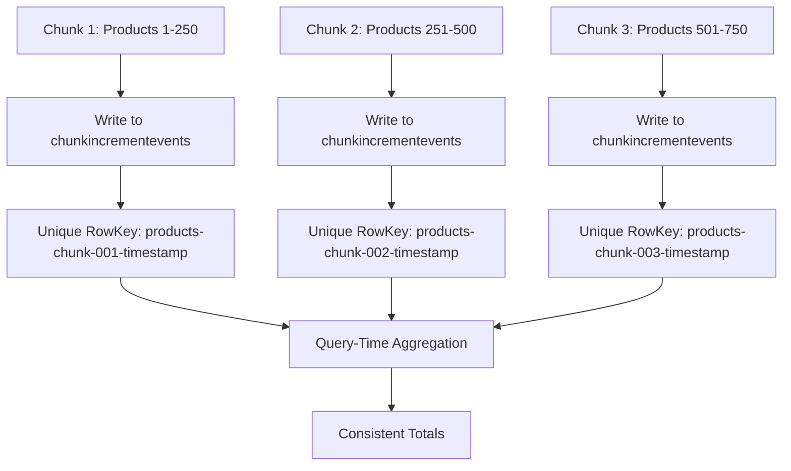

# 🔒 Incremental Progress - Concurrency Strategy Design

## 🎯 Document Overview

This document defines the concurrency strategy for thread-safe incremental progress updates, ensuring data integrity and performance under parallel processing conditions.

**Task**: 1.3 Concurrency Strategy Design  
**Design Date**: 2025-01-17  
**Strategy Version**: 1.0  
**Target**: Safe, performant incremental updates without data corruption  

---

## 🚨 **CONCURRENCY CHALLENGES**

### **Current System Parallelism:**
```
Migration Processing:
├── EntityMigrationDurableOrchestrator (1 instance per entity type)
├── EnhancedParallelProcessor (up to 32 concurrent batches)
├── ProcessEntityChunkActivity (up to 500 entities per chunk)
└── Multiple chunks processing simultaneously

Concurrency Scenarios:
1. Multiple chunks of same entity type processing in parallel
2. Multiple entity types processing simultaneously  
3. Multiple migrations running concurrently
4. Cancellation events during active processing
5. System restarts/crashes during processing
```

### **Potential Race Conditions:**
1. **Chunk Write Conflicts**: Multiple chunks trying to update same aggregated totals
2. **Read-While-Write**: UI reading progress while chunks are being written
3. **Cancellation Timing**: Cancellation occurring mid-chunk-write
4. **Aggregation Inconsistency**: Partial reads during aggregation calculations
5. **Storage Conflicts**: Azure Table Storage optimistic concurrency violations

---

## 🎯 **CONCURRENCY STRATEGY: "INDEPENDENT CHUNK WRITES"**

### **Core Principle: Eliminate Contention**
Instead of trying to coordinate concurrent updates, we design the system so that **each chunk write is completely independent** and **aggregation is conflict-free**.



### **Strategy Benefits:**
- ✅ **Zero Write Conflicts**: Each chunk writes to unique RowKey
- ✅ **No Locking Required**: Independent writes eliminate need for distributed locks
- ✅ **Crash Resilient**: Partial writes don't corrupt other chunks
- ✅ **Cancellation Safe**: In-progress chunks complete independently
- ✅ **Scalable**: Performance improves with parallelism

---

## 🔧 **IMPLEMENTATION STRATEGY**

### **1. Independent Chunk Writes**

#### **Unique RowKey Generation:**
```csharp
public static class ChunkRowKeyGenerator
{
    private static readonly object _lock = new object();
    private static int _sequenceCounter = 0;
    
    public static string GenerateUniqueRowKey(string entityType, int chunkNumber)
    {
        lock (_lock)
        {
            _sequenceCounter++;
            var timestamp = DateTime.UtcNow.ToString("yyyyMMddHHmmssfff");
            var sequence = _sequenceCounter.ToString("D6");
            
            // Format: products-chunk-001-20250117102345123-000001
            return $"{entityType}-chunk-{chunkNumber:D3}-{timestamp}-{sequence}";
        }
    }
}
```

#### **Conflict-Free Write Pattern:**
```csharp
public async Task WriteChunkIncrementAsync(ChunkIncrementEvent incrementEvent)
{
    try
    {
        // Generate unique RowKey - no conflicts possible
        incrementEvent.RowKey = ChunkRowKeyGenerator.GenerateUniqueRowKey(
            incrementEvent.EntityType, 
            incrementEvent.ChunkNumber);
        
        var tableClient = await GetTableClientAsync();
        
        // AddEntityAsync - creates new entity, fails only if RowKey exists (impossible with our generation)
        await tableClient.AddEntityAsync(incrementEvent);
        
        _logger.LogInformation("✅ Chunk increment written: {RowKey}", incrementEvent.RowKey);
    }
    catch (RequestFailedException ex) when (ex.Status == 409)
    {
        // This should never happen with unique RowKey generation
        _logger.LogError("🚨 UNEXPECTED: Duplicate RowKey detected: {RowKey}", incrementEvent.RowKey);
        
        // Fallback: Add timestamp suffix and retry once
        incrementEvent.RowKey += $"-retry-{DateTime.UtcNow.Ticks}";
        await tableClient.AddEntityAsync(incrementEvent);
    }
    catch (Exception ex)
    {
        _logger.LogError(ex, "❌ Failed to write chunk increment: {MigrationId}-{EntityType}-{ChunkNumber}", 
            incrementEvent.MigrationId, incrementEvent.EntityType, incrementEvent.ChunkNumber);
        
        // Don't throw - increment failures should not break migration
        // End-of-migration update provides fallback
    }
}
```

### **2. Fire-and-Forget Pattern**

#### **Non-Blocking Integration:**
```csharp
// In ProcessEntityChunkActivity.cs
public async Task<BatchProcessingResult> ProcessEntityChunkAsync(ProcessEntityChunkRequest request)
{
    // ... existing chunk processing logic ...
    
    var result = new BatchProcessingResult
    {
        SuccessfulEntities = successCount,
        FailedEntities = failedCount,
        SkippedEntities = skippedCount,
        CancelledEntities = cancelledCount
    };
    
    // 🆕 ADD: Fire-and-forget incremental update (non-blocking)
    _ = Task.Run(async () => 
    {
        try
        {
            await WriteChunkIncrementEventAsync(request, result);
        }
        catch (Exception ex)
        {
            // Log but don't fail the chunk processing
            _logger.LogWarning(ex, "Incremental progress update failed for chunk {ChunkNumber} - migration continues", 
                request.ChunkNumber);
        }
    });
    
    // Return immediately - don't wait for increment write
    return result;
}

private async Task WriteChunkIncrementEventAsync(ProcessEntityChunkRequest request, BatchProcessingResult result)
{
    var incrementEvent = new ChunkIncrementEvent
    {
        PartitionKey = request.MigrationId,
        // RowKey will be generated in WriteChunkIncrementAsync
        MigrationId = request.MigrationId,
        EntityType = request.EntityType,
        ChunkNumber = request.ChunkNumber,
        ChunkStartIndex = request.StartIndex,
        ChunkSize = request.ChunkSize,
        SuccessfulEntities = result.SuccessfulEntities,
        FailedEntities = result.FailedEntities,
        SkippedEntities = result.SkippedEntities,
        CancelledEntities = result.CancelledEntities,
        ProcessingStartTime = result.StartTime ?? DateTime.UtcNow,
        ProcessingEndTime = DateTime.UtcNow,
        ProcessingTimeMs = (long)result.ProcessingTime.TotalMilliseconds,
        SourceStore = request.SourceStore,
        DestinationStore = request.DestinationStore,
        HasErrors = result.Errors.Any(),
        ErrorSummary = result.Errors.Any() ? JsonSerializer.Serialize(result.Errors.Take(5)) : null,
        CreatedAt = DateTime.UtcNow,
        CreatedBy = "ProcessEntityChunkActivity"
    };
    
    await _incrementEventsService.WriteChunkIncrementAsync(incrementEvent);
}
```

### **3. Query-Time Aggregation (Conflict-Free)**

#### **Consistent Read Pattern:**
```csharp
public async Task<Dictionary<string, EntityProgressSummary>> GetAggregatedProgressAsync(string migrationId)
{
    var tableClient = await GetTableClientAsync();
    
    // Single partition query - strongly consistent in Azure Table Storage
    var query = tableClient.QueryAsync<ChunkIncrementEvent>(
        filter: $"PartitionKey eq '{migrationId}'",
        select: new[] { 
            "EntityType", "SuccessfulEntities", "FailedEntities", 
            "SkippedEntities", "CancelledEntities", "ProcessingEndTime" 
        });
    
    var entityGroups = new Dictionary<string, List<ChunkIncrementEvent>>();
    
    // Group chunks by entity type
    await foreach (var chunk in query)
    {
        if (!entityGroups.ContainsKey(chunk.EntityType))
            entityGroups[chunk.EntityType] = new List<ChunkIncrementEvent>();
            
        entityGroups[chunk.EntityType].Add(chunk);
    }
    
    // Aggregate each entity type independently
    var result = new Dictionary<string, EntityProgressSummary>();
    
    foreach (var (entityType, chunks) in entityGroups)
    {
        result[entityType] = new EntityProgressSummary
        {
            EntityType = entityType,
            TotalChunks = chunks.Count,
            TotalSuccessful = chunks.Sum(c => c.SuccessfulEntities),
            TotalFailed = chunks.Sum(c => c.FailedEntities),
            TotalSkipped = chunks.Sum(c => c.SkippedEntities),
            TotalCancelled = chunks.Sum(c => c.CancelledEntities),
            LastUpdateTime = chunks.Max(c => c.ProcessingEndTime)
        };
    }
    
    return result;
}
```

---

## 🛡️ **ERROR HANDLING & RESILIENCE**

### **1. Write Failure Handling**

#### **Graceful Degradation:**
```csharp
public class IncrementEventsService : IIncrementEventsService
{
    private readonly ILogger<IncrementEventsService> _logger;
    private readonly TableServiceClient _tableServiceClient;
    private readonly ICircuitBreaker _circuitBreaker; // Optional: Circuit breaker for storage failures
    
    public async Task WriteChunkIncrementAsync(ChunkIncrementEvent incrementEvent)
    {
        try
        {
            // Primary write attempt
            await _circuitBreaker.ExecuteAsync(async () =>
            {
                var tableClient = await GetTableClientAsync();
                await tableClient.AddEntityAsync(incrementEvent);
            });
            
            _logger.LogInformation("✅ Chunk increment written successfully");
        }
        catch (CircuitBreakerOpenException)
        {
            _logger.LogWarning("⚡ Circuit breaker open - skipping increment write (fallback to end-of-migration update)");
            // Don't throw - let migration continue
        }
        catch (RequestFailedException ex) when (ex.Status >= 500)
        {
            _logger.LogWarning("⚠️ Azure Table Storage temporary failure - skipping increment write: {Error}", ex.Message);
            // Don't throw - temporary Azure issues shouldn't break migration
        }
        catch (Exception ex)
        {
            _logger.LogError(ex, "❌ Unexpected error writing chunk increment - migration continues");
            // Don't throw - unexpected errors shouldn't break migration
        }
    }
}
```

### **2. Read Failure Handling**

#### **Fallback Strategy:**
```csharp
public async Task<MigrationProgress> GetMigrationProgressAsync(string migrationId)
{
    try
    {
        // Primary: Try incremental progress from ChunkIncrementEvents
        var incrementalProgress = await _incrementEventsService.GetAggregatedProgressAsync(migrationId);
        
        if (incrementalProgress.Any())
        {
            _logger.LogDebug("📊 Using incremental progress data for {MigrationId}", migrationId);
            return ConvertToMigrationProgress(incrementalProgress);
        }
    }
    catch (Exception ex)
    {
        _logger.LogWarning(ex, "⚠️ Failed to get incremental progress - falling back to traditional method");
    }
    
    // Fallback: Use existing entityprogress table (works exactly as before)
    _logger.LogDebug("📊 Using traditional progress data for {MigrationId}", migrationId);
    return await GetTraditionalMigrationProgressAsync(migrationId);
}
```

### **3. Cancellation Handling**

#### **Safe Cancellation Pattern:**
```csharp
public async Task<BatchProcessingResult> ProcessEntityChunkAsync(ProcessEntityChunkRequest request)
{
    var cancellationToken = request.CancellationToken;
    
    try
    {
        // Check cancellation before processing
        cancellationToken.ThrowIfCancellationRequested();
        
        // ... chunk processing logic ...
        var result = ProcessChunkEntities(entities, cancellationToken);
        
        // Check cancellation before increment write
        if (!cancellationToken.IsCancellationRequested)
        {
            // Fire-and-forget increment write (cancellation-safe)
            _ = Task.Run(async () => 
            {
                try
                {
                    await WriteChunkIncrementEventAsync(request, result);
                }
                catch (Exception ex)
                {
                    _logger.LogWarning(ex, "Increment write failed during cancellation - expected behavior");
                }
            }, CancellationToken.None); // Use None to allow write to complete even if cancelled
        }
        
        return result;
    }
    catch (OperationCanceledException)
    {
        _logger.LogInformation("🚫 Chunk processing cancelled - returning partial results");
        
        // Return partial results if any work was done
        return new BatchProcessingResult
        {
            SuccessfulEntities = partialSuccessCount,
            FailedEntities = partialFailedCount,
            // ... other partial counts
        };
    }
}
```

---

## 🔄 **RETRY STRATEGIES**

### **1. Exponential Backoff for Transient Failures**

```csharp
public class RetryableIncrementEventsService : IIncrementEventsService
{
    private static readonly TimeSpan[] RetryDelays = 
    {
        TimeSpan.FromMilliseconds(100),
        TimeSpan.FromMilliseconds(500),
        TimeSpan.FromSeconds(2)
    };
    
    public async Task WriteChunkIncrementAsync(ChunkIncrementEvent incrementEvent)
    {
        Exception lastException = null;
        
        for (int attempt = 0; attempt <= RetryDelays.Length; attempt++)
        {
            try
            {
                if (attempt > 0)
                {
                    _logger.LogInformation("🔄 Retry attempt {Attempt} for chunk increment write", attempt);
                    await Task.Delay(RetryDelays[attempt - 1]);
                }
                
                var tableClient = await GetTableClientAsync();
                await tableClient.AddEntityAsync(incrementEvent);
                
                if (attempt > 0)
                {
                    _logger.LogInformation("✅ Chunk increment write succeeded on retry {Attempt}", attempt);
                }
                
                return; // Success
            }
            catch (RequestFailedException ex) when (IsTransientError(ex))
            {
                lastException = ex;
                _logger.LogWarning("⚠️ Transient error on attempt {Attempt}: {Error}", attempt + 1, ex.Message);
                continue;
            }
            catch (Exception ex)
            {
                _logger.LogError(ex, "❌ Non-transient error writing chunk increment - giving up");
                return; // Don't retry non-transient errors
            }
        }
        
        _logger.LogWarning("⚠️ All retry attempts exhausted for chunk increment write: {Error}", 
            lastException?.Message);
        // Don't throw - increment write failures shouldn't break migration
    }
    
    private static bool IsTransientError(RequestFailedException ex)
    {
        return ex.Status == 429 ||  // Throttling
               ex.Status == 500 ||  // Internal Server Error
               ex.Status == 502 ||  // Bad Gateway
               ex.Status == 503 ||  // Service Unavailable
               ex.Status == 504;    // Gateway Timeout
    }
}
```

### **2. Circuit Breaker Pattern**

```csharp
public class CircuitBreakerIncrementEventsService : IIncrementEventsService
{
    private readonly ICircuitBreaker _circuitBreaker;
    
    public CircuitBreakerIncrementEventsService(ICircuitBreaker circuitBreaker)
    {
        _circuitBreaker = circuitBreaker;
    }
    
    public async Task WriteChunkIncrementAsync(ChunkIncrementEvent incrementEvent)
    {
        try
        {
            await _circuitBreaker.ExecuteAsync(async () =>
            {
                var tableClient = await GetTableClientAsync();
                await tableClient.AddEntityAsync(incrementEvent);
            });
        }
        catch (CircuitBreakerOpenException)
        {
            _logger.LogWarning("⚡ Circuit breaker open - increment writes temporarily disabled");
            // Don't throw - let migration continue with end-of-migration fallback
        }
    }
}

// Circuit breaker configuration
services.AddCircuitBreaker("IncrementEvents", options =>
{
    options.FailureThreshold = 5;           // Open after 5 consecutive failures
    options.RecoveryTimeout = TimeSpan.FromMinutes(2); // Stay open for 2 minutes
    options.SamplingDuration = TimeSpan.FromMinutes(1); // Sample period
});
```

---

## 📊 **PERFORMANCE OPTIMIZATION**

### **1. Batched Writes (Future Enhancement)**

```csharp
public class BatchedIncrementEventsService : IIncrementEventsService
{
    private readonly ConcurrentQueue<ChunkIncrementEvent> _writeQueue = new();
    private readonly Timer _batchTimer;
    private readonly SemaphoreSlim _batchSemaphore = new(1, 1);
    
    public BatchedIncrementEventsService()
    {
        // Batch writes every 5 seconds or 100 items, whichever comes first
        _batchTimer = new Timer(ProcessBatchAsync, null, TimeSpan.FromSeconds(5), TimeSpan.FromSeconds(5));
    }
    
    public async Task WriteChunkIncrementAsync(ChunkIncrementEvent incrementEvent)
    {
        _writeQueue.Enqueue(incrementEvent);
        
        // Trigger immediate batch if queue is large
        if (_writeQueue.Count >= 100)
        {
            _ = Task.Run(ProcessBatchAsync);
        }
    }
    
    private async void ProcessBatchAsync(object state = null)
    {
        if (!await _batchSemaphore.WaitAsync(100))
            return; // Another batch is already processing
            
        try
        {
            var batch = new List<ChunkIncrementEvent>();
            
            // Dequeue up to 100 items
            while (batch.Count < 100 && _writeQueue.TryDequeue(out var item))
            {
                batch.Add(item);
            }
            
            if (batch.Any())
            {
                await WriteBatchAsync(batch);
            }
        }
        finally
        {
            _batchSemaphore.Release();
        }
    }
    
    private async Task WriteBatchAsync(List<ChunkIncrementEvent> batch)
    {
        try
        {
            var tableClient = await GetTableClientAsync();
            
            // Use batch operations for better performance
            var batchOperation = new List<TableTransactionAction>();
            
            foreach (var item in batch)
            {
                item.RowKey = ChunkRowKeyGenerator.GenerateUniqueRowKey(item.EntityType, item.ChunkNumber);
                batchOperation.Add(new TableTransactionAction(TableTransactionActionType.Add, item));
            }
            
            await tableClient.SubmitTransactionAsync(batchOperation);
            
            _logger.LogInformation("✅ Batch wrote {Count} chunk increments", batch.Count);
        }
        catch (Exception ex)
        {
            _logger.LogError(ex, "❌ Failed to write batch of {Count} chunk increments", batch.Count);
            
            // Fallback: Try individual writes
            foreach (var item in batch)
            {
                try
                {
                    await WriteIndividualAsync(item);
                }
                catch
                {
                    // Individual write failed - log and continue
                    _logger.LogWarning("❌ Individual fallback write failed for chunk {ChunkNumber}", item.ChunkNumber);
                }
            }
        }
    }
}
```

### **2. Optimized Aggregation Queries**

```csharp
public async Task<EntityProgressSummary> GetEntityProgressSummaryAsync(string migrationId, string entityType)
{
    var tableClient = await GetTableClientAsync();
    
    // Optimized query with select projection and filtering
    var query = tableClient.QueryAsync<ChunkIncrementEvent>(
        filter: $"PartitionKey eq '{migrationId}' and EntityType eq '{entityType}'",
        select: new[] { "SuccessfulEntities", "FailedEntities", "SkippedEntities", "CancelledEntities" });
    
    var summary = new EntityProgressSummary { EntityType = entityType };
    
    await foreach (var chunk in query)
    {
        summary.TotalChunks++;
        summary.TotalSuccessful += chunk.SuccessfulEntities;
        summary.TotalFailed += chunk.FailedEntities;
        summary.TotalSkipped += chunk.SkippedEntities;
        summary.TotalCancelled += chunk.CancelledEntities;
    }
    
    return summary;
}
```

---

## 🧪 **TESTING STRATEGY**

### **1. Concurrency Tests**

```csharp
[Test]
public async Task ConcurrentChunkWrites_NoConflicts()
{
    // Arrange: 50 concurrent chunk writes for same migration
    var migrationId = "test-migration-concurrent";
    var tasks = new List<Task>();
    
    for (int i = 1; i <= 50; i++)
    {
        var chunkNumber = i;
        tasks.Add(Task.Run(async () =>
        {
            var incrementEvent = CreateTestChunkEvent(migrationId, "products", chunkNumber);
            await _incrementEventsService.WriteChunkIncrementAsync(incrementEvent);
        }));
    }
    
    // Act: Execute all writes concurrently
    await Task.WhenAll(tasks);
    
    // Assert: All writes succeeded, no conflicts
    var allChunks = await _incrementEventsService.GetChunkIncrementsAsync(migrationId);
    Assert.That(allChunks.Count, Is.EqualTo(50));
    
    // Verify unique RowKeys
    var rowKeys = allChunks.Select(c => c.RowKey).ToHashSet();
    Assert.That(rowKeys.Count, Is.EqualTo(50)); // All unique
}

[Test]
public async Task ConcurrentAggregation_ConsistentResults()
{
    // Arrange: Write chunks while reading aggregations concurrently
    var migrationId = "test-migration-read-write";
    var writeTask = Task.Run(async () =>
    {
        for (int i = 1; i <= 20; i++)
        {
            var incrementEvent = CreateTestChunkEvent(migrationId, "products", i, successCount: 100);
            await _incrementEventsService.WriteChunkIncrementAsync(incrementEvent);
            await Task.Delay(50); // Small delay between writes
        }
    });
    
    var readTasks = Enumerable.Range(1, 10).Select(i => Task.Run(async () =>
    {
        var results = new List<int>();
        for (int j = 0; j < 10; j++)
        {
            var progress = await _incrementEventsService.GetAggregatedProgressAsync(migrationId);
            if (progress.ContainsKey("products"))
            {
                results.Add(progress["products"].TotalSuccessful);
            }
            await Task.Delay(100);
        }
        return results;
    })).ToArray();
    
    // Act: Execute writes and reads concurrently
    await Task.WhenAll(writeTask);
    var readResults = await Task.WhenAll(readTasks);
    
    // Assert: All reads returned valid, increasing values (no corruption)
    foreach (var results in readResults)
    {
        for (int i = 1; i < results.Count; i++)
        {
            Assert.That(results[i], Is.GreaterThanOrEqualTo(results[i - 1]), 
                "Progress values should be monotonically increasing");
        }
    }
}
```

### **2. Failure Scenario Tests**

```csharp
[Test]
public async Task WriteFailure_DoesNotBreakMigration()
{
    // Arrange: Mock storage service to fail
    var mockTableClient = new Mock<TableClient>();
    mockTableClient.Setup(x => x.AddEntityAsync(It.IsAny<ChunkIncrementEvent>(), It.IsAny<CancellationToken>()))
               .ThrowsAsync(new RequestFailedException(500, "Internal Server Error"));
    
    // Act: Attempt to write increment (should not throw)
    var incrementEvent = CreateTestChunkEvent("test-migration", "products", 1);
    
    Assert.DoesNotThrowAsync(async () =>
    {
        await _incrementEventsService.WriteChunkIncrementAsync(incrementEvent);
    });
    
    // Assert: Error was logged but no exception thrown
    _mockLogger.Verify(
        x => x.Log(LogLevel.Error, It.IsAny<EventId>(), It.IsAny<It.IsAnyType>(), 
                   It.IsAny<Exception>(), It.IsAny<Func<It.IsAnyType, Exception, string>>()),
        Times.Once);
}

[Test]
public async Task CancellationDuringWrite_HandledGracefully()
{
    // Arrange: Cancellation token that will be cancelled mid-operation
    using var cts = new CancellationTokenSource();
    
    // Act: Start write operation and cancel it
    var writeTask = Task.Run(async () =>
    {
        var incrementEvent = CreateTestChunkEvent("test-migration", "products", 1);
        await _incrementEventsService.WriteChunkIncrementAsync(incrementEvent);
    });
    
    await Task.Delay(10); // Let write start
    cts.Cancel();
    
    // Assert: Write completes without throwing (fire-and-forget pattern)
    Assert.DoesNotThrowAsync(async () => await writeTask);
}
```

---

## 📋 **DEPLOYMENT CHECKLIST**

### **Pre-Deployment Validation**
- [ ] **Load Testing**: Verify performance under concurrent chunk writes
- [ ] **Failure Testing**: Confirm graceful degradation when storage fails
- [ ] **Cancellation Testing**: Verify safe behavior during migration cancellation
- [ ] **Data Integrity Testing**: Confirm aggregation accuracy under all conditions

### **Monitoring Setup**
- [ ] **Write Success Rate**: Monitor percentage of successful increment writes
- [ ] **Aggregation Performance**: Track query response times
- [ ] **Error Rates**: Alert on increment write failures
- [ ] **Storage Metrics**: Monitor Azure Table Storage throttling

### **Rollback Plan**
- [ ] **Feature Flag**: Ability to disable incremental writes instantly
- [ ] **Fallback Logic**: Existing end-of-migration updates continue working
- [ ] **Data Cleanup**: Scripts to remove increment events if needed

---

## 🎯 **SUCCESS CRITERIA**

### **Concurrency Requirements**
- ✅ **Zero Write Conflicts**: No RowKey collisions under maximum concurrency
- ✅ **Read Consistency**: Aggregation queries return consistent results during writes
- ✅ **Cancellation Safety**: Partial writes don't corrupt migration state
- ✅ **Performance**: <5% degradation in migration speed under concurrent load

### **Reliability Requirements**
- ✅ **Graceful Failure**: Increment write failures don't break migrations
- ✅ **Data Integrity**: Aggregated totals always match sum of individual chunks
- ✅ **Resilience**: System recovers automatically from transient storage failures

---

## 🎉 **EXPECTED OUTCOME**

### **Concurrency Behavior:**
```
50 chunks processing in parallel for same migration:
├── Chunk 1 writes to: products-chunk-001-20250117102345123-000001
├── Chunk 2 writes to: products-chunk-002-20250117102345124-000002
├── Chunk 3 writes to: products-chunk-003-20250117102345125-000003
├── ... (all unique RowKeys, no conflicts)
└── Aggregation query: SUM(all chunks) = accurate total

Result: Zero conflicts, accurate totals, real-time updates
```

### **Failure Behavior:**
```
Chunk increment write fails:
├── Error logged: "Failed to write chunk increment"
├── Migration continues: Normal processing unaffected
├── Fallback available: End-of-migration update still works
└── User experience: Slight delay in real-time updates, but migration succeeds

Result: Graceful degradation, no data loss, migration completes successfully
```

---

*Concurrency strategy design completed on 2025-01-17*  
*Ready for Task 2.1: Increment Events Infrastructure implementation*