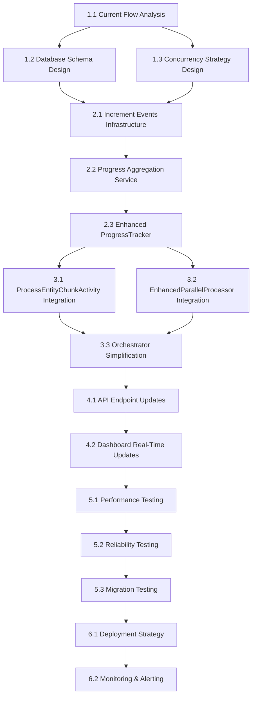

# 📋 Incremental Progress Update Implementation Plan

## 🎯 Project Overview
**Objective**: Replace end-of-process progress tracking with real-time incremental updates to prevent data loss during cancellations and provide accurate real-time progress.

**Problem**: Currently, when migrations are cancelled mid-process, all successful work completed before cancellation is lost because progress is only tracked in-memory and written to database at the end.

**Solution**: Implement event-driven incremental progress updates that write to database immediately as chunks complete.

---

## 📊 Task Breakdown

### 🔍 Phase 1: Analysis & Design
**Duration**: 1-2 hours | **Priority**: High | **Dependencies**: None

#### Task 1.1: Current Flow Analysis
- **Objective**: Map existing progress update flow
- **Deliverables**: 
  - Flow diagram of current progress tracking
  - Identification of all progress update points
  - Documentation of current database schema
- **Sub-tasks**:
  - [ ] Trace progress flow from ProcessEntityChunkActivity to database
  - [ ] Document UpdateEntityProgressActivity current behavior
  - [ ] Map ProgressTracker methods and their call sites
  - [ ] Identify all tables involved in progress tracking
  - [ ] Document current concurrency handling (if any)
- **Acceptance Criteria**: Clear understanding of current system documented

#### Task 1.2: Database Schema Design
- **Objective**: Design increment events table and modify existing schema
- **Deliverables**: 
  - New table schema for ChunkIncrementEvents
  - Modified schema for existing progress tables
  - Migration scripts
- **Sub-tasks**:
  - [ ] Design ChunkIncrementEvents table schema
  - [ ] Plan modifications to existing entityprogress table
  - [ ] Design aggregation strategy (real-time vs periodic)
  - [ ] Create database migration scripts
  - [ ] Plan indexing strategy for performance
- **Acceptance Criteria**: Complete schema design with performance considerations

#### Task 1.3: Concurrency Strategy Design
- **Objective**: Define approach for handling concurrent updates
- **Deliverables**:
  - Concurrency strategy document
  - Lock acquisition strategy
  - Conflict resolution approach
- **Sub-tasks**:
  - [ ] Choose between atomic operations, event sourcing, or locking
  - [ ] Design distributed lock strategy if needed
  - [ ] Plan retry logic for failed updates
  - [ ] Design conflict resolution mechanisms
  - [ ] Plan performance monitoring approach
- **Acceptance Criteria**: Robust concurrency strategy defined

---

### 🏗️ Phase 2: Core Implementation
**Duration**: 8-12 hours | **Priority**: High | **Dependencies**: Phase 1

#### Task 2.1: Increment Events Infrastructure
- **Objective**: Create the event-driven infrastructure for progress tracking
- **Deliverables**:
  - ChunkIncrementEvent model classes
  - IncrementEventsService for writing events
  - Database table creation
- **Sub-tasks**:
  - [ ] Create ChunkIncrementEvent model class
  - [ ] Implement IncrementEventsService with Azure Table Storage
  - [ ] Create database table creation scripts
  - [ ] Add dependency injection configuration
  - [ ] Implement basic event writing functionality
  - [ ] Add error handling and logging
  - [ ] Create unit tests for event writing
- **Acceptance Criteria**: Events can be written to database without conflicts

#### Task 2.2: Progress Aggregation Service
- **Objective**: Create service to aggregate increment events into final progress
- **Deliverables**:
  - ProgressAggregationService
  - Background aggregation process
  - Conflict handling mechanisms
- **Sub-tasks**:
  - [ ] Implement ProgressAggregationService
  - [ ] Create background aggregation timer/trigger
  - [ ] Implement distributed locking for aggregation
  - [ ] Add retry logic with exponential backoff
  - [ ] Implement aggregation algorithm
  - [ ] Add monitoring and alerting for aggregation failures
  - [ ] Create unit and integration tests
- **Acceptance Criteria**: Aggregation works reliably under concurrent load

#### Task 2.3: Enhanced ProgressTracker
- **Objective**: Extend ProgressTracker to support incremental updates
- **Deliverables**:
  - New methods in IProgressTracker interface
  - Implementation in ProgressTracker class
  - Backward compatibility maintained
- **Sub-tasks**:
  - [ ] Add IncrementProgressAsync method to IProgressTracker
  - [ ] Implement IncrementProgressAsync in ProgressTracker
  - [ ] Add GetLatestAggregatedProgressAsync method
  - [ ] Modify existing methods to work with new system
  - [ ] Ensure backward compatibility for existing callers
  - [ ] Add comprehensive logging
  - [ ] Create unit tests for new methods
- **Acceptance Criteria**: ProgressTracker supports both old and new approaches

---

### 🔧 Phase 3: Integration Points
**Duration**: 6-8 hours | **Priority**: High | **Dependencies**: Phase 2

#### Task 3.1: ProcessEntityChunkActivity Integration
- **Objective**: Add real-time progress updates after each chunk completion
- **Deliverables**:
  - Modified ProcessEntityChunkActivity with incremental updates
  - Error handling for update failures
  - Performance monitoring
- **Sub-tasks**:
  - [ ] Add increment update call after successful chunk processing
  - [ ] Handle update failures gracefully (don't fail migration)
  - [ ] Add performance monitoring for update operations
  - [ ] Implement async fire-and-forget updates to avoid blocking
  - [ ] Add detailed logging for troubleshooting
  - [ ] Create integration tests
  - [ ] Ensure cancellation still works properly
- **Acceptance Criteria**: Chunks update progress in real-time without affecting performance

#### Task 3.2: EnhancedParallelProcessor Integration
- **Objective**: Add batch-level progress updates for finer granularity
- **Deliverables**:
  - Modified EnhancedParallelProcessor with incremental updates
  - Batch-level progress tracking
  - Performance optimization
- **Sub-tasks**:
  - [ ] Add batch-level increment updates
  - [ ] Implement batching of small updates for performance
  - [ ] Add circuit breaker for update failures
  - [ ] Monitor performance impact on parallel processing
  - [ ] Add configuration for update frequency
  - [ ] Create performance tests
  - [ ] Optimize for high-throughput scenarios
- **Acceptance Criteria**: Batch processing shows real-time progress without performance degradation

#### Task 3.3: Orchestrator Simplification
- **Objective**: Simplify orchestrators to use database state instead of in-memory aggregation
- **Deliverables**:
  - Simplified EntityMigrationDurableOrchestrator
  - Removed complex recovery logic
  - Database-driven final state determination
- **Sub-tasks**:
  - [ ] Replace in-memory aggregation with database reads
  - [ ] Remove PreserveCancelledWorkAsync method
  - [ ] Simplify catch blocks in orchestrators
  - [ ] Update final result determination logic
  - [ ] Remove unnecessary parallelResult aggregation
  - [ ] Add database-based progress queries
  - [ ] Create regression tests to ensure functionality preserved
- **Acceptance Criteria**: Orchestrators are significantly simpler while maintaining functionality

---

### 🎨 Phase 4: UI & API Updates
**Duration**: 4-6 hours | **Priority**: Medium | **Dependencies**: Phase 3

#### Task 4.1: API Endpoint Updates
- **Objective**: Update API endpoints to return real-time aggregated progress
- **Deliverables**:
  - Modified MigrationHttpFunctions
  - Real-time progress endpoints
  - Backward compatibility
- **Sub-tasks**:
  - [ ] Update GetMigrationDetailsAsync to use aggregated progress
  - [ ] Modify GetMigrationHistoryAsync for real-time data
  - [ ] Update GetLatestMigrationForStore endpoint
  - [ ] Add new real-time progress endpoint
  - [ ] Maintain backward compatibility with existing clients
  - [ ] Add caching for frequently accessed data
  - [ ] Create API integration tests
- **Acceptance Criteria**: APIs return real-time progress data efficiently

#### Task 4.2: Dashboard Real-Time Updates
- **Objective**: Ensure dashboard shows real-time progress from database
- **Deliverables**:
  - Updated dashboard components
  - Real-time progress visualization
  - Improved user experience
- **Sub-tasks**:
  - [ ] Verify dashboard polling frequency is appropriate
  - [ ] Update progress calculation logic in frontend
  - [ ] Add real-time progress indicators
  - [ ] Implement progressive loading for large migrations
  - [ ] Add error handling for progress update failures
  - [ ] Test with various migration sizes
  - [ ] Optimize API call frequency
- **Acceptance Criteria**: Dashboard shows progress updates within 2-3 seconds of chunk completion

---

### 🧪 Phase 5: Testing & Validation
**Duration**: 6-8 hours | **Priority**: High | **Dependencies**: Phase 4

#### Task 5.1: Performance Testing
- **Objective**: Validate system performance under various loads
- **Deliverables**:
  - Performance test suite
  - Performance benchmarks
  - Optimization recommendations
- **Sub-tasks**:
  - [ ] Create performance test scenarios (small, medium, large migrations)
  - [ ] Measure database write frequency and impact
  - [ ] Test concurrent migration scenarios
  - [ ] Benchmark aggregation performance
  - [ ] Monitor memory usage and resource consumption
  - [ ] Test edge cases (very large migrations, network issues)
  - [ ] Create performance regression tests
- **Acceptance Criteria**: System performs within 10% of baseline with improved reliability

#### Task 5.2: Reliability Testing
- **Objective**: Validate system behavior under failure conditions
- **Deliverables**:
  - Reliability test suite
  - Failure scenario validation
  - Recovery mechanism testing
- **Sub-tasks**:
  - [ ] Test cancellation scenarios (early, mid, late cancellation)
  - [ ] Test system crash and recovery scenarios
  - [ ] Test database connectivity issues
  - [ ] Test aggregation service failures
  - [ ] Validate data consistency under all failure modes
  - [ ] Test concurrent update scenarios
  - [ ] Create chaos engineering tests
- **Acceptance Criteria**: System maintains data integrity under all failure conditions

#### Task 5.3: Migration Testing
- **Objective**: Test with real migration scenarios and data
- **Deliverables**:
  - End-to-end migration tests
  - Data integrity validation
  - User acceptance test results
- **Sub-tasks**:
  - [ ] Test with historical migration data
  - [ ] Validate cancelled migration scenarios
  - [ ] Test UI behavior with real-time updates
  - [ ] Verify all entity types work correctly
  - [ ] Test various store sizes and configurations
  - [ ] Validate database migration scripts
  - [ ] Create user acceptance test scenarios
- **Acceptance Criteria**: All migration scenarios work correctly with real-time progress

---

### 🚀 Phase 6: Deployment & Monitoring
**Duration**: 3-4 hours | **Priority**: High | **Dependencies**: Phase 5

#### Task 6.1: Deployment Strategy
- **Objective**: Plan and execute safe deployment of new system
- **Deliverables**:
  - Deployment scripts
  - Rollback procedures
  - Feature flags configuration
- **Sub-tasks**:
  - [ ] Create database migration scripts
  - [ ] Implement feature flags for gradual rollout
  - [ ] Plan blue-green deployment strategy
  - [ ] Create rollback procedures
  - [ ] Document deployment steps
  - [ ] Test deployment in staging environment
  - [ ] Plan production deployment schedule
- **Acceptance Criteria**: Safe deployment with ability to rollback if needed

#### Task 6.2: Monitoring & Alerting
- **Objective**: Implement monitoring for the new incremental system
- **Deliverables**:
  - Monitoring dashboards
  - Alert configurations
  - Performance metrics
- **Sub-tasks**:
  - [ ] Add metrics for increment event writing
  - [ ] Monitor aggregation service performance
  - [ ] Alert on aggregation failures or delays
  - [ ] Monitor database write performance
  - [ ] Track progress update accuracy
  - [ ] Create operational dashboards
  - [ ] Document troubleshooting procedures
- **Acceptance Criteria**: Comprehensive monitoring with proactive alerting

---

## 🔄 Dependencies & Critical Path

## 📈 Success Metrics

### Primary Success Criteria:
1. **Data Integrity**: Zero lost progress data during cancellations
2. **Real-time Updates**: Progress visible within 2-3 seconds of chunk completion
3. **Performance**: <10% impact on migration speed
4. **Reliability**: 99.9% successful progress updates

### Secondary Success Criteria:
1. **Code Simplicity**: 50%+ reduction in orchestrator complexity
2. **User Experience**: Real-time progress visibility
3. **Maintainability**: Simplified debugging and troubleshooting
4. **Scalability**: System handles concurrent migrations effectively

---

## 🚨 Risk Mitigation

### High-Risk Items:
1. **Database Performance**: Mitigation through batching and async updates
2. **Concurrency Issues**: Mitigation through event sourcing and distributed locks
3. **Data Consistency**: Mitigation through atomic operations and eventual consistency
4. **Deployment Complexity**: Mitigation through feature flags and blue-green deployment

### Contingency Plans:
1. **Feature Flag Rollback**: Immediate rollback if issues detected
2. **Database Rollback**: Scripts to revert schema changes
3. **Performance Degradation**: Circuit breakers and update throttling
4. **Data Corruption**: Backup and recovery procedures

---

*Last Updated: 2025-01-17*
*Document Version: 1.0*