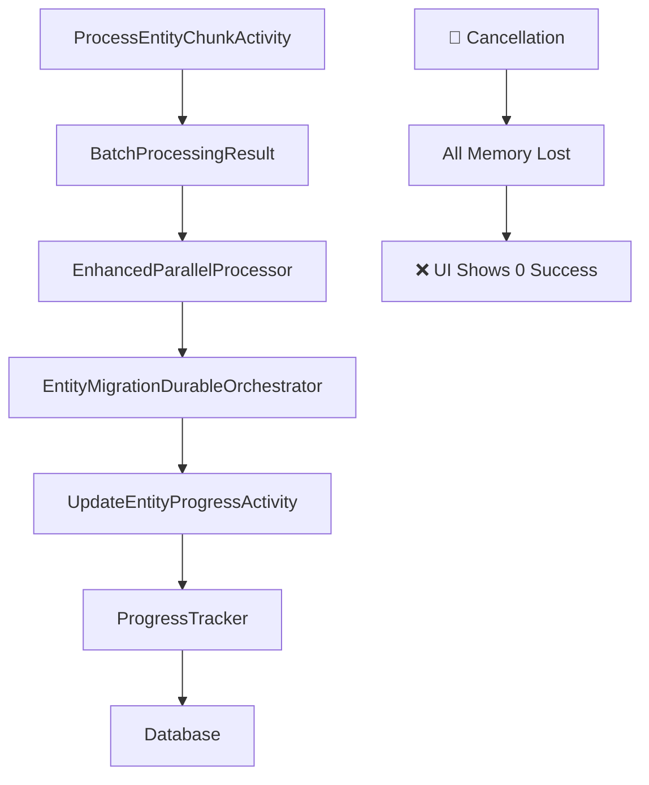
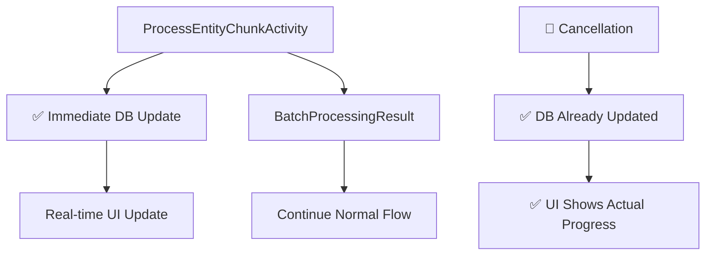

# 🚀 Incremental Progress Update - Quick Start Guide

## 📖 Overview

This guide helps team members quickly get up to speed on the Incremental Progress Update project and start contributing immediately.

---

## 🎯 Project Goal

**Replace end-of-process progress tracking with real-time incremental updates to prevent data loss during cancellations and provide accurate real-time progress.**

### **Current Problem**
```
Migration with 4791 products:
✅ Processes 2499 products successfully
🚫 User cancels migration
❌ UI shows: 0 successful, 0 processed (all work lost!)
✅ Destination store: 2499 products actually migrated
```

### **Target Solution**
```
Migration with 4791 products:
✅ Processes 250 products → Database updated immediately
✅ Processes 500 products → Database updated immediately  
✅ Processes 750 products → Database updated immediately
...
✅ Processes 2499 products → Database shows 2499 successful
🚫 User cancels migration
✅ UI shows: 2499 successful, 0 failed (no work lost!)
```

---

## ⚡ 5-Minute Setup

### **1. Get the Code**
```bash
git clone [repository-url]
cd bigcommerce-migration
git checkout main
```

### **2. Understand the Architecture**
```
Current Flow:
ProcessEntityChunkActivity → Memory → End-of-Migration → Database

Target Flow:
ProcessEntityChunkActivity → Database (immediately) → Real-time UI Updates
```

### **3. Key Files to Understand**
```
📁 src/BigCommerce.Migration.Activities/Activities/
   └── ProcessEntityChunkActivity.cs          # Where chunks are processed

📁 src/BigCommerce.Migration.Activities/Services/
   └── ProgressTracker.cs                     # Progress tracking service

📁 src/BigCommerce.Migration.Functions/Orchestrators/
   └── EntityMigrationDurableOrchestrator.cs  # Main orchestrator

📁 src/BigCommerce.Migration.Infrastructure/Services/
   └── EnhancedParallelProcessor.cs           # Parallel processing engine
```

### **4. Run the System Locally**
```bash
# Start the system
docker-compose up -d

# Check logs
docker-compose logs bigcommerce-functions --tail=100

# Access dashboard
open http://localhost:3000
```

---

## 🛠️ Development Workflow

### **Phase 1: Analysis Tasks** (Start Here!)

#### **Task 1.1: Current Flow Analysis** ⭐ **GOOD FIRST TASK**
**What to do:**
1. Trace how progress updates flow through the system
2. Document all the places where progress is updated
3. Identify where incremental updates should be added

**Files to examine:**
- `ProcessEntityChunkActivity.cs` (line ~400-500)
- `ProgressTracker.cs` (entire file)
- `EntityMigrationDurableOrchestrator.cs` (lines 460-500)

**Deliverable:**
Create a document: `docs/CURRENT-PROGRESS-FLOW-ANALYSIS.md`

**Time estimate:** 2 hours

---

## 🔍 Code Analysis Guide

### **Understanding ProcessEntityChunkActivity**

```csharp
// Current approach (ProcessEntityChunkActivity.cs around line 450)
public async Task<BatchProcessingResult> ProcessEntityChunkAsync(...)
{
    // Process 250 entities
    var result = new BatchProcessingResult
    {
        SuccessfulEntities = 200,  // This stays in memory!
        FailedEntities = 50        // This stays in memory!
    };
    
    // No database update here - problem!
    return result;  // Goes to orchestrator, then lost on cancellation
}
```

**What we need to add:**
```csharp
// Target approach
public async Task<BatchProcessingResult> ProcessEntityChunkAsync(...)
{
    // Process 250 entities
    var result = new BatchProcessingResult
    {
        SuccessfulEntities = 200,
        FailedEntities = 50
    };
    
    // 🆕 ADD THIS: Immediate database update
    await _progressTracker.IncrementProgressAsync(migrationId, entityType, result);
    
    return result;
}
```

### **Understanding Progress Flow**



**Target Flow:**


---

## 🎯 Quick Wins

### **Easy Tasks to Start With:**

1. **Document Current Flow** (Task 1.1)
   - **Difficulty**: Easy
   - **Skills**: Code reading
   - **Time**: 2 hours

2. **Design Increment Events Table** (Task 1.2)
   - **Difficulty**: Medium
   - **Skills**: Database design
   - **Time**: 2 hours

3. **Create Unit Tests** (Various tasks)
   - **Difficulty**: Easy-Medium
   - **Skills**: Testing
   - **Time**: 1-3 hours each

### **Advanced Tasks:**

1. **Implement Aggregation Service** (Task 2.2)
   - **Difficulty**: Hard
   - **Skills**: Concurrency, distributed systems
   - **Time**: 5 hours

2. **Orchestrator Simplification** (Task 3.3)
   - **Difficulty**: Hard
   - **Skills**: Architecture, refactoring
   - **Time**: 4 hours

---

## 🧪 Testing Approach

### **How to Test Current System**
```bash
# 1. Start a migration
curl -X POST http://localhost:7071/api/migrations/start \
  -H "Content-Type: application/json" \
  -d '{"sourceStoreId": "test", "destinationStoreId": "test"}'

# 2. Cancel it mid-way
curl -X POST http://localhost:7071/api/migrations/{id}/cancel

# 3. Check progress - should show actual work done, not 0
curl http://localhost:7071/api/migrations/{id}/details
```

### **Test Scenarios**
1. **Normal completion** - verify all counts are correct
2. **Early cancellation** - verify partial progress is preserved
3. **Mid-way cancellation** - verify completed chunks are counted
4. **System crash** - verify progress survives restarts

---

## 📊 Success Metrics

### **How to Measure Success**
1. **Data Integrity**: Cancelled migrations show actual completed work
2. **Real-time Updates**: UI updates within 2-3 seconds of chunk completion
3. **Performance**: <10% impact on migration speed
4. **Code Quality**: Simpler orchestrator code

### **Before vs After**
| **Scenario** | **Before** | **After** |
|--------------|------------|-----------|
| **Cancel after 2500 products** | UI: 0 success | UI: 2500 success |
| **System crash mid-migration** | All progress lost | Progress preserved |
| **Real-time updates** | Only at end | Every chunk |
| **Orchestrator complexity** | Complex recovery logic | Simple DB reads |

---

## 🤝 Getting Help

### **Questions About:**
- **Code Structure**: Check existing documentation or ask in daily standup
- **Database Schema**: Review Azure Table Storage docs
- **Testing Strategy**: Check existing test patterns in `/tests` folder
- **Architecture Decisions**: Review implementation plan document

### **Stuck on a Task?**
1. **Review documentation** in `/docs` folder
2. **Check existing code patterns** for similar functionality
3. **Ask in daily standup** or team chat
4. **Create a spike** to explore the problem (time-boxed research)

---

## 📚 Key Resources

### **Essential Reading**
1. [Implementation Plan](./INCREMENTAL-PROGRESS-IMPLEMENTATION-PLAN.md) - Complete project roadmap
2. [Task Tracker](./TASK-TRACKER.md) - Current status and assignments  
3. [Task Management](./INCREMENTAL-PROGRESS-TASKS.md) - Daily workflow and processes

### **Technical References**
- [Azure Table Storage Docs](https://docs.microsoft.com/en-us/azure/storage/tables/)
- [Durable Functions Patterns](https://docs.microsoft.com/en-us/azure/azure-functions/durable/durable-functions-overview)
- [BigCommerce API Reference](https://developer.bigcommerce.com/api-reference/)

### **Project Context**
- Current system handles product migrations between BigCommerce stores
- Uses Azure Durable Functions for long-running workflows
- Processes thousands of products in parallel batches
- Real production system with paying customers

---

*Ready to contribute? Start with Task 1.1 - Current Flow Analysis!*

---

*Last Updated: 2025-01-17*  
*Quick Start Version: 1.0*