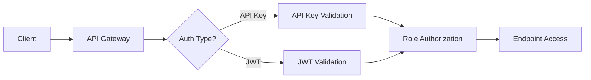
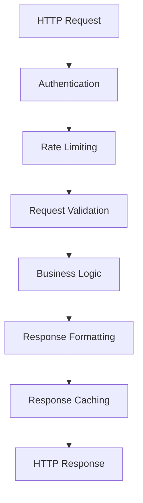

# Phase 7B: HTTP API Layer Implementation Plan

## Executive Summary

**Status**: Building comprehensive RESTful APIs on top of enterprise-grade service layer  
**Timeline**: 10-12 days (December 2024)  
**Current Foundation**: Solid API foundation already exists, enhancement and completion needed

## 🔍 **Current API Implementation Analysis**

### ✅ **EXISTING API ENDPOINTS** (Well-Implemented)

#### **Migration Management API** (`/migrations`)
- `POST /migrations` - Start migration (comprehensive implementation)
- `GET /migrations/{migrationId}` - Get migration status
- `GET /migrations` - List migrations with filtering/pagination
- `POST /migrations/{migrationId}/cancel` - Cancel migration

#### **Dashboard API** (`/dashboard`)
- `GET /dashboard/migrations/{migrationId}/status` - Detailed progress tracking
- `GET /dashboard/migrations` - List active migrations
- `GET /dashboard/health` - System health monitoring
- `GET /dashboard/statistics` - Migration statistics
- `GET /dashboard/queues` - Queue status monitoring

### 🎯 **ENHANCEMENT OPPORTUNITIES**

## 📋 **PHASE 7B IMPLEMENTATION TASKS**

### **Sprint 1: API Foundation Enhancement** (Days 1-4)

#### **Task 1: API Authentication & Authorization** (Day 1-2)
**Priority**: HIGH  
**Effort**: 2 days

**Implementation:**
- Replace Function-level auth with comprehensive API key management
- Implement JWT-based authentication for different user roles
- Add role-based authorization (Admin, User, ReadOnly)
- Create API key management endpoints

**Deliverables:**
```csharp
// API Key Authentication Middleware
public class ApiKeyAuthenticationMiddleware
// JWT Token Service
public class JwtTokenService  
// Authorization Policies
public static class AuthorizationPolicies
```

#### **Task 2: Request Validation & Error Handling** (Day 2-3)
**Priority**: HIGH  
**Effort**: 1.5 days

**Implementation:**
- Standardize request validation across all endpoints
- Implement consistent error response format
- Add comprehensive input validation middleware
- Create global exception handling

**Deliverables:**
```csharp
// Request Validation Middleware
public class RequestValidationMiddleware
// Global Error Handler
public class GlobalExceptionHandler
// Standard Error Responses
public class ApiErrorResponse
```

#### **Task 3: OpenAPI Documentation** (Day 3-4)
**Priority**: MEDIUM  
**Effort**: 1.5 days

**Implementation:**
- Add Swagger/OpenAPI 3.0 specification
- Generate interactive API documentation
- Document all request/response schemas
- Add example requests and responses

**Deliverables:**
- Complete OpenAPI specification file
- Interactive Swagger UI
- Generated API documentation

### **Sprint 2: API Enhancement & Features** (Days 5-8)

#### **Task 4: API Rate Limiting** (Day 5)
**Priority**: MEDIUM  
**Effort**: 1 day

**Implementation:**
- Implement API-level rate limiting (separate from BigCommerce limits)
- Add rate limiting headers
- Configure different limits per endpoint/user role
- Add rate limit monitoring

**Deliverables:**
```csharp
// API Rate Limiting Middleware
public class ApiRateLimitingMiddleware
// Rate Limit Configuration
public class RateLimitConfiguration
```

#### **Task 5: Additional Monitoring Endpoints** (Day 6-7)
**Priority**: MEDIUM  
**Effort**: 2 days

**Enhancement of existing endpoints:**
- Enhanced `/health` endpoint with detailed component status
- `/metrics` endpoint for Prometheus-style metrics
- `/logs` endpoint for real-time log streaming
- `/performance` endpoint for system performance data

**New endpoints:**
```http
GET /api/health/detailed      # Comprehensive health check
GET /api/metrics             # System metrics
GET /api/logs                # Real-time logs
GET /api/performance         # Performance metrics
GET /api/stores/{storeId}/health  # Store-specific health
```

#### **Task 6: API Versioning** (Day 7-8)
**Priority**: LOW  
**Effort**: 1.5 days

**Implementation:**
- Implement API versioning strategy (URL-based)
- Add version negotiation
- Create v1 and v2 endpoints structure
- Add deprecation notices

**Deliverables:**
```http
# Versioned endpoints
/api/v1/migrations
/api/v2/migrations
```

### **Sprint 3: Advanced Features & Testing** (Days 9-12)

#### **Task 7: Response Caching** (Day 9)
**Priority**: LOW  
**Effort**: 1 day

**Implementation:**
- Add response caching for read-only endpoints
- Implement cache invalidation strategies
- Configure different cache durations per endpoint
- Add cache headers

#### **Task 8: Enhanced Migration Endpoints** (Day 9-10)
**Priority**: HIGH  
**Effort**: 2 days

**New endpoints:**
```http
# Migration Templates
GET /api/migrations/templates        # Get migration templates
POST /api/migrations/templates       # Create migration template
GET /api/migrations/templates/{id}   # Get specific template

# Migration Validation
POST /api/migrations/validate        # Validate migration request
POST /api/stores/validate           # Validate store configurations

# Migration History
GET /api/migrations/{id}/history     # Get migration history
GET /api/migrations/{id}/logs        # Get migration logs
GET /api/migrations/{id}/errors      # Get migration errors

# Bulk Operations
POST /api/migrations/bulk            # Start multiple migrations
GET /api/migrations/bulk/{batchId}   # Get bulk migration status
```

#### **Task 9: API Testing Suite** (Day 10-11)
**Priority**: HIGH  
**Effort**: 2 days

**Implementation:**
- Unit tests for all endpoints
- Integration tests with real services
- Load testing for performance validation
- Contract testing with API specifications

**Test Coverage:**
- Authentication/authorization flows
- Request validation scenarios
- Error handling cases
- Rate limiting behavior
- Caching functionality

#### **Task 10: Client SDK Generation** (Day 11-12)
**Priority**: MEDIUM  
**Effort**: 2 days

**Implementation:**
- Generate C# client SDK
- Generate TypeScript client SDK
- Generate Python client SDK
- Add usage examples and documentation

**Deliverables:**
- NuGet package for C# SDK
- NPM package for TypeScript SDK
- PyPI package for Python SDK
- SDK documentation and examples

## 🏗️ **DETAILED API ARCHITECTURE**

### **Authentication Flow**


### **Request/Response Flow**


### **Error Handling Strategy**
```json
{
  "error": {
    "code": "VALIDATION_ERROR",
    "message": "Request validation failed",
    "details": [
      {
        "field": "sourceStore.storeId",
        "message": "Store ID is required",
        "code": "REQUIRED_FIELD"
      }
    ],
    "timestamp": "2024-12-10T10:30:00Z",
    "requestId": "req_12345",
    "documentation": "https://docs.bigcommerce-migration.com/errors/validation"
  }
}
```

## 📊 **API SPECIFICATIONS**

### **Base URL Structure**
```
Production: https://api.bigcommerce-migration.com
Staging: https://staging-api.bigcommerce-migration.com
Development: https://localhost:7071/api
```

### **Authentication Headers**
```http
# API Key Authentication
X-API-Key: your-api-key-here

# JWT Authentication  
Authorization: Bearer jwt-token-here

# Request ID (for tracking)
X-Request-ID: unique-request-id
```

### **Rate Limiting Headers**
```http
X-RateLimit-Limit: 1000
X-RateLimit-Remaining: 999
X-RateLimit-Reset: 1640995200
X-RateLimit-RetryAfter: 60
```

### **Caching Headers**
```http
Cache-Control: public, max-age=300
ETag: "12345"
Last-Modified: Tue, 15 Nov 2024 12:45:26 GMT
```

## 🧪 **TESTING STRATEGY**

### **Unit Testing** (Comprehensive)
- All endpoint logic
- Authentication/authorization
- Validation rules
- Error handling

### **Integration Testing**
- Service integration
- Database operations
- External API calls
- Queue operations

### **Performance Testing**
- Load testing (1000+ concurrent requests)
- Rate limiting validation
- Caching effectiveness
- Response time benchmarks

### **Security Testing**
- Authentication bypass attempts
- Authorization privilege escalation
- Input validation security
- API abuse scenarios

## 📈 **SUCCESS METRICS**

### **Functional Metrics**
- ✅ 100% API endpoint coverage
- ✅ <200ms average response time
- ✅ 99.9% uptime
- ✅ Comprehensive error handling

### **Quality Metrics**
- ✅ 95%+ test coverage
- ✅ OpenAPI 3.0 compliance
- ✅ Security best practices
- ✅ Rate limiting effectiveness

### **Developer Experience**
- ✅ Interactive API documentation
- ✅ Client SDKs for 3 languages
- ✅ Comprehensive examples
- ✅ Clear error messages

## 🚀 **DELIVERABLES**

### **Sprint 1 Outputs**
- Enhanced authentication system
- Standardized validation/error handling
- Complete OpenAPI documentation

### **Sprint 2 Outputs**
- API rate limiting implementation
- Enhanced monitoring endpoints
- API versioning infrastructure

### **Sprint 3 Outputs**
- Response caching system
- Additional migration endpoints
- Comprehensive test suite
- Client SDKs (C#, TypeScript, Python)

## 📝 **IMPLEMENTATION NOTES**

### **Priority Focus**
1. **Authentication & Security** - Foundation for enterprise use
2. **Documentation** - Critical for developer adoption
3. **Testing** - Ensure reliability and performance
4. **Client SDKs** - Enable easy integration

### **Architecture Decisions**
- **API-First Design** - OpenAPI specification drives implementation
- **RESTful Principles** - Consistent resource-based URLs
- **Stateless Authentication** - JWT tokens for scalability
- **Comprehensive Logging** - All API calls logged for monitoring

### **Performance Targets**
- **Response Time**: <200ms for 95% of requests
- **Throughput**: 1000+ requests/second
- **Availability**: 99.9% uptime
- **Rate Limits**: Configurable per endpoint/role

---

**Phase 7B Timeline**: 10-12 days  
**Dependencies**: Phase 7A Service Layer (Complete)  
**Next Phase**: Phase 8 Production Optimization 