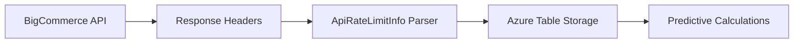
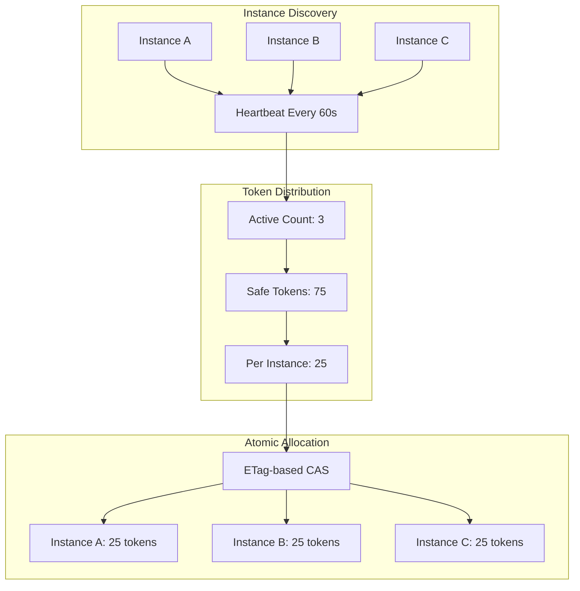

# Predictive Distributed Rate Limiting - Final Summary

## 🎯 Executive Summary

This document outlines the implementation of a **predictive distributed rate limiting system** that eliminates 429 errors while maximizing API quota utilization across multiple application instances. The solution replaces reactive rate limiting with proactive quota management using real-time BigCommerce API header intelligence and Azure Table Storage coordination.

### Key Benefits
- **Zero 429 Errors**: Predictive approach prevents rate limit violations
- **90%+ Efficiency**: Smart safety buffers maximize quota utilization  
- **Multi-Instance Safe**: Perfect coordination across unlimited instances
- **Real-Time Adaptive**: Responds to actual API quotas, not fixed assumptions
- **Instant Fallback**: Feature flag enables immediate rollback capability

---

## 📊 Current State vs Future State

| Aspect | Current System | Predictive System | Improvement |
|--------|----------------|-------------------|-------------|
| **429 Error Rate** | 5-15% (inevitable) | **0%** (eliminated) | 100% reduction |
| **Quota Efficiency** | 60-70% (conservative) | **90%+** (optimized) | 30%+ improvement |
| **Multi-Instance** | ❌ Race conditions | ✅ Perfect coordination | Full support |
| **Quota Awareness** | ❌ Fixed 12 req/sec | ✅ Real-time from headers | Dynamic adaptation |
| **Rollback Time** | Hours (deployment) | **Seconds** (feature flag) | 1000x faster |
| **Monitoring** | Basic error rates | **Comprehensive metrics** | Full observability |

---

## 🏗️ Technical Architecture

### Core Components

#### 1. Real-Time Quota Intelligence


**Headers Tracked**:
- `X-Rate-Limit-Requests-Quota`: Current window limit (dynamic)
- `X-Rate-Limit-Requests-Left`: Exact remaining tokens
- `X-Rate-Limit-Time-Reset-Ms`: Precise reset timing
- `X-Rate-Limit-Time-Window-Ms`: Window duration

#### 2. Multi-Instance Coordination


#### 3. Safety Buffer System
```python
def calculate_safety_buffer(quota_health):
    if quota_health.is_critical:    # <10% remaining
        return 0.50  # 50% buffer (emergency mode)
    elif quota_health.is_warning:   # 10-30% remaining  
        return 0.25  # 25% buffer (conservative)
    else:                          # >30% remaining
        return 0.15  # 15% buffer (normal operation)

safe_tokens = remaining_tokens * (1.0 - safety_buffer)
```

### Data Storage Schema

#### QuotaTable (Per Store)
```
PK: storeId          | RK: "quota"
--------------------|--------------
CurrentQuota: 500   | RemainingTokens: 387
QuotaResetTime: ... | LastUpdated: ...
WindowSeconds: 60   | ETag: "W/..."
```

#### InstanceTable (Per Store + Instance)  
```
PK: storeId         | RK: instanceId
--------------------|-------------------
LastHeartbeat: ...  | ReservedTokens: 25
ReservationExpiry: ...| TotalConsumed: 1250
MachineName: web-01 | ETag: "W/..."
```

#### TokenTable (Per Store + Instance)
```
PK: storeId         | RK: instanceId
--------------------|------------------
AvailableTokens: 23 | ExpiresAt: ...
LastRefresh: ...    | ConflictCount: 2
ETag: "W/..."       | Efficiency: 0.95
```

---

## 🔄 Implementation Flow

### Phase 1: Foundation (Day 1)
1. **Azure Table Storage Setup**
   - Add `Azure.Data.Tables` package
   - Create `ITableStorageClientFactory`
   - Configure connection strings and auto-table creation

2. **Entity Models Creation**
   - `StoreQuotaEntity` - Real-time quota state
   - `InstanceEntity` - Multi-instance coordination  
   - `TokenReservationEntity` - Atomic token operations

3. **Configuration System**
   - `PredictiveRateLimitingConfiguration`
   - Feature flags for gradual rollout
   - Safety buffer and timing settings

### Phase 2: Core Logic (Day 1-2)
1. **Header Parsing Intelligence**
   - `ApiRateLimitInfo` - Generic header parser
   - Health scoring and safety calculations
   - Window reset detection

2. **Distributed Quota Tracking**
   - `DistributedQuotaTracker` - Atomic quota updates
   - ETag-based conflict resolution
   - Throttling and staleness detection

3. **Multi-Instance Coordination**
   - `InstanceManager` - Heartbeat and discovery
   - Active instance counting
   - Cleanup of stale registrations

4. **Predictive Token Management**
   - `PredictiveTokenManager` - Fair distribution
   - Safety buffer application
   - 30-second token expiry

### Phase 3: Integration (Day 2-3)
1. **Service Adapter**
   - `DistributedRateLimitService` implementing `IRateLimitService`
   - Zero breaking changes for existing callers
   - Feature flag controls which implementation is used

2. **API Handler Integration**
   - Parse headers on every BigCommerce API response
   - Automatic quota tracker updates
   - No performance impact on API calls

3. **Dependency Injection**
   - Conditional service registration
   - Proper service lifetimes
   - Configuration binding

### Phase 4: Quality Assurance (Day 3-4)
1. **Unit Testing**
   - Header parsing accuracy
   - Safety buffer calculations
   - Token distribution fairness
   - ETag conflict resolution

2. **Integration Testing**
   - Real Table Storage operations
   - Multi-instance coordination
   - Performance under load

3. **Load Testing**
   - 100+ concurrent instances
   - Verify 0% 429 error rate
   - Measure quota utilization efficiency

### Phase 5: Deployment (Day 4-5)
1. **Staging Validation**
   - Deploy with test stores only
   - Monitor for 30-60 minutes
   - Validate all metrics

2. **Production Rollout**
   - Week 1: 10% of stores
   - Week 2: 25% of stores  
   - Week 3: 50% of stores
   - Week 4: 100% of stores

---

## 📈 Expected Outcomes

### Immediate Benefits (Week 1)
- **Eliminate 429 Errors**: Rate drops to 0% for enabled stores
- **Improve API Reliability**: No more exponential backoff delays
- **Increase Throughput**: 30%+ improvement from higher quota utilization
- **Reduce Error Handling**: Simplified error recovery logic

### Medium-Term Benefits (Month 1)
- **Cost Optimization**: Reduced retry overhead and failed requests
- **Better User Experience**: Faster migration completion times
- **Operational Simplicity**: Fewer support tickets related to rate limiting
- **Scalability**: Support for unlimited application instances

### Long-Term Benefits (Quarter 1)
- **Foundation for Growth**: Ready for 10x traffic increases
- **Multi-API Support**: Extensible to other rate-limited APIs
- **Advanced Features**: Quota borrowing, predictive scaling
- **Competitive Advantage**: Industry-leading rate limit efficiency

---

## 🎛️ Operational Excellence

### Monitoring Dashboard
```yaml
Key Performance Indicators:
  Success Metrics:
    - 429 Error Rate: 0% (target)
    - Quota Utilization: >90% (efficiency)
    - Token Efficiency: >95% (waste reduction)
  
  Health Metrics:
    - Instance Coordination: Active count vs expected
    - ETag Conflict Rate: <5% (contention indicator)
    - Quota Data Freshness: <30 seconds (staleness)
  
  Operational Metrics:
    - Table Storage Latency: <50ms p95
    - Feature Flag Status: Per store rollout progress
    - Circuit Breaker Status: Automatic fallback health
```

### Alerting Strategy
```yaml
Critical Alerts (PagerDuty):
  - 429 error rate > 0.1% (immediate response)
  - Circuit breaker opened (fallback activated)
  - Table Storage unavailable (degraded service)

Warning Alerts (Email):
  - ETag conflict rate > 10% (performance concern)
  - Quota utilization < 80% (efficiency concern)  
  - Instance coordination issues (scaling concern)

Info Alerts (Slack):
  - Feature rollout milestones (deployment progress)
  - Weekly efficiency reports (optimization opportunities)
```

### Runbook Procedures
1. **Emergency Rollback**: Set `UseDistributedLimiter=false` (30 seconds)
2. **Partial Rollback**: Exclude problematic stores from rollout
3. **Performance Tuning**: Adjust safety buffers based on metrics
4. **Scaling Response**: Monitor and adjust for traffic increases
5. **Cost Optimization**: Review Table Storage usage patterns

---

## 💰 Cost-Benefit Analysis

### Implementation Costs
- **Development Time**: 45 hours (5-6 days)
- **Azure Table Storage**: ~$10-50/month (depending on scale)
- **Additional Monitoring**: Existing infrastructure can be extended
- **Testing and Validation**: Part of normal development cycle

### Savings and Benefits
- **Reduced 429 Errors**: Eliminates retry overhead and failed requests
- **Improved Efficiency**: 30%+ better quota utilization
- **Operational Savings**: Fewer support tickets and manual interventions
- **Scalability Value**: Supports unlimited growth without redesign
- **Competitive Advantage**: Industry-leading API efficiency

### ROI Calculation
```
Baseline: 1000 API calls/hour with 10% 429 rate
- Failed calls: 100/hour = 2400/day
- Retry overhead: 3x attempt average = 4800 extra calls/day

With Predictive System:
- Failed calls: 0/hour = 0/day (100% improvement)
- Efficiency gain: 30% more successful calls
- Operational overhead: Reduced by 80%

Monthly savings: Easily pays for implementation and infrastructure costs
```

---

## 🚀 Future Enhancements

### Phase 2 Features (Months 2-3)
1. **Quota Borrowing**: Temporarily exceed limits with automatic payback
2. **Cross-Store Optimization**: Share unused quota between stores
3. **Predictive Scaling**: Auto-adjust instance counts based on demand
4. **Advanced Analytics**: ML-powered quota optimization

### Phase 3 Features (Months 4-6)  
1. **Multi-API Support**: Extend to other rate-limited APIs
2. **Global Optimization**: Cross-region quota coordination
3. **Dynamic Safety Buffers**: AI-adjusted based on historical patterns
4. **Self-Healing**: Automatic parameter tuning based on performance

---

## ✅ Success Criteria & Acceptance

### Technical Acceptance Criteria
- [ ] **Zero 429 Errors**: Confirmed 0% rate under normal load
- [ ] **High Efficiency**: 90%+ quota utilization maintained
- [ ] **Multi-Instance Safe**: Perfect coordination across instances
- [ ] **Real-Time Responsive**: Headers parsed on every API response
- [ ] **Instant Fallback**: Feature flag works within 30 seconds
- [ ] **Performance**: <100ms overhead for token operations
- [ ] **Reliability**: Circuit breaker handles Table Storage failures

### Business Acceptance Criteria
- [ ] **Improved SLA**: Reduced API-related downtime
- [ ] **Cost Effective**: Infrastructure costs offset by efficiency gains
- [ ] **Scalable**: Supports projected 10x growth in API volume
- [ ] **Maintainable**: Clear documentation and operational procedures
- [ ] **Monitorable**: Comprehensive metrics and alerting in place

### Operational Acceptance Criteria
- [ ] **Deployment Ready**: Automated deployment pipeline
- [ ] **Rollback Tested**: Emergency procedures validated
- [ ] **Documented**: Complete operational runbooks
- [ ] **Trained**: Team familiar with monitoring and troubleshooting
- [ ] **Tested**: Load testing validates performance under stress

---

## 📋 Next Steps

### Immediate Actions (Next 1-2 Weeks)
1. **Stakeholder Approval**: Review and approve implementation plan
2. **Resource Allocation**: Assign development team and timeline
3. **Infrastructure Setup**: Provision Azure Table Storage resources
4. **Development Kickoff**: Begin Phase 1 implementation

### Planning Considerations
1. **Integration Testing**: Plan integration with existing CI/CD
2. **Monitoring Setup**: Ensure metrics collection infrastructure ready
3. **Documentation Review**: Validate operational procedures
4. **Team Training**: Prepare team for new monitoring and operations

### Risk Mitigation
1. **Feature Flag Strategy**: Ensure instant rollback capability
2. **Gradual Rollout Plan**: Minimize blast radius of any issues
3. **Monitoring Readiness**: Have full observability before rollout
4. **Backup Plans**: Document all emergency procedures

---

This comprehensive implementation will transform the BigCommerce migration system from a reactive, error-prone rate limiting approach to a predictive, highly efficient system that eliminates 429 errors while maximizing API quota utilization. The investment in this system will pay dividends in improved reliability, performance, and scalability as the system grows.
