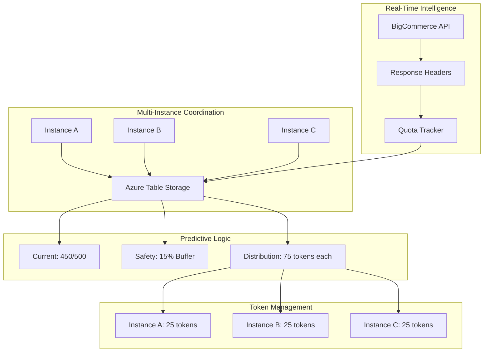

# Predictive Distributed Rate Limiting Implementation Guide

## Overview

This document provides a comprehensive guide for implementing a predictive distributed rate limiting system that **eliminates 429 errors** through real-time quota tracking and multi-instance coordination using Azure Table Storage.

## 🎯 Problem Statement

### Current Issues
1. **In-Memory Rate Limiting**: Single-instance only, race conditions in multi-instance deployments
2. **Reactive Approach**: Waits for 429 errors, then backs off (guaranteed failures)
3. **Fixed Rate Assumptions**: Uses hardcoded 12 req/sec instead of real BigCommerce quotas
4. **Poor Multi-Instance Support**: Instances compete, leading to quota over-consumption

### Success Criteria
- **Zero 429 errors** under normal operations
- **90%+ quota utilization** with safety margins
- **Perfect multi-instance coordination** via distributed state
- **Real-time quota awareness** from API response headers
- **Instant fallback** capability via feature flags

## 🏗️ Architecture Overview



## 📋 Implementation Task List

### Phase 1: Foundation (Day 1)
- [ ] **1.1** Add Azure.Data.Tables package to Core project
- [ ] **1.2** Create Table Storage entity models
  - [ ] `StoreQuotaEntity` - Real-time quota tracking
  - [ ] `InstanceEntity` - Multi-instance coordination
  - [ ] `TokenReservationEntity` - Atomic token allocation
- [ ] **1.3** Define configuration models
  - [ ] `PredictiveRateLimiting` configuration section
  - [ ] Feature flags and safety settings
- [ ] **1.4** Create core interfaces
  - [ ] `IQuotaTracker` - Generic quota tracking
  - [ ] `ITableStorageClientFactory` - Table client abstraction

### Phase 2: Quota Tracking (Day 1-2)
- [ ] **2.1** Implement `ApiRateLimitInfo` model
  - [ ] Generic header parsing (X-Rate-Limit-*)
  - [ ] Health scoring and safety calculations
- [ ] **2.2** Implement `DistributedQuotaTracker`
  - [ ] Real-time header parsing from API responses
  - [ ] Atomic ETag-based updates
  - [ ] Throttling and conflict resolution
- [ ] **2.3** Create `TableStorageClientFactory`
  - [ ] Auto-table creation
  - [ ] Connection management and retry policies

### Phase 3: Instance Coordination (Day 2)
- [ ] **3.1** Implement `InstanceManager`
  - [ ] Heartbeat registration (60s intervals)
  - [ ] Active instance discovery
  - [ ] Cleanup of stale instances
- [ ] **3.2** Add instance health monitoring
  - [ ] Connection status tracking
  - [ ] Performance metrics collection

### Phase 4: Token Management (Day 2-3)
- [ ] **4.1** Implement `PredictiveTokenManager`
  - [ ] 15% safety buffer calculations
  - [ ] Fair distribution across instances
  - [ ] 30-second token expiry
- [ ] **4.2** Add atomic token operations
  - [ ] ETag-based Compare-And-Swap
  - [ ] Conflict retry with jitter
  - [ ] Local token consumption tracking

### Phase 5: Integration (Day 3)
- [ ] **5.1** Create `DistributedRateLimitService`
  - [ ] Implements existing `IRateLimitService`
  - [ ] Zero breaking changes for callers
- [ ] **5.2** Update `ApiRequestHandler`
  - [ ] Parse headers on every response
  - [ ] Update quota tracker automatically
- [ ] **5.3** DI registration and feature flags
  - [ ] Conditional service registration
  - [ ] `UseDistributedLimiter=false` by default

### Phase 6: Safety & Monitoring (Day 3-4)
- [ ] **6.1** Add circuit breaker logic
  - [ ] Fallback to conservative mode
  - [ ] Table Storage failure handling
- [ ] **6.2** Implement health checks
  - [ ] `QuotaTrackerHealthCheck`
  - [ ] Connection and data freshness validation
- [ ] **6.3** Add telemetry and metrics
  - [ ] Token efficiency tracking
  - [ ] ETag conflict monitoring
  - [ ] 429 rate measurements

### Phase 7: Testing (Day 4)
- [ ] **7.1** Unit tests
  - [ ] Header parsing accuracy
  - [ ] ETag conflict scenarios
  - [ ] Token reservation logic
- [ ] **7.2** Integration tests
  - [ ] Multi-instance coordination
  - [ ] Real Table Storage operations
- [ ] **7.3** Load testing
  - [ ] Verify 0% 429 rate
  - [ ] Performance under concurrency

### Phase 8: Rollout (Day 4-5)
- [ ] **8.1** Dev validation
  - [ ] Local testing with flag toggle
  - [ ] Table Storage connectivity
- [ ] **8.2** Staging deployment
  - [ ] Canary testing (1-2 stores)
  - [ ] Monitor for 30-60 minutes
- [ ] **8.3** Production rollout
  - [ ] Gradual: 10% → 25% → 50% → 100%
  - [ ] Keep kill switch ready

## 🔧 Technical Specifications

### Table Storage Schema

#### QuotaTable
```csharp
PK: storeId (e.g., "store-12345")
RK: "quota"
Properties:
- CurrentQuota: int (from X-Rate-Limit-Requests-Quota)
- RemainingTokens: int (from X-Rate-Limit-Requests-Left)
- QuotaResetTime: DateTimeOffset (from X-Rate-Limit-Time-Reset-Ms)
- LastUpdated: DateTimeOffset
- WindowSeconds: int (default: 60)
```

#### InstanceTable
```csharp
PK: storeId
RK: instanceId (e.g., "web-01-a1b2c3d4")
Properties:
- LastHeartbeat: DateTimeOffset
- ReservedTokens: int
- ReservationExpiry: DateTimeOffset
- TotalTokensConsumed: long
- MachineName: string
```

#### TokenTable
```csharp
PK: storeId
RK: instanceId
Properties:
- AvailableTokens: int
- ExpiresAt: DateTimeOffset
- LastRefresh: DateTimeOffset
- ETagConflictCount: long
```

### Configuration Structure

```json
{
  "PredictiveRateLimiting": {
    "Features": {
      "UseDistributedLimiter": false,
      "EnableHeaderParsing": true,
      "EnablePredictiveDistribution": true,
      "EnableInstanceCoordination": true,
      "EnableCircuitBreaker": true
    },
    "Safety": {
      "SafetyBufferPercentage": 0.15,
      "ConservativeBufferPercentage": 0.25,
      "EmergencyBufferPercentage": 0.5,
      "HealthyQuotaThreshold": 0.3,
      "CriticalQuotaThreshold": 0.1
    },
    "Tokens": {
      "ReservationExpirySeconds": 30,
      "MinimumTokensPerInstance": 1,
      "MaximumTokensPerInstance": 50
    },
    "Coordination": {
      "HeartbeatIntervalSeconds": 60,
      "InstanceTimeoutSeconds": 120,
      "MaxETagRetries": 5,
      "ETagRetryBaseDelayMs": 20
    },
    "TableStorage": {
      "ConnectionString": "...",
      "QuotaTableName": "RateLimitQuotas",
      "InstanceTableName": "RateLimitInstances",
      "TokenTableName": "RateLimitTokens",
      "AutoCreateTables": true
    }
  }
}
```

### Key Algorithms

#### Safety Buffer Calculation
```csharp
public int GetSafeTokens(StoreQuotaEntity quota)
{
    var safetyBuffer = quota.IsCritical ? 0.5 : quota.IsHealthy ? 0.15 : 0.25;
    return Math.Max(0, (int)(quota.RemainingTokens * (1.0 - safetyBuffer)));
}
```

#### Token Distribution
```csharp
public async Task<int> DistributeTokens(string storeId)
{
    var quota = await GetCurrentQuota(storeId);
    var activeInstances = await GetActiveInstanceCount(storeId);
    var safeTokens = quota.GetSafeTokens();
    
    return Math.Max(1, safeTokens / activeInstances);
}
```

#### ETag Conflict Resolution
```csharp
for (int retry = 0; retry < maxRetries; retry++)
{
    try
    {
        await tableClient.UpdateEntityAsync(entity, entity.ETag);
        return; // Success
    }
    catch (RequestFailedException ex) when (ex.Status == 412)
    {
        var delay = baseDelay * Math.Pow(2, retry) + Random.Next(0, jitter);
        await Task.Delay((int)delay);
        entity = await tableClient.GetEntityAsync<T>(pk, rk); // Refresh
    }
}
```

## 📊 Monitoring & Metrics

### Key Metrics
- `rate_limit.decisions{source=memory|distributed}` - Decision source tracking
- `rate_limit.429_rate` - HTTP 429 error rate (target: 0%)
- `rate_limit.quota_utilization` - Percentage of quota used (target: 90%+)
- `rate_limit.token_efficiency` - Allocated vs consumed ratio
- `rate_limit.etag_conflicts` - Conflict rate (target: <5%)
- `rate_limit.instance_count` - Active instances per store

### Health Checks
- Table Storage connectivity
- Quota data freshness (<30 seconds old)
- Instance heartbeat status
- Token reservation accuracy

### Alerts
- 429 error rate > 0.1% (critical)
- ETag conflict rate > 10% (warning)
- Quota utilization < 80% (efficiency concern)
- Table Storage latency > 1 second (performance)

## 🚀 Rollout Strategy

### Phase 1: Local Validation
```bash
# Toggle feature flag locally
"UseDistributedLimiter": true

# Verify:
# - Tables created automatically
# - Headers parsed correctly
# - No 429 errors
# - Token distribution working
```

### Phase 2: Shadow Mode (Optional)
```csharp
// Log decisions from both systems without enforcing distributed
var memoryDecision = memoryLimiter.CanProceed();
var distributedDecision = distributedLimiter.CanProceed();

logger.LogInformation("Decision comparison: Memory={Memory}, Distributed={Distributed}", 
    memoryDecision, distributedDecision);

return memoryDecision; // Still use memory for actual decision
```

### Phase 3: Staging Canary
```json
{
  "CanaryStores": ["store-test-1", "store-test-2"],
  "UseDistributedLimiter": true
}
```

### Phase 4: Production Rollout
- **Week 1**: 10% of stores
- **Week 2**: 25% of stores
- **Week 3**: 50% of stores
- **Week 4**: 100% of stores

Monitor at each stage:
- 429 error rate
- API response times
- Table Storage costs
- ETag conflict rates

## 🔧 Implementation Tips

### Error Handling
- **Graceful Degradation**: Table Storage failures fall back to in-memory
- **Fail Open**: Rate limiting failures allow requests (don't break API)
- **Circuit Breaker**: Automatic fallback after consecutive failures

### Performance Optimization
- **Throttling**: Max 1 quota update per 5 seconds per store
- **Batching**: Group instance heartbeats where possible
- **Caching**: Local token reservations reduce Table Storage calls
- **Jitter**: Random delays prevent thundering herd

### Testing Strategies
- **Unit Tests**: Mock Table Storage for fast feedback
- **Integration Tests**: Real Table Storage with test data
- **Load Tests**: Multiple instances, high concurrency
- **Chaos Engineering**: Table Storage failures, network partitions

## 📚 Dependencies

### NuGet Packages
```xml
<PackageReference Include="Azure.Data.Tables" Version="12.8.3" />
<PackageReference Include="Microsoft.Extensions.Diagnostics.HealthChecks" Version="8.0.0" />
<PackageReference Include="System.ComponentModel.Annotations" Version="5.0.0" />
```

### Infrastructure Requirements
- **Azure Storage Account** with Table Storage enabled
- **Connection String** with read/write permissions
- **Monitoring Tools** for metrics collection

## 🎯 Success Validation

### Acceptance Criteria
1. ✅ **Zero 429 Errors**: Rate drops to 0% under normal load
2. ✅ **High Efficiency**: 90%+ quota utilization maintained
3. ✅ **Multi-Instance Safe**: Perfect coordination across instances
4. ✅ **Real-Time Aware**: Headers parsed on every response
5. ✅ **Instant Fallback**: Feature flag instantly reverts behavior
6. ✅ **Performance**: <100ms overhead for token operations
7. ✅ **Reliability**: Circuit breaker handles Table Storage failures

### Performance Benchmarks
- **Latency**: Token reservation <50ms p95
- **Throughput**: Support 1000+ req/sec per store
- **Efficiency**: <5% wasted tokens (unused reservations)
- **Reliability**: 99.9%+ uptime for rate limiting

## 🔄 Maintenance & Operations

### Daily Operations
- Monitor 429 error rates
- Check ETag conflict rates
- Validate quota utilization efficiency
- Review Table Storage costs

### Weekly Reviews
- Analyze token distribution fairness
- Review instance coordination efficiency
- Check for quota tracking accuracy
- Validate safety buffer effectiveness

### Monthly Optimizations
- Tune safety buffer percentages
- Adjust token expiry times
- Review instance timeout thresholds
- Optimize retry policies

This implementation will provide a robust, scalable, and efficient rate limiting system that eliminates 429 errors while maximizing API quota utilization across multiple instances.
