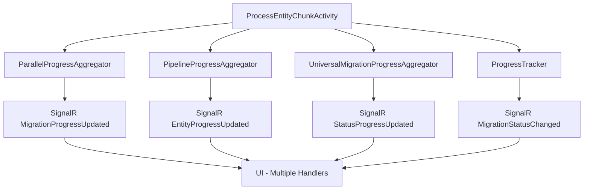
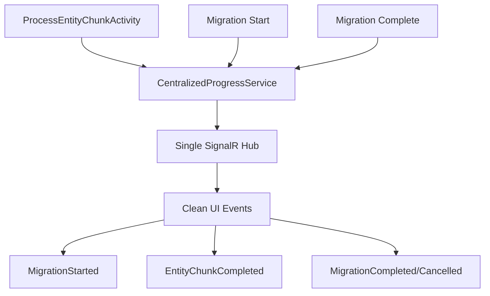

# 📡 SignalR Real-Time Status Broadcast - Improvement Plan

## 🎯 Project Overview

**Objective**: Fix and improve the SignalR real-time broadcasting system to provide clean, efficient, and single-source-of-truth progress updates with a new dedicated UI for migration monitoring.

### **Current Problems Identified**
1. **Multiple Broadcasting Sources**: Events sent from ParallelProgressAggregator, PipelineProgressAggregator, UniversalMigrationProgressAggregator, and ProgressTracker
2. **Excessive Event Frequency**: Events triggered at batch level, chunk level, entity level, and pipeline level
3. **Event Duplication**: Multiple "migration completed" notifications 
4. **Inconsistent Event Structure**: Different event types with varying data formats
5. **UI Complexity**: Current dashboard shows too many statistics and unclear progress
6. **No Single Source of Truth**: Progress data comes from multiple aggregators

### **Target Solution**
```
Single Centralized Broadcasting:
✅ Migration Start Event (once per migration)
✅ Chunk Progress Events (once per chunk completion)  
✅ Migration Complete/Cancelled Events (once per migration)
✅ Clean UI with simple entity progress display
✅ Single source of truth for all progress data
```

---

## 📊 Current State Analysis

### **Current SignalR Events (Too Many!)**
| **Event Type** | **Sent From** | **Frequency** | **Issue** |
|----------------|---------------|---------------|-----------|
| `MigrationProgressUpdated` | ParallelProgressAggregator | Every 500ms | Too frequent |
| `EntityProgressUpdated` | PipelineProgressAggregator | Per sub-entity | Confusing |
| `StatusProgressUpdated` | UniversalMigrationProgressAggregator | Per aggregation | Redundant |
| `BatchProgressUpdated` | Multiple sources | Per batch | Overwhelming |
| `MigrationStatusChanged` | ProgressTracker | Multiple times | Inconsistent |

### **Current Broadcasting Sources**


### **Target Architecture**


---

## 🏗️ Implementation Plan

### **Phase 1: Analysis & Cleanup** (2-3 hours)

#### Task 1.1: Current Implementation Analysis
**Objective**: Document all current SignalR broadcasting sources and event types

**Sub-tasks**:
- [ ] Map all classes that publish SignalR events
- [ ] Document event frequency and data structure for each type
- [ ] Identify redundant/duplicate events
- [ ] Document current UI event handlers
- [ ] Analyze performance impact of current broadcasting

**Files to examine**:
- `ParallelProgressAggregator.cs` (lines 869-948)
- `PipelineProgressAggregator.cs` (lines 293-346)
- `UniversalMigrationProgressAggregator.cs` (lines 341-400)
- `ProgressTracker.cs` (lines 570-588)
- `SignalRService.ts` (lines 266-297)

#### Task 1.2: Event Consolidation Design
**Objective**: Design streamlined event structure and single broadcasting point

**Target Event Structure**:
```typescript
// Migration Lifecycle Events
interface MigrationStartedEvent {
  migrationId: string;
  sourceStore: string;
  destinationStore: string;
  startDateTime: string;
  estimatedEndTime?: string;
  entities: EntityInfo[];
}

interface EntityChunkProgressEvent {
  migrationId: string;
  entityType: string;
  chunkNumber: number;
  totalProcessed: number;
  totalSuccess: number;
  totalFailed: number;
  totalSkipped: number;
  totalCancelled: number;
  progressPercentage: number;
  status: 'processing' | 'completed' | 'cancelled' | 'failed';
}

interface MigrationCompletedEvent {
  migrationId: string;
  status: 'completed' | 'cancelled' | 'failed';
  endDateTime: string;
  totalDuration: string;
  finalCounts: {
    totalProcessed: number;
    totalSuccess: number;
    totalFailed: number;
    totalSkipped: number;
    totalCancelled: number;
  };
  entities: EntitySummary[];
}
```

---

### **Phase 2: Centralized Broadcasting Service** (4-5 hours)

#### Task 2.1: Create CentralizedProgressBroadcastService
**Objective**: Single service responsible for all SignalR broadcasting

```csharp
public interface ICentralizedProgressBroadcastService
{
    Task BroadcastMigrationStartedAsync(string migrationId, MigrationStartInfo startInfo);
    Task BroadcastEntityChunkProgressAsync(string migrationId, EntityChunkProgress progress);
    Task BroadcastMigrationCompletedAsync(string migrationId, MigrationCompletionInfo completion);
}

public class CentralizedProgressBroadcastService : ICentralizedProgressBroadcastService
{
    private readonly IProgressEventPublisher _publisher;
    private readonly ISignalREventFactory _eventFactory;
    private readonly ILogger<CentralizedProgressBroadcastService> _logger;

    // Rate limiting to prevent spam (chunk-level only)
    private readonly Dictionary<string, DateTime> _lastBroadcastTimes = new();
    private readonly TimeSpan _minBroadcastInterval = TimeSpan.FromSeconds(2);

    public async Task BroadcastEntityChunkProgressAsync(string migrationId, EntityChunkProgress progress)
    {
        // Rate limit per migration to chunk-level updates only
        if (!ShouldBroadcast(migrationId)) return;

        var progressEvent = _eventFactory.CreateEntityChunkProgress(migrationId, progress);
        await _publisher.PublishEntityProgressAsync(progressEvent);
        
        _lastBroadcastTimes[migrationId] = DateTime.UtcNow;
    }
}
```

#### Task 2.2: Integrate with ProcessEntityChunkActivity
**Objective**: Add broadcasting calls after chunk completion only

```csharp
// In ProcessEntityChunkActivity.cs - after chunk completes successfully
public async Task<BatchProcessingResult> ProcessEntityChunkAsync(...)
{
    // ... existing processing logic ...
    
    var result = new BatchProcessingResult
    {
        SuccessfulEntities = actuallyCreated,
        FailedEntities = actualFailures,
        SkippedEntities = skippedEntities,
        CancelledEntities = cancelledEntities
    };

    // ✅ NEW: Single broadcasting point - chunk level only
    await _centralizedBroadcastService.BroadcastEntityChunkProgressAsync(migrationId, new EntityChunkProgress
    {
        EntityType = entityType,
        ChunkNumber = chunkNumber,
        TotalProcessed = result.TotalProcessed,
        TotalSuccess = result.SuccessfulEntities,
        TotalFailed = result.FailedEntities,
        TotalSkipped = result.SkippedEntities,
        TotalCancelled = result.CancelledEntities,
        ProgressPercentage = CalculateProgressPercentage(),
        Status = DetermineChunkStatus(result)
    });

    return result;
}
```

#### Task 2.3: Remove Redundant Broadcasting
**Objective**: Remove broadcasting from all other services

**Services to modify**:
- `ParallelProgressAggregator.cs` - Remove `SendSignalRUpdateAsync`
- `PipelineProgressAggregator.cs` - Remove `BroadcastComprehensiveProgressAsync`
- `UniversalMigrationProgressAggregator.cs` - Remove `BroadcastUniversalProgressAsync`
- `ProgressTracker.cs` - Remove `PublishMigrationProgressEventAsync`

---

### **Phase 3: Enhanced Dashboard Integration** (4-6 hours)

#### Task 3.1: Enhance Existing Dashboard Component
**Objective**: Integrate clean migration monitor within existing dashboard page

**Component Integration**:
```typescript
// Enhanced MigrationOverview.tsx (existing component)
interface EnhancedMigrationOverviewProps {
  migrationId: string;
  isRealTime: boolean; // Toggle between real-time and historical view
}

interface MigrationDisplayData {
  migrationId: string;
  sourceStore: string;
  destinationStore: string;
  startDateTime: string;
  estimatedEndTime?: string;
  overallProgress: number;
  totalProcessed: number;
  totalSuccess: number;
  totalFailed: number;
  totalSkipped: number;
  entities: EntityDisplayData[];
}

interface EntityDisplayData {
  entityType: string;
  totalCount: number;
  processedCount: number;
  successCount: number;
  failedCount: number;
  skippedCount: number;
  progressPercentage: number;
  status: 'processing' | 'completed' | 'cancelled' | 'failed' | 'pending';
}
```

#### Task 3.2: Enhanced Migration Overview Layout
**Objective**: Integrate clean entity progress display within existing dashboard

**UI Layout** (matches your screenshot requirements):
```
Migration Overview
┌─────────────────────────────────────────────────────────────────┐
│ Migration ID      MIG-12345                                     │
│ Source Store      bigcommerce-store-A → bigcommerce-store-B     │
│ Migration Start   2025-08-17 12:30    Expected End Time        │
│                                                                 │
│ Overall Progress  ████████████████████░░░░░░░░░░░░░░░░░░░░ 42%   │
│ Processed: 4,250  Success: 4,000  Failed: 200  Skipped: 50     │
├─────────────────────────────────────────────────────────────────┤
│                                                                 │
│ Entities                                                        │
│                                                                 │
│ Product          ████████████████████████░░░░░░ 85%   In Progress│
│                  4,135/4,791 | ✅4,000 ❌0 ⏭️135                │
│                                                                 │
│ Options          ██████████████████░░░░░░░░░░░░ 60%   In Progress│
│                  2,200/3,145 | ✅2,200 ❌0 ⏭️945                │
│                                                                 │
│ Modifiers        ░░░░░░░░░░░░░░░░░░░░░░░░░░░░░░░░ 0%    Pending  │
│                  0/1,875 | ✅0 ❌0 ⏭️0                          │
│                                                                 │
│ Images           ░░░░░░░░░░░░░░░░░░░░░░░░░░░░░░░░ 0%    Pending  │
│                  0/4,791 | ✅0 ❌0 ⏭️0                          │
│                                                                 │
│ Reviews          ░░░░░░░░░░░░░░░░░░░░░░░░░░░░░░░░ 0%    Pending  │
│                  0/1,600 | ✅0 ❌0 ⏭️0                          │
│                                                                 │
│ Variants         ░░░░░░░░░░░░░░░░░░░░░░░░░░░░░░░░ 0%    Pending  │
│                  0/1,875 | ✅0 ❌0 ⏭️0                          │
└─────────────────────────────────────────────────────────────────┘
```

#### Task 3.3: Enhance Existing Dashboard Real-Time Updates
**Objective**: Integrate new SignalR events into existing dashboard components

```typescript
// Enhanced MigrationOverview.tsx (modify existing component)
export const MigrationOverview: React.FC<MigrationOverviewProps> = ({ 
  migrationId, 
  isRealTime = true 
}) => {
  const { migrationData, isConnected } = useEnhancedMigrationProgress(migrationId);

  return (
    <Card>
      <CardContent>
        {/* Migration Overview Header - matches your screenshot */}
        <Box sx={{ mb: 3 }}>
          <Typography variant="h6" gutterBottom>
            Migration Overview
          </Typography>
          <Grid container spacing={2}>
            <Grid item xs={6}>
              <Typography variant="body2">
                <strong>Migration ID:</strong> {migrationData?.migrationId}
              </Typography>
              <Typography variant="body2">
                <strong>Source Store:</strong> {migrationData?.sourceStore} → {migrationData?.destinationStore}
              </Typography>
              <Typography variant="body2">
                <strong>Migration Start:</strong> {formatDateTime(migrationData?.startDateTime)}
              </Typography>
            </Grid>
            <Grid item xs={6}>
              <Typography variant="body2">
                <strong>Expected End Time:</strong> {formatDateTime(migrationData?.estimatedEndTime)}
              </Typography>
            </Grid>
          </Grid>
          
          {/* Overall Progress Bar */}
          <Box sx={{ mt: 2 }}>
            <Typography variant="body2" gutterBottom>
              Overall Progress {migrationData?.overallProgress}%
            </Typography>
            <LinearProgress 
              variant="determinate" 
              value={migrationData?.overallProgress || 0} 
              sx={{ height: 8, borderRadius: 4 }}
            />
            <Typography variant="body2" sx={{ mt: 1 }}>
              Processed: {migrationData?.totalProcessed} Success: {migrationData?.totalSuccess} Failed: {migrationData?.totalFailed} Skipped: {migrationData?.totalSkipped}
            </Typography>
          </Box>
        </Box>

        {/* Entities Section */}
        <Box>
          <Typography variant="h6" gutterBottom>
            Entities
          </Typography>
          {migrationData?.entities?.map((entity) => (
            <EntityProgressRow key={entity.entityType} entity={entity} />
          ))}
        </Box>
      </CardContent>
    </Card>
  );
};

// Entity Progress Row Component
const EntityProgressRow: React.FC<{ entity: EntityDisplayData }> = ({ entity }) => {
  return (
    <Box sx={{ mb: 2 }}>
      <Box sx={{ display: 'flex', justifyContent: 'space-between', alignItems: 'center' }}>
        <Typography variant="body1" sx={{ minWidth: 120 }}>
          {entity.entityType}
        </Typography>
        <Box sx={{ flex: 1, mx: 2 }}>
          <LinearProgress 
            variant="determinate" 
            value={entity.progressPercentage} 
            sx={{ height: 6, borderRadius: 3 }}
          />
        </Box>
        <Typography variant="body2" sx={{ minWidth: 60 }}>
          {entity.progressPercentage}%
        </Typography>
        <Typography variant="body2" sx={{ minWidth: 100, textAlign: 'right' }}>
          {entity.status}
        </Typography>
      </Box>
      <Typography variant="body2" color="text.secondary" sx={{ ml: 2, mt: 0.5 }}>
        {entity.processedCount}/{entity.totalCount} | ✅{entity.successCount} ❌{entity.failedCount} ⏭️{entity.skippedCount}
      </Typography>
    </Box>
  );
};
```

---

### **Phase 4: Migration Lifecycle Events** (3-4 hours)

#### Task 4.1: Migration Start Event
**Objective**: Single event when migration begins (not per entity)

**Integration Point**: `MigrationDurableOrchestrator.cs`
```csharp
// At the beginning of migration
await _centralizedBroadcastService.BroadcastMigrationStartedAsync(migrationId, new MigrationStartInfo
{
    SourceStore = request.SourceStore.StoreId,
    DestinationStore = request.DestinationStore.StoreId,
    StartDateTime = context.CurrentUtcDateTime,
    EstimatedEndTime = CalculateEstimatedEndTime(totalEntities),
    Entities = discoveredEntities.Select(e => new EntityInfo 
    { 
        EntityType = e.EntityType, 
        TotalCount = e.TotalCount 
    }).ToList()
});
```

#### Task 4.2: Migration Completion Events
**Objective**: Single event when migration ends (completed/cancelled/failed)

**Integration Points**:
- Migration successful completion
- User cancellation
- System failure/timeout

```csharp
// At migration end
await _centralizedBroadcastService.BroadcastMigrationCompletedAsync(migrationId, new MigrationCompletionInfo
{
    Status = determineFinalStatus(result),
    EndDateTime = context.CurrentUtcDateTime,
    TotalDuration = result.Duration,
    FinalCounts = aggregateFinalCounts(result),
    Entities = result.EntityResults.Select(ConvertToEntitySummary).ToList()
});
```

---

### **Phase 5: Performance & Testing** (2-3 hours)

#### Task 5.1: Broadcasting Performance Optimization
**Objective**: Ensure minimal performance impact

**Optimizations**:
- Rate limiting: Maximum 1 broadcast per 2 seconds per migration
- Async fire-and-forget broadcasting
- Batch small updates if multiple chunks complete rapidly
- Circuit breaker for SignalR failures

#### Task 5.2: End-to-End Testing
**Objective**: Validate real-time updates work correctly

**Test Scenarios**:
- Normal migration completion
- Mid-migration cancellation
- Multiple concurrent migrations
- Network disconnection/reconnection
- Large migrations (10,000+ entities)

---

## 📋 Task Breakdown Summary

| **Phase** | **Tasks** | **Time Est** | **Priority** | **Dependencies** |
|-----------|-----------|--------------|--------------|------------------|
| **Phase 1** | Analysis & Cleanup | 2-3h | P0 | None |
| **Phase 2** | Centralized Service | 4-5h | P0 | Phase 1 |
| **Phase 3** | Enhanced Dashboard | 4-6h | P1 | Phase 2 |
| **Phase 4** | Lifecycle Events | 3-4h | P1 | Phase 2 |
| **Phase 5** | Performance & Testing | 2-3h | P1 | All phases |

**Total Estimated Time**: 15-21 hours over 5-7 days

---

## 🎯 Success Metrics

### **Broadcasting Efficiency**
- **Current**: ~50-100 events per migration (excessive)
- **Target**: ~10-20 events per migration (chunk-level only)
- **Reduction**: 80-90% fewer SignalR events

### **UI Responsiveness**
- **Current**: Multiple confusing event handlers
- **Target**: Single clean event flow
- **Update Frequency**: Real-time (2-3 seconds)

### **Event Structure**
- **Current**: 5+ different event types with inconsistent data
- **Target**: 3 clean event types with consistent structure
- **Maintainability**: Single broadcasting service

### **User Experience**
- **Current**: Complex dashboard with too many statistics
- **Target**: Clean, focused migration monitor
- **Clarity**: Simple progress bars with clear status

---

## 🚨 Risks & Mitigation

### **Risk 1: Performance Impact**
- **Mitigation**: Rate limiting and async broadcasting
- **Monitoring**: Track SignalR message frequency and size

### **Risk 2: Data Consistency**
- **Mitigation**: Single source of truth from centralized service
- **Validation**: End-to-end testing with real migrations

### **Risk 3: UI Breaking Changes**
- **Mitigation**: Incremental rollout with feature flags
- **Backup**: Keep existing dashboard as fallback

---

## 📚 Implementation Files

### **New Files to Create**:
- `src/BigCommerce.Migration.Core/Interfaces/ICentralizedProgressBroadcastService.cs`
- `src/BigCommerce.Migration.Infrastructure/Services/CentralizedProgressBroadcastService.cs`

### **Files to Modify**:
- `src/BigCommerce.Migration.Activities/Activities/ProcessEntityChunkActivity.cs`
- `src/BigCommerce.Migration.Functions/Orchestrators/MigrationDurableOrchestrator.cs`
- `src/BigCommerce.Migration.Infrastructure/Services/ParallelProgressAggregator.cs` (remove broadcasting)
- `src/BigCommerce.Migration.Infrastructure/Services/PipelineProgressAggregator.cs` (remove broadcasting)
- `src/BigCommerce.Migration.Dashboard/src/services/signalRService.ts`
- `src/BigCommerce.Migration.Dashboard/src/components/Dashboard/MigrationOverview.tsx` (enhance existing)
- `src/BigCommerce.Migration.Dashboard/src/hooks/useRealTimeMigrationProgress.ts` (enhance existing)

### **Files to Remove/Replace**:
- `src/BigCommerce.Migration.Dashboard/src/components/Dashboard/RealTimeMigrationDashboard.tsx` (if exists)
- Any existing dedicated real-time status pages

---

*Last Updated: 2025-01-17*  
*Plan Version: 1.0*  
*Target Completion: 5-7 days*