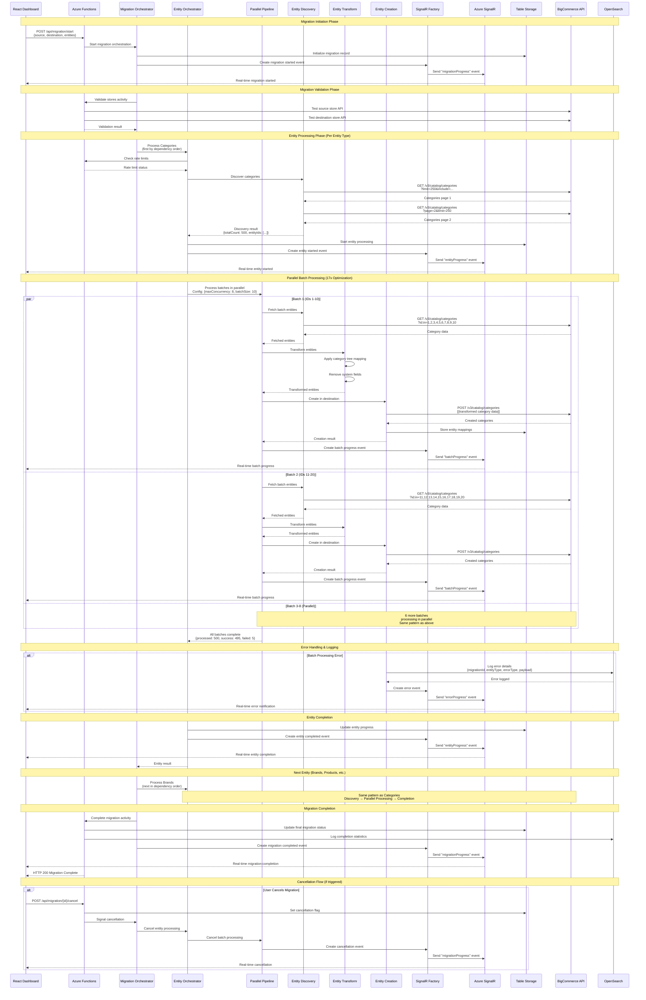

# BigCommerce Migration System - Sequence Diagram

## Overview

This sequence diagram shows the detailed interaction timeline between all system components during a migration, illustrating the real-time communication patterns, parallel processing, and error handling mechanisms.

## Interaction Phases

### 1. Migration Initiation Phase
- User submits migration request through React Dashboard
- Azure Functions receive and validate the request
- Migration Orchestrator initializes the migration process
- Real-time notifications sent to dashboard via SignalR

### 2. Migration Validation Phase
- Store validation against BigCommerce APIs
- Rate limit checks and configuration
- Permission and connectivity verification

### 3. Entity Processing Phase
- Entities processed in dependency order (Categories → Brands → Products → Variants → Images → Modifiers)
- Entity Discovery retrieves data from source BigCommerce store
- Parallel batch processing with up to 8 concurrent batches
- Real-time progress updates throughout the process

### 4. Parallel Batch Processing (17x Optimization)
- Multiple batches processed simultaneously
- Each batch follows: Fetch → Transform → Create → Progress Update
- Error handling and logging for each operation
- Continuous SignalR updates to dashboard

### 5. Error Handling & Logging
- Errors logged to OpenSearch with structured data
- Real-time error notifications to dashboard
- Continue-on-error policy maintains migration progress

### 6. Migration Completion
- Final statistics compilation
- Completion notification via SignalR
- Audit logs and cleanup

## Sequence Diagram

## Key Interaction Patterns

### Real-time Communication
- **SignalR Events**: Every major operation generates real-time events
- **Progress Updates**: Continuous feedback to dashboard during processing
- **Error Notifications**: Immediate error alerts with detailed context
- **Cancellation Signals**: Real-time cancellation propagation through all layers

### Parallel Processing Optimization
- **Concurrent Batches**: Up to 8 batches processed simultaneously per entity type
- **Load Balancing**: Dynamic batch sizing based on performance metrics
- **Progress Aggregation**: Real-time consolidation of parallel batch progress
- **Error Isolation**: Individual batch failures don't affect other batches

### API Interaction Patterns
- **Discovery Phase**: Efficient pagination to discover all entities
- **Batch Fetching**: Optimized bulk retrieval using ID filters
- **Bulk Creation**: Efficient bulk operations for destination store
- **Rate Limit Compliance**: Automatic rate limiting and backoff

### Error Handling & Logging
- **Structured Logging**: Comprehensive error data sent to OpenSearch
- **Error Categorization**: Different handling for infrastructure vs. application errors
- **Continue-on-Error**: Migration continues despite individual entity failures
- **Audit Trail**: Complete operation history for troubleshooting

### Data Flow Patterns
- **Entity Dependencies**: Sequential processing respecting entity relationships
- **State Management**: Consistent state updates across Table Storage
- **Mapping Storage**: Entity relationship tracking between source and destination
- **Progress Tracking**: Multi-level progress (migration → entity → batch → item)

## Performance Characteristics

### Throughput Optimization
- **17x Performance Improvement**: Through parallel processing architecture
- **Dynamic Concurrency**: Adaptive concurrency based on system health
- **Rate Limit Integration**: Optimal use of BigCommerce API limits
- **Caching Strategies**: Reduced API calls through intelligent caching

### Real-time Responsiveness
- **Sub-second Updates**: Real-time progress updates every 250ms
- **Immediate Error Feedback**: Instant error notifications
- **Live Cancellation**: Real-time cancellation detection and response
- **Dashboard Synchronization**: Consistent state between backend and frontend

### Scalability Features
- **Serverless Architecture**: Automatic scaling based on load
- **Stateless Processing**: Enables horizontal scaling
- **Queue-based Communication**: Handles traffic spikes gracefully
- **Resource Optimization**: Pay-per-use model with efficient resource utilization