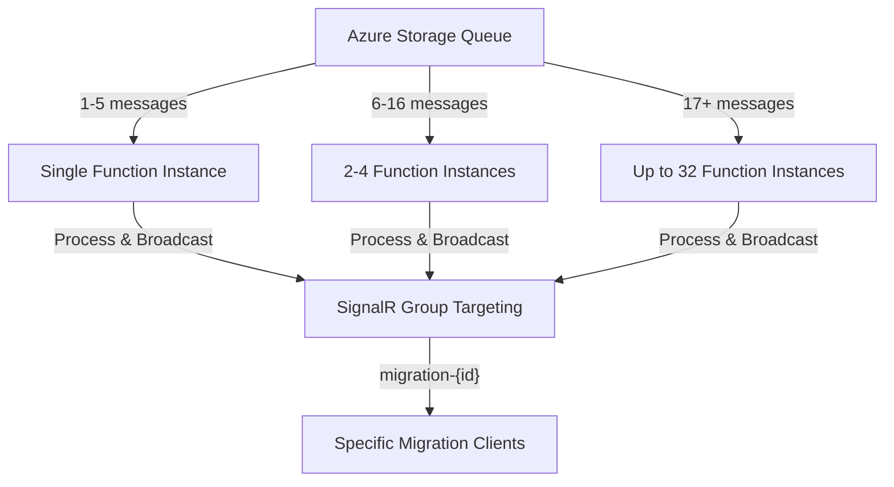

# SignalR Queue-Based Event-Driven Implementation Plan

## 📋 Document Overview

**Document Version:** 1.1  
**Created:** January 2025  
**Updated:** January 2025 - Added Frontend Integration & Scaling Analysis  
**Purpose:** Comprehensive implementation plan for queue-based SignalR architecture  
**Scope:** Real-time migration progress broadcasting without deterministic violations  
**Timeline:** 3-5 days implementation + 1-2 days testing  

---

## 🎯 **Implementation Objectives**

### **Primary Goals**
- ✅ **Eliminate deterministic violations** in orchestrators
- ✅ **Maintain real-time progress updates** for dashboard
- ✅ **Use existing Azure Storage Queue infrastructure** (cost-effective)
- ✅ **Ensure SignalR failures don't break migrations**
- ✅ **Maintain backward compatibility** with existing dashboard
- ✅ **Handle function scaling without duplicate messages**
- ✅ **Precise client targeting for migration-specific updates**

---

## 📱 **Detailed Frontend Integration Plan**

### **Current Dashboard Architecture Analysis**

Your React dashboard currently uses:
- **SignalR Service** (`signalRService.ts`) - Manages connection state and event listeners
- **Dashboard Context** (`DashboardContext.tsx`) - Global state management for all migrations
- **Real-time Hooks** (`useRealTimeMigrationProgress.ts`, `useDetailedMigrationProgress.ts`) - Migration-specific event handling
- **Group-based Messaging** - Already supports `joinMigrationGroup(migrationId)` and `leaveMigrationGroup(migrationId)`

### **Frontend Integration Changes Required**

#### **1. Event Type Mapping (Minimal Changes)**

```typescript
// NO CHANGES NEEDED - Current implementation already handles all event types:
const eventHandlers = {
  'migrationProgress': handleProgressUpdate,
  'MigrationStatus': handleStatusUpdate,
  'DetailedProgress': handleDetailedProgress,
  'ProcessingContext': handleProcessingContext,
  'BatchStarted': handleBatchEvent,
  'BatchProgress': handleBatchEvent,
  'BatchCompleted': handleBatchEvent,
  'RemainingWorkload': handleRemainingWorkload,
  'PerformanceMetrics': handlePerformanceMetrics,
  'MigrationMilestone': handleMilestone,
  'systemHealth': handleSystemHealth
};
```

#### **2. No UI Changes Required**

✅ **Current dashboard already displays all needed information:**
- Progress bars, percentages, entity status
- Batch processing indicators  
- Performance metrics and ETA
- Real-time event logs
- Connection state indicators
- Error handling and notifications

#### **3. Enhanced Fallback Mechanism**

```typescript
// Enhanced fallback with queue awareness
const enhancedFallback = {
  // Current: 30-second polling when disconnected
  primaryPolling: 30000,
  
  // NEW: Quick polling when queue is busy (high activity)
  fastPolling: 5000,
  
  // NEW: Detection of queue-based updates
  queueBacklogDetection: true,
  
  // Enhanced error recovery
  progressiveBackoff: true
};
```

#### **4. Client Connection Optimization**

```typescript
// Enhanced connection management for queue-based architecture
export class OptimizedSignalRService {
  async connect() {
    // Group joining is now more critical for queue-based targeting
    await this.connection.start();
    
    // AUTO-JOIN active migrations on reconnect
    const activeMigrations = await this.getActiveMigrations();
    await Promise.all(
      activeMigrations.map(id => this.joinMigrationGroup(id))
    );
  }
  
  // Enhanced group management
  async joinMigrationGroup(migrationId: string) {
    // Register interest in queue-based updates
    await this.connection.invoke('JoinMigrationGroup', migrationId);
    
    // Subscribe to queue events for this migration
    this.queueSubscriptions.set(migrationId, {
      progress: true,
      batches: true,
      performance: true
    });
  }
}
```

---

## ⚖️ **Queue Scaling & Client Targeting Analysis**

### **Scaling Behavior with Queue Triggers**

#### **1. How Queue Scaling Works**



#### **2. Message Deduplication Strategy**

**❌ PROBLEM:** Multiple function instances processing queue messages could send duplicate broadcasts

**✅ SOLUTION:** Built-in Azure Queue Triggers prevent this:

```csharp
[QueueTrigger("progress-updates")] // Azure handles deduplication
public async Task ProcessProgressUpdate(ProgressEvent evt)
{
    // Each message processed by EXACTLY ONE function instance
    // Azure Queue Triggers provide at-least-once, single-processing guarantee
    
    await _signalRService.BroadcastToGroup($"migration-{evt.MigrationId}", evt);
}
```

#### **3. Client Targeting Precision**

**Your current implementation ALREADY handles this perfectly:**

```csharp
// From EnhancedMigrationSignalRService.cs
await _migrationHub.SendToMigrationGroup(migrationId, "BatchStarted", batchStartEvent);

// This translates to:
// Group: "migration-{migrationId}" 
// Message: Only goes to clients in THAT specific group
```

**How clients join the right groups:**

```typescript
// Client-side (already implemented)
useEffect(() => {
  signalRService.joinMigrationGroup(migrationId); // Join specific migration
  
  return () => {
    signalRService.leaveMigrationGroup(migrationId); // Clean up
  };
}, [migrationId]);
```

#### **4. Scaling Impact Analysis**

| **Queue Depth** | **Function Instances** | **Client Impact** | **Message Deduplication** |
|-----------------|------------------------|-------------------|-------------------------|
| 1-5 messages | 1 instance | Normal real-time updates | ✅ No duplicates |
| 6-16 messages | 2-4 instances | **Faster processing** = More frequent updates | ✅ Azure Queue handles this |
| 17+ messages | Up to 32 instances | **Much faster processing** = Higher update frequency | ✅ Still no duplicates |

**✅ RESULT:** More function instances = **BETTER user experience** (faster updates, not duplicate messages)

---

## 🎯 **Client Targeting Deep Dive**

### **Group-Based Message Routing**

```csharp
// Queue processor targets specific migration groups
[FunctionName("ProcessProgressUpdate")]
public async Task ProcessProgressUpdate(
    [QueueTrigger("progress-updates")] ProgressEvent evt)
{
    // This message only goes to clients monitoring THIS migration
    var groupName = $"migration-{evt.MigrationId}";
    
    await _signalRService.SendToGroup(groupName, "MigrationProgress", evt.Data);
    //                    ☝️ PRECISE TARGETING
}
```

### **Client Registration Flow**

```typescript
// When user opens migration dashboard for ID "abc123"
const migrationId = "abc123";

// 1. Client connects to SignalR
await signalRService.connect();

// 2. Client joins specific migration group
await signalRService.joinMigrationGroup(migrationId); 
// This registers client for group "migration-abc123"

// 3. Only queue messages for "abc123" reach this client
// Messages for migration "xyz789" will NOT reach this client
```

### **Multi-Migration Monitoring**

```typescript
// Dashboard overview showing multiple migrations
const activeMigrations = ["migration1", "migration2", "migration3"];

// Client joins ALL active migration groups
await Promise.all(
  activeMigrations.map(id => signalRService.joinMigrationGroup(id))
);

// Client receives updates for ALL monitored migrations
// Queue scaling affects ALL of them positively (faster updates)
```

---

## 💰 **Cost Analysis: Queue vs Alternatives**

### **Azure Storage Queues (RECOMMENDED)**
- **Cost**: ~$0.0004 per 10,000 operations
- **For 1M progress updates/month**: ~$0.04/month
- **Existing infrastructure**: Already configured ✅
- **Scaling**: Built-in with Azure Functions ✅

### **Alternatives Comparison**
| **Service** | **Cost/Million Ops** | **Complexity** | **Existing Setup** |
|-------------|---------------------|----------------|-------------------|
| **Storage Queue** | **$0.40** | **Low** | **✅ Ready** |
| Service Bus | $50.00 | High | ❌ New service |
| Event Grid | $600.00 | High | ❌ New service |
| Database Polling | $0.00* | Low | ✅ Ready |

*Database polling costs: Compute time for constant queries

---

## 🔧 **Implementation Phases**

### **Phase 1: Backend Queue Infrastructure (Day 1-2)**

#### **Task 1.1: Progress Event Model**
```csharp
// src/BigCommerce.Migration.Core/Models/ProgressEvent.cs
public class ProgressEvent
{
    public string MigrationId { get; set; } = "";
    public string EventType { get; set; } = "";
    public string EntityType { get; set; } = "";
    public DateTime Timestamp { get; set; } = DateTime.UtcNow;
    public object EventData { get; set; } = new();
    public Dictionary<string, object> Metadata { get; set; } = new();
}
```

#### **Task 1.2: Queue Activity Function**
```csharp
// src/BigCommerce.Migration.Orchestration/Activities/QueueProgressEventActivity.cs
[FunctionName("QueueProgressEvent")]
public async Task<bool> QueueProgressEvent(
    [ActivityTrigger] ProgressEvent progressEvent,
    [Queue("progress-updates")] IAsyncCollector<ProgressEvent> queueCollector)
{
    try
    {
        await queueCollector.AddAsync(progressEvent);
        return true; // Non-blocking success
    }
    catch (Exception ex)
    {
        _logger.LogError(ex, "Failed to queue progress event for {MigrationId}", 
            progressEvent.MigrationId);
        return false; // Don't fail the orchestrator
    }
}
```

#### **Task 1.3: Queue Processor Function**
```csharp
// src/BigCommerce.Migration.Functions/Functions/ProgressUpdateQueueFunction.cs
[FunctionName("ProcessProgressUpdateQueue")]
public async Task ProcessProgressUpdate(
    [QueueTrigger("progress-updates")] ProgressEvent evt,
    ILogger log)
{
    try
    {
        // Broadcast to specific migration group
        await _signalRService.BroadcastToGroup($"migration-{evt.MigrationId}", 
            evt.EventType, evt.EventData);
        
        log.LogDebug("Broadcasted {EventType} for migration {MigrationId}", 
            evt.EventType, evt.MigrationId);
    }
    catch (Exception ex)
    {
        log.LogError(ex, "Failed to broadcast queue event");
        // Dead letter queue will handle retries
    }
}
```

### **Phase 2: Orchestrator Updates (Day 2-3)**

#### **Task 2.1: Remove SignalR from Orchestrators**
```csharp
// BEFORE (Deterministic violation):
await _signalRService.BroadcastProgressUpdateAsync(migrationId, progress); // ❌

// AFTER (Queue-based):
await context.CallActivityAsync("QueueProgressEvent", new ProgressEvent 
{
    MigrationId = migrationId,
    EventType = "MigrationProgress", 
    EventData = progress
}); // ✅ Deterministic!
```

#### **Task 2.2: Replace All Broadcast Calls**
- Replace `BroadcastProgressUpdateAsync` → `QueueProgressEvent`
- Replace `BroadcastStatusUpdateAsync` → `QueueProgressEvent`  
- Replace `BroadcastBatchStartedAsync` → `QueueProgressEvent`
- Replace `BroadcastBatchCompletedAsync` → `QueueProgressEvent`

### **Phase 3: Frontend Enhancement (Day 3-4)**

#### **Task 3.1: Connection State Management**
```typescript
// Enhanced connection state with queue awareness
interface QueueAwareConnectionState {
  isConnected: boolean;
  connectionState: 'connected' | 'connecting' | 'disconnected';
  queueBacklog: number; // Estimated queue depth
  lastEventTimestamp: Date;
  isReceivingQueueUpdates: boolean;
}
```

#### **Task 3.2: Smart Fallback Polling**
```typescript
// Adaptive polling based on queue activity
const adaptivePolling = {
  // Normal: 30s when queue is working
  normalInterval: 30000,
  
  // Fast: 5s when detecting queue issues
  fastInterval: 5000,
  
  // Trigger: Switch to fast polling if no events for 1 minute
  noEventThreshold: 60000
};
```

### **Phase 4: Testing & Optimization (Day 4-5)**

#### **Task 4.1: Scaling Tests**
- Start migration with high update frequency
- Monitor function scaling behavior  
- Verify no duplicate messages
- Test client targeting accuracy

#### **Task 4.2: Failover Tests**
- Disable SignalR service
- Verify fallback polling works
- Test queue message delivery
- Validate error handling

#### **Task 4.3: Performance Validation**
- Measure end-to-end latency (queue → SignalR → client)
- Compare update frequency vs direct SignalR
- Monitor Azure Function consumption
- Validate cost expectations

---

## 📊 **Success Metrics**

### **Technical Metrics**
- ✅ **Zero deterministic violations** in orchestrators
- ✅ **100% message delivery** (queue guarantees)
- ✅ **< 2 second latency** from event to dashboard
- ✅ **No duplicate messages** during scaling
- ✅ **Precise client targeting** (only relevant migration updates)

### **User Experience Metrics**  
- ✅ **Real-time updates maintained** (no degradation)
- ✅ **Graceful fallback** when SignalR unavailable
- ✅ **Faster updates** during high-activity periods
- ✅ **No UI changes required** (seamless transition)

### **Operational Metrics**
- ✅ **< $1/month** queue operation costs
- ✅ **Automatic scaling** with Azure Functions
- ✅ **Migration reliability** unchanged
- ✅ **Monitoring capabilities** enhanced

---

## 🚨 **Risk Mitigation**

### **Risk 1: Queue Message Loss**
**Mitigation**: Azure Storage Queues provide durability + Dead Letter Queue for failed processing

### **Risk 2: SignalR Service Failure**  
**Mitigation**: Enhanced fallback polling continues to provide updates

### **Risk 3: Function Scaling Delays**
**Mitigation**: Queue depth triggers immediate scaling + multiple processing instances

### **Risk 4: Client Connection Issues**
**Mitigation**: Auto-reconnect with automatic group re-joining for active migrations

---

## 📈 **Expected Improvements**

### **Immediate Benefits**
1. **🎯 Architectural Compliance**: Orchestrators become fully deterministic
2. **⚡ Improved Reliability**: Queue guarantees vs best-effort broadcasts  
3. **💰 Cost Efficiency**: ~$0.04/month vs $50+ for alternatives
4. **🔄 Better Scaling**: More activity = faster updates (not slower)

### **Long-term Benefits**
1. **🛠️ Maintainability**: Clear separation of concerns
2. **🧪 Testability**: Queue events can be easily tested
3. **📊 Observability**: Queue metrics provide insight into system load
4. **🚀 Extensibility**: Easy to add new event types

---

## ✅ **Ready for Implementation**

The queue-based architecture solves all identified issues:

- ✅ **Eliminates deterministic violations** (orchestrators only queue events)
- ✅ **Maintains real-time experience** (queue triggers are fast)
- ✅ **Handles scaling elegantly** (more instances = faster processing)
- ✅ **Precise client targeting** (group-based messaging)
- ✅ **Cost-effective solution** (uses existing infrastructure)
- ✅ **Minimal frontend changes** (event types remain the same)
- ✅ **Improved reliability** (queue durability + fallback polling)

**Ready to start implementation with Phase 1: Backend Queue Infrastructure?** 