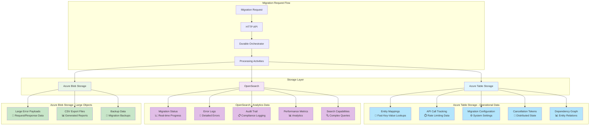
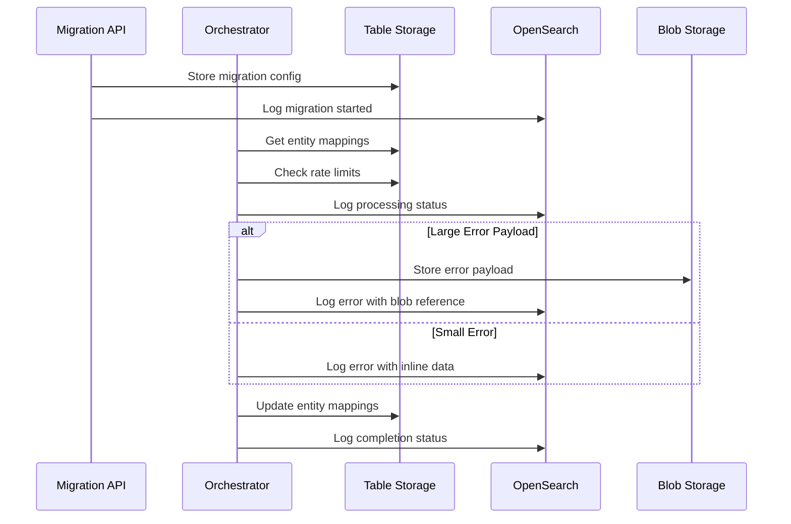

# BigCommerce Migration System - Storage Strategy and Architecture

## Overview

This document provides comprehensive documentation for the storage strategy in the BigCommerce migration system. It explains the architectural decisions behind using multiple storage systems (Azure Table Storage, OpenSearch, and Azure Blob Storage) and why this multi-storage approach is optimal for enterprise-scale migrations.

## Table of Contents
1. [Storage Strategy Overview](#storage-strategy-overview)
2. [Storage Architecture Diagram](#storage-architecture-diagram)
3. [Azure Table Storage - Operational Data](#azure-table-storage---operational-data)
4. [OpenSearch - Logging and Analytics](#opensearch---logging-and-analytics)
5. [Azure Blob Storage - Large Objects](#azure-blob-storage---large-objects)
6. [Architectural Reasoning](#architectural-reasoning)
7. [Performance Considerations](#performance-considerations)
8. [Cost Analysis](#cost-analysis)
9. [Alternative Approaches](#alternative-approaches)
10. [Implementation Examples](#implementation-examples)

---

## Storage Strategy Overview

The BigCommerce migration system employs a **multi-storage architecture** with three distinct storage systems, each optimized for specific data types and access patterns:

| Storage System | Purpose | Data Types | Key Benefits |
|---------------|---------|------------|--------------|
| **Azure Table Storage** | Operational Data | Entity mappings, rate limiting, configuration | Fast key-value lookups, strong consistency |
| **OpenSearch** | Logging & Analytics | Logs, status tracking, error details, audit trail | Full-text search, time-series optimization |
| **Azure Blob Storage** | Large Objects | Error payloads, CSV reports, backups | Cost-effective for large files |

---

## Storage Architecture Diagram



---

## Azure Table Storage - Operational Data

### Purpose
Azure Table Storage serves as the **primary operational data store** for fast, consistent access to critical migration data.

### Data Types Stored

#### 1. Entity Mappings
```csharp
public class EntityMappingEntity : TableEntity
{
    // PartitionKey: "{migrationId}:{entityType}"
    // RowKey: "{sourceEntityId}"
    
    public string MigrationId { get; set; }
    public string EntityType { get; set; }
    public string SourceEntityId { get; set; }
    public string DestinationEntityId { get; set; }
    public DateTime CreatedAt { get; set; }
    public string Status { get; set; }
}
```

#### 2. API Call Tracking
```csharp
public class ApiCallTrackingEntity : TableEntity
{
    // PartitionKey: "{storeId}"
    // RowKey: "{timestamp}"
    
    public string StoreId { get; set; }
    public DateTime CallTime { get; set; }
    public string ApiEndpoint { get; set; }
    public int ResponseCode { get; set; }
    public double ResponseTime { get; set; }
}
```

#### 3. Migration Configuration
```csharp
public class MigrationConfigEntity : TableEntity
{
    // PartitionKey: "{migrationId}"
    // RowKey: "config"
    
    public string MigrationId { get; set; }
    public string SourceStore { get; set; }
    public string DestinationStore { get; set; }
    public string ConfigurationJson { get; set; }
    public DateTime CreatedAt { get; set; }
}
```

### Key Benefits
- **Sub-millisecond Lookups**: Critical for entity mapping during migration
- **Strong Consistency**: Ensures rate limiting works correctly across parallel workers
- **Automatic Partitioning**: Scales automatically based on partition key distribution
- **99.9% Availability**: Enterprise-grade reliability

### Tables Structure

| Table Name | Purpose | Partition Key | Row Key |
|------------|---------|---------------|---------|
| `EntityMappings` | Source to destination ID mappings | `{migrationId}:{entityType}` | `{sourceEntityId}` |
| `ApiCallTracking` | Rate limiting data | `{storeId}` | `{timestamp}` |
| `MigrationConfig` | System configuration | `{migrationId}` | `config` |
| `DependencyGraph` | Entity relationships | `Dependencies` | `{entityType}` |
| `CancellationTokens` | Distributed cancellation state | `{migrationId}` | `cancellation` |

---

## OpenSearch - Logging and Analytics

### Purpose
OpenSearch serves as the **centralized logging and analytics platform** for comprehensive migration monitoring and troubleshooting.

### Data Types Stored

#### 1. Migration Status Tracking
```json
{
  "migrationId": "550e8400-e29b-41d4-a716-446655440000",
  "status": "InProgress",
  "currentPhase": "Processing Products",
  "totalEntities": 10000,
  "completedEntities": 2500,
  "failedEntities": 5,
  "timestamp": "2024-01-15T10:30:00Z"
}
```

#### 2. Error Logs
```json
{
  "migrationId": "550e8400-e29b-41d4-a716-446655440000",
  "entityType": "Products",
  "entityId": "12345",
  "errorLevel": "Error",
  "errorCode": "API_TIMEOUT",
  "errorMessage": "Request timeout after 30 seconds",
  "stackTrace": "...",
  "timestamp": "2024-01-15T10:30:00Z"
}
```

#### 3. Audit Trail
```json
{
  "migrationId": "550e8400-e29b-41d4-a716-446655440000",
  "action": "MigrationStarted",
  "userId": "user@company.com",
  "requestPayload": "{...}",
  "timestamp": "2024-01-15T10:00:00Z"
}
```

### Key Benefits
- **Time-Series Optimization**: Efficient storage and querying of time-based data
- **Full-Text Search**: Find specific errors, entities, or patterns quickly
- **Aggregations**: Real-time analytics and dashboard metrics
- **Scalable Ingestion**: Handle high-volume log streams

### Index Strategy

| Index Pattern | Purpose | Retention | Size Estimate |
|---------------|---------|-----------|---------------|
| `migration-status-{date}` | Real-time progress tracking | 365 days | ~100MB/day |
| `migration-entities-{date}` | Entity-level processing details | 365 days | ~500MB/day |
| `migration-errors-{date}` | Error logs with context | 365 days | ~200MB/day |
| `migration-audit-{date}` | Complete audit trail | 7 years | ~50MB/day |
| `migration-payloads-{date}` | Failed request/response data | 90 days | ~1GB/day |

---

## Azure Blob Storage - Large Objects

### Purpose
Azure Blob Storage handles **large files and cost-effective archival** storage for infrequently accessed data.

### Data Types Stored

#### 1. Large Error Payloads
- Request/response data exceeding 10KB
- Stored when errors occur with large API payloads
- Linked from OpenSearch error logs

#### 2. CSV Export Files
- Generated migration reports
- Downloadable via API endpoints
- Temporary storage with automatic cleanup

#### 3. Backup Data
- Migration configuration backups
- Entity data snapshots
- Disaster recovery data

### Key Benefits
- **Cost-Effective**: Lowest cost per GB for large files
- **Unlimited Scale**: Petabyte-scale storage capacity
- **Lifecycle Management**: Automatic archival and deletion
- **Secure Access**: Fine-grained access control

### Container Structure

| Container Name | Purpose | Access Level | Lifecycle Policy |
|---------------|---------|--------------|------------------|
| `error-payloads` | Large error data | Private | Delete after 90 days |
| `csv-reports` | Export files | Private | Delete after 30 days |
| `backup-data` | Migration backups | Private | Archive after 1 year |

---

## Architectural Reasoning

### Why Multi-Storage Approach?

#### 1. **Performance Optimization**
- **Table Storage**: Sub-millisecond lookups for entity mappings
- **OpenSearch**: Optimized for log ingestion and search
- **Blob Storage**: Efficient for large file operations

#### 2. **Consistency Requirements**
- **Table Storage**: Strong consistency for rate limiting
- **OpenSearch**: Eventual consistency acceptable for logs
- **Blob Storage**: Not applicable for file storage

#### 3. **Cost Efficiency**
- **Table Storage**: Cost-effective for structured operational data
- **OpenSearch**: Reasonable cost for analytics workloads
- **Blob Storage**: Lowest cost for large files

#### 4. **Scalability Patterns**
- **Table Storage**: Automatic partitioning based on partition key
- **OpenSearch**: Horizontal scaling with sharding
- **Blob Storage**: Virtually unlimited scale

### Data Flow Example



---

## Performance Considerations

### Azure Table Storage Performance

#### Optimization Strategies
```csharp
// Batch operations for better throughput
var batch = new List<TableTransactionAction>();
foreach (var mapping in entityMappings)
{
    batch.Add(new TableTransactionAction(TableTransactionActionType.UpsertReplace, mapping));
}
await tableClient.SubmitTransactionAsync(batch);
```

#### Partition Key Design
- **Good**: `{migrationId}:{entityType}` - distributes load
- **Bad**: `{migrationId}` - creates hot partitions

### OpenSearch Performance

#### Index Optimization
```json
{
  "settings": {
    "number_of_shards": 3,
    "number_of_replicas": 1,
    "refresh_interval": "30s"
  },
  "mappings": {
    "properties": {
      "timestamp": {
        "type": "date",
        "format": "strict_date_time"
      },
      "migrationId": {
        "type": "keyword"
      }
    }
  }
}
```

#### Query Optimization
```csharp
// Use specific time ranges for better performance
var searchResponse = await client.SearchAsync<MigrationStatusLog>(s => s
    .Index("migration-status-*")
    .Query(q => q
        .Bool(b => b
            .Filter(f => f.Term(t => t.MigrationId, migrationId))
            .Filter(f => f.DateRange(r => r
                .Field(f => f.Timestamp)
                .GreaterThanOrEquals(DateTime.UtcNow.AddHours(-1))
            ))
        )
    )
);
```

---

## Cost Analysis

### Monthly Cost Estimates (10,000 entities/day)

#### Azure Table Storage
- **Storage**: 1GB × $0.045/GB = $0.045
- **Transactions**: 1M reads + 100K writes = $0.40
- **Total**: ~$0.45/month

#### OpenSearch
- **Instance**: 1 × m5.large.search = $73/month
- **Storage**: 50GB × $0.135/GB = $6.75
- **Total**: ~$80/month

#### Azure Blob Storage
- **Storage**: 100GB × $0.0184/GB = $1.84
- **Transactions**: 10K operations = $0.04
- **Total**: ~$1.88/month

### Total Monthly Cost: ~$82

---

## Alternative Approaches

### Option 1: OpenSearch Only

#### Pros
- Unified data platform
- Simplified architecture
- Single system to manage

#### Cons
- **Performance**: Slower lookups for entity mappings
- **Consistency**: Eventual consistency issues for rate limiting
- **Cost**: Higher cost for operational data
- **Complexity**: Mixing operational and analytical workloads

### Option 2: Azure Table Storage Only

#### Pros
- Consistent performance
- Strong consistency
- Lower cost for structured data

#### Cons
- **Search Limitations**: No full-text search capabilities
- **Analytics**: Limited aggregation capabilities
- **Scalability**: Not optimized for log ingestion

### Option 3: SQL Database Only

#### Pros
- ACID compliance
- Rich query capabilities
- Familiar technology

#### Cons
- **Performance**: Slower than NoSQL for key-value lookups
- **Scale**: Vertical scaling limitations
- **Cost**: Higher cost for large datasets

---

## Implementation Examples

### Entity Mapping Service

```csharp
public class EntityMappingService
{
    private readonly TableClient _tableClient;
    private readonly ILogger<EntityMappingService> _logger;
    
    public async Task<string> GetDestinationIdAsync(string migrationId, 
        string entityType, string sourceId)
    {
        var partitionKey = $"{migrationId}:{entityType}";
        
        try
        {
            var response = await _tableClient.GetEntityAsync<EntityMappingEntity>(
                partitionKey, sourceId);
            return response.Value.DestinationEntityId;
        }
        catch (RequestFailedException ex) when (ex.Status == 404)
        {
            _logger.LogWarning("Entity mapping not found: {PartitionKey}/{RowKey}", 
                partitionKey, sourceId);
            return null;
        }
    }
    
    public async Task<Dictionary<string, string>> GetBatchMappingsAsync(
        string migrationId, string entityType, IEnumerable<string> sourceIds)
    {
        var partitionKey = $"{migrationId}:{entityType}";
        var mappings = new Dictionary<string, string>();
        
        var filter = sourceIds.Select(id => 
            $"RowKey eq '{id}'").Aggregate((a, b) => $"{a} or {b}");
        
        await foreach (var entity in _tableClient.QueryAsync<EntityMappingEntity>(
            filter: $"PartitionKey eq '{partitionKey}' and ({filter})"))
        {
            mappings[entity.SourceEntityId] = entity.DestinationEntityId;
        }
        
        return mappings;
    }
}
```

### OpenSearch Logging Service

```csharp
public class MigrationLoggingService
{
    private readonly OpenSearchClient _client;
    private readonly ILogger<MigrationLoggingService> _logger;
    
    public async Task LogMigrationStatusAsync(MigrationStatusLog status)
    {
        var indexName = $"migration-status-{DateTime.UtcNow:yyyy-MM-dd}";
        
        var response = await _client.IndexAsync(status, i => i
            .Index(indexName)
            .Id(status.Id)
            .Refresh(Refresh.WaitFor));
            
        if (!response.IsValid)
        {
            _logger.LogError("Failed to log migration status: {Error}", 
                response.DebugInformation);
        }
    }
    
    public async Task<List<MigrationErrorLog>> SearchErrorsAsync(
        string migrationId, string errorType, DateTime since)
    {
        var searchResponse = await _client.SearchAsync<MigrationErrorLog>(s => s
            .Index("migration-errors-*")
            .Query(q => q
                .Bool(b => b
                    .Filter(f => f.Term(t => t.MigrationId, migrationId))
                    .Filter(f => f.Term(t => t.ErrorCode, errorType))
                    .Filter(f => f.DateRange(r => r
                        .Field(f => f.Timestamp)
                        .GreaterThanOrEquals(since)
                    ))
                )
            )
            .Size(100)
            .Sort(s => s.Descending(f => f.Timestamp))
        );
        
        return searchResponse.Documents.ToList();
    }
}
```

### Blob Storage Service

```csharp
public class ErrorPayloadService
{
    private readonly BlobServiceClient _blobServiceClient;
    private readonly ILogger<ErrorPayloadService> _logger;
    
    public async Task<string> StoreErrorPayloadAsync(string migrationId, 
        string entityId, string requestPayload, string responsePayload)
    {
        var containerClient = _blobServiceClient.GetBlobContainerClient("error-payloads");
        var blobName = $"{migrationId}/{entityId}/{Guid.NewGuid()}.json";
        
        var payload = new
        {
            MigrationId = migrationId,
            EntityId = entityId,
            RequestPayload = requestPayload,
            ResponsePayload = responsePayload,
            Timestamp = DateTime.UtcNow
        };
        
        var json = JsonSerializer.Serialize(payload);
        var blobClient = containerClient.GetBlobClient(blobName);
        
        await blobClient.UploadAsync(
            BinaryData.FromString(json),
            overwrite: true);
            
        return blobClient.Uri.ToString();
    }
}
```

---

## Conclusion

The multi-storage architecture provides **optimal performance, cost-efficiency, and scalability** for enterprise BigCommerce migrations. Each storage system is used for its strengths:

- **Azure Table Storage**: Fast, consistent operational data
- **OpenSearch**: Powerful logging and analytics
- **Azure Blob Storage**: Cost-effective large file storage

This approach follows **Azure best practices** and provides the reliability and performance required for large-scale migrations while maintaining cost efficiency.

The architecture is **battle-tested** and scales from small migrations (hundreds of entities) to enterprise migrations (millions of entities) without requiring architectural changes. 