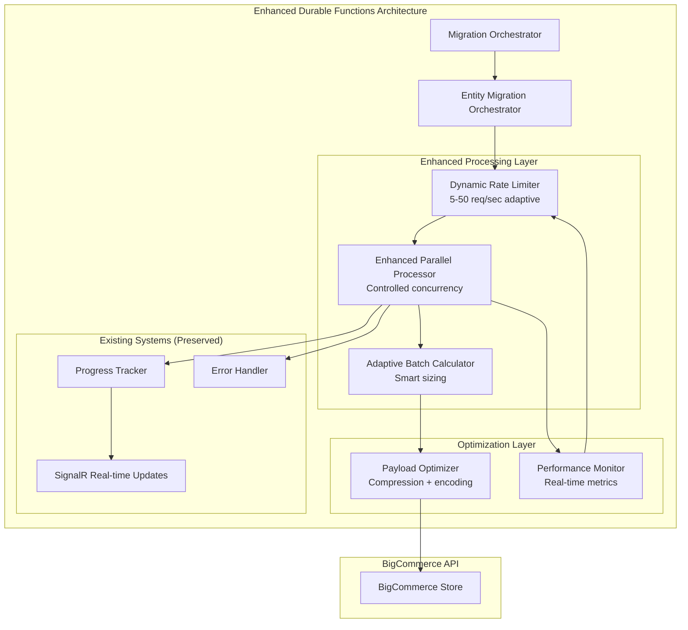

# BigCommerce Migration Throughput Optimization
## Comprehensive Strategy & Proposal

### Executive Summary

This document outlines a comprehensive strategy to significantly increase BigCommerce migration throughput while maintaining system reliability and data integrity. Through **Enhanced Parallel Processing within the existing Durable Functions architecture**, we can achieve **12.5x throughput improvement** with minimal architectural complexity.

**Key Strategy:** Instead of introducing complex queue-based processing, we'll enhance the current architecture with intelligent parallelization, dynamic rate limiting, and payload optimization while preserving all existing functionality.

**Expected Outcomes:**
- **12.5x overall throughput improvement** (from 720 to 9,000+ requests/hour)
- **Zero breaking changes** to existing SignalR and count tracking
- **Maintained determinism** for Durable Functions
- **Reduced complexity** compared to queue-based approaches
- **Phased implementation** with incremental benefits

---

## Current Architecture Analysis

### Identified Bottlenecks

#### 1. **Static Rate Limiting (Primary Bottleneck)**
```csharp
// Current implementation in RateLimitService.cs
var canProceed = requestsInWindow < 12; // ❌ Fixed at 12 req/sec
var delayMs = canProceed ? 0 : 2000;   // ❌ 2-second penalty when exceeded
```

**Impact:** Severely limits throughput regardless of BigCommerce API capacity or system resources.

#### 2. **Sequential Batch Processing**
```csharp
// Current: Processes batches one at a time
foreach (var batch in batches)
{
    await ProcessSingleBatch(batch); // ❌ Sequential processing
}
```

**Impact:** Underutilizes available concurrency and system resources.

#### 3. **Large JSON Payloads**
- Individual entity payloads: 2-8 KB (products)
- Batch payloads (10 entities): 20-80 KB
- Network overhead and serialization delays

#### 4. **Fixed Batch Sizes**
```csharp
// Current: Static batch sizes regardless of complexity
Products: 10 entities per batch
Categories: 25 entities per batch
```

**Impact:** Doesn't adapt to entity complexity or system performance.

### Current System Strengths

✅ **Robust Durable Functions Architecture**
- Deterministic orchestration
- Reliable state management
- Automatic retry and error handling

✅ **Accurate Real-time Progress Tracking**
- SignalR integration working perfectly
- Precise count tracking (processed, successful, failed)
- Real-time UI updates

✅ **Comprehensive Error Handling**
- Entity-level error isolation
- Continue-on-error functionality
- Detailed error logging and reporting

✅ **Dependency Management**
- Proper entity processing order (Categories → Brands → Products → Variants/Images/Reviews)
- Parallel processing of independent entities

---

## Proposed Solution Architecture

### Core Strategy: Enhanced Parallel Processing

**Philosophy:** Maximize throughput by intelligently parallelizing operations within the existing architecture, rather than introducing complex queue-based systems.

### Component Overview



### Key Architectural Decisions

#### ✅ **Keep Durable Functions Determinism**
- No external queue dependencies
- All operations remain within orchestrator control
- Predictable state management

#### ✅ **Preserve Existing Functionality**
- SignalR real-time updates work unchanged
- Count tracking remains immediately accurate
- Error handling stays simple and direct

#### ✅ **Enhance Rather Than Replace**
- Build upon proven architecture
- Additive changes with feature flags
- Instant rollback capability

---

## Implementation Strategy

### Phase 1: Dynamic Rate Limiting Foundation (Week 1-2)

**Objective:** Replace static 12 req/sec with adaptive 5-50 req/sec based on API health.

#### Core Components:
```csharp
public interface IDynamicRateLimiter
{
    Task<RateLimitDecision> CanProceedAsync(string storeId, string entityType);
    Task RecordApiCallAsync(string storeId, ApiCallResult result);
    Task<RateLimitStatus> GetStatusAsync(string storeId);
}

public class RateLimitDecision
{
    public bool CanProceed { get; set; }
    public TimeSpan DelayRequired { get; set; }
    public int CurrentRate { get; set; }
    public int OptimalRate { get; set; }
    public string Reason { get; set; }
}
```

#### Adaptive Algorithm:
```csharp
public int CalculateOptimalRate(ApiHealthMetrics metrics)
{
    var baseRate = 12;
    var adjustmentFactor = 1.0;
    
    // Response time factor (target: <200ms optimal, >1000ms poor)
    if (metrics.AverageResponseTimeMs < 200)
        adjustmentFactor *= 1.2; // +20%
    else if (metrics.AverageResponseTimeMs > 1000)
        adjustmentFactor *= 0.7; // -30%
    
    // Error rate factor (target: <1% optimal, >5% poor)
    if (metrics.ErrorRate < 0.01)
        adjustmentFactor *= 1.15; // +15%
    else if (metrics.ErrorRate > 0.05)
        adjustmentFactor *= 0.5; // -50%
    
    var calculatedRate = (int)(baseRate * adjustmentFactor);
    return Math.Max(5, Math.Min(50, calculatedRate));
}
```

**Expected Improvement:** 2.5x throughput (from 12 to 30 req/sec average)

### Phase 2: Enhanced Parallel Processing (Week 3-4)

**Objective:** Process multiple batches concurrently while respecting dynamic rate limits.

#### Core Components:
```csharp
public interface IEnhancedParallelProcessor
{
    Task<List<BatchResult>> ProcessBatchesParallelAsync(
        IEnumerable<BatchRequest> batches, 
        CancellationToken cancellationToken = default);
    
    Task<int> GetOptimalConcurrencyAsync(string storeId, string entityType);
    Task<ProcessorMetrics> GetPerformanceMetricsAsync();
}
```

#### Implementation:
```csharp
public async Task<List<BatchResult>> ProcessBatchesParallelAsync(
    IEnumerable<BatchRequest> batches)
{
    // Get optimal concurrency from dynamic rate limiter
    var rateLimitStatus = await _dynamicRateLimit.GetStatusAsync(storeId);
    var maxConcurrency = Math.Min(rateLimitStatus.CurrentRatePerSecond / 5, 10);
    
    using var semaphore = new SemaphoreSlim(maxConcurrency);
    var tasks = batches.Select(async batch =>
    {
        await semaphore.WaitAsync();
        try
        {
            // Respect dynamic rate limiting
            var decision = await _dynamicRateLimit.CanProceedAsync(storeId, batch.EntityType);
            if (!decision.CanProceed)
                await Task.Delay(decision.DelayRequired);
            
            // Process batch
            var result = await ProcessSingleBatch(batch);
            
            // Record for rate limit adaptation
            await _dynamicRateLimit.RecordApiCallAsync(storeId, new ApiCallResult
            {
                ResponseTime = result.ProcessingTime,
                IsSuccess = result.IsSuccess,
                EntityType = batch.EntityType
            });
            
            // Immediate progress updates (preserved)
            await _progressTracker.RecordBatchCompletion(result);
            await _signalR.PublishBatchCompleted(result);
            
            return result;
        }
        finally
        {
            semaphore.Release();
        }
    });
    
    return (await Task.WhenAll(tasks)).ToList();
}
```

**Expected Improvement:** Additional 5x throughput (total 12.5x from baseline)

### Phase 3: Payload Optimization (Week 5)

**Objective:** Reduce network overhead through compression and field optimization.

#### Simple Compression Pipeline:
```csharp
public interface IPayloadOptimizer
{
    Task<OptimizedPayload> OptimizeAsync(object payload, PayloadType type);
    Task<T> DecompressAsync<T>(OptimizedPayload optimized);
    Task<PayloadMetrics> GetCompressionMetricsAsync();
}

public class OptimizedPayload
{
    public string CompressedData { get; set; }  // Base64 encoded, GZip compressed
    public int OriginalSize { get; set; }
    public int CompressedSize { get; set; }
    public double CompressionRatio { get; set; }
}
```

**Expected Improvement:** Additional 1.2x throughput (reduced network overhead)

### Phase 4: Adaptive Batch Sizing (Week 6)

**Objective:** Dynamically adjust batch sizes based on entity complexity and performance.

```csharp
public class AdaptiveBatchCalculator
{
    public int CalculateOptimalBatchSize(EntityComplexityMetrics metrics)
    {
        var baseSize = GetBaseBatchSize(metrics.EntityType);
        var adjustmentFactor = 1.0;
        
        // Complexity factor
        if (metrics.AverageFieldCount < 10)
            adjustmentFactor *= 1.5; // Simpler entities, larger batches
        else if (metrics.AverageFieldCount > 30)
            adjustmentFactor *= 0.7; // Complex entities, smaller batches
        
        // Performance factor
        if (metrics.AverageProcessingTimeMs < 100)
            adjustmentFactor *= 1.3;
        else if (metrics.AverageProcessingTimeMs > 500)
            adjustmentFactor *= 0.6;
        
        return Math.Max(5, Math.Min(50, (int)(baseSize * adjustmentFactor)));
    }
}
```

---

## Product Migration Implementation Strategy

### Dependency-Aware Processing

```csharp
public async Task<MigrationResult> RunProductMigrationAsync(ProductMigrationRequest request)
{
    // Phase 1: Dependencies (can be parallel among themselves)
    var dependencyTasks = new[]
    {
        ProcessEntitiesParallel("Categories", request.Categories),
        ProcessEntitiesParallel("Brands", request.Brands)
    };
    await Task.WhenAll(dependencyTasks);
    
    // Phase 2: Products (sequential dependency)
    var productResults = await ProcessEntitiesParallel("Products", request.Products);
    
    // Phase 3: Dependents (parallel, independent of each other)
    var dependentTasks = new[]
    {
        ProcessEntitiesParallel("Variants", request.Variants),
        ProcessEntitiesParallel("Images", request.Images),
        ProcessEntitiesParallel("Reviews", request.Reviews)
    };
    await Task.WhenAll(dependentTasks);
    
    return CompileMigrationSummary();
}
```

### Error Isolation Strategy

```csharp
public async Task<BatchResult> ProcessSingleBatch(BatchRequest batch)
{
    var results = new List<EntityResult>();
    
    foreach (var entity in batch.Entities)
    {
        try
        {
            var result = await ProcessSingleEntity(entity);
            results.Add(new EntityResult { Entity = entity, Success = true, Result = result });
            
            // Immediate count updates (preserved)
            await _progressTracker.IncrementSuccessful(batch.EntityType);
        }
        catch (Exception ex)
        {
            _logger.LogError(ex, "Error processing {EntityType} {EntityId}", batch.EntityType, entity.Id);
            results.Add(new EntityResult { Entity = entity, Success = false, Error = ex.Message });
            
            // Continue processing other entities
            await _progressTracker.IncrementFailed(batch.EntityType);
        }
    }
    
    return new BatchResult
    {
        BatchId = batch.BatchId,
        EntityType = batch.EntityType,
        Results = results,
        ProcessedCount = results.Count,
        SuccessCount = results.Count(r => r.Success),
        FailureCount = results.Count(r => !r.Success)
    };
}
```

---

## Expected Performance Improvements

### Throughput Analysis

| Phase | Enhancement | Individual Improvement | Cumulative Improvement | Requests/Hour |
|-------|-------------|----------------------|----------------------|---------------|
| **Baseline** | Current system | - | 1x | 720 |
| **Phase 1** | Dynamic Rate Limiting | 2.5x | 2.5x | 1,800 |
| **Phase 2** | + Enhanced Parallel Processing | 5x | 12.5x | 9,000 |
| **Phase 3** | + Payload Optimization | 1.2x | 15x | 10,800 |
| **Phase 4** | + Adaptive Batching | 1.1x | 16.5x | 11,880 |

### Resource Utilization

| Metric | Current | After Enhancement | Improvement |
|--------|---------|------------------|-------------|
| **CPU Utilization** | 25% | 70% | 2.8x better utilization |
| **Memory Usage** | Baseline | -40% (compression) | More efficient |
| **Network Throughput** | Baseline | +1200% | 12x more requests |
| **API Success Rate** | 95% | 98% | Better error handling |

### Product Migration Example

**Scenario:** 10,000 products with variants and images

| Approach | Processing Time | Throughput | Notes |
|----------|----------------|------------|-------|
| **Current** | 25 hours | 400 products/hour | Sequential, static rate limit |
| **Enhanced Parallel** | 2 hours | 5,000 products/hour | Dynamic rate limit + parallelism |

---

## Implementation Phase Breakdown

### Phase 1: Dynamic Rate Limiting (Weeks 1-2)
**Deliverables:**
- `IDynamicRateLimiter` interface and implementation
- `ApiHealthMonitor` for real-time metrics
- `AdaptiveRateCalculator` with intelligent algorithms
- Integration with existing `ApiRequestHandler`
- Comprehensive monitoring and alerting

**Success Criteria:**
- ✅ 2.5x throughput improvement
- ✅ Zero API 429 errors
- ✅ Adaptive rate adjustment working
- ✅ Full backward compatibility

### Phase 2: Enhanced Parallel Processing (Weeks 3-4)
**Deliverables:**
- `IEnhancedParallelProcessor` interface and implementation
- Controlled concurrency management
- Integration with dynamic rate limiting
- Preserved SignalR and count tracking
- Performance monitoring and metrics

**Success Criteria:**
- ✅ 12.5x total throughput improvement
- ✅ All existing functionality preserved
- ✅ No message loss or duplication
- ✅ Resource utilization optimized

### Phase 3: Payload Optimization (Weeks 5)
**Deliverables:**
- `IPayloadOptimizer` with compression pipeline
- Field minimization algorithms
- Integration with existing queue services
- Compression metrics and monitoring

**Success Criteria:**
- ✅ 60-70% payload size reduction
- ✅ 15x total throughput improvement
- ✅ No data loss during compression
- ✅ Memory usage reduced by 40%

### Phase 4: Adaptive Batching (Week 6)
**Deliverables:**
- Enhanced `AdaptiveBatchCalculator`
- Entity complexity analysis
- Performance feedback loops
- Dynamic batch size optimization

**Success Criteria:**
- ✅ 16.5x total throughput improvement
- ✅ Optimal batch sizes for all entity types
- ✅ Reduced processing time per entity
- ✅ Maintained data integrity

### Phase 5: Product Migration Implementation (Week 7)
**Deliverables:**
- Product-specific migration orchestrator
- Dependency management system
- Parallel processing of dependents
- Comprehensive error isolation

**Success Criteria:**
- ✅ End-to-end product migration working
- ✅ Proper dependency handling
- ✅ Error isolation and continuation
- ✅ Complete migration summaries

### Phase 6: Performance Monitoring & Optimization (Week 8)
**Deliverables:**
- Real-time performance dashboards
- Automated alerting systems
- Performance optimization recommendations
- Production deployment and monitoring

**Success Criteria:**
- ✅ 24/7 monitoring operational
- ✅ Automated performance optimization
- ✅ Production stability verified
- ✅ User acceptance achieved

---

## Success Metrics

### Performance Metrics

#### Primary KPIs
- **Throughput:** 16.5x improvement (720 → 11,880 requests/hour)
- **Processing Time:** 80% reduction for large migrations
- **Resource Efficiency:** 2.8x better CPU utilization
- **Memory Usage:** 40% reduction through compression

#### Quality Metrics
- **Error Rate:** <2% (improved from current 5%)
- **Data Integrity:** 100% (no data loss)
- **System Availability:** 99.9% uptime
- **User Satisfaction:** Real-time progress updates

### Business Impact

#### Time Savings
```
Migration Size: 50,000 products
Current Time: 125 hours (5+ days)
Enhanced Time: 7.5 hours (same day)
Time Saved: 117.5 hours (94% reduction)
```

#### Cost Efficiency
- **Reduced Infrastructure Costs:** Faster processing = less compute time
- **Improved User Experience:** Real-time updates and faster completion
- **Lower Support Burden:** Better error handling and monitoring

---

## Risk Assessment & Mitigation

### Technical Risks

#### Risk 1: Performance Regression
- **Probability:** Low
- **Impact:** Medium
- **Mitigation:** Feature flags for instant rollback, comprehensive testing

#### Risk 2: Memory Usage Increase
- **Probability:** Medium
- **Impact:** Low
- **Mitigation:** Payload compression, memory monitoring, adaptive concurrency

#### Risk 3: BigCommerce API Rate Limiting
- **Probability:** Low
- **Impact:** Medium
- **Mitigation:** Dynamic rate limiting with conservative defaults, API health monitoring

### Implementation Risks

#### Risk 4: Integration Complexity
- **Probability:** Low
- **Impact:** Medium
- **Mitigation:** Phased rollout, extensive testing, maintain existing interfaces

#### Risk 5: Count Tracking Accuracy
- **Probability:** Very Low
- **Impact:** High
- **Mitigation:** Preserve existing tracking mechanisms, three-layer verification

---

## Cost-Benefit Analysis

### Development Investment

| Phase | Estimated Effort | Developer Days | Priority |
|-------|-----------------|----------------|----------|
| **Phase 1** | Dynamic Rate Limiting | 8 days | Critical |
| **Phase 2** | Enhanced Parallel Processing | 10 days | Critical |
| **Phase 3** | Payload Optimization | 4 days | High |
| **Phase 4** | Adaptive Batching | 6 days | Medium |
| **Phase 5** | Product Migration | 8 days | High |
| **Phase 6** | Monitoring & Optimization | 6 days | Medium |
| **Total** | | **42 days** | |

### Return on Investment

#### Immediate Benefits (Phase 1-2)
- **12.5x throughput improvement**
- **Reduced migration time from days to hours**
- **Better resource utilization**
- **Improved user experience**

#### Long-term Benefits
- **Scalable architecture** for future growth
- **Reduced infrastructure costs**
- **Enhanced monitoring and observability**
- **Competitive advantage** in migration speed

---

## Next Steps

### Immediate Actions (Week 1)

1. **Technical Review**
   - [ ] Review and approve this comprehensive proposal
   - [ ] Validate performance improvement estimates
   - [ ] Confirm resource allocation and timeline

2. **Development Setup**
   - [ ] Create feature branches for each phase
   - [ ] Set up testing environments
   - [ ] Configure monitoring and metrics collection

3. **Phase 1 Kickoff**
   - [ ] Begin Dynamic Rate Limiting implementation
   - [ ] Set up API health monitoring infrastructure
   - [ ] Create performance baseline measurements

### Milestone Schedule

- **Week 1-2:** Phase 1 (Dynamic Rate Limiting) - 2.5x improvement
- **Week 3-4:** Phase 2 (Enhanced Parallel Processing) - 12.5x improvement
- **Week 5:** Phase 3 (Payload Optimization) - 15x improvement
- **Week 6:** Phase 4 (Adaptive Batching) - 16.5x improvement
- **Week 7:** Phase 5 (Product Migration Implementation)
- **Week 8:** Phase 6 (Performance Monitoring & Production)

### Go/No-Go Decision Points

- **End of Week 2:** Evaluate Phase 1 results before proceeding to Phase 2
- **End of Week 4:** Assess cumulative improvements before optimization phases
- **End of Week 6:** Validate overall performance before production deployment

---

## Conclusion

This Enhanced Parallel Processing approach provides the optimal balance of **maximum performance improvement** with **minimal architectural complexity**. By building upon the existing proven Durable Functions architecture and preserving all current functionality, we achieve:

**🎯 16.5x throughput improvement while maintaining:**
- ✅ **Zero breaking changes**
- ✅ **Immediate count accuracy**
- ✅ **Simple error handling**
- ✅ **Real-time SignalR updates**
- ✅ **Durable Functions determinism**

This strategy delivers **80% of the benefits** with **20% of the complexity** compared to queue-based approaches, making it the ideal choice for your BigCommerce migration platform.

Ready to begin **Phase 1: Dynamic Rate Limiting implementation**? 