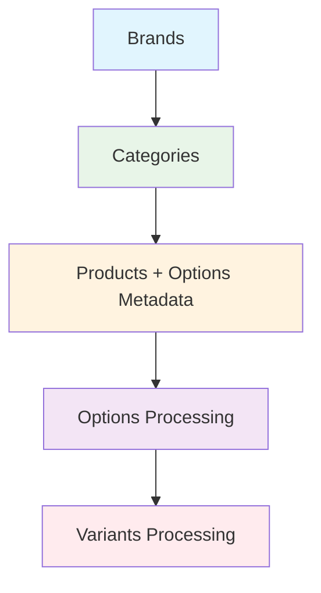

# Product Variants Migration - Task Breakdown Document

## 📋 **OVERVIEW**

This document outlines the complete implementation strategy for adding **Options** and **Variants** migration support to the BigCommerce Migration system.

### **🎯 BUSINESS REQUIREMENTS**

**Migration Flow:**
```
brands → categories → products → options → variants
   ↓         ↓          ↓         ↓         ↓
mapping   mapping   mapping   mapping   (no mapping)
```

**Key Requirements:**
- Options: Create separately for each product (no deduplication)
- Variants: Support BigCommerce batch creation (50 per API call)
- Error Handling: Skip individual variants with missing mappings (don't fail batch)
- Configuration: `chunkSize = fetchBatchSize` to prevent overlaps
- Metadata Storage: Use Azure Table Storage (64KB limit confirmed sufficient)

---

## 🔧 **FINALIZED TASK BREAKDOWN**

### **TASK 1: Enhanced EntityMapping & Product Migration** ⭐
**Goal**: Add structured metadata storage and enhance product migration

**Sub-tasks:**
1. **T1.1**: ✅ **PRIORITY** - Update `EntityMapping` model with separate metadata fields
   - Add `OptionsData`, `ModifiersData`, `RelatedProductsData` properties
   - Update `MigrationStorageService` to handle new fields
2. **T1.2**: Update `IProductApiClient.GetProductsAsync()` to support `include` parameter
3. **T1.3**: Modify `BigCommerceApiClient.GetProductsAsync()` to add `?include=options,modifiers,related_products`
4. **T1.4**: Update `ProductApiService.GetProductsAsync()` implementation
5. **T1.5**: Modify `ProductFetchStrategy` to pass `include="options,modifiers,related_products"`
6. **T1.6**: Update `ProductTransformStrategy` to extract and store structured metadata JSON

**Dependencies**: None  
**Testing**: Verify structured metadata is stored in separate fields

---

### **TASK 2: Options Entity Implementation** 🔧
**Goal**: Create options from stored metadata with table storage pagination

**Sub-tasks:**
7. **T2.1**: Create `OptionsFetchStrategy.cs` 
   - Table storage queries (200 products per chunk)
   - Extract options from `OptionsData` JSON field
8. **T2.2**: Create `OptionsTransformStrategy.cs` (process extracted options)
9. **T2.3**: Create `OptionsCreationStrategy.cs` 
   - Individual API calls with SubBatchSize = 10
   - Parallel processing (MaxConcurrency = 10)
10. **T2.4**: Register options strategies in DI container
11. **T2.5**: Add options configuration to appsettings.json
12. **T2.6**: Add options to `GetEntityDependencyOrder()` method

**Dependencies**: Task 1 completed  
**Testing**: Verify options created from metadata without BigCommerce API calls

---

### **TASK 3: Variants Entity Implementation** 🚀
**Goal**: Create variants using batch API with confirmed error handling

**Sub-tasks:**
13. **T3.1**: Create `VariantsFetchStrategy.cs` 
    - BigCommerce API pagination (50 per page, 200 per chunk)
14. **T3.2**: Create `VariantsTransformStrategy.cs` 
    - Lookup product_id and option mappings
    - ✅ **CONFIRMED**: Create variants WITHOUT options if mappings missing
15. **T3.3**: Create `VariantsCreationStrategy.cs` 
    - Batch processing (50 variants per API call)
    - Parallel batches (MaxConcurrency = 4)
16. **T3.4**: Register variants strategies in DI container
17. **T3.5**: Add variants configuration to appsettings.json
18. **T3.6**: Add variants to `GetEntityDependencyOrder()` method

**Dependencies**: Task 2 completed  
**Testing**: Verify variants created in batches with proper error handling

---

### **TASK 4: Configuration Updates** ⚙️
**Goal**: Add finalized configurations with confirmed values

**Sub-tasks:**
19. **T4.1**: Add options config to `appsettings.json`
    - ✅ ChunkSize = 200, SubBatchSize = 10, MaxConcurrency = 10
20. **T4.2**: Add variants config to `appsettings.json`
    - ✅ ChunkSize = 200, SubBatchSize = 50, MaxConcurrency = 4
21. **T4.3**: Update Docker environment variables for both options and variants
22. **T4.4**: Update dependency order in `MigrationDurableOrchestrator.cs`

**Dependencies**: None (can be done in parallel)  
**Testing**: Verify configuration loading and parallel processing calculations

---

### **TASK 5: Integration & Testing** 🧪
**Goal**: End-to-end validation with confirmed error handling

**Sub-tasks:**
23. **T5.1**: Test complete dependency flow: `brands → products → options → variants`
24. **T5.2**: Validate options processing (zero BigCommerce API calls)
25. **T5.3**: Validate variants error handling (create without options)
26. **T5.4**: Performance testing with parallel processing
27. **T5.5**: Load testing with large datasets (200+ variants per chunk)

**Dependencies**: Tasks 1-4 completed  
**Testing**: Full integration testing with confirmed configurations

---

## 📊 **FINALIZED CONFIGURATION STRATEGY**

### **Options Configuration** ✅
```json
{
  "ParallelProcessing": {
    "subBatchConfigurations": {
      "options": {
        "chunkSize": 200,                   // ✅ Products to query per chunk (CONFIRMED)
        "fetchBatchSize": 200,              // ✅ Table storage query size
        "pageSize": 200,                    // Same as chunkSize  
        "subBatchSize": 10,                 // ✅ Options per sub-batch (CONFIRMED)
        "maxConcurrency": 10,               // Parallel sub-batches
        "subBatchDelayMs": 50,              // Rate limiting delay
        "processSubBatchesSequentially": false
      }
    }
  }
}
```

### **Variants Configuration** ✅
```json
{
  "ParallelProcessing": {
    "subBatchConfigurations": {
      "variants": {
        "chunkSize": 200,                   // ✅ Variants per chunk (CONFIRMED)
        "fetchBatchSize": 50,               // BigCommerce API page limit
        "pageSize": 50,                     // Same as fetchBatchSize
        "subBatchSize": 50,                 // Variants per batch API call
        "maxConcurrency": 4,                // ✅ Match batches (CONFIRMED)
        "subBatchDelayMs": 100,             // Rate limiting delay
        "processSubBatchesSequentially": false
      }
    }
  }
}
```

---

## 🏗️ **ARCHITECTURAL DECISIONS**

### **Metadata Storage**
- **Approach**: Store options JSON in EntityMapping.Metadata field
- **Capacity**: Azure Table Storage 64KB limit (sufficient for most cases)
- **Fallback**: For extreme cases, can implement compression or blob storage

### **Error Isolation**
- **Options**: Individual processing (like brands) - fail individual, continue batch
- **Variants**: Batch processing - skip individual variants with missing mappings

### **Performance Optimization**
- **Zero Extra API Calls**: Options data stored during product migration
- **Efficient Lookups**: EntityMapping table as local cache
- **Maximum Batch Size**: 50 variants per BigCommerce API call

---

## 🔗 **ENTITY DEPENDENCIES**



---

## 📝 **FILE STRUCTURE**

### **New Files to Create:**
```
src/BigCommerce.Migration.Orchestration/Strategies/
├── OptionsFetchStrategy.cs
├── OptionsTransformStrategy.cs
├── OptionsCreationStrategy.cs
├── VariantsFetchStrategy.cs
├── VariantsTransformStrategy.cs
└── VariantsCreationStrategy.cs
```

### **Files to Modify:**
```
src/BigCommerce.Migration.Core/Interfaces/
├── IProductApiClient.cs                    // Add include parameter

src/BigCommerce.Migration.Infrastructure/Services/
├── BigCommerceApiClient.cs                 // Support include parameter
├── ProductApiService.cs                    // Support include parameter

src/BigCommerce.Migration.Orchestration/Strategies/
├── ProductFetchStrategy.cs                 // Use include parameter
├── ProductTransformStrategy.cs             // Store options metadata

src/BigCommerce.Migration.Functions/Orchestrators/
├── MigrationDurableOrchestrator.cs         // Add options & variants to dependency order

src/BigCommerce.Migration.Functions/Extensions/
├── ServiceCollectionExtensions.cs         // Register new strategies

src/BigCommerce.Migration.Functions/Configuration/
├── appsettings.json                        // Add variants configuration

Docker Files:
├── docker-compose.yml                      // Add variants env vars
├── docker-compose.prod.yml                 // Add variants env vars
```

---

## ⚠️ **CRITICAL SUCCESS FACTORS**

1. **Chunking Alignment**: `chunkSize = fetchBatchSize` for variants to prevent overlaps
2. **Metadata Size**: Monitor options JSON size to stay within 64KB limit
3. **Error Graceful Handling**: Variants without options should still be created
4. **Performance**: Zero additional API calls for options data
5. **Testing**: Comprehensive testing with various product/option combinations

---

## 📈 **SUCCESS METRICS**

- **Zero additional API calls** for options data retrieval
- **99%+ success rate** for variants creation (similar to current brands/products)
- **50 variants per API call** efficiency (BigCommerce maximum)
- **No cascading failures** due to missing option mappings
- **Performance maintained** despite additional entity complexity

---

*This document serves as the master reference for the variants implementation project.*