# BigCommerce Migration System - Workflow Diagram

## Overview

This diagram illustrates the complete migration workflow from request initiation to completion, showing all decision points, error handling paths, and the parallel processing optimizations that achieve 17x performance improvement.

## Workflow Phases

### 1. Migration Initiation
- Migration request with source store, destination store, and entity types
- Migration ID generation and initial tracking setup

### 2. Validation & Setup
- Orchestrator lock acquisition to prevent collisions
- Store validation for API connectivity and permissions
- Rate limit checks and configuration

### 3. Entity Dependency Processing
The system processes entities in a specific dependency order to maintain referential integrity:
1. **Categories** - Must be first (referenced by products)
2. **Brands** - Must be before products (referenced by products)
3. **Products** - Must be before variants and images
4. **Variants** - Depends on products
5. **Images** - Can reference products and variants
6. **Modifiers** - Product modifiers/options

### 4. Parallel Batch Processing
- Dynamic batch sizing based on performance metrics
- 17x performance optimization through concurrent execution
- Real-time progress tracking and error isolation

### 5. Error Handling & Recovery
- Continue-on-error policy: Individual entity failures don't stop the migration
- Comprehensive error categorization and logging
- Real-time error notifications via SignalR

### 6. Live Cancellation Support
- Multi-level cancellation (Migration → Entity → Batch → Store)
- Real-time cancellation detection and graceful cleanup
- Status updates and resource cleanup

## Workflow Diagram

```mermaid
graph TD
    Start([Migration Request<br/>- Source store<br/>- Destination store<br/>- Entity types]) --> Init[Initialize Migration<br/>- Generate migration ID<br/>- Validate stores<br/>- Set up tracking]
    
    Init --> Lock{Acquire<br/>Orchestrator Lock}
    Lock -->|Success| Validate[Validate Stores<br/>- API connectivity<br/>- Rate limits<br/>- Permissions]
    Lock -->|Failed| LockError[Return Lock Error<br/>- Instance collision<br/>- Cleanup required]
    
    Validate --> DepOrder[Determine Entity<br/>Dependency Order<br/>1. Categories<br/>2. Brands<br/>3. Products<br/>4. Variants<br/>5. Images<br/>6. Modifiers]
    
    DepOrder --> EntityLoop{Next Entity Type?}
    
    EntityLoop -->|Yes| CancelCheck{Check<br/>Cancellation}
    CancelCheck -->|Cancelled| CancelFlow[Handle Cancellation<br/>- Update status<br/>- Cleanup resources<br/>- Notify dashboard]
    CancelCheck -->|Continue| RateCheck[Check Rate Limits<br/>- Dynamic adjustment<br/>- Store-specific limits]
    
    RateCheck --> Discover[Discover Entities<br/>- API pagination<br/>- Cache results<br/>- Count validation]
    
    Discover --> EmptyCheck{Entities Found?}
    EmptyCheck -->|No| EntityLoop
    EmptyCheck -->|Yes| StartTrack[Start Entity Processing<br/>- Initialize progress<br/>- SignalR updates]
    
    StartTrack --> CreateBatches[Create Batches<br/>- Dynamic batch sizing<br/>- Load balancing<br/>- Parallel optimization]
    
    CreateBatches --> ParallelProc[Parallel Batch Processing<br/>17x Performance Optimization<br/>- Concurrent execution<br/>- Progress aggregation<br/>- Error isolation]
    
    ParallelProc --> BatchLoop{Process Batch}
    
    BatchLoop --> Fetch[Fetch Entity Data<br/>- BigCommerce API<br/>- Strategy pattern<br/>- Caching optimization]
    
    Fetch --> Transform[Transform Data<br/>- Field mapping<br/>- Category tree resolution<br/>- Channel context]
    
    Transform --> Create[Create in Destination<br/>- Bulk operations<br/>- Error handling<br/>- Mapping storage]
    
    Create --> Progress[Update Progress<br/>- Real-time SignalR<br/>- Table storage<br/>- Dashboard refresh]
    
    Progress --> BatchComplete{Batch Complete?}
    BatchComplete -->|No| BatchLoop
    BatchComplete -->|Yes| EntityComplete{All Batches Done?}
    
    EntityComplete -->|No| ParallelProc
    EntityComplete -->|Yes| EntityStatus[Update Entity Status<br/>- Success metrics<br/>- Error summary<br/>- Progress completion]
    
    EntityStatus --> EntityLoop
    
    EntityLoop -->|No More| FinalCheck{Check Final Status}
    
    FinalCheck --> CompleteSuccess[Complete Migration<br/>- Success status<br/>- Statistics summary<br/>- Final notifications]
    
    FinalCheck --> CompleteError[Complete with Errors<br/>- Partial success<br/>- Error analysis<br/>- Retry recommendations]
    
    CompleteSuccess --> End([Migration Complete<br/>- Dashboard updated<br/>- Audit logs created<br/>- Resources cleaned])
    CompleteError --> End
    CancelFlow --> End
    LockError --> End
    
    %% Error handling paths
    Validate -->|Error| ValidationError[Validation Failed<br/>- API errors<br/>- Credential issues<br/>- Store unavailable]
    ValidationError --> End
    
    Discover -->|Error| DiscoveryError[Discovery Failed<br/>- Rate limit exceeded<br/>- Network issues<br/>- Temporary failure]
    DiscoveryError --> End
    
    Fetch -->|Error| FetchError[Log Error & Continue<br/>- Continue-on-error policy<br/>- Error categorization<br/>- Detailed logging]
    Transform -->|Error| TransformError[Log Error & Continue<br/>- Data validation<br/>- Mapping issues<br/>- Field conflicts]
    Create -->|Error| CreateError[Log Error & Continue<br/>- API failures<br/>- Constraint violations<br/>- Retry logic disabled]
    
    FetchError --> Progress
    TransformError --> Progress
    CreateError --> Progress
    
    %% Styling
    classDef startEnd fill:#e8f5e8,stroke:#4caf50,stroke-width:3px
    classDef process fill:#e3f2fd,stroke:#2196f3,stroke-width:2px
    classDef decision fill:#fff3e0,stroke:#ff9800,stroke-width:2px
    classDef error fill:#ffebee,stroke:#f44336,stroke-width:2px
    classDef parallel fill:#f3e5f5,stroke:#9c27b0,stroke-width:2px
    
    class Start,End startEnd
    class Init,Validate,DepOrder,Discover,StartTrack,CreateBatches,Fetch,Transform,Create,Progress,EntityStatus,CompleteSuccess,CompleteError process
    class Lock,EntityLoop,CancelCheck,EmptyCheck,BatchLoop,BatchComplete,EntityComplete,FinalCheck decision
    class LockError,ValidationError,DiscoveryError,FetchError,TransformError,CreateError,CancelFlow error
    class ParallelProc parallel
```

## Key Workflow Features

### Performance Optimizations
- **17x Performance Improvement**: Through parallel batch processing and dynamic concurrency
- **Dynamic Batch Sizing**: Automatically adjusts based on performance metrics
- **Concurrent Execution**: Multiple batches processed simultaneously within rate limits

### Error Resilience
- **Continue-on-Error Policy**: Individual entity failures don't stop the entire migration
- **Error Categorization**: Infrastructure vs. application logic errors handled differently
- **Comprehensive Logging**: All errors logged to OpenSearch with structured data

### Real-time Visibility
- **Live Progress Updates**: SignalR events for every major operation
- **Cancellation Support**: Real-time cancellation detection at multiple levels
- **Dashboard Integration**: Immediate feedback to users

### Data Integrity
- **Entity Dependencies**: Proper ordering ensures referential integrity
- **Mapping Storage**: Tracks relationships between source and destination entities
- **Validation Checks**: Multi-level validation throughout the process

## Error Handling Strategy

The system implements a sophisticated error handling strategy:

1. **Infrastructure Errors**: Immediately stop migration (storage unavailable, network failures)
2. **Application Logic Errors**: Log and continue (data validation, mapping issues)
3. **Rate Limit Errors**: Dynamic backoff and retry
4. **User Visibility**: Only BigCommerce API errors shown to users, system errors remain internal